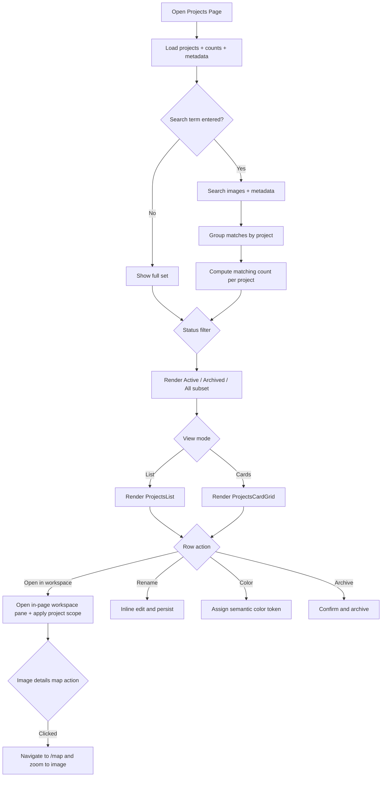
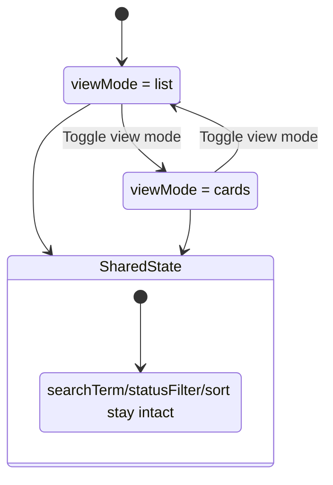

# Projects Page

> **Use cases:** [use-cases/projects-page-workspace.md](../use-cases/projects-page-workspace.md)

## What It Is

A dedicated management page for organization projects. It lets users create, rename, archive, color-tag, and open projects while preserving map-first workflows. The page reuses the same Search Bar component pattern used on the map page, but the query algorithm is different: it searches across images and metadata and returns grouped project-level result counts.

## What It Looks Like

Full-width page with a header row: title "Projects", total project count, and a primary "New project" button. Below header, the same Search Bar surface pattern is reused (same geometry, icon rhythm, focus behavior), but in Projects mode results are aggregated as project cards/rows with matching-image counts. The center content rail is horizontally centered and constrained to a readable maximum width of 70rem (1120px) so scanning remains comfortable on large monitors. A view toggle switches between List view (default, optimized for quick scanning/comparison) and Cards view (optimized for browsing and visual grouping). Each project item shows name, color chip, status, matching image count, total image count, last activity, and quick actions; cards use consistent structure and fixed action zones.

## Where It Lives

- **Route**: `/projects`
- **Parent**: App shell
- **Sidebar link**: Projects icon
- **Appears when**: User navigates via sidebar or deep link

## Actions

| #   | User Action                        | System Response                                                                                                        | Triggers                         |
| --- | ---------------------------------- | ---------------------------------------------------------------------------------------------------------------------- | -------------------------------- |
| 1   | Navigates to `/projects`           | Loads organization projects, image counts, and summary metadata                                                        | Supabase query                   |
| 2   | Types in shared Search Bar         | Runs image-level search (title/address/custom properties) and groups matches by project with per-project result counts | `searchTerm` state               |
| 3   | Clicks "New project"               | Inserts draft project and opens inline name edit                                                                       | Supabase insert                  |
| 4   | Submits project name               | Persists new name and exits edit mode                                                                                  | Supabase update                  |
| 5   | Clicks project row                 | Opens workspace pane in-place and scopes content to that project                                                       | `selectedProjectId` + pane state |
| 6   | Opens row menu and clicks Rename   | Enables inline rename for that row                                                                                     | Local state                      |
| 7   | Confirms rename                    | Validates name and updates project row                                                                                 | Supabase update                  |
| 8   | Opens color picker on project      | Assigns predefined project color token and updates chip/accent                                                         | Supabase update                  |
| 9   | Opens row menu and clicks Archive  | Asks confirmation, then archives project (not hard delete)                                                             | Supabase update                  |
| 10  | Uses status filter                 | Restricts grouped results to Active or Archived projects                                                               | `statusFilter` state             |
| 11  | Toggles view mode                  | Switches between List and Cards layouts without losing search/filter/sort state                                        | `viewMode` state                 |
| 12  | Clicks "Open in workspace"         | Opens the same in-page workspace pane scoped to that project (no route change)                                         | Shared open action               |
| 13  | Clicks map button in image details | Navigates to `/map` and zooms to the selected image location                                                           | Router + map focus payload       |

### Interaction Flowchart



### View Mode State



## Component Hierarchy

```
ProjectsPage                                ← route root, full width
├── ProjectsHeader                           ← title, count, primary CTA
│   ├── ProjectsTitle                         ← "Projects"
│   ├── ProjectCountBadge                     ← "N projects"
│   └── NewProjectButton                      ← primary action
├── ProjectsSearchSurface                     ← reuse shared Search Bar component in "projects" mode
│   └── SearchBarComponent                     ← same component family as map search
├── ProjectsToolbar                           ← list controls
│   ├── StatusSegmentedControl                 ← All / Active / Archived
│   ├── ViewModeToggle                         ← List / Cards
│   └── SortDropdown                           ← Name / Updated / Image count
├── ContentRail                                ← centered layout rail, max-width 70rem (1120px)
│   ├── [viewMode=list] ProjectsList (.ui-container)
│   │   └── ProjectRow (.ui-item) × N
│   │       ├── ProjectColorChip               ← token color indicator
│   │       ├── ProjectStatusDot               ← active/archived state
│   │       ├── ProjectName (.ui-item-label)   ← inline editable on rename
│   │       ├── MatchingCountMeta              ← "5 results" for current search query
│   │       ├── ImageCountMeta                 ← total photos
│   │       ├── LastActivityMeta               ← relative date
│   │       ├── OpenInWorkspaceButton          ← map shortcut
│   │       └── RowMenu                         ← Rename, Color, Archive
│   └── [viewMode=cards] ProjectsCardGrid      ← responsive grid, cards share stable info zones
│       └── ProjectCard × N
│           ├── ProjectColorChip               ← token color indicator
│           ├── ProjectName                    ← primary label
│           ├── MatchingCountBadge             ← query-specific count (e.g., "5 results")
│           ├── ProjectMeta                    ← total count + status + updated
│           ├── OpenInWorkspaceButton
│           └── CardMenu                        ← Rename, Color, Archive
├── [projectSelected] WorkspacePaneComponent    ← in-page details surface, no route change
│   ├── ProjectScopedPhotoGrid                  ← selected project photos
│   └── ImageDetailView                          ← includes MapButton to `/map`
├── [loading] ProjectsLoadingState           ← skeleton rows
└── [empty] ProjectsEmptyState               ← guidance + CTA
```

## Data

| Field                     | Source                                                                                      | Type                                    |
| ------------------------- | ------------------------------------------------------------------------------------------- | --------------------------------------- | -------- |
| Projects                  | `supabase.from('projects').select('id,name,color_key,archived_at,created_at,updated_at')`   | `Project[]`                             |
| Image counts              | RPC or aggregated query by `project_id` from `images`                                       | `Record<string, number>`                |
| Last activity             | Max `images.captured_at` per project                                                        | `Record<string, string>`                |
| Active scope set          | Workspace project scope state (project IDs)                                                 | `Set<string>`                           |
| View preference           | User preference store (profile preferences)                                                 | `'list'                                 | 'cards'` |
| Search matches by project | RPC/search service: image-level query joined with project IDs, grouped by `project_id`      | `Record<string, number>`                |
| Search fields             | `images.title`, `images.address_label`, custom metadata key/value pairs (`metadata_values`) | `string` query against normalized index |

`color_key` is a semantic project color token key (for example `clay`, `accent`, `success`, `warning`) and maps to existing design tokens. Do not store arbitrary hex values.
Search behavior on this page is explicitly aggregation-first: query images, then group by project; it is not a simple project-name-only filter.

## State

| Name                 | Type                     | Default  | Controls                                |
| -------------------- | ------------------------ | -------- | --------------------------------------- | ------------------ | -------------- |
| `projects`           | `ProjectListItem[]`      | `[]`     | Rendered project rows                   |
| `loading`            | `boolean`                | `false`  | Loading skeleton visibility             |
| `searchTerm`         | `string`                 | `''`     | Client-side text filtering              |
| `statusFilter`       | `'all'                   | 'active' | 'archived'`                             | `'all'`            | Status scoping |
| `viewMode`           | `'list'                  | 'cards'` | `'list'`                                | Active layout mode |
| `projectMatchCounts` | `Record<string, number>` | `{}`     | Search-result count per project         |
| `selectedProjectId`  | `string \| null`         | `null`   | Active project opened in workspace pane |
| `workspacePaneOpen`  | `boolean`                | `false`  | In-page workspace visibility            |
| `editingProjectId`   | `string \| null`         | `null`   | Inline rename row                       |
| `creatingProject`    | `boolean`                | `false`  | New-project draft input visibility      |
| `archivingProjectId` | `string \| null`         | `null`   | Archive confirmation pending state      |
| `coloringProjectId`  | `string \| null`         | `null`   | Color picker visibility target          |

## File Map

| File                                                                   | Purpose                                         |
| ---------------------------------------------------------------------- | ----------------------------------------------- |
| `apps/web/src/app/features/projects/projects-page.component.ts`        | Standalone route component                      |
| `apps/web/src/app/features/projects/projects-page.component.html`      | Page template                                   |
| `apps/web/src/app/features/projects/projects-page.component.scss`      | Page styles                                     |
| `apps/web/src/app/features/projects/projects-view-toggle.component.ts` | List/cards toggle control                       |
| `apps/web/src/app/features/projects/project-card.component.ts`         | Card presentation for cards mode                |
| `apps/web/src/app/features/projects/project-color-picker.component.ts` | Color selector using semantic tokens            |
| `apps/web/src/app/core/projects/projects.service.ts`                   | Project read/create/rename/archive data service |
| `apps/web/src/app/core/projects/projects.types.ts`                     | Shared project page models                      |
| `apps/web/src/app/features/projects/projects-page.component.spec.ts`   | Component behavior tests                        |

## Wiring

- Add route `{ path: 'projects', component: ProjectsPageComponent }` in app routes.
- Add sidebar entry that navigates to `/projects`.
- Inject `ProjectsService` in `ProjectsPageComponent`.
- Reuse the existing Search Bar component family by importing a shared search-surface component in Projects mode; do not create a second independent search implementation.
- The shared search-surface must support mode-specific behavior via inputs/adapter (`map` vs `projects`) while preserving identical keyboard and focus interactions.
- Projects mode must call the grouped-search endpoint/service (image-level query -> group by project) instead of map-center commit behavior.
- On row open action, set selected project and open the in-page workspace pane; do not change route.
- Reuse existing image-details map action to navigate to `/map` with selected image id/coordinates so map zoom/focus can be applied.
- Keep `Projects Dropdown` behavior consistent with this page by sharing the same source-of-truth project scope state.
- Constrain the central project content area to max-width 70rem (1120px) and center it in the available viewport.

## Acceptance Criteria

- [ ] Route `/projects` renders a list of projects for the active organization.
- [ ] Projects page reuses the same Search Bar component family as map search (no duplicated search UI implementation).
- [ ] Search uses image-level matching and groups results by project with query-specific counts.
- [ ] Search fields include custom metadata values (for example query `Fang 5`).
- [ ] Query `Fang 5` shows grouped result badges such as `5 results` on matching projects.
- [ ] Keyboard interaction model stays consistent with map search.
- [ ] Status control filters Active vs Archived rows.
- [ ] View toggle switches between List and Cards without resetting search/filter/sort state.
- [ ] List view is default and optimized for scan/compare.
- [ ] Cards view keeps card internals structurally consistent for fast comparison.
- [ ] "New project" creates a draft row and persists after confirmation.
- [ ] Rename is inline, validates input, and persists without full-page reload.
- [ ] Each project can be assigned a semantic color token and the color is visible in list and card presentations.
- [ ] Archive requires confirmation and removes project from Active view.
- [ ] Clicking project row opens in-page workspace details scoped to that project without leaving `/projects`.
- [ ] "Open in workspace" opens the same in-page workspace details behavior as row click.
- [ ] Image-details map action from project-scoped workspace navigates to `/map` and zooms to the selected photo location.
- [ ] Empty state appears when no projects match current filters.
- [ ] Loading state appears during initial fetch and refresh operations.
- [ ] Center content rail is horizontally centered and capped at max-width 70rem (1120px).
- [ ] Mobile layout is single-column with accessible touch targets.
- [ ] [PPW-1] Selecting a project opens the workspace pane in place while remaining on `/projects`.
- [ ] [PPW-2] Selecting a project-scoped thumbnail opens image details for that scoped image.
- [ ] [PPW-3] Using the image-details map action navigates to `/map` and focuses the exact selected photo location.
- [ ] [PPW-4] Closing the workspace pane preserves Projects page search/filter/view mode state.
- [ ] [PPW-5] Re-opening the same project restores prior project-scoped browsing context (including prior subview and scroll position).

## Use Cases

> **Full use cases:** [use-cases/projects-page-workspace.md](../use-cases/projects-page-workspace.md)

The scenarios in this use-case document define the expected behavior for project selection, project-scoped workspace browsing, map handoff, and state persistence on `/projects`.

## Settings

- **Projects View Mode**: default layout mode (`list` or `cards`) and persistence behavior.
- **Project Color Palette**: enabled semantic project color options and default fallback color.
