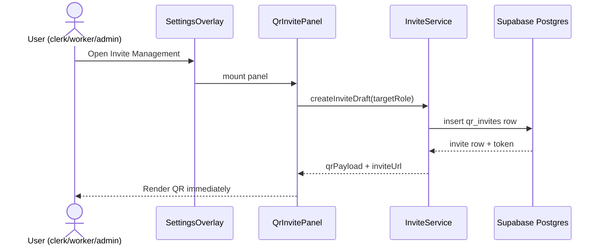
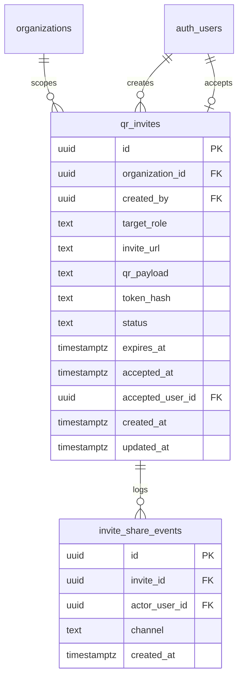
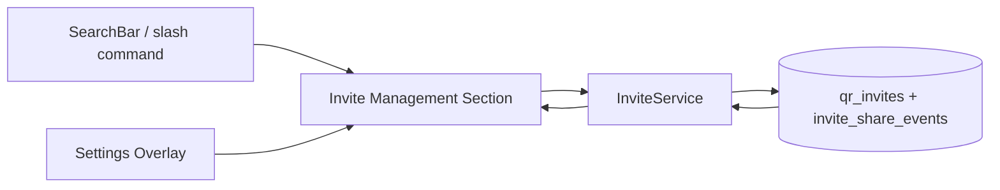

# QR Invite Flow

## What It Is

A role-scoped invite flow that creates a join QR code immediately when Invite Management is opened, and also from command-mode search via `/image`. The QR or link can be shared through channels like email or WhatsApp, and the invited person joins the same organization with a preselected role.

## What It Looks Like

The feature appears as a dedicated section in Settings Overlay and as a command result in Search Bar command mode. The invite surface uses the shared `.ui-container` and `.ui-item` row rhythm in a single vertical flow. From top to bottom, the order is fixed and non-negotiable: `Role picker`, then `QR preview`, then `Share actions`. This order must remain identical on desktop and mobile; responsive behavior may only change spacing/sizing, never block order. Primary controls use a minimum hit target of `2.75rem` (44px). The QR preview is square and stable at `12rem` (192px) on desktop and `10rem` (160px) on mobile, with metadata below for expiration and role label. Status chips (`active`, `expired`, `revoked`, `accepted`) use tokenized semantic colors and never rely on color-only meaning.

## Where It Lives

- **Route**: Global on map shell; no dedicated route segment.
- **Parent**: `SettingsOverlayComponent` for settings entry and `SearchBarComponent` for slash-command entry.
- **Appears when**:
  - Invite Management section is opened in Settings Overlay.
  - User types `/image` and commits `Create QR Invite` command in Search Bar.

## Actions

| # | User Action | System Response | Triggers |
| --- | --- | --- | --- |
| 1 | Opens Invite Management section | Immediately creates a new active invite draft and renders QR preview | section selection in settings overlay |
| 2 | Commits `/image` command `Create QR Invite` | Opens Invite Management and pre-focuses role picker | search commit action `run-command` |
| 3 | Changes target role (Clerk or Worker) | Regenerates invite token and QR payload for the selected role | role dropdown change |
| 4 | Clicks `Regenerate` | Revokes current active draft and creates a fresh one | regenerate action |
| 5 | Clicks `Copy Link` | Copies one-time invite URL to clipboard and logs share channel | clipboard write + share event insert |
| 6 | Clicks `Share via Email` | Opens device/app share intent with invite URL and logs share channel | web share or mailto fallback |
| 7 | Clicks `Share via WhatsApp` | Opens WhatsApp share URL with invite URL and logs share channel | external deep link |
| 8 | Invited user scans QR | Join flow validates token and marks invite as accepted once completed | invite accept endpoint/RPC |
| 9 | Invite reaches expiration | UI changes state to expired and disables share controls | now() > expires_at |
| 10 | Creator clicks `Revoke` | Invite state becomes revoked and further acceptance is blocked | update invite status |
| 11 | Non-allowed role attempts invite creation | UI shows permission-denied message; no invite row created | RLS insert deny |
| 12 | Network/create error on auto-generation | Shows retry state with actionable `Try again` button | service error |



## Component Hierarchy

```text
QrInviteFlowHost (Settings section or command entry host)
├── QrInvitePanel (.ui-container)
│   ├── InviteHeaderRow (.ui-item)
│   │   ├── Title + status chip
│   │   └── Expiration meta
│   ├── InviteContentStack
│   │   ├── RolePickerBlock
│   │   │   ├── RoleSelect (.ui-item; clerk/worker)
│   │   │   ├── RegenerateButton
│   │   │   └── RevokeButton
│   │   ├── QrPreviewBlock
│   │   │   ├── QrCanvasBlock (12rem desktop / 10rem mobile)
│   │   │   └── InviteLinkPreview
│   │   └── ShareActionsBlock
│   │       ├── ShareActionsRow
│   │       │   ├── CopyLinkButton
│   │       │   ├── ShareEmailButton
│   │       │   └── ShareWhatsAppButton
│   └── InviteHistoryList [optional, later extension]
└── InviteErrorOrEmptyState [conditional]
```

## Data

| Field | Source | Type |
| --- | --- | --- |
| inviteId | `qr_invites.id` | `string` |
| organizationId | `qr_invites.organization_id` | `string` |
| createdBy | `qr_invites.created_by` | `string` |
| targetRole | `qr_invites.target_role` | `'clerk' | 'worker'` |
| inviteUrl | `qr_invites.invite_url` | `string` |
| qrPayload | `qr_invites.qr_payload` | `string` |
| tokenHash | `qr_invites.token_hash` | `string` |
| status | `qr_invites.status` | `'active' | 'expired' | 'revoked' | 'accepted'` |
| expiresAt | `qr_invites.expires_at` | `string` |
| acceptedAt | `qr_invites.accepted_at` | `string | null` |
| acceptedUserId | `qr_invites.accepted_user_id` | `string | null` |
| shareEvents | `invite_share_events` | `InviteShareEvent[]` |



## State

| Name | Type | Default | Controls |
| --- | --- | --- | --- |
| `panelMode` | `'loading' | 'ready' | 'error'` | `'loading'` | Auto-generation lifecycle on open |
| `targetRole` | `'clerk' | 'worker'` | `'worker'` | Role preselection for generated invite |
| `activeInvite` | `QrInviteViewModel | null` | `null` | QR preview, link, status chip |
| `shareInFlight` | `boolean` | `false` | Temporary disabled state for share controls |
| `lastError` | `string | null` | `null` | Error message and retry visibility |

## File Map

| File | Purpose |
| --- | --- |
| `apps/web/src/app/features/settings-overlay/sections/invite-management-section.component.ts` | Invite settings section host |
| `apps/web/src/app/features/settings-overlay/sections/invite-management-section.component.html` | Invite UI template with role picker and QR preview |
| `apps/web/src/app/features/settings-overlay/sections/invite-management-section.component.scss` | Invite layout and visual states |
| `apps/web/src/app/core/invites/invite.service.ts` | Invite create/regenerate/revoke/share orchestration |
| `apps/web/src/app/core/invites/invite.types.ts` | Shared invite DTOs and UI models |
| `apps/web/src/app/core/search/search.models.ts` | Extend command union with invite command |
| `apps/web/src/app/core/search/search-orchestrator.service.ts` | Emit `/image` invite command candidate |
| `apps/web/src/app/features/map/search-bar/search-bar.component.ts` | Handle invite command commit routing |
| `supabase/migrations/20260316230000_qr_invites.sql` | Schema + RLS for invite generation and sharing |
| `docs/use-cases/qr-invite-flow.md` | Detailed scenarios for QA and implementation checks |

## Wiring

### Injected Services

- `InviteService`: creates and manages invite drafts and share-event logging.
- `SearchOrchestratorService`: exposes command candidate for `/image` invite action.
- `SettingsOverlaySectionRegistry`: exposes Invite Management section.
- `Clipboard` / Web Share adapter abstraction: channel execution for link distribution.

### Inputs / Outputs

- **Inputs**:
  - `openContext`: `'settings' | 'command'`
  - `preselectedRole`: optional `'clerk' | 'worker'`
- **Outputs**:
  - `inviteCreated(inviteId)`
  - `inviteRevoked(inviteId)`

### Subscriptions

- Subscribe to section open event and create invite immediately.
- Subscribe to role changes and regenerate invite payload.
- Subscribe to expiration timer tick (minute cadence) for live status updates.

### Supabase Calls

- `insert` into `qr_invites` on open.
- `update` `qr_invites.status` for revoke/expire/accept.
- `insert` into `invite_share_events` for every share action.



## Acceptance Criteria

- [ ] Opening Invite Management auto-generates an active invite and visible QR without extra clicks.
- [ ] `/image` command mode can launch the same invite flow from Search Bar.
- [ ] Visual block order is always `Role picker -> QR preview -> Share actions` on desktop and mobile.
- [ ] Role picker supports `clerk` and `worker` and regenerates invite payload when changed.
- [ ] Share actions include copy link, email share, and WhatsApp share.
- [ ] Every share action writes an `invite_share_events` row.
- [ ] Invite states include `active`, `expired`, `revoked`, `accepted` and are reflected in UI.
- [ ] Revoked or expired invites cannot be accepted.
- [ ] RLS prevents viewers and out-of-org users from creating invites.
- [ ] Clerk users can create clerk/worker invites.
- [ ] Admin can later change granted role after acceptance (handled outside this element).

## Settings

- **Invite Management**: one-time invite generation, default target role, expiration window, revoke behavior, and share channel availability.
