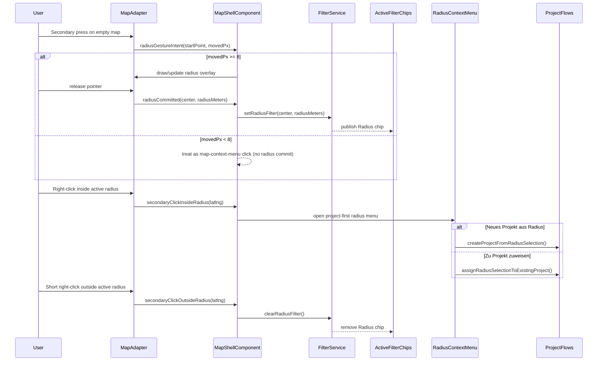

# Radius Selection

> **Blueprint:** [implementation-blueprints/radius-selection.md](../implementation-blueprints/radius-selection.md)
> **System spec:** [map-secondary-click-system](map-secondary-click-system.md)

## What It Is

A map interaction for selecting a geographic radius. The user right-clicks (desktop) or long-presses (mobile) on the map, then drags outward to draw a circle. The circle defines a spatial filter: "show me images within this radius." Once committed, the radius becomes an active filter with drag handles to resize.

## What It Looks Like

A semi-transparent circle overlay on the map with a `--color-clay` stroke (2px) and a very light fill (10% opacity). Center point marked with a small dot. Edge has a drag handle (small circle on the perimeter). Radius distance label shown near the edge (e.g., "250 m").

## Where It Lives

- **Parent**: Map Zone (Leaflet overlay layer)
- **Appears when**: User right-click-drags on the map

## Actions

| #   | User Action                             | System Response                                                 | Triggers                          |
| --- | --------------------------------------- | --------------------------------------------------------------- | --------------------------------- |
| 1   | Right-click + drag on map               | Circle appears from click point, expands as user drags          | Circle overlay drawn              |
| 2   | Releases mouse                          | Circle committed, becomes active filter                         | `FilterService.setRadiusFilter()` |
| 3   | Drags edge handle                       | Resizes the circle radius                                       | Filter updated, map re-queries    |
| 4   | Drags center point                      | Moves the entire circle                                         | Filter updated, map re-queries    |
| 5   | Right-click inside active radius        | Opens Radius Context Menu with project-focused actions          | Hit-test inside radius polygon    |
| 6   | Chooses `Neues Projekt aus Radius`      | Creates a named project from current in-radius media            | Existing project creation flow    |
| 7   | Chooses `Zu Projekt zuweisen...`        | Opens existing project picker and assigns all in-radius media   | Existing assign-to-project flow   |
| 8   | Short right-click outside active radius | Closes radius selection immediately (no map menu on same click) | Outside-radius secondary click    |
| 9   | Clicks × on radius filter chip          | Removes the circle and radius filter                            | Circle removed from map           |
| 10  | Long-press + drag (mobile)              | Same as right-click + drag                                      | Circle overlay drawn              |

### Interaction Rationale

- **Inside-radius menu gets project actions first**: Users selecting by radius are usually in curation mode; project assignment is the next likely step.
- **Reuse existing project verbs**: `Neues Projekt aus Radius` and `Zu Projekt zuweisen...` mirror existing project workflows and reduce new UI concepts.
- **Outside short right-click closes radius**: Fast "dismiss" gesture prevents accidental stale spatial filters and keeps map cleanup one click away.
- **No same-click menu reopen outside radius**: Avoids conflicting intent (dismiss vs open) and reduces surprise.

## Component Hierarchy

```
RadiusSelection                            ← Leaflet circle overlay (L.Circle via MapAdapter)
├── CenterDot                              ← small dot at center, draggable
├── CircleOverlay                          ← semi-transparent fill + stroke
├── EdgeHandle                             ← draggable circle on perimeter for resizing
└── RadiusLabel                            ← text label showing distance (e.g., "250 m")
```

Note: This is primarily a Leaflet layer managed by `MapAdapter`, not a standalone Angular component. The Angular side manages the state and filter integration.

## State

| Name           | Type                           | Default | Controls                                     |
| -------------- | ------------------------------ | ------- | -------------------------------------------- |
| `center`       | `{ lat: number, lng: number }` | —       | Circle center position                       |
| `radiusMeters` | `number`                       | —       | Circle radius                                |
| `isDrawing`    | `boolean`                      | `false` | Whether user is currently dragging to create |
| `isActive`     | `boolean`                      | `false` | Whether a committed radius filter exists     |

## File Map

| File                     | Purpose                                            |
| ------------------------ | -------------------------------------------------- |
| `core/map-adapter.ts`    | Circle overlay creation, drag interaction handling |
| `core/filter.service.ts` | Stores the radius filter (center + distance)       |

## Wiring

### Wiring Flow (Mermaid)



- Right-click/long-press interaction detected by `MapAdapter`
- On commit, passes center + radius to `FilterService`
- `FilterService` includes radius in spatial queries
- Removing the Active Filter Chip for radius also removes the map circle
- Only one radius selection active at a time
- Inside active radius, context actions prioritize project workflows
- Short outside right-click acts as explicit radius-dismiss gesture

## Acceptance Criteria

- [ ] Right-click + drag draws a circle (desktop)
- [ ] Long-press + drag draws a circle (mobile)
- [ ] Circle uses `--color-clay` stroke with light fill
- [ ] Radius label shown near the edge
- [ ] Edge handle allows resizing after commit
- [ ] Center dot allows repositioning after commit
- [ ] Right-click inside active radius opens Radius Context Menu with project actions.
- [ ] `Neues Projekt aus Radius` creates a project from the in-radius result set.
- [ ] `Zu Projekt zuweisen...` assigns in-radius result set to an existing project.
- [ ] Short right-click outside active radius closes radius filter immediately.
- [ ] Radius filter integrates with `FilterService` and Active Filter Chips
- [ ] Removing the chip removes the circle
- [ ] Only one radius selection at a time
