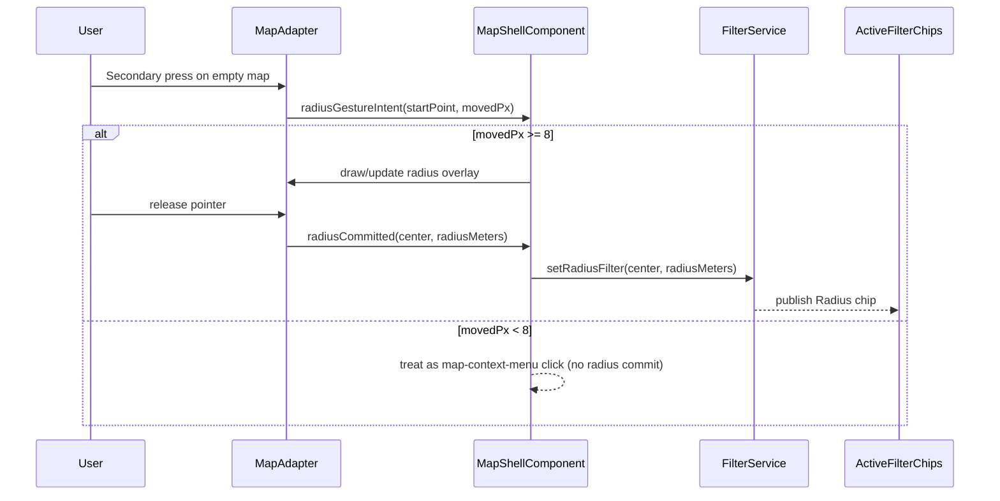

# Radius Selection

> **Blueprint:** [implementation-blueprints/radius-selection.md](../implementation-blueprints/radius-selection.md)

## What It Is

A map interaction for selecting a geographic radius. The user right-clicks (desktop) or long-presses (mobile) on the map, then drags outward to draw a circle. The circle defines a spatial filter: "show me images within this radius." Once committed, the radius becomes an active filter with drag handles to resize.

## What It Looks Like

A semi-transparent circle overlay on the map with a `--color-clay` stroke (2px) and a very light fill (10% opacity). Center point marked with a small dot. Edge has a drag handle (small circle on the perimeter). Radius distance label shown near the edge (e.g., "250 m").

## Where It Lives

- **Parent**: Map Zone (Leaflet overlay layer)
- **Appears when**: User right-click-drags on the map

## Actions

| #   | User Action                    | System Response                                        | Triggers                          |
| --- | ------------------------------ | ------------------------------------------------------ | --------------------------------- |
| 1   | Right-click + drag on map      | Circle appears from click point, expands as user drags | Circle overlay drawn              |
| 2   | Releases mouse                 | Circle committed, becomes active filter                | `FilterService.setRadiusFilter()` |
| 3   | Drags edge handle              | Resizes the circle radius                              | Filter updated, map re-queries    |
| 4   | Drags center point             | Moves the entire circle                                | Filter updated, map re-queries    |
| 5   | Clicks × on radius filter chip | Removes the circle and radius filter                   | Circle removed from map           |
| 6   | Long-press + drag (mobile)     | Same as right-click + drag                             | Circle overlay drawn              |

## Component Hierarchy

```
RadiusSelection                            ← Leaflet circle overlay (L.Circle via MapAdapter)
├── CenterDot                              ← small dot at center, draggable
├── CircleOverlay                          ← semi-transparent fill + stroke
├── EdgeHandle                             ← draggable circle on perimeter for resizing
└── RadiusLabel                            ← text label showing distance (e.g., "250 m")
```

Note: This is primarily a Leaflet layer managed by `MapAdapter`, not a standalone Angular component. The Angular side manages the state and filter integration.

## State

| Name           | Type                           | Default | Controls                                     |
| -------------- | ------------------------------ | ------- | -------------------------------------------- |
| `center`       | `{ lat: number, lng: number }` | —       | Circle center position                       |
| `radiusMeters` | `number`                       | —       | Circle radius                                |
| `isDrawing`    | `boolean`                      | `false` | Whether user is currently dragging to create |
| `isActive`     | `boolean`                      | `false` | Whether a committed radius filter exists     |

## File Map

| File                     | Purpose                                            |
| ------------------------ | -------------------------------------------------- |
| `core/map-adapter.ts`    | Circle overlay creation, drag interaction handling |
| `core/filter.service.ts` | Stores the radius filter (center + distance)       |

## Wiring

### Wiring Flow (Mermaid)



- Right-click/long-press interaction detected by `MapAdapter`
- On commit, passes center + radius to `FilterService`
- `FilterService` includes radius in spatial queries
- Removing the Active Filter Chip for radius also removes the map circle
- Only one radius selection active at a time

## Acceptance Criteria

- [ ] Right-click + drag draws a circle (desktop)
- [ ] Long-press + drag draws a circle (mobile)
- [ ] Circle uses `--color-clay` stroke with light fill
- [ ] Radius label shown near the edge
- [ ] Edge handle allows resizing after commit
- [ ] Center dot allows repositioning after commit
- [ ] Radius filter integrates with `FilterService` and Active Filter Chips
- [ ] Removing the chip removes the circle
- [ ] Only one radius selection at a time
