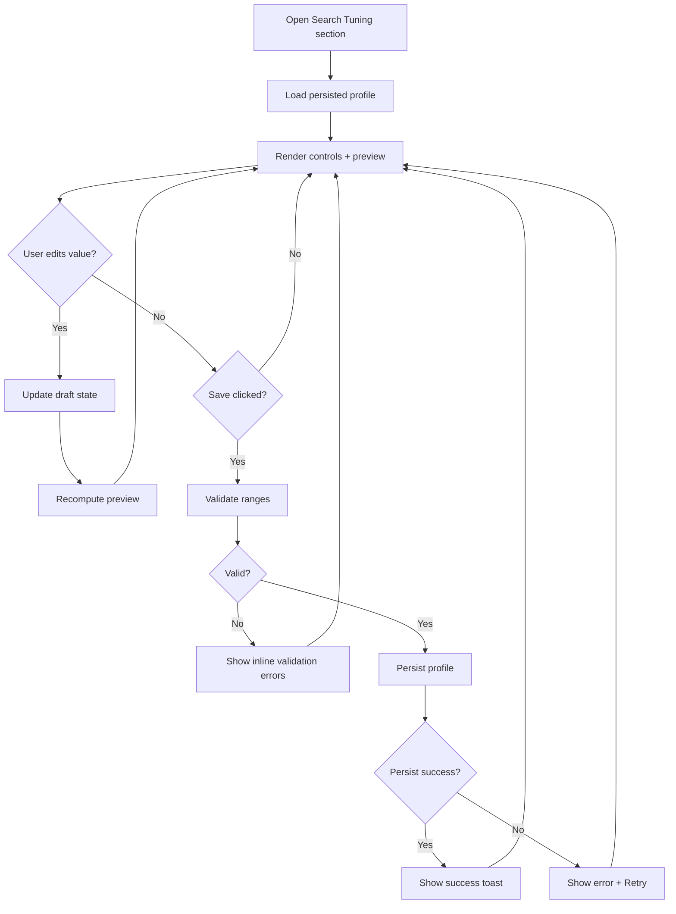
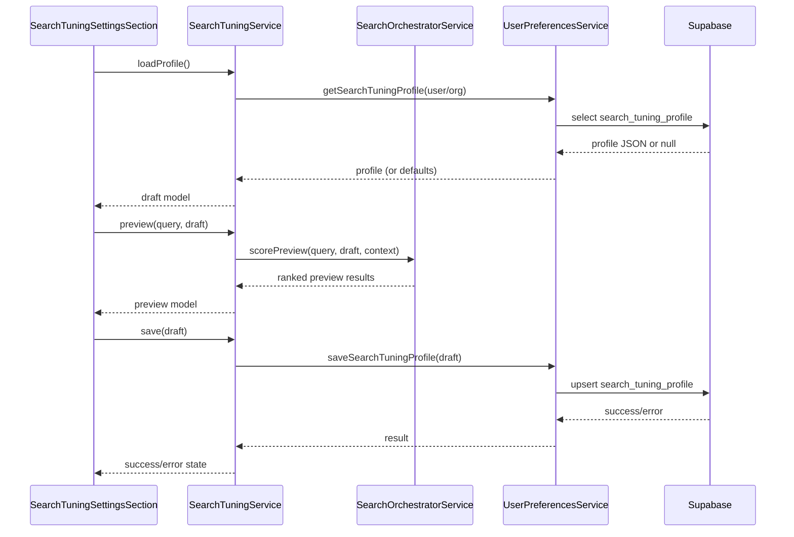
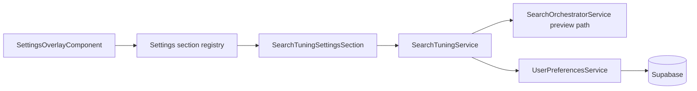

# Search Tuning Settings

> **Formula reference:** [search-algorithm-addresses-and-places.md](../../search-algorithm-addresses-and-places.md)

## What It Is

A settings section that lets authorized users tune address/place search behavior by adjusting filters, scoring weights, and penalties, then previewing the impact before saving.

## What It Looks Like

The section is rendered inside the existing Settings Overlay detail column as a form-first control surface. Controls are grouped into cards: Filters, Geocoder Weights, Penalties, and Place Boosts. Each numeric parameter is editable with a slider plus numeric input so users can do quick coarse or exact adjustments. A live preview pane shows top results for a test query and highlights score contributions by factor. Primary actions sit in a sticky footer: Reset to Defaults, Discard, and Save.

## Where It Lives

- **Route**: Global settings overlay section (no route segment).
- **Parent**: `SettingsOverlayComponent` via section registry.
- **Appears when**: User opens Settings Overlay and selects `Search Tuning`.

## Actions

| #   | User Action                                                | System Response                                                         | Triggers                               |
| --- | ---------------------------------------------------------- | ----------------------------------------------------------------------- | -------------------------------------- |
| 1   | Opens `Search Tuning` section                              | Loads persisted tuning profile and displays editable controls           | section selection in settings registry |
| 2   | Changes a filter threshold (for example min lexical score) | Updates draft state immediately and marks form as dirty                 | draft signal update                    |
| 3   | Changes a scoring weight                                   | Recomputes normalized weight check and updates preview scores           | draft signal update                    |
| 4   | Changes a penalty value                                    | Re-runs preview ranking for test query                                  | draft signal update                    |
| 5   | Enters test query in preview box                           | Runs preview scoring with current draft values (no global app mutation) | preview query input                    |
| 6   | Clicks `Reset to defaults`                                 | Restores all draft values to baseline defaults and reruns preview       | reset action                           |
| 7   | Clicks `Discard`                                           | Reverts draft to last persisted values                                  | discard action                         |
| 8   | Clicks `Save`                                              | Validates ranges, persists settings, emits success state                | save action                            |
| 9   | Save fails                                                 | Shows error banner with retry option; keeps draft values                | persistence error                      |



## Component Hierarchy

```text
SearchTuningSettingsSection (.ui-container in Settings detail area)
|- SectionHeader
|  |- Title: "Search Tuning"
|  `- Description: "Adjust filters and ranking weights for addresses and places"
|- TuningGrid (2-column desktop, 1-column mobile)
|  |- FiltersCard
|  |  |- MinQueryLengthControl
|  |  |- LexicalThresholdGroup
|  |  `- RetryThresholdGroup
|  |- GeocoderWeightsCard
|  |  |- ShortPrefixWeightsGroup
|  |  `- NormalWeightsGroup
|  |- PenaltiesCard
|  |  |- LocationPenaltyGroup
|  |  |- GeoPenaltyGroup
|  |  `- PrefixPenaltyControl
|  |- PlaceBoostsCard
|  |  |- ProjectBoostControl
|  |  |- GroupBoostControl
|  |  `- SizeSignalMultiplierControl
|  `- PreviewCard
|     |- PreviewQueryInput
|     |- PreviewResultList (top N)
|     `- ScoreBreakdownTable
`- StickyActionBar
   |- ResetToDefaultsButton
   |- DiscardButton
   `- SaveButton
```

## Data



| Field           | Source                              | Type                              |
| --------------- | ----------------------------------- | --------------------------------- |
| tuning profile  | `SearchTuningService.loadProfile()` | `SearchTuningProfile`             |
| default profile | `SEARCH_TUNING_DEFAULTS` constant   | `SearchTuningProfile`             |
| preview context | active map/search context provider  | `SearchQueryContext`              |
| preview results | `SearchTuningService.preview()`     | `SearchPreviewResult[]`           |
| save result     | `SearchTuningService.save()`        | `{ ok: boolean; error?: string }` |

## State

| Name               | Type                    | Default                  | Controls                          |
| ------------------ | ----------------------- | ------------------------ | --------------------------------- |
| `profile`          | `SearchTuningProfile`   | `SEARCH_TUNING_DEFAULTS` | current working model             |
| `persistedProfile` | `SearchTuningProfile`   | loaded value or defaults | dirty-check baseline              |
| `previewQuery`     | `string`                | `''`                     | ad-hoc query for preview          |
| `previewResults`   | `SearchPreviewResult[]` | `[]`                     | score/ranking preview UI          |
| `loading`          | `boolean`               | `true`                   | initial load state                |
| `saving`           | `boolean`               | `false`                  | save button busy/disabled state   |
| `dirty`            | `boolean`               | `false`                  | enables/disables Discard and Save |
| `error`            | `string \| null`        | `null`                   | error banner and retry affordance |

## File Map

| File                                                                                                | Purpose                                                             |
| --------------------------------------------------------------------------------------------------- | ------------------------------------------------------------------- |
| `apps/web/src/app/features/settings-overlay/sections/search-tuning-settings-section.component.ts`   | standalone settings section component for search tuning             |
| `apps/web/src/app/features/settings-overlay/sections/search-tuning-settings-section.component.html` | section template with grouped controls and preview                  |
| `apps/web/src/app/features/settings-overlay/sections/search-tuning-settings-section.component.scss` | scoped styling for cards, slider/input rows, and sticky footer      |
| `apps/web/src/app/core/search/search-tuning.service.ts`                                             | profile load/save/preview orchestration service                     |
| `apps/web/src/app/core/search/search-tuning.models.ts`                                              | types for profile fields, defaults, and preview models              |
| `apps/web/src/app/core/search/search-tuning.defaults.ts`                                            | canonical default values for all tunable parameters                 |
| `apps/web/src/app/core/search/search-tuning.service.spec.ts`                                        | unit tests for validation, reset, preview, and persistence behavior |

## Wiring

### Injected Services

- `SearchTuningService`: loads, validates, previews, and persists tuning profiles.
- `SearchOrchestratorService`: used by preview path to evaluate ranking with draft values.
- `UserPreferencesService` (or equivalent): persistence boundary for user/org settings.
- `AuthService`: scopes persisted profile to authenticated user/organization.

### Inputs / Outputs

- **Inputs**: None.
- **Outputs**: None (section is registry-mounted inside Settings Overlay).

### Subscriptions

- Preview query stream (debounced) to re-run preview scoring.
- Draft profile signal/observable to recompute derived validation and weight checks.
- Save result stream to map success/error UI states.

### Supabase Calls

- None directly from section component.
- Delegated via `UserPreferencesService` to read/write `search_tuning_profile` payload.



## Acceptance Criteria

- [ ] `Search Tuning` appears as a selectable section in Settings Overlay.
- [ ] Section loads persisted tuning profile or defaults when none is persisted.
- [ ] Every exposed filter/weight/penalty value is editable and range-validated.
- [ ] Editing any value updates preview ranking without mutating global live search.
- [ ] `Reset to defaults` restores all fields to canonical defaults.
- [ ] `Discard` restores draft to last persisted profile.
- [ ] `Save` persists profile and returns success state without leaving section.
- [ ] Save failure keeps draft values and surfaces actionable error message.
- [ ] Profile is scoped to authenticated user/organization context.

## Settings

- **Search Tuning**: address and place search filters, weights, penalties, and retry thresholds.
