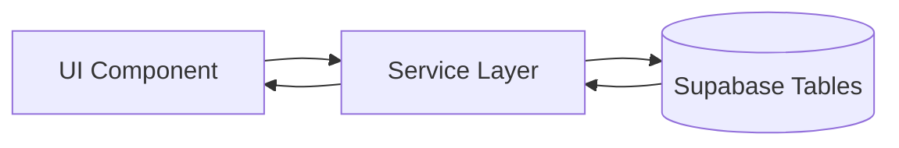
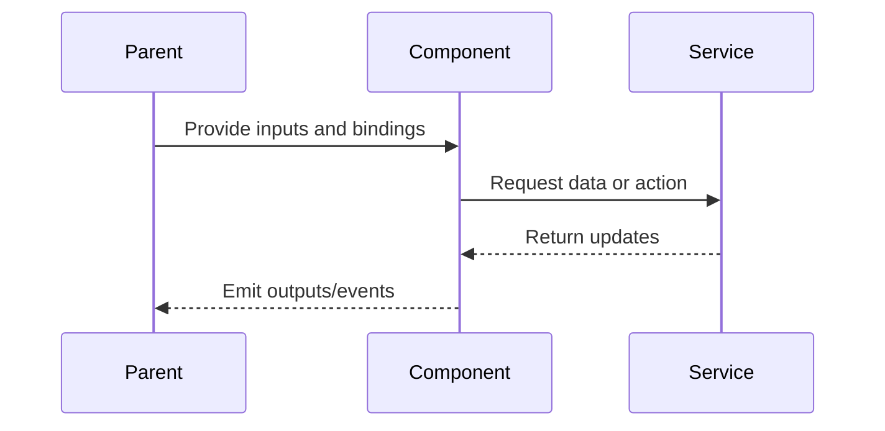

# Settings Page

## What It Is

App-level preferences page. Currently scoped to theme control (light/dark/system) and map tile preference. Accessed via `/settings` from the Sidebar. Settings are persisted in localStorage and optionally synced to the user profile.

## What It Looks Like

Full-width page with a clean form layout. Each setting is a labeled row: label on the left, control on the right. Grouped into sections with section headers. Warm `--color-bg-base` background, `--color-bg-surface` for setting cards.

## Where It Lives

- **Route**: `/settings`
- **Parent**: App shell
- **Sidebar link**: Settings gear icon

## Actions

| #   | User Action                | System Response                     | Triggers                         |
| --- | -------------------------- | ----------------------------------- | -------------------------------- |
| 1   | Navigates to /settings     | Shows current preferences           | Load from localStorage / profile |
| 2   | Changes theme              | Immediately applies theme, persists | `ThemeService`, localStorage     |
| 3   | Changes map tile style     | Updates map tile layer              | `MapAdapter.setTileLayer()`      |
| 4   | (Future) Other preferences | Persisted per setting               | —                                |

## Component Hierarchy

```
SettingsPage                               ← full-width, max-width 640px centered
├── SectionHeader "Appearance"
│   ├── SettingRow "Theme"
│   │   └── ThemeToggle                    ← reuses ThemeToggle component (light/dark/system)
│   └── SettingRow "Map tiles"
│       └── TileStyleSelect               ← dropdown: Default, Satellite, Terrain
└── [future] SectionHeader "Notifications" etc.
```

## Data

### Data Flow (Mermaid)



| Field         | Source                            | Type                            |
| ------------- | --------------------------------- | ------------------------------- |
| Current theme | `ThemeService.themeMode()`        | `'light' \| 'dark' \| 'system'` |
| Map tile pref | `localStorage` / user preferences | `string`                        |

## State

| Name        | Type                                    | Default             | Controls        |
| ----------- | --------------------------------------- | ------------------- | --------------- |
| `themeMode` | `'light' \| 'dark' \| 'system'`         | from `ThemeService` | Theme selection |
| `tileStyle` | `'default' \| 'satellite' \| 'terrain'` | `'default'`         | Map tile layer  |

## File Map

| File                                        | Purpose                                |
| ------------------------------------------- | -------------------------------------- |
| `features/settings/settings.component.ts`   | Page component (currently placeholder) |
| `features/settings/settings.component.html` | Template                               |
| `features/settings/settings.component.scss` | Styles                                 |
| `core/theme.service.ts`                     | Shared theme service                   |

## Wiring

### Wiring Flow (Mermaid)



- Add route `{ path: 'settings', component: SettingsComponent }` in `app.routes.ts`
- Import `SettingsComponent` standalone
- Inject `ThemeService` for theme preference
- Sidebar "settings" link navigates to `/settings`

## Acceptance Criteria

- [ ] Theme control matches ThemeToggle behavior (3-state cycle)
- [ ] Theme change applies immediately (no save button needed)
- [ ] Map tile preference persisted and applied on next map load
- [ ] Clean form layout, max-width centered
- [ ] Extensible: easy to add new setting rows later
