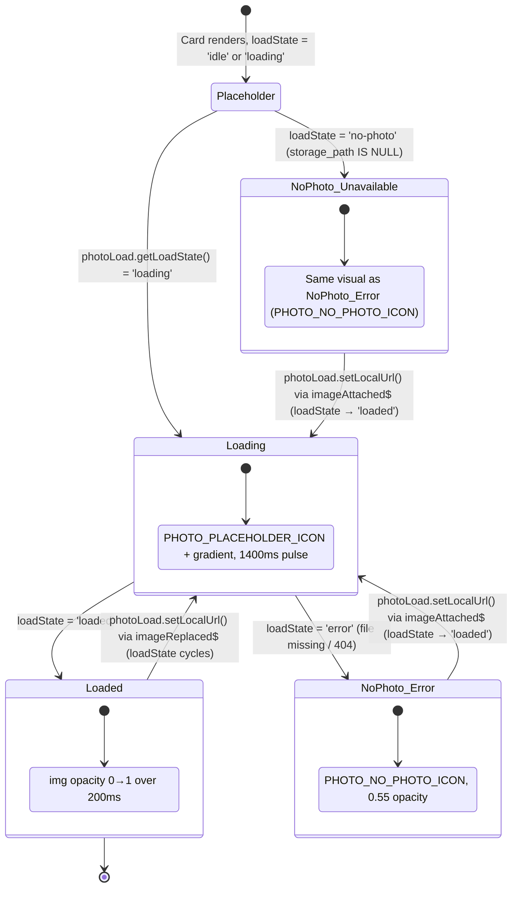

# Thumbnail Card

> **Photo loading service:** [photo-load-service](photo-load-service.md)
> **Photo loading use cases:** [use-cases/photo-loading.md](../use-cases/photo-loading.md)

## What It Is

A single 128×128px image thumbnail in the grid. Shows photo preview with overlaid metadata. Actions (checkbox, add to group, context menu) are hidden at rest and appear on hover (Quiet Actions pattern). On mobile, selection checkboxes become visible in bulk-select mode. Loading state is driven by `PhotoLoadService.getLoadState()` signals.

## What It Looks Like

128×128px rounded card. Photo thumbnail fills the card (`object-fit: cover`). When no photo file exists in Supabase Storage, the canonical `PHOTO_NO_PHOTO_ICON` from `PhotoLoadService` fills the card — no broken `` icon ever appears. Overlays at rest:

- Bottom-left: capture date (small, semi-transparent bg)
- Top-right: correction dot (if corrected) or metadata preview icon

On hover (desktop): fade-in at 80ms with no layout shift:

- Top-left: selection checkbox
- Top-right: "Add to project" icon button
- Bottom-right: context menu (⋯) button

## Where It Lives

- **Parent**: Thumbnail Grid
- **Component**: Inline within Thumbnail Grid or standalone component

## Actions

| #   | User Action                      | System Response                                    | Triggers            |
| --- | -------------------------------- | -------------------------------------------------- | ------------------- |
| 1   | Clicks card                      | Opens Image Detail View                            | `detailImageId` set |
| 2   | Hovers card (desktop)            | Reveals action buttons (checkbox, add-to-group, ⋯) | Opacity 0→1, 80ms   |
| 3   | Clicks checkbox                  | Toggles selection for this image                   | Selection state     |
| 4   | Clicks "Add to project"          | Opens project picker dropdown                      | Project selection   |
| 5   | Clicks ⋯ (context menu)          | Opens menu: View detail, Edit metadata, Delete     | Context menu        |
| 6   | Enters bulk-select mode (mobile) | Checkboxes become always visible                   | Bulk mode           |

## Component Hierarchy

```
ThumbnailCard                              ← 128×128, rounded, overflow-hidden, relative
├── [loaded] ThumbnailImage                ←  object-fit:cover, signed URL (256×256 transform) from PhotoLoadService
├── [loading] Placeholder                  ← PHOTO_PLACEHOLDER_ICON (gradient + camera icon SVG data-URI from PhotoLoadService)
├── [error/no-photo] NoPhotoPlaceholder    ← PHOTO_NO_PHOTO_ICON (gradient + crossed-out image SVG data-URI from PhotoLoadService), 0.55 opacity
├── DateOverlay                            ← bottom-left, text-xs, semi-transparent bg
├── [corrected] CorrectionDot             ← top-right, 6px, --color-accent
├── [uploading] UploadingOverlay           ← semi-transparent overlay with animated upload icon, --color-primary
└── [hover] ActionOverlay                  ← opacity 0→1, 80ms, no layout shift
    ├── SelectionCheckbox                  ← top-left
│   ├── AddToProjectButton                 ← top-right
    └── ContextMenuButton (⋯)             ← bottom-right
```

The `UploadingOverlay` is shown when a file targeting this image's coordinates is currently being uploaded (`jobPhaseChanged$` from `UploadManagerService`, phase === `'uploading'`). It renders a semi-transparent `--color-bg-base` overlay (0.6 opacity) with a small animated upload arrow icon in the center. The overlay does not block hover actions but sits behind them in z-order.

## Data

| Field           | Source                                                                   | Type      |
| --------------- | ------------------------------------------------------------------------ | --------- |
| Image thumbnail | `PhotoLoadService` signed URL (256×256 transform)                        | `string`  |
| Placeholder     | `PHOTO_PLACEHOLDER_ICON` / `PHOTO_NO_PHOTO_ICON` from `PhotoLoadService` | —         |
| Capture date    | `images.captured_at` or `images.created_at`                              | `Date`    |
| Is corrected    | `images.corrected_lat IS NOT NULL`                                       | `boolean` |

## State

| Name          | Type                     | Default | Controls                                                                                                     |
| ------------- | ------------------------ | ------- | ------------------------------------------------------------------------------------------------------------ |
| `isSelected`  | `boolean`                | `false` | Checkbox state                                                                                               |
| `isHovered`   | `boolean`                | `false` | Action overlay visibility (desktop)                                                                          |
| `isUploading` | `boolean`                | `false` | Upload overlay visibility (driven by `jobPhaseChanged$`)                                                     |
| `loadState`   | `Signal<PhotoLoadState>` | —       | Read from `photoLoad.getLoadState(imageId, 'thumb')` — drives placeholder, pulse, fade-in, and error visuals |

> **Removed:** `imgLoading`, `imgErrored`, `isLoading` (computed), `imageReady` (computed), `thumbnailUnavailable` — all replaced by the single `PhotoLoadState` signal from `PhotoLoadService`. The component reads `loadState` and maps its value (`'idle'`, `'loading'`, `'loaded'`, `'error'`, `'no-photo'`) to the appropriate visual state.

## Thumbnail Loading

Thumbnail cards use **Tier 2** of the progressive loading pipeline (256×256px). The `WorkspaceViewService` calls `photoLoad.batchSign(images, 'thumb')` for images with a pre-generated `thumbnailPath`, and the service falls back to individual `photoLoad.getSignedUrl(storagePath, 'thumb')` with server-side transforms for images without a thumbnail. The card reads `photoLoad.getLoadState(imageId, 'thumb')` to drive all visual states.

### Loading State Machine



> **Replace / Attach optimisation:** Both `imageReplaced$` and `imageAttached$` trigger `photoLoad.setLocalUrl(imageId, blobUrl)` in `UploadManagerService`, which sets the load state to `'loaded'` with a blob URL. Because blob URLs load locally in ~0ms, the pulsing placeholder phase is imperceptibly brief — the user sees an almost-instant swap to the new photo via the standard 200ms fade-in. See [PL-7 / PL-8](../use-cases/photo-loading.md#pl-7-replace-photo--loading-state-reset) for full interaction diagrams.

### Visual States

| State              | Placeholder visible | Pulse | Icon                                  | ``       | Trigger                                        |
| ------------------ | ------------------- | ----- | ------------------------------------- | ------------- | ---------------------------------------------- |
| Waiting            | Yes                 | Yes   | `PHOTO_PLACEHOLDER_ICON` (camera)     | Hidden        | `loadState = 'idle'` or `'loading'`            |
| Downloading        | Yes                 | Yes   | `PHOTO_PLACEHOLDER_ICON` (camera)     | Hidden        | `loadState = 'loading'`, URL received          |
| Loaded             | No                  | No    | —                                     | Visible       | `loadState = 'loaded'`                         |
| No photo           | Yes                 | No    | `PHOTO_NO_PHOTO_ICON` (crossed), 0.55 | Hidden        | `loadState = 'no-photo'`                       |
| Error (404)        | Yes                 | No    | `PHOTO_NO_PHOTO_ICON` (crossed), 0.55 | Hidden        | `loadState = 'error'`                          |
| Replacing (brief)  | Yes                 | Yes   | `PHOTO_PLACEHOLDER_ICON` (camera)     | Hidden        | `photoLoad.setLocalUrl()` via `imageReplaced$` |
| Replacing → Loaded | No                  | No    | —                                     | Visible (new) | `loadState = 'loaded'` (blob ~0ms)             |
| Attaching (brief)  | Yes                 | Yes   | `PHOTO_PLACEHOLDER_ICON` (camera)     | Hidden        | `photoLoad.setLocalUrl()` via `imageAttached$` |
| Attaching → Loaded | No                  | No    | —                                     | Visible (new) | `loadState = 'loaded'` (blob ~0ms)             |

### Placeholder Design

- **Loading state:** `PHOTO_PLACEHOLDER_ICON` from `PhotoLoadService` (camera icon SVG data-URI) centered on gradient background (`--color-bg-subtle` → `--color-bg-muted`). Pulses at 1400ms ease-in-out to match map marker loading animation.
- **No-photo / error state:** `PHOTO_NO_PHOTO_ICON` from `PhotoLoadService` (crossed-out image SVG data-URI, Material "image_not_supported") at 0.55 opacity. No pulse.
- These icons are shared with `PhotoMarkerComponent` and `ImageDetailPhotoViewerComponent` for consistent visuals across all surfaces.

## File Map

| File                                                      | Purpose                           |
| --------------------------------------------------------- | --------------------------------- |
| `features/map/workspace-pane/thumbnail-card.component.ts` | Card component with hover actions |

## Wiring

- Injects `PhotoLoadService` — reads `photoLoad.getLoadState(imageId, 'thumb')` signal to drive all visual states (placeholder, pulse, fade-in, error, no-photo). Uses `PHOTO_PLACEHOLDER_ICON` and `PHOTO_NO_PHOTO_ICON` for consistent placeholder visuals. **Does not call Supabase Storage directly.**
- Signed URLs are obtained by the parent `WorkspaceViewService` via `photoLoad.batchSign(images, 'thumb')` and passed down, or the card reads from the service cache directly.
- Import `ThumbnailCardComponent` in `ThumbnailGridComponent`
- Bind image data via `@Input()` from grid's `@for` loop
- Emit selection and detail-view events via `@Output()`

## Acceptance Criteria

- [ ] Loading state driven by `photoLoad.getLoadState(imageId, 'thumb')` signal — no local `imgLoading` / `imgErrored` booleans
- [ ] Uses `PHOTO_PLACEHOLDER_ICON` from `PhotoLoadService` for loading placeholder (gradient + camera icon, 1400ms pulse)
- [ ] Uses `PHOTO_NO_PHOTO_ICON` from `PhotoLoadService` for error/no-photo state (crossed-out image, 0.55 opacity)
- [ ] Placeholder visuals are identical across thumbnail cards, map markers, and detail view
- [ ] Component does not call `supabase.client.storage.from('images').createSignedUrl` directly — all via `PhotoLoadService`
- [ ] 128×128px with rounded corners
- [ ] Thumbnail shows via signed URL with `transform: { width: 256, height: 256, resize: 'cover' }` (service-managed)
- [ ] Pulsing placeholder shown while `loadState = 'loading'` (`PHOTO_PLACEHOLDER_ICON`, 1400ms pulse)
- [ ] Pulse stops once `loadState` transitions to `'loaded'` or `'error'` or `'no-photo'`
- [ ] Static `PHOTO_NO_PHOTO_ICON` (0.55 opacity) shown when `loadState = 'error'` or `'no-photo'`
- [x] `` fades in over 200ms once `loadState = 'loaded'`
- [x] No broken `` icon ever appears
- [ ] On `imageReplaced$`: `photoLoad.setLocalUrl()` injects blob URL → `loadState = 'loaded'` → fade-in with new photo (~0ms)
- [ ] On `imageAttached$`: `photoLoad.setLocalUrl()` injects blob URL → `loadState` transitions from `'no-photo'` → `'loaded'` → fade-in
- [ ] `localObjectUrl` freed via `photoLoad.revokeLocalUrl()` after signed URL takes over — no visible flash
- [x] Date overlay bottom-left, always visible (including on placeholder)

- [ ] Correction dot top-right (when corrected)
- [ ] Hover reveals checkbox, add-to-project, context menu (80ms, no layout shift)
- [ ] Upload overlay shown when a file for this image's coords is in `uploading` phase
- [ ] Upload overlay has animated upload icon + semi-transparent background
- [ ] Upload overlay disappears when upload completes or errors
- [ ] Mobile: checkboxes visible in bulk-select mode, hidden otherwise
- [ ] Click opens detail view
