# Thumbnail Card

> **Photo loading use cases:** [use-cases/photo-loading.md](../use-cases/photo-loading.md)

## What It Is

A single 128×128px image thumbnail in the grid. Shows photo preview with overlaid metadata. Actions (checkbox, add to group, context menu) are hidden at rest and appear on hover (Quiet Actions pattern). On mobile, selection checkboxes become visible in bulk-select mode.

## What It Looks Like

128×128px rounded card. Photo thumbnail fills the card (`object-fit: cover`). When no photo file exists in Supabase Storage, a CSS placeholder (gradient + camera icon) fills the card identically — no broken `` icon ever appears. Overlays at rest:

- Bottom-left: capture date (small, semi-transparent bg)
- Bottom-right: project badge (if assigned)
- Top-right: correction dot (if corrected) or metadata preview icon

On hover (desktop): fade-in at 80ms with no layout shift:

- Top-left: selection checkbox
- Top-right: "Add to project" icon button
- Bottom-right: context menu (⋯) button

## Where It Lives

- **Parent**: Thumbnail Grid
- **Component**: Inline within Thumbnail Grid or standalone component

## Actions

| #   | User Action                      | System Response                                    | Triggers            |
| --- | -------------------------------- | -------------------------------------------------- | ------------------- |
| 1   | Clicks card                      | Opens Image Detail View                            | `detailImageId` set |
| 2   | Hovers card (desktop)            | Reveals action buttons (checkbox, add-to-group, ⋯) | Opacity 0→1, 80ms   |
| 3   | Clicks checkbox                  | Toggles selection for this image                   | Selection state     |
| 4   | Clicks "Add to project"          | Opens project picker dropdown                      | Project selection   |
| 5   | Clicks ⋯ (context menu)          | Opens menu: View detail, Edit metadata, Delete     | Context menu        |
| 6   | Enters bulk-select mode (mobile) | Checkboxes become always visible                   | Bulk mode           |

## Component Hierarchy

```
ThumbnailCard                              ← 128×128, rounded, overflow-hidden, relative
├── [loaded] ThumbnailImage                ←  object-fit:cover, signed URL (256×256 transform)
├── [not loaded] Placeholder               ← CSS gradient + camera icon (SVG mask), matches card geometry
├── DateOverlay                            ← bottom-left, text-xs, semi-transparent bg
├── [has project] ProjectBadge             ← bottom-right, small pill
├── [corrected] CorrectionDot             ← top-right, 6px, --color-accent
└── [hover] ActionOverlay                  ← opacity 0→1, 80ms, no layout shift
    ├── SelectionCheckbox                  ← top-left
│   ├── AddToProjectButton                 ← top-right
    └── ContextMenuButton (⋯)             ← bottom-right
```

## Data

| Field           | Source                                          | Type             |
| --------------- | ----------------------------------------------- | ---------------- |
| Image thumbnail | Supabase Storage signed URL (256×256 transform) | `string`         |
| Placeholder     | CSS-only, no data source                        | —                |
| Capture date    | `images.captured_at` or `images.created_at`     | `Date`           |
| Project name    | `projects.name` via join                        | `string \| null` |
| Is corrected    | `images.corrected_lat IS NOT NULL`              | `boolean`        |

## State

| Name         | Type      | Default | Controls                                 |
| ------------ | --------- | ------- | ---------------------------------------- |
| `isSelected` | `boolean` | `false` | Checkbox state                           |
| `isHovered`  | `boolean` | `false` | Action overlay visibility (desktop)      |
| `isLoaded`   | `boolean` | `false` | Whether signed URL resolved successfully |
| `isLoading`  | `boolean` | `false` | Whether signed URL is being fetched      |

## Thumbnail Loading

Thumbnail cards use **Tier 2** of the progressive loading pipeline (256×256px). URLs are signed with `createSignedUrl(path, 3600, { transform: { width: 256, height: 256, resize: 'cover' } })`. The grid batches signing for all cards in the current virtual-scroll window.

### Loading States

```mermaid
stateDiagram-v2
    [*] --> Placeholder : Card enters viewport, no signedUrl yet
    Placeholder --> Loading : Batch sign request fires
    Loading --> Loaded : signedUrl received, <img> renders
    Loading --> Error : File missing in storage
    Error --> Placeholder : Show CSS placeholder permanently
    Loaded --> [*]

    note right of Loaded
        <img> fades in over 120ms
        Date overlay + badges render
        on top regardless of state
    end note
```



### Placeholder Design

Pure CSS — gradient background (`--color-bg-subtle` → `--color-bg-muted`) with a centered camera icon (SVG mask in `::after`). Matches card border-radius and dimensions exactly. Date overlay and project badge still render on top of the placeholder.

## File Map

| File                                                      | Purpose                           |
| --------------------------------------------------------- | --------------------------------- |
| `features/map/workspace-pane/thumbnail-card.component.ts` | Card component with hover actions |

## Wiring

- Import `ThumbnailCardComponent` in `ThumbnailGridComponent`
- Bind image data via `@Input()` from grid's `@for` loop
- Emit selection and detail-view events via `@Output()`

## Acceptance Criteria

- [ ] 128×128px with rounded corners
- [ ] Thumbnail shows via signed URL with `transform: { width: 256, height: 256, resize: 'cover' }`
- [ ] CSS placeholder shown while thumbnail is loading (gradient + camera icon)
- [ ] CSS placeholder shown permanently when file is missing in storage — no broken `` icon
- [ ] `` fades in over 120ms once signed URL loads
- [ ] Date overlay bottom-left, always visible (including on placeholder)
- [ ] Project badge bottom-right (when project assigned, including on placeholder)
- [ ] Correction dot top-right (when corrected)
- [ ] Hover reveals checkbox, add-to-project, context menu (80ms, no layout shift)
- [ ] Mobile: checkboxes visible in bulk-select mode, hidden otherwise
- [ ] Click opens detail view
