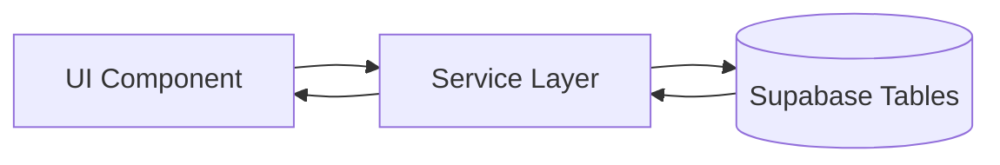
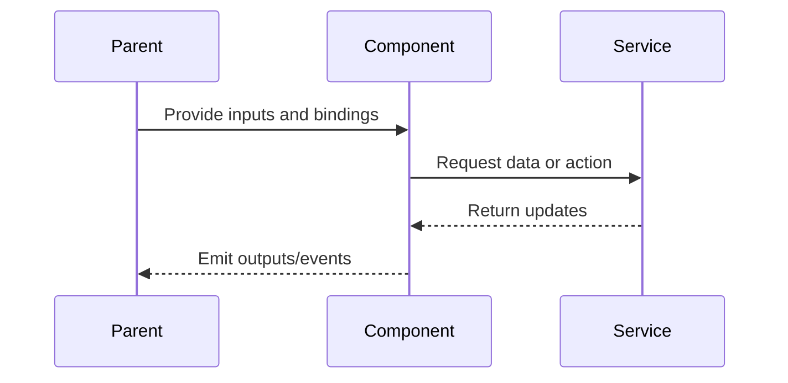

# Upload Button Zone

## What It Is

The upload trigger and its container. A round button fixed in the top-right of the Map Zone that toggles the Upload Panel open/closed. The zone holds both the button and the expanded panel in a vertical layout.

## What It Looks Like

**Button:** 44px circle, `--color-clay` background, white camera icon. Desktop: top-right of map. Mobile: 56px FAB, bottom-right. When panel is open, button gets an active/pressed state.

**Zone:** Fixed-position container that holds the button at top and the Upload Panel below when expanded. Desktop: top-right corner. Mobile: bottom-right for FAB, panel slides up.

## Where It Lives

- **Parent**: Map Zone area of `MapShellComponent`
- **Always visible** when on the map page

## Actions

| #   | User Action                       | System Response                                     | Triggers                      |
| --- | --------------------------------- | --------------------------------------------------- | ----------------------------- |
| 1   | Clicks upload button              | Toggles Upload Panel open/closed                    | `uploadPanelOpen` signal      |
| 2   | Clicks button while panel is open | Closes panel                                        | `uploadPanelOpen` → false     |
| 3   | Upload batch is active            | Button shows progress ring / badge overlay (0–100%) | `batchProgress$` subscription |
| 4   | All uploads complete              | Progress ring disappears, optional success flash    | `batchComplete$` event        |

## Component Hierarchy

```
UploadButtonZone                           ← fixed position container, z-20
├── UploadButton                           ← 44px circle (desktop) / 56px FAB (mobile)
│   ├── Icon "add_photo_alternate"         ← Material Icon, white
│   └── [uploading] ProgressRing           ← SVG circular progress (0–100%), --color-primary stroke
└── [open] UploadPanel                     ← slides down from button (see upload-panel spec)
```

The `ProgressRing` is a thin (2px) SVG circle overlaying the button border. It fills clockwise from 0–100% as the active batch progresses. When no batch is active, it is hidden. When the batch completes, it flashes `--color-success` briefly (200ms) before fading out.

## Data

### Data Flow (Mermaid)



| Field        | Source                               | Type                          |
| ------------ | ------------------------------------ | ----------------------------- |
| Active batch | `UploadManagerService.activeBatch()` | `Signal<UploadBatch \| null>` |
| Is busy      | `UploadManagerService.isBusy()`      | `Signal<boolean>`             |

## State

| Name              | Type      | Default | Controls                              |
| ----------------- | --------- | ------- | ------------------------------------- |
| `uploadPanelOpen` | `boolean` | `false` | Panel visibility, button active state |
| `batchProgress`   | `number`  | `0`     | Progress ring fill (0–100)            |

## File Map

Part of `MapShellComponent` template (button + zone container are in `map-shell.component.html`). The Upload Panel itself is a separate component.

## Wiring

### Wiring Flow (Mermaid)



- Button and zone container live in `map-shell.component.html`
- `uploadPanelOpen` signal in `MapShellComponent` controls panel visibility
- Click handler toggles `uploadPanelOpen` signal
- Subscribes to `UploadManagerService.batchProgress$` for the progress ring
- Subscribes to `UploadManagerService.batchComplete$` for the success flash

## Acceptance Criteria

- [ ] Button always visible on map page
- [ ] Desktop: 44px, top-right
- [ ] Mobile: 56px FAB, bottom-right
- [ ] Click toggles Upload Panel
- [ ] Button shows active state when panel is open
- [ ] `--color-clay` background, white icon
- [ ] Progress ring (SVG circle) appears on button when a batch is active
- [ ] Progress ring fills 0–100% as batch progresses
- [ ] Progress ring flashes `--color-success` on batch completion
- [ ] Progress ring hidden when no batch is active
