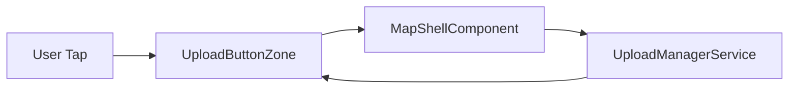
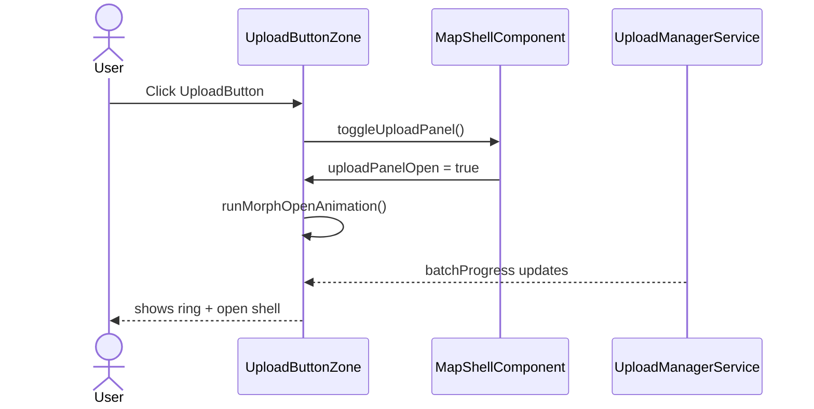

# Upload Button Zone

## What It Is

The upload trigger and its morph container. A round button fixed in the top-right of the Map Zone expands into a compact upload container when tapped. The zone holds the trigger, the expanded Upload Panel, and batch-state indicators.

## What It Looks Like

**Closed state:** 2.75rem (44px) circle, `--color-clay` background, white media-upload icon (not photo/camera-specific). Desktop is top-right of map; mobile is 3.5rem (56px) FAB bottom-right.

When the panel is closed and uploads are active, the zone additionally shows up to 3 currently uploading items as compact independent item previews near the trigger. These are live status previews, not full lane rows.

**Open state:** the circle morphs into a compact rounded container (`min-width: 20rem`, `max-width: 24rem`) with the drop area and status board handled by Upload Panel. The morph should animate radius, width, and elevation in 180ms using `--motion-standard` timing.

**Expanded trigger state (closed panel, active upload):** while uploads are active and the panel is still closed, the upload trigger itself expands horizontally to the left (same height as the button, wider form factor) and shows status text like `Uploading...` plus `current/total` count.

**Zone:** fixed-position stack container with a single visual surface in open state so it feels like one control, not a floating button plus separate card.

## Where It Lives

- **Parent**: Map Zone area of `MapShellComponent`
- **Always visible** when on the map page

## Actions

| #   | User Action                              | System Response                                                         | Triggers                     |
| --- | ---------------------------------------- | ----------------------------------------------------------------------- | ---------------------------- |
| 1   | Clicks upload button                     | Button morphs into compact upload container and opens panel             | `uploadPanelOpen` signal     |
| 2   | Clicks collapse control                  | Container collapses back into round upload button                       | `uploadPanelOpen` → false    |
| 3   | Upload batch is active                   | Button shell shows aggregate progress ring (0–100%)                     | `activeBatch()` signal       |
| 4   | Queue empty + no active uploads          | Progress ring hidden; control returns to idle visual                    | `activeBatch() === null`     |
| 5   | User reopens while uploads run           | Panel restores current intake/progress state                            | `UploadManagerService` state |
| 6   | Panel is closed while jobs upload        | Zone shows up to 3 currently uploading item previews                    | top-3 from uploading lane    |
| 7   | Panel is closed while uploads are active | Trigger expands left and shows `Uploading...` + `current/total` summary | `isBusy` state               |
| 8   | Batch progresses                         | Ring fills clockwise around icon until 100%                             | aggregate batch progress     |

## Component Hierarchy

```
UploadButtonZone                                   ← fixed position container, z-20
├── MorphShell                                     ← transitions circle → rounded panel shell
│   ├── UploadButton                               ← closed state: 44px desktop / 56px mobile
│   │   ├── Icon "upload"                          ← Material Icon, white, media-upload semantics
│   │   └── [uploading] ProgressRing               ← circular edge ring (0–100%), token-driven stroke/fill
│   ├── [closed + busy] ExpandedUploadButton          ← same height as trigger, expands left, shows uploading summary text
│   ├── [closed + busy] LiveUploadingPreviewList    ← max 3 independent preview items
│   │   └── UploadingPreviewItem × up to 3
│   └── [open] UploadPanel                         ← integrated content surface (see upload-panel spec)
```

The `ProgressRing` is a thin (2px) circular edge overlay around the trigger. It fills clockwise from 0–100% as the active batch progresses. When no batch is active, it is hidden.

## Data

### Data Flow (Mermaid)



| Field         | Source                               | Type                          |
| ------------- | ------------------------------------ | ----------------------------- |
| Active batch  | `UploadManagerService.activeBatch()` | `Signal<UploadBatch \| null>` |
| Is busy       | `UploadManagerService.isBusy()`      | `Signal<boolean>`             |
| Open state    | `MapShellComponent.uploadPanelOpen`  | `WritableSignal<boolean>`     |
| Live previews | uploading-lane derived projection    | `Signal<UploadJob[]>` (max 3) |

## State

| Name                       | Type          | Default | Controls                                                    |
| -------------------------- | ------------- | ------- | ----------------------------------------------------------- |
| `uploadPanelOpen`          | `boolean`     | `false` | Panel visibility, button active state                       |
| `batchProgress`            | `number`      | `0`     | Progress ring fill (0–100)                                  |
| `isMorphing`               | `boolean`     | `false` | Prevents double-tap during transition                       |
| `showExpandedUploadButton` | `boolean`     | `false` | Closed-state busy expanded trigger visibility               |
| `collapsedPreviewItems`    | `UploadJob[]` | `[]`    | Closed-state top-right preview list (max 3 uploading items) |

## File Map

Part of `MapShellComponent` template (button + zone container are in `map-shell.component.html`). The Upload Panel itself is a separate component.

## Wiring

### Wiring Flow (Mermaid)



- Button and zone container live in `map-shell.component.html`
- `uploadPanelOpen` signal in `MapShellComponent` controls panel visibility
- Click handler toggles `uploadPanelOpen` signal
- Reads `UploadManagerService.activeBatch()` for ring visibility and aggregate progress
- Reopening panel rehydrates view state from `UploadManagerService`

## Acceptance Criteria

- [ ] Button always visible on map page
- [ ] Desktop: 44px, top-right
- [ ] Mobile: 56px FAB, bottom-right
- [ ] Click morphs button into compact upload container
- [ ] Collapse control returns container to round button
- [ ] Button shows active state when panel is open
- [ ] `--color-clay` background, white icon
- [ ] Progress ring appears on button when a batch is active
- [ ] Progress ring fills 0–100% as batch progresses
- [ ] Progress ring fills clockwise around the trigger icon
- [ ] Progress ring hidden when no batch is active
- [ ] Reopening while uploads continue shows current panel state
- [ ] While panel is closed and uploads are active, zone shows up to 3 currently uploading item previews
- [ ] Closed-state busy state expands the upload trigger left while keeping trigger height constant
- [ ] Expanded trigger shows `Uploading...` and current/total upload count summary
