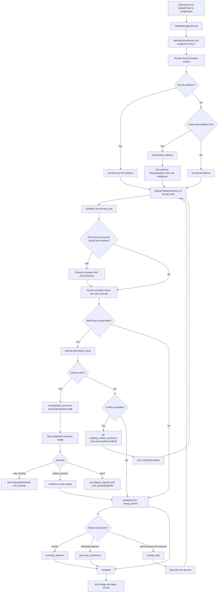
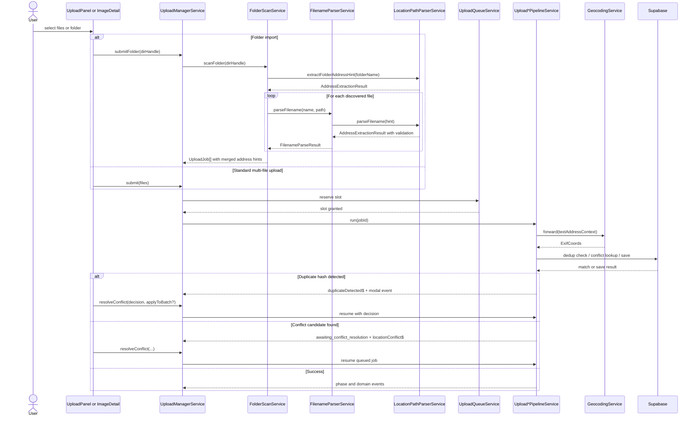

# Upload Manager Pipeline

## What It Is

Child spec for the operational pipeline owned by `UploadManagerService`: folder submission with address-hint extraction, media-only deduplication, replace/attach event flow, location-conflict handling, and EXIF-vs-text-address reconciliation (15m tolerance).

The pipeline coordinates three utility services (`FolderScanService`, `FilenameParserService`, `LocationPathParserService`) to establish address precedence: file > folder > country level. Details on orchestration, state, and conflict handling are preserved in Actions and acceptance criteria.

## What It Looks Like

This is mostly invisible infrastructure. Users experience it through stable phase labels, batch progress, skipped-duplicate states, replace/attach refresh behavior, and explicit conflict-resolution pauses instead of silent failures.

## Where It Lives

- **Parent spec**: `docs/element-specs/upload-manager.md`
- **Child/related specs**: `docs/element-specs/folder-scan.md`, `docs/element-specs/filename-parser.md`, `docs/element-specs/location-path-parser.md`
- **Primary implementation**: `core/upload/upload-manager.service.ts` plus pipeline services in `core/upload/` and shared utility services in `core/`
- **Consumed by**: upload panel, image detail replace/attach flows, map shell, thumbnail views, folder import entry points

## Actions

| #   | Trigger                                                  | System Response                                                                   | Notes                                  |
| --- | -------------------------------------------------------- | --------------------------------------------------------------------------------- | -------------------------------------- |
| 1   | User selects many files                                  | Creates one batch and one job per file                                            | Standard multi-file flow               |
| 2   | User selects a folder                                    | Scans recursively, creates scanning batch, then queues jobs                       | Chromium/File System Access only       |
| 3   | Folder name contains parseable address                   | Stores batch-level folder address hint and applies it to jobs without own address | Default only, never forced override    |
| 4   | Individual file name contains parseable address          | File-level address overrides inherited folder hint                                | Most-specific textual source wins      |
| 4b  | Street+house resolves to multiple cities                 | Runs disambiguation algorithm and computes ranked candidate probabilities         | Auto-assign only above threshold       |
| 5   | EXIF GPS and text-derived address both available         | Geocodes text address and compares distance to EXIF GPS using 15m tolerance       | Keeps both coordinate sources          |
| 6   | Distance between text-derived and EXIF coordinates > 15m | Marks location source mismatch for detail UI and audit fields                     | Upload still continues                 |
| 7   | Job media type is image or video                         | Computes content hash and checks server for duplicate content                     | Hash dedupe does not run for documents |
| 8   | Job media type is document                               | Skips dedupe check and continues normal upload path                               | PDF/Office are not hash-blocked        |
| 9   | Duplicate hash found (image/video)                       | Moves job to issues lane and opens duplicate-resolution modal                     | Not auto-skipped                       |
| 10  | User clicks secondary GPS button in duplicate issue row  | Opens/focuses already placed existing media item                                  | Uses existing media reference          |
| 11  | User resolves duplicate modal                            | Chooses `use_existing`, `upload_anyway`, or `reject`                              | Optional "apply to all in batch"       |
| 11b | Parser leaves residual address fragments                 | Persists `addressNotes[]` on job/media metadata                                   | Nothing parsed is lost                 |
| 12  | Upload targets photoless row conflict                    | Pauses in `awaiting_conflict_resolution` and emits popup event                    | Releases concurrency slot              |
| 13  | User resolves conflict                                   | Resumes with `attach_replace`, `attach_keep`, or `create_new`                     | Re-queues at front                     |
| 14  | User replaces existing photo                             | Emits replace-specific events so map/detail/grid refresh instantly                | Existing image row retained            |
| 15  | User attaches photo to photoless row                     | Emits attach-specific events so no-photo surfaces update                          | Existing row gains media               |

## Component Hierarchy

```
Upload Manager Pipeline
  ├── Submission Entry Points
  │   ├── submit(files) ← standard multi-file entry
  │   ├── submitFolder(dirHandle) ← folder import entry
  │   ├── replaceFile(imageId, file) ← replace existing photo
  │   └── attachFile(imageId, file) ← attach to photoless row
  ├── Processing Stages
  │   ├── Validation / EXIF
  │   ├── Hashing / Dedup
  │   ├── Upload / DB write
  │   └── Enrichment / Conflict resolution
  ├── Persistence Contracts
  │   ├── `dedup_hashes`
  │   ├── duplicate-resolution decision state
  │   └── `images` conflict lookup
  └── Output Events
      ├── batch progress / batch complete
      ├── upload skipped / upload failed
      ├── image uploaded / replaced / attached
      └── location conflict / missing data
```

## Data

### Data Flow (Mermaid)



| Field / Artifact       | Source                                | Type                                            | Notes                                                  |
| ---------------------- | ------------------------------------- | ----------------------------------------------- | ------------------------------------------------------ |
| Folder batch status    | `UploadBatchService`                  | `UploadBatch`                                   | Starts as `scanning`, then transitions to `uploading`  |
| Folder address hint    | Folder name parser                    | `string \| null`                                | Batch default address for jobs without file-level hint |
| File title address     | Filename parser                       | `string \| null`                                | Overrides folder address hint                          |
| Title geocode          | `GeocodingService.forward()`          | `ExifCoords \| null`                            | Used for source reconciliation                         |
| EXIF/title distance    | Haversine compare                     | `number \| null`                                | Mismatch if `distanceMeters > 15`                      |
| Location sources       | Upload persistence (`images/media`)   | structured fields                               | Keeps EXIF and text-derived coordinates separately     |
| Address disambiguation | `LocationPathParserService` ranking   | `{ algorithm, probability, candidates }`        | Used for ambiguous city assignment                     |
| Address notes          | Parser residual fragments             | `string[]`                                      | Preserved on job + media metadata                      |
| Content hash           | `core/content-hash.util.ts`           | `string`                                        | SHA-256 from file head + EXIF-derived metadata         |
| Dedup lookup result    | `check_dedup_hashes` RPC              | `{ content_hash, image_id }[]`                  | Used for single and batch duplicate checks             |
| Dedupe scope           | Media type gate                       | `'image' \| 'video'`                            | Documents are excluded from hash dedupe                |
| Duplicate decision     | Duplicate-resolution modal            | `'use_existing' \| 'upload_anyway' \| 'reject'` | Can be batch-applied                                   |
| Duplicate apply mode   | Modal checkbox                        | `boolean`                                       | Apply chosen decision to all matching jobs in batch    |
| Conflict candidate     | `images` table lookup                 | `ConflictCandidate`                             | Photoless row near upload coords/address               |
| Replace event          | `UploadManagerService.imageReplaced$` | `ImageReplacedEvent`                            | Drives map/detail/card refresh                         |
| Attach event           | `UploadManagerService.imageAttached$` | `ImageAttachedEvent`                            | Upgrades photoless surfaces to media surfaces          |

## State

| Name                         | Type                                                                                                    | Default       | Controls                                                  |
| ---------------------------- | ------------------------------------------------------------------------------------------------------- | ------------- | --------------------------------------------------------- |
| `batch.status`               | `'scanning' \| 'uploading' \| 'complete' \| 'cancelled'`                                                | `'uploading'` | Batch lifecycle during folder submissions                 |
| `batch.folderAddressHint`    | `string \| null`                                                                                        | `null`        | Default textual address for folder jobs                   |
| `job.titleAddressSource`     | `'file' \| 'folder' \| null`                                                                            | `null`        | Provenance of the active textual address                  |
| `job.titleAddressCoords`     | `ExifCoords \| undefined`                                                                               | `undefined`   | Geocoded coordinates from textual address                 |
| `job.addressDisambiguation`  | `{ algorithm:string; probability:number; candidates:{city:string; probability:number}[] } \| undefined` | `undefined`   | Ambiguous city ranking result                             |
| `job.addressNotes`           | `string[]`                                                                                              | `[]`          | Unmapped parsed fragments preserved                       |
| `job.locationMismatch`       | `{ distanceMeters:number } \| undefined`                                                                | `undefined`   | EXIF vs text-derived mismatch payload                     |
| `job.contentHash`            | `string \| undefined`                                                                                   | `undefined`   | Dedup identity for resume-safe uploads                    |
| `job.duplicateState`         | `'none' \| 'duplicate_issue' \| 'resolved'`                                                             | `'none'`      | Duplicate detection + modal lifecycle                     |
| `job.duplicateDecision`      | `'use_existing' \| 'upload_anyway' \| 'reject' \| undefined`                                            | `undefined`   | Final duplicate decision per job                          |
| `job.duplicateTargetImageId` | `string \| undefined`                                                                                   | `undefined`   | Existing image selected via duplicate flow                |
| `job.existingImageId`        | `string \| undefined`                                                                                   | `undefined`   | Existing image match selected via `use_existing` decision |
| `job.conflictCandidate`      | `ConflictCandidate \| undefined`                                                                        | `undefined`   | Existing photoless row candidate                          |
| `job.conflictResolution`     | `ConflictResolution \| undefined`                                                                       | `undefined`   | User choice after conflict popup                          |
| `job.mode`                   | `'new' \| 'replace' \| 'attach'`                                                                        | `'new'`       | Routes pipeline and output events                         |

## File Map

| File                                                      | Purpose                                          |
| --------------------------------------------------------- | ------------------------------------------------ |
| **Specs**                                                 |                                                  |
| `docs/element-specs/upload-manager.md`                    | Parent contract                                  |
| `docs/element-specs/upload-manager-pipeline.md`           | Child spec for deep operational behavior         |
| `docs/element-specs/location-path-parser.md`              | Address extraction from path hierarchy           |
| `docs/element-specs/folder-scan.md`                       | Folder scanning and per-file aggregation         |
| `docs/element-specs/filename-parser.md`                   | Per-file metadata extraction (address, date)     |
| `docs/implementation-blueprints/upload-manager.md`        | Blueprint for implementation-level rollout notes |
| **Services**                                              |                                                  |
| `core/upload/upload-manager.service.ts`                   | Batch submission, queue draining, event fan-out  |
| `core/upload/upload-new-pipeline.service.ts`              | New-upload path                                  |
| `core/upload/folder-scan.service.ts`                      | Folder scan + folder-address-hint extraction     |
| `core/filename-parser.service.ts`                         | File-level metadata (address, date) extraction   |
| `core/location-path-parser.service.ts`                    | Address component parsing and validation         |
| `core/geocoding.service.ts`                               | Forward geocoding for text-derived coordinates   |
| `core/upload/upload-replace-pipeline.service.ts`          | Replace path                                     |
| `core/upload/upload-attach-pipeline.service.ts`           | Attach path                                      |
| `core/upload/upload-queue.service.ts`                     | Concurrency and running-slot management          |
| `core/upload/upload-job-state.service.ts`                 | Job phase state and phase-change events          |
| **Utilities & Constants**                                 |                                                  |
| `core/location-path-parser/city-registry.const.ts`        | City whitelist lookup table                      |
| `core/location-path-parser/postal-code-patterns.const.ts` | Country-specific postal code regexes             |
| `core/location-path-parser/street-keywords.const.ts`      | Street type keywords (Gasse, Str., etc.)         |
| `core/filename-parser/date-patterns.const.ts`             | ISO, timestamp, German date format regexes       |
| `core/filename-parser/metadata-keywords.const.ts`         | DRAFT, THUMB, TEMP metadata keyword set          |
| `core/location-path-parser.util.ts`                       | Shared validation utilities                      |
| `core/filename-parser.util.ts`                            | Filename normalization utilities                 |
| `features/upload/upload-duplicate-resolution-modal/*`     | Duplicate decision modal with batch-apply option |
| `core/content-hash.util.ts`                               | Content hash generation                          |

## Wiring

### Injected Services

- `UploadJobStateService` — owns job state, phase transitions, and failure events
- `UploadBatchService` — owns batch progress and completion state
- `UploadQueueService` — enforces concurrency and running-slot tracking
- `FolderScanService` — recursively scans directories; uses `FilenameParserService` + `LocationPathParserService` per file
- `FilenameParserService` — extracts address and date from all filenames (standalone or via FolderScanService)
- `LocationPathParserService` — parses and validates address components from path hierarchies
- `UploadNewPipelineService` — executes normal upload path
- `UploadReplacePipelineService` — executes replace path
- `UploadAttachPipelineService` — executes attach path
- `GeocodingService` — forward-geocodes text-derived addresses to coordinates
- `SupabaseService` — used for RPC/storage cleanup through service abstraction

### Inputs / Outputs

- **Inputs**: `File[]`, `FileSystemDirectoryHandle`, `imageId`, conflict-resolution choice
- **Outputs**: `batchId`, `jobId`, and event streams on `UploadManagerService`

### Subscriptions

- Manager-owned consumers subscribe to `imageUploaded$`, `imageReplaced$`, `imageAttached$`, `uploadSkipped$`, `locationConflict$`, `jobPhaseChanged$`, `batchProgress$`, and `batchComplete$`.
- Folder scan progress updates batch totals during `submitFolder()`.

### Supabase Calls

- `rpc('check_dedup_hashes', { hashes })` — duplicate detection
- Storage remove on cancellation/cleanup via `SupabaseService`
- Conflict lookup and save/update behavior are delegated through upload pipeline services

### Wiring Flow (Mermaid)



## Acceptance Criteria

- [x] Standard multi-file upload creates one batch and one job per file.
- [x] Folder upload uses scanning state before queueing discovered files.
- [ ] Folder uploads inherit a folder-level textual address for files that do not provide their own title address.
- [ ] File-level title addresses override inherited folder-level addresses.
- [ ] Ambiguous street+house matches run disambiguation ranking and auto-assign only when probability >= configured threshold.
- [ ] EXIF GPS is never discarded when title/folder addresses exist.
- [ ] Text-derived coordinates and EXIF coordinates are compared with a 15m tolerance.
- [ ] Mismatches beyond 15m are persisted as structured location mismatch state and surfaced to detail UI.
- [ ] Hash deduplication runs only for image/video media types.
- [ ] PDF and Office documents bypass hash dedupe and stay on normal upload path.
- [ ] Duplicate hash matches are surfaced as issues instead of being auto-skipped.
- [ ] Duplicate issue row exposes a secondary GPS action that opens the existing placed media.
- [ ] Duplicate-resolution modal supports `use_existing`, `upload_anyway`, and `reject` decisions.
- [ ] Duplicate-resolution modal supports "apply to all matching items in this batch".
- [ ] Choosing `use_existing` links the current project context to the existing media item when needed.
- [ ] Choosing `upload_anyway` creates a new media item even with matching hash.
- [ ] Choosing `reject` marks the item as skipped/rejected and keeps audit trace.
- [ ] Parser residual fragments are preserved in `addressNotes[]` and carried into media detail evidence.
- [x] Dedup behavior is resume-safe when a folder is re-selected after interruption.
- [x] Replace flow emits `imageReplaced$` so image surfaces refresh immediately.
- [x] Attach flow emits `imageAttached$` so photoless surfaces upgrade immediately.
- [x] Conflict handling pauses the job and emits `locationConflict$` instead of silently choosing a row.
- [x] Jobs in `awaiting_conflict_resolution` do not permanently consume a concurrency slot.
- [x] Resolved conflicts resume the same job rather than creating a new job identity.
- [x] Dedup and conflict behavior remain part of the upload contract even if implementation details move to blueprint/services.
