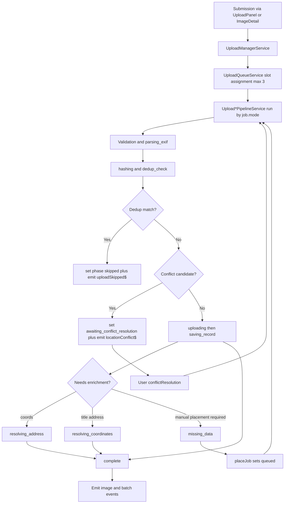
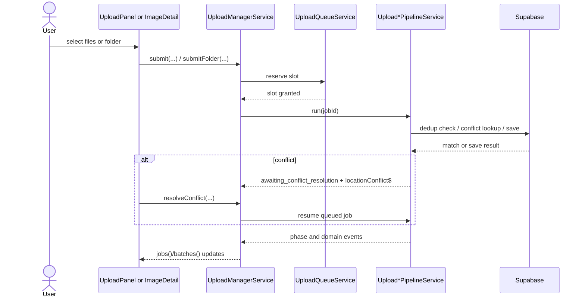

# Upload Manager Pipeline

## What It Is

Child spec for the operational pipeline owned by `UploadManagerService`: folder submission, deduplication, replace/attach event flow, and location-conflict handling.

It exists to keep the parent `upload-manager.md` contractual while preserving the detailed orchestration rules that materially affect correctness.

## What It Looks Like

This is mostly invisible infrastructure. Users experience it through stable phase labels, batch progress, skipped-duplicate states, replace/attach refresh behavior, and explicit conflict-resolution pauses instead of silent failures.

## Where It Lives

- **Parent spec**: `docs/element-specs/upload-manager.md`
- **Primary implementation**: `core/upload/upload-manager.service.ts` plus pipeline services in `core/upload/`
- **Consumed by**: upload panel, image detail replace/attach flows, map shell, thumbnail views, folder import entry points

## Actions

| #   | Trigger                               | System Response                                                    | Notes                            |
| --- | ------------------------------------- | ------------------------------------------------------------------ | -------------------------------- |
| 1   | User selects many files               | Creates one batch and one job per file                             | Standard multi-file flow         |
| 2   | User selects a folder                 | Scans recursively, creates scanning batch, then queues jobs        | Chromium/File System Access only |
| 3   | Pipeline computes content hash        | Checks server for duplicate content                                | Duplicate jobs become `skipped`  |
| 4   | Duplicate found                       | Emits `uploadSkipped$` and excludes file from upload path          | Resume-safe behavior             |
| 5   | Upload targets photoless row conflict | Pauses in `awaiting_conflict_resolution` and emits popup event     | Releases concurrency slot        |
| 6   | User resolves conflict                | Resumes with `attach_replace`, `attach_keep`, or `create_new`      | Re-queues at front               |
| 7   | User replaces existing photo          | Emits replace-specific events so map/detail/grid refresh instantly | Existing image row retained      |
| 8   | User attaches photo to photoless row  | Emits attach-specific events so no-photo surfaces update           | Existing row gains media         |

## Component Hierarchy

```
Upload Manager Pipeline
  ├── Submission Entry Points
  │   ├── submit(files) ← standard multi-file entry
  │   ├── submitFolder(dirHandle) ← folder import entry
  │   ├── replaceFile(imageId, file) ← replace existing photo
  │   └── attachFile(imageId, file) ← attach to photoless row
  ├── Processing Stages
  │   ├── Validation / EXIF
  │   ├── Hashing / Dedup
  │   ├── Upload / DB write
  │   └── Enrichment / Conflict resolution
  ├── Persistence Contracts
  │   ├── `dedup_hashes`
  │   └── `images` conflict lookup
  └── Output Events
      ├── batch progress / batch complete
      ├── upload skipped / upload failed
      ├── image uploaded / replaced / attached
      └── location conflict / missing data
```

## Data

### Data Flow (Mermaid)



| Field / Artifact    | Source                                | Type                           | Notes                                                 |
| ------------------- | ------------------------------------- | ------------------------------ | ----------------------------------------------------- |
| Folder batch status | `UploadBatchService`                  | `UploadBatch`                  | Starts as `scanning`, then transitions to `uploading` |
| Content hash        | `core/content-hash.util.ts`           | `string`                       | SHA-256 from file head + EXIF-derived metadata        |
| Dedup lookup result | `check_dedup_hashes` RPC              | `{ content_hash, image_id }[]` | Used for single and batch duplicate checks            |
| Conflict candidate  | `images` table lookup                 | `ConflictCandidate`            | Photoless row near upload coords/address              |
| Replace event       | `UploadManagerService.imageReplaced$` | `ImageReplacedEvent`           | Drives map/detail/card refresh                        |
| Attach event        | `UploadManagerService.imageAttached$` | `ImageAttachedEvent`           | Upgrades photoless surfaces to media surfaces         |

## State

| Name                     | Type                                                     | Default       | Controls                                  |
| ------------------------ | -------------------------------------------------------- | ------------- | ----------------------------------------- |
| `batch.status`           | `'scanning' \| 'uploading' \| 'complete' \| 'cancelled'` | `'uploading'` | Batch lifecycle during folder submissions |
| `job.contentHash`        | `string \| undefined`                                    | `undefined`   | Dedup identity for resume-safe uploads    |
| `job.existingImageId`    | `string \| undefined`                                    | `undefined`   | Existing image match when dedup skips     |
| `job.conflictCandidate`  | `ConflictCandidate \| undefined`                         | `undefined`   | Existing photoless row candidate          |
| `job.conflictResolution` | `ConflictResolution \| undefined`                        | `undefined`   | User choice after conflict popup          |
| `job.mode`               | `'new' \| 'replace' \| 'attach'`                         | `'new'`       | Routes pipeline and output events         |

## File Map

| File                                               | Purpose                                          |
| -------------------------------------------------- | ------------------------------------------------ |
| `docs/element-specs/upload-manager.md`             | Parent contract                                  |
| `docs/element-specs/upload-manager-pipeline.md`    | Child spec for deep operational behavior         |
| `docs/implementation-blueprints/upload-manager.md` | Blueprint for implementation-level rollout notes |
| `core/upload/upload-manager.service.ts`            | Batch submission, queue draining, event fan-out  |
| `core/upload/upload-new-pipeline.service.ts`       | New-upload path                                  |
| `core/upload/upload-replace-pipeline.service.ts`   | Replace path                                     |
| `core/upload/upload-attach-pipeline.service.ts`    | Attach path                                      |
| `core/upload/upload-queue.service.ts`              | Concurrency and running-slot management          |
| `core/upload/upload-job-state.service.ts`          | Job phase state and phase-change events          |
| `core/content-hash.util.ts`                        | Content hash generation                          |

## Wiring

### Injected Services

- `UploadJobStateService` — owns job state, phase transitions, and failure events
- `UploadBatchService` — owns batch progress and completion state
- `UploadQueueService` — enforces concurrency and running-slot tracking
- `FolderScanService` — recursively scans selected directories
- `UploadNewPipelineService` — executes normal upload path
- `UploadReplacePipelineService` — executes replace path
- `UploadAttachPipelineService` — executes attach path
- `SupabaseService` — used for RPC/storage cleanup through service abstraction

### Inputs / Outputs

- **Inputs**: `File[]`, `FileSystemDirectoryHandle`, `imageId`, conflict-resolution choice
- **Outputs**: `batchId`, `jobId`, and event streams on `UploadManagerService`

### Subscriptions

- Manager-owned consumers subscribe to `imageUploaded$`, `imageReplaced$`, `imageAttached$`, `uploadSkipped$`, `locationConflict$`, `jobPhaseChanged$`, `batchProgress$`, and `batchComplete$`.
- Folder scan progress updates batch totals during `submitFolder()`.

### Supabase Calls

- `rpc('check_dedup_hashes', { hashes })` — duplicate detection
- Storage remove on cancellation/cleanup via `SupabaseService`
- Conflict lookup and save/update behavior are delegated through upload pipeline services

### Wiring Flow (Mermaid)



## Acceptance Criteria

- [x] Standard multi-file upload creates one batch and one job per file.
- [x] Folder upload uses scanning state before queueing discovered files.
- [x] Deduplication can skip already-uploaded files without re-uploading blobs.
- [x] Dedup behavior is resume-safe when a folder is re-selected after interruption.
- [x] Replace flow emits `imageReplaced$` so image surfaces refresh immediately.
- [x] Attach flow emits `imageAttached$` so photoless surfaces upgrade immediately.
- [x] Conflict handling pauses the job and emits `locationConflict$` instead of silently choosing a row.
- [x] Jobs in `awaiting_conflict_resolution` do not permanently consume a concurrency slot.
- [x] Resolved conflicts resume the same job rather than creating a new job identity.
- [x] Dedup and conflict behavior remain part of the upload contract even if implementation details move to blueprint/services.
