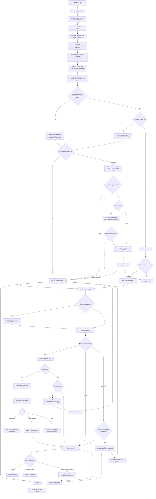
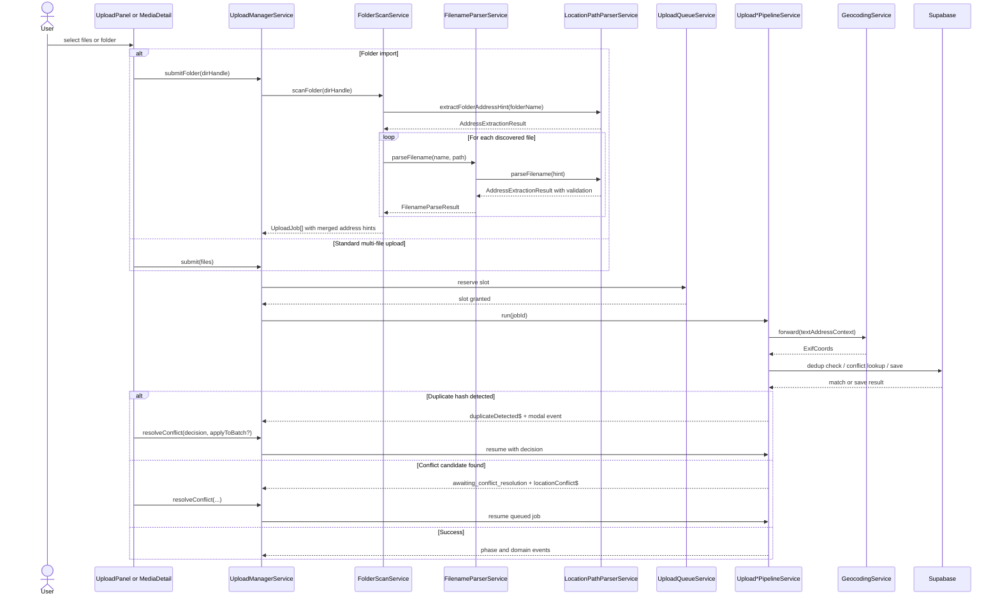

# Upload Manager Pipeline

## What It Is

Child spec for the operational pipeline owned by `UploadManagerService`: folder submission with address-hint extraction, photo-only deduplication, replace/attach event flow, location-conflict handling, and EXIF-vs-text-address reconciliation (15m tolerance).

The pipeline coordinates three utility services (`FolderScanService`, `FilenameParserService`, `LocationPathParserService`) to establish address precedence: file > folder > country level. The upload-internal `address_ambiguous` prompt is emitted only when the user needs to resolve conflicting parsed location candidates. Details on orchestration, state, and conflict handling are preserved in Actions and acceptance criteria.

## What It Looks Like

This is mostly invisible infrastructure. Users experience it through stable phase labels, batch progress, skipped-duplicate states, replace/attach refresh behavior, and explicit conflict-resolution pauses instead of silent failures.

## Where It Lives

- **Parent spec**: `docs/element-specs/upload-manager.md`
- **Child/related specs**: `docs/element-specs/folder-scan.md`, `docs/element-specs/filename-parser.md`, `docs/element-specs/location-path-parser.md`
- **Primary implementation**: `core/upload/upload-manager.service.ts` plus pipeline services in `core/upload/` and shared utility services in `core/`
- **Consumed by**: upload panel, media detail replace/attach flows, map shell, thumbnail views, folder import entry points

## Actions

| #   | Trigger                                                          | System Response                                                                                                 | Notes                                                                                                   |
| --- | ---------------------------------------------------------------- | --------------------------------------------------------------------------------------------------------------- | ------------------------------------------------------------------------------------------------------- |
| 1   | User selects many files                                          | Creates one batch and one job per file                                                                          | Standard multi-file flow                                                                                |
| 2   | User selects a folder                                            | Scans recursively, creates scanning batch, then queues jobs                                                     | Chromium/File System Access only                                                                        |
| 2a  | Folder name contains `Project: [projectname]`                    | Resolves project by case-insensitive name; creates project if missing, assigns jobs to project context          | Project context extraction is deterministic and case-insensitive                                        |
| 3   | Folder name contains parseable address                           | Stores batch-level folder address hint and applies it to jobs without own address                               | Default only, never forced override                                                                     |
| 3a  | Folder has nested address hierarchy (`Wien/Hauptstrasse 5/…`)    | Builds per-file folder candidate by traversing `directorySegments` leaf→root                                    | Nearest matching folder segment wins; root hint used only as fallback                                   |
| 4   | Individual file name contains parseable address                  | File-level address overrides inherited folder hint                                                              | Most-specific textual source wins                                                                       |
| 4a  | Parsed file/folder address is low-confidence                     | Keeps parsed fragment as note only; does not qualify as resolved address                                        | Prevents nonsense title strings from bypassing issues routing                                           |
| 4b  | Street+house resolves to multiple cities                         | Runs disambiguation algorithm and computes ranked candidate probabilities                                       | Auto-assign only above threshold                                                                        |
| 5   | EXIF GPS and text-derived address both available                 | Geocodes text address and compares distance to EXIF GPS using 15m tolerance                                     | Keeps both coordinate sources                                                                           |
| 6   | Distance between text-derived and EXIF coordinates > 15m         | Marks location source mismatch for detail UI and audit fields                                                   | Upload still continues                                                                                  |
| 7   | Job media type is photo/image                                    | Computes content hash and checks server for duplicate content                                                   | Hash dedupe does not run for videos or documents                                                        |
| 8   | Job media type is video                                          | Skips dedupe check and continues normal upload path                                                             | Video uploads are never hash-blocked                                                                    |
| 8a  | Job media type is document with GPS or parseable address         | Skips dedupe check and continues normal upload path                                                             | Applies to `DOC`, `DOCX`, `ODT`, `ODG`, `TXT`, `XLS`, `XLSX`, `ODS`, `CSV`, `PPT`, `PPTX`, `ODP`, `PDF` |
| 8a2 | Document upload persists successfully                            | Enqueues first-page thumbnail generation job (provider-backed) and stores preview path when generation succeeds | Applies to `PDF`, `DOC`, `DOCX`, `PPT`, `PPTX`, `ODT`, `ODP`                                            |
| 8a3 | Document preview generation fails or unsupported                 | Keeps upload successful and falls back to icon-based document rendering                                         | Preview generation is non-blocking for upload completion                                                |
| 8a1 | Job media type is document with low-confidence text address only | Treats job as unresolved location and routes to Issues                                                          | Low-confidence text address is not equivalent to parseable address                                      |
| 8b  | Job media type is document without GPS and without address       | Moves to issues as `document_unresolved`                                                                        | Status text: `Choose location or project`                                                               |
| 8c  | User resolves `document_unresolved` via project binding          | Continues upload as project-bound document and moves to Uploaded lane                                           | Resolution is explicit user action; project context alone does not auto-bypass issues                   |
| 8d  | User resolves `document_unresolved` via map/address              | Persists location and continues upload to Uploaded lane                                                         | Uses same `resolve_media_location` contract                                                             |
| 8e  | Issue row action menu is opened                                  | Exposes only issue-kind-specific options plus one destructive final item                                        | no cross-kind action leakage                                                                            |
| 8f  | User changes GPS/address on persisted uploaded media             | Updates location fields for existing media only                                                                 | MUST NOT create a new upload job or re-enter upload queue                                               |
| 8g  | User resolves issue item (GPS/address/project)                   | Job moves lane classification but selected lane stays unchanged                                                 | UI never auto-switches tabs/lane on single-item resolution                                              |
| 8h  | User resolves ambiguous address prompt                           | Shows `candidate_select`, `manual_location_entry`, or `cancel_location_prompt` only                             | Upload-internal `address_ambiguous` flow; no map/workspace exposure                                     |
| 9   | Duplicate hash found (photo/image)                               | Moves job to issues lane and opens duplicate-resolution modal                                                   | Not auto-skipped                                                                                        |
| 10  | User clicks secondary GPS button in duplicate issue row          | Opens/focuses already placed existing media item                                                                | Uses existing media reference                                                                           |
| 11  | User resolves duplicate modal                                    | Chooses `use_existing`, `upload_anyway`, or `reject`                                                            | Optional "apply to all in batch"                                                                        |
| 11a | Duplicate issue is resolved as `upload_anyway`                   | Resumes upload path with force-upload semantics                                                                 | Only duplicate review supports force-upload                                                             |
| 11b | GPS issue remains unresolved                                     | Stays in issues lane for placement or later correction                                                          | Never exposes `upload anyway`                                                                           |
| 11c | Parser leaves residual address fragments                         | Persists `addressNotes[]` on job/media metadata                                                                 | Nothing parsed is lost                                                                                  |
| 12  | Upload targets photoless row conflict                            | Pauses in `awaiting_conflict_resolution` and emits popup event                                                  | Releases concurrency slot                                                                               |
| 13  | User resolves conflict                                           | Resumes with `attach_replace`, `attach_keep`, or `create_new`                                                   | Re-queues at front                                                                                      |
| 14  | User replaces existing photo                                     | Emits replace-specific events so map/detail/grid refresh instantly                                              | Existing media row retained                                                                             |
| 15  | User attaches photo to photoless row                             | Emits attach-specific events so no-photo surfaces update                                                        | Existing row gains media                                                                                |
| 16  | Job reaches uploaded lane with persisted media                   | Exposes follow-up item actions                                                                                  | `Assign project`, `Prioritize`, `Open in /media`, `Download`, optional `Open project`                   |

## Component Hierarchy

```
Upload Manager Pipeline
  ├── Submission Entry Points
  │   ├── submit(files) ← standard multi-file entry
  │   ├── submitFolder(dirHandle) ← folder import entry
  │   ├── replaceFile(mediaId, file) ← replace existing photo
  │   └── attachFile(mediaId, file) ← attach to photoless row
  ├── Processing Stages
  │   ├── Validation / EXIF
  │   ├── Hashing / Dedup
  │   ├── Upload / DB write
  │   └── Enrichment / Conflict resolution
  ├── Persistence Contracts
  │   ├── `dedup_hashes`
  │   ├── duplicate-resolution decision state
  │   └── `images` conflict lookup
  └── Output Events
      ├── batch progress / batch complete
      ├── upload skipped / upload failed
      ├── media uploaded / replaced / attached
      └── location conflict / missing data
```

## Data

### Document First-Page Thumbnail Generation

Document uploads can produce a generated first-page thumbnail path used by media consumers.

- Generation trigger: after successful document upload and record persist.
- Generation output: storage path (for example `document_preview_path`) pointing to first-page rasterized preview.
- Retrieval path: media delivery orchestrator resolves this path before icon fallback for eligible slot sizes.
- Failure mode: upload remains successful; preview path stays null and consumer falls back to deterministic icon/no-media rendering.
- Provider model: generation may run via edge function/service worker pipeline using pluggable renderer libraries/services (for example PDF renderer and office-to-preview converter).

### Standortaufloesung: Algorithmus GPS vs. Titel

Deterministische Reihenfolge (first-match-wins):

1. Pro Datei `directorySegments` aus der Ordnerstruktur aufbauen.
2. Folder-Kandidat erzeugen:

- Segmente leaf→root traversieren (`folderHierarchyTraversalOrder`)
- nur high-confidence Segmenttreffer zulassen (`folderHintRequireHighConfidence`)
- root hint nur als fallback (`folderHintUseRootFallback`)

3. Titel/Filename-Kandidat extrahieren und confidence score bestimmen.
4. Vorrangsregel anwenden: Dateiname gewinnt immer gegen Folder-Kandidat (`filenameAlwaysOverridesFolder`).
5. Nur den gemergten Kandidaten ab `titleConfidenceThreshold` weiterverarbeiten.
6. Kandidat forward-geocoden und Mehrtreffer gegen `minMeaningfulScore` filtern.
7. Bei genau einem sinnvollen Treffer: Titel als Standortquelle verwenden.
8. Bei mehreren Treffern: Cluster-Disambiguierung mit `clusterAssistWeight` + `minTopGap` ausfuehren.
9. Wenn weiterhin mehrdeutig und EXIF vorhanden: EXIF als Assistenz mit `exifAssistRadiusMeters` pruefen.
10. Wenn danach eindeutig: Titel-Treffer verwenden.
11. Wenn weiter mehrdeutig: User-Prompt fuer Kandidatenauswahl.
12. Wenn kein aufloesbarer Titelkandidat: EXIF als Fallback verwenden.
13. Wenn weder Titel noch EXIF aufloesbar: `missing_data` issue setzen.

Algorithmus-Parameter (`UploadLocationConfig`) mit Defaults:

| Parameter                                   | Default              | Bedeutung                                                                                                             |
| ------------------------------------------- | -------------------- | --------------------------------------------------------------------------------------------------------------------- |
| `exifAssistRadiusMeters`                    | `300`                | EXIF darf Mehrtreffer nur bestaetigen, wenn EXIF-Koordinaten innerhalb dieses Radius zu genau einem Kandidaten liegen |
| `minMeaningfulScore`                        | `0.55`               | Untergrenze fuer geocoding Treffer, die als sinnvolle Kandidaten gelten                                               |
| `minTopGap`                                 | `0.1`                | Mindestabstand zwischen Platz 1 und Platz 2, damit Cluster-Entscheid als eindeutig gilt                               |
| `titleConfidenceThreshold`                  | `0.8`                | Mindestconfidence fuer Parser-Ergebnis, um als Titelkandidat in den Geocoding-Pfad zu gehen                           |
| `clusterAssistWeight.project`               | `0.7`                | Gewicht fuer bereits bekannte Projektstandorte bei Mehrtreffer-Ranking                                                |
| `clusterAssistWeight.company`               | `0.3`                | Gewicht fuer bekannte Unternehmenscluster bei Mehrtreffer-Ranking                                                     |
| `folderHierarchyTraversalOrder`             | `'leaf-to-root'`     | Traversierungsrichtung der `directorySegments`; dateinahe Ordner haben Prioritaet                                     |
| `folderHintRequireHighConfidence`           | `true`               | Nur high-confidence Segmenttreffer aus Ordnern duerfen als Folder-Kandidat gelten                                     |
| `folderHintUseRootFallback`                 | `true`               | Root folder hint wird nur genutzt, wenn kein spezifischer Segmenttreffer gefunden wurde                               |
| `filenameAlwaysOverridesFolder`             | `true`               | Erzwingt die Vorrangsregel file > folder fuer den finalen Titelkandidaten                                             |
| `maxDirectorySegmentsForHint`               | `32`                 | Schutzgrenze fuer Segmentauswertung pro Datei in tiefen Ordnerbaeumen                                                 |
| `parserBaseConfidence`                      | `0.5`                | Basisvertrauen fuer Pfad-/Titelparser                                                                                 |
| `parserCityStreetIncrement`                 | `0.2`                | Inkrement fuer Stadt/Strassen-Signale im Parser                                                                       |
| `parserZipIncrement`                        | `0.25`               | Inkrement fuer PLZ-Signal im Parser                                                                                   |
| `disambiguationAutoAssignThreshold`         | `0.95`               | Schwellwert fuer automatische Stadtzuweisung                                                                          |
| `disambiguationReviewLowerBound`            | `0.7`                | Untergrenze, ab der Kandidaten noch als pruefbar gelten statt sofort verwerfen                                        |
| `disambiguationZipCandidateProbability`     | `0.8`                | Kandidatenwahrscheinlichkeit bei passender PLZ                                                                        |
| `disambiguationDefaultCandidateProbability` | `0.2`                | Basiswahrscheinlichkeit ohne PLZ-Match                                                                                |
| `disambiguationAlgorithm`                   | `'cluster-majority'` | Disambiguierungsverfahren fuer city ranking                                                                           |
| `filenameSingleWordMinLength`               | `8`                  | Mindestlaenge fuer einwortige Strassennamen im Fallback-Pfad                                                          |
| `filenameSingleWordCityMinLength`           | `3`                  | Mindestlaenge fuer City-Anteil bei einwortigem Strassennamen                                                          |
| `filenameMultiWordTokenMinLength`           | `3`                  | Mindestlaenge pro Token bei mehrwortigen Fallback-Strassen                                                            |
| `filenameTrailingArtifactMinDigits`         | `3`                  | Untergrenze fuer zu entfernende Dateiende-Zaehlreste                                                                  |
| `filenameTrailingArtifactMaxDigits`         | `6`                  | Obergrenze fuer zu entfernende Dateiende-Zaehlreste                                                                   |
| `geocodeCacheTtlMs`                         | `300000`             | Cache-TTL fuer geocoding Antworten                                                                                    |
| `geocodeMaxProxyAttempts`                   | `3`                  | Maximale Retry-Anzahl fuer geocode Proxy-Aufrufe                                                                      |
| `geocodeLogDedupWindowMs`                   | `30000`              | Deduplizierungsfenster fuer wiederholte Fehlerlogs                                                                    |
| `geocodeAuthFailureCooldownMs`              | `120000`             | Cooldown nach Auth-Fehlern vor neuem geocode Versuch                                                                  |
| `geocodeSearchDefaultLimit`                 | `10`                 | Standardlimit fuer Forward-Search Trefferliste                                                                        |

Additional document-preview fields (conceptual contract):

| Field                    | Source                          | Type                               | Purpose                                                   |
| ------------------------ | ------------------------------- | ---------------------------------- | --------------------------------------------------------- |
| `document_preview_path`  | document thumbnail generator    | `string \| null`                   | First-page preview storage path for document-like uploads |
| `document_preview_state` | generation worker/edge function | `'pending' \| 'ready' \| 'failed'` | Progress state for asynchronous preview generation        |

Pseudo-Ablauf:

```ts
const folderCandidate = buildFolderHierarchyCandidate(job.directorySegments, {
  traversalOrder: config.folderHierarchyTraversalOrder,
  requireHighConfidence: config.folderHintRequireHighConfidence,
  useRootFallback: config.folderHintUseRootFallback,
  maxSegments: config.maxDirectorySegmentsForHint,
});

const fileCandidate = extractTitleCandidate(job.fileName);
const mergedCandidate =
  fileCandidate && config.filenameAlwaysOverridesFolder
    ? fileCandidate
    : (fileCandidate ?? folderCandidate);

if (
  mergedCandidate &&
  mergedCandidate.confidence >= config.titleConfidenceThreshold
) {
  const hits = forwardGeocodeAll(mergedCandidate.text);
  const meaningful = hits.filter((h) => h.score >= config.minMeaningfulScore);

  if (meaningful.length === 1) {
    useTitle(meaningful[0]);
  } else if (meaningful.length > 1) {
    const ranked = rankWithClusters(meaningful, {
      projectWeight: config.clusterAssistWeight.project,
      companyWeight: config.clusterAssistWeight.company,
      minTopGap: config.minTopGap,
    });

    if (ranked.isUnique) {
      useTitle(ranked.best);
    } else if (job.coords) {
      const exifNarrowed = narrowWithExif(
        meaningful,
        job.coords,
        config.exifAssistRadiusMeters,
      );
      if (exifNarrowed.length === 1) useTitle(exifNarrowed[0]);
      else promptUserForLocationChoice(meaningful);
    } else {
      promptUserForLocationChoice(meaningful);
    }
  } else if (job.coords) {
    useExif(job.coords);
  } else {
    routeToMissingDataIssue();
  }
} else if (job.coords) {
  useExif(job.coords);
} else {
  routeToMissingDataIssue();
}

// post-save enrichment
if (coords && !titleAddress) reverseGeocode();
else if (titleAddress && !coords) forwardGeocode();
```

### Data Flow (Mermaid)



| Field / Artifact       | Source                                | Type                                                                                                                                | Notes                                                                                                                                             |
| ---------------------- | ------------------------------------- | ----------------------------------------------------------------------------------------------------------------------------------- | ------------------------------------------------------------------------------------------------------------------------------------------------- |
| Folder batch status    | `UploadBatchService`                  | `UploadBatch`                                                                                                                       | Starts as `scanning`, then transitions to `uploading`                                                                                             |
| Folder address hint    | Folder name parser                    | `string \| null`                                                                                                                    | Batch default address for jobs without file-level hint                                                                                            |
| File title address     | Filename parser                       | `string \| null`                                                                                                                    | Overrides folder address hint                                                                                                                     |
| Title geocode          | `GeocodingService.forward()`          | `ExifCoords \| null`                                                                                                                | Used for source reconciliation                                                                                                                    |
| EXIF/title distance    | Haversine compare                     | `number \| null`                                                                                                                    | Mismatch if `distanceMeters > 15`                                                                                                                 |
| Location sources       | Upload persistence (`images/media`)   | structured fields                                                                                                                   | Keeps EXIF and text-derived coordinates separately                                                                                                |
| Address disambiguation | `LocationPathParserService` ranking   | `{ algorithm, probability, candidates }`                                                                                            | Used for ambiguous city assignment                                                                                                                |
| Address notes          | Parser residual fragments             | `string[]`                                                                                                                          | Preserved on job + media metadata                                                                                                                 |
| Content hash           | `core/content-hash.util.ts`           | `string`                                                                                                                            | SHA-256 from file head + EXIF-derived metadata                                                                                                    |
| Dedup lookup result    | `check_dedup_hashes` RPC              | `{ content_hash, image_id }[]`                                                                                                      | Used for single and batch duplicate checks                                                                                                        |
| Dedupe scope           | Media type gate                       | `'image'`                                                                                                                           | Videos and documents (`DOC`, `DOCX`, `ODT`, `ODG`, `TXT`, `XLS`, `XLSX`, `ODS`, `CSV`, `PPT`, `PPTX`, `ODP`, `PDF`) are excluded from hash dedupe |
| Duplicate decision     | Duplicate-resolution modal            | `'use_existing' \| 'upload_anyway' \| 'reject'`                                                                                     | Can be batch-applied                                                                                                                              |
| Duplicate apply mode   | Modal checkbox                        | `boolean`                                                                                                                           | Apply chosen decision to all matching jobs in batch                                                                                               |
| Issue kind             | Upload lane presenter                 | `'duplicate_photo' \| 'missing_gps' \| 'address_ambiguous' \| 'document_unresolved' \| 'conflict_review' \| 'upload_error' \| null` | Drives lane placement and row actions                                                                                                             |
| Uploaded actions       | Upload row presenter                  | `UploadItemAction[]`                                                                                                                | Available only after saved media exists                                                                                                           |
| Conflict candidate     | `images` table lookup                 | `ConflictCandidate`                                                                                                                 | Photoless row near upload coords/address                                                                                                          |
| Replace event          | `UploadManagerService.imageReplaced$` | `ImageReplacedEvent`                                                                                                                | Drives map/detail/card refresh                                                                                                                    |
| Attach event           | `UploadManagerService.imageAttached$` | `ImageAttachedEvent`                                                                                                                | Upgrades photoless surfaces to media surfaces                                                                                                     |

### Issue Kind Option Contract

| Issue kind                         | Allowed non-destructive actions                                       | Required destructive action |
| ---------------------------------- | --------------------------------------------------------------------- | --------------------------- |
| `duplicate_photo`                  | `open_existing_media`, `upload_anyway`                                | `dismiss`                   |
| `missing_gps`                      | `change_location_map`, `change_location_address`, `retry`             | `dismiss`                   |
| `address_ambiguous`                | `candidate_select`, `manual_location_entry`                           | `cancel_location_prompt`    |
| `document_unresolved`              | `change_location_map`, `change_location_address`, `assign_to_project` | `dismiss`                   |
| `conflict_review` / `upload_error` | `retry`                                                               | `dismiss`                   |

### Filename Address Confidence Contract

| Input                                          | Confidence result  | Pipeline behavior                                                       |
| ---------------------------------------------- | ------------------ | ----------------------------------------------------------------------- |
| Filename/folder address parse                  | `high`             | Treated as parseable title/folder address and can continue normal route |
| Filename/folder address parse                  | `low` / `nonsense` | Stored in `addressNotes[]` only; does not satisfy location requirement  |
| Document with only low-confidence text address | unresolved         | Routed to `missing_data` with `issueKind=document_unresolved`           |

### Persisted Media Location Edit Contract

| Trigger                                           | Required behavior                                                | Forbidden behavior                                    |
| ------------------------------------------------- | ---------------------------------------------------------------- | ----------------------------------------------------- |
| User chooses `Add/Change GPS` on uploaded row     | Update persisted media coordinates/address fields                | Creating a new upload job                             |
| User chooses `Add/Change address` on uploaded row | Resolve and persist updated address/coords on same media record  | Requeueing file into upload phases                    |
| Address/GPS correction completes                  | Keep row identity in uploaded lane and refresh map/card position | Re-running `uploading -> saving_record` for same file |

### Status Label Contract

| Pipeline state                         | Required statusLabel fallback |
| -------------------------------------- | ----------------------------- |
| `queued`                               | `Queued`                      |
| `validating`                           | `Validating…`                 |
| `parsing_exif`                         | `Reading EXIF…`               |
| `extracting_title`                     | `Checking filename…`          |
| `hashing`                              | `Computing hash…`             |
| `dedup_check`                          | `Checking duplicates…`        |
| `awaiting_conflict_resolution`         | `Waiting for decision…`       |
| `uploading`                            | `Uploading…`                  |
| `saving_record`                        | `Saving…`                     |
| `resolving_address`                    | `Resolving address…`          |
| `resolving_coordinates`                | `Resolving location…`         |
| `missing_data` + `missing_gps`         | `Choose location`             |
| `missing_data` + `document_unresolved` | `Choose location or project`  |
| `skipped` + `duplicate_photo`          | `Already uploaded`            |
| `error`                                | `Upload failed`               |
| `complete`                             | `Uploaded`                    |

## State

| Name                         | Type                                                                                                                                     | Default       | Controls                                                                     |
| ---------------------------- | ---------------------------------------------------------------------------------------------------------------------------------------- | ------------- | ---------------------------------------------------------------------------- |
| `batch.status`               | `'scanning' \| 'uploading' \| 'complete' \| 'cancelled'`                                                                                 | `'uploading'` | Batch lifecycle during folder submissions                                    |
| `batch.folderAddressHint`    | `string \| null`                                                                                                                         | `null`        | Default textual address for folder jobs                                      |
| `job.titleAddressSource`     | `'file' \| 'folder' \| null`                                                                                                             | `null`        | Provenance of the active textual address                                     |
| `job.titleAddressCoords`     | `ExifCoords \| undefined`                                                                                                                | `undefined`   | Geocoded coordinates from textual address                                    |
| `job.addressDisambiguation`  | `{ algorithm:string; probability:number; candidates:{city:string; probability:number}[] } \| undefined`                                  | `undefined`   | Ambiguous city ranking result                                                |
| `job.addressNotes`           | `string[]`                                                                                                                               | `[]`          | Unmapped parsed fragments preserved                                          |
| `job.locationMismatch`       | `{ distanceMeters:number } \| undefined`                                                                                                 | `undefined`   | EXIF vs text-derived mismatch payload                                        |
| `job.contentHash`            | `string \| undefined`                                                                                                                    | `undefined`   | Dedup identity for resume-safe uploads                                       |
| `job.duplicateState`         | `'none' \| 'duplicate_issue' \| 'resolved'`                                                                                              | `'none'`      | Duplicate detection + modal lifecycle                                        |
| `job.duplicateDecision`      | `'use_existing' \| 'upload_anyway' \| 'reject' \| undefined`                                                                             | `undefined`   | Final duplicate decision per job                                             |
| `job.duplicateTargetMediaId` | `string \| undefined`                                                                                                                    | `undefined`   | Existing image selected via duplicate flow                                   |
| `job.existingMediaId`        | `string \| undefined`                                                                                                                    | `undefined`   | Existing image match selected via `use_existing` decision                    |
| `job.issueKind`              | `'duplicate_photo' \| 'missing_gps' \| 'address_ambiguous' \| 'document_unresolved' \| 'conflict_review' \| 'upload_error' \| undefined` | `undefined`   | UI-level issue semantics separate duplicate, GPS, and document-location gaps |
| `job.availableActions`       | `UploadItemAction[]`                                                                                                                     | `[]`          | Uploaded and issue row actions derived after state settle                    |
| `job.conflictCandidate`      | `ConflictCandidate \| undefined`                                                                                                         | `undefined`   | Existing photoless row candidate                                             |
| `job.conflictResolution`     | `ConflictResolution \| undefined`                                                                                                        | `undefined`   | User choice after conflict popup                                             |
| `job.mode`                   | `'new' \| 'replace' \| 'attach'`                                                                                                         | `'new'`       | Routes pipeline and output events                                            |

## File Map

| File                                                      | Purpose                                          |
| --------------------------------------------------------- | ------------------------------------------------ |
| **Specs**                                                 |                                                  |
| `docs/element-specs/upload-manager.md`                    | Parent contract                                  |
| `docs/element-specs/upload-manager-pipeline.md`           | Child spec for deep operational behavior         |
| `docs/element-specs/location-path-parser.md`              | Address extraction from path hierarchy           |
| `docs/element-specs/folder-scan.md`                       | Folder scanning and per-file aggregation         |
| `docs/element-specs/filename-parser.md`                   | Per-file metadata extraction (address, date)     |
| `docs/implementation-blueprints/upload-manager.md`        | Blueprint for implementation-level rollout notes |
| **Services**                                              |                                                  |
| `core/upload/upload-manager.service.ts`                   | Batch submission, queue draining, event fan-out  |
| `core/upload/upload-new-pipeline.service.ts`              | New-upload path                                  |
| `core/upload/folder-scan.service.ts`                      | Folder scan + folder-address-hint extraction     |
| `core/filename-parser.service.ts`                         | File-level metadata (address, date) extraction   |
| `core/location-path-parser.service.ts`                    | Address component parsing and validation         |
| `core/geocoding.service.ts`                               | Forward geocoding for text-derived coordinates   |
| `core/upload/upload-replace-pipeline.service.ts`          | Replace path                                     |
| `core/upload/upload-attach-pipeline.service.ts`           | Attach path                                      |
| `core/upload/upload-queue.service.ts`                     | Concurrency and running-slot management          |
| `core/upload/upload-job-state.service.ts`                 | Job phase state and phase-change events          |
| **Utilities & Constants**                                 |                                                  |
| `core/location-path-parser/city-registry.const.ts`        | City whitelist lookup table                      |
| `core/location-path-parser/postal-code-patterns.const.ts` | Country-specific postal code regexes             |
| `core/location-path-parser/street-keywords.const.ts`      | Street type keywords (Gasse, Str., etc.)         |
| `core/filename-parser/date-patterns.const.ts`             | ISO, timestamp, German date format regexes       |
| `core/filename-parser/metadata-keywords.const.ts`         | DRAFT, THUMB, TEMP metadata keyword set          |
| `core/location-path-parser.util.ts`                       | Shared validation utilities                      |
| `core/filename-parser.util.ts`                            | Filename normalization utilities                 |
| `features/upload/upload-duplicate-resolution-modal/*`     | Duplicate decision modal with batch-apply option |
| `core/content-hash.util.ts`                               | Content hash generation                          |

## Wiring

### Injected Services

- `UploadJobStateService` — owns job state, phase transitions, and failure events
- `UploadBatchService` — owns batch progress and completion state
- `UploadQueueService` — enforces concurrency and running-slot tracking
- `FolderScanService` — recursively scans directories; uses `FilenameParserService` + `LocationPathParserService` per file
- `FilenameParserService` — extracts address and date from all filenames (standalone or via FolderScanService)
- `LocationPathParserService` — parses and validates address components from path hierarchies
- `UploadNewPipelineService` — executes normal upload path
- `UploadReplacePipelineService` — executes replace path
- `UploadAttachPipelineService` — executes attach path
- `GeocodingService` — forward-geocodes text-derived addresses to coordinates
- `SupabaseService` — used for RPC/storage cleanup through service abstraction

### Inputs / Outputs

- **Inputs**: `File[]`, `FileSystemDirectoryHandle`, `mediaId`, conflict-resolution choice
- **Outputs**: `batchId`, `jobId`, and event streams on `UploadManagerService`

### Subscriptions

- Manager-owned consumers subscribe to `imageUploaded$`, `imageReplaced$`, `imageAttached$`, `uploadSkipped$`, `locationConflict$`, `jobPhaseChanged$`, `batchProgress$`, and `batchComplete$`.
- Folder scan progress updates batch totals during `submitFolder()`.

### Supabase Calls

- `rpc('check_dedup_hashes', { hashes })` — duplicate detection
- Storage remove on cancellation/cleanup via `SupabaseService`
- Conflict lookup and save/update behavior are delegated through upload pipeline services

### Wiring Flow (Mermaid)



## Acceptance Criteria

- [x] Standard multi-file upload creates one batch and one job per file.
- [x] Folder upload uses scanning state before queueing discovered files.
- [x] Folder `Project: [projectname]` context is parsed and applied case-insensitively (create if missing, else assign existing).
- [x] Folder uploads inherit a folder-level textual address for files that do not provide their own title address.
- [x] File-level title addresses override inherited folder-level addresses.
- [ ] Ambiguous street+house matches run disambiguation ranking and auto-assign only when probability >= configured threshold.
- [x] EXIF GPS is never discarded when title/folder addresses exist.
- [ ] Text-derived coordinates and EXIF coordinates are compared with a 15m tolerance.
- [ ] Mismatches beyond 15m are persisted as structured location mismatch state and surfaced to detail UI.
- [x] Hash deduplication runs only for photo/image media types.
- [x] Videos bypass hash dedupe and stay on normal upload path.
- [x] Documents with GPS or parseable textual address bypass hash dedupe and stay on normal upload path.
- [x] Documents without GPS and without parseable textual address enter issues as `document_unresolved` with status `Choose location or project`, even when submitted with project context.
- [x] `document_unresolved` items can be resolved either by assigning a project or by setting GPS/address, then continue to Uploaded lane.
- [ ] Resolving one item from Issues does not auto-switch the selected lane/tab.
- [x] Issue actions are gated strictly by issue kind according to the issue-kind option contract.
- [x] `missing_data` for `document_unresolved` can be resolved by `assignJobToProject` in addition to location placement.
- [x] `statusLabel` fallback text matches the status-label contract for every pipeline state transition.
- [ ] Duplicate-photo matches are surfaced as issues instead of being auto-skipped.
- [ ] Duplicate issue row exposes a secondary GPS action that opens the existing placed media.
- [ ] Duplicate-resolution modal supports `use_existing`, `upload_anyway`, and `reject` decisions.
- [ ] Duplicate-resolution modal supports "apply to all matching items in this batch".
- [ ] Choosing `use_existing` links the current project context to the existing media item when needed.
- [ ] Choosing `upload_anyway` creates a new media item even with matching hash.
- [ ] Choosing `reject` marks the item as skipped/rejected and keeps audit trace.
- [ ] Parser residual fragments are preserved in `addressNotes[]` and carried into media detail evidence.
- [x] Dedup behavior is resume-safe when a folder is re-selected after interruption.
- [x] Replace flow emits `imageReplaced$` so media surfaces refresh immediately.
- [x] Attach flow emits `imageAttached$` so photoless surfaces upgrade immediately.
- [x] Conflict handling pauses the job and emits `locationConflict$` instead of silently choosing a row.
- [x] Jobs in `awaiting_conflict_resolution` do not permanently consume a concurrency slot.
- [x] Resolved conflicts resume the same job rather than creating a new job identity.
- [x] Dedup and conflict behavior remain part of the upload contract even if implementation details move to blueprint/services.
