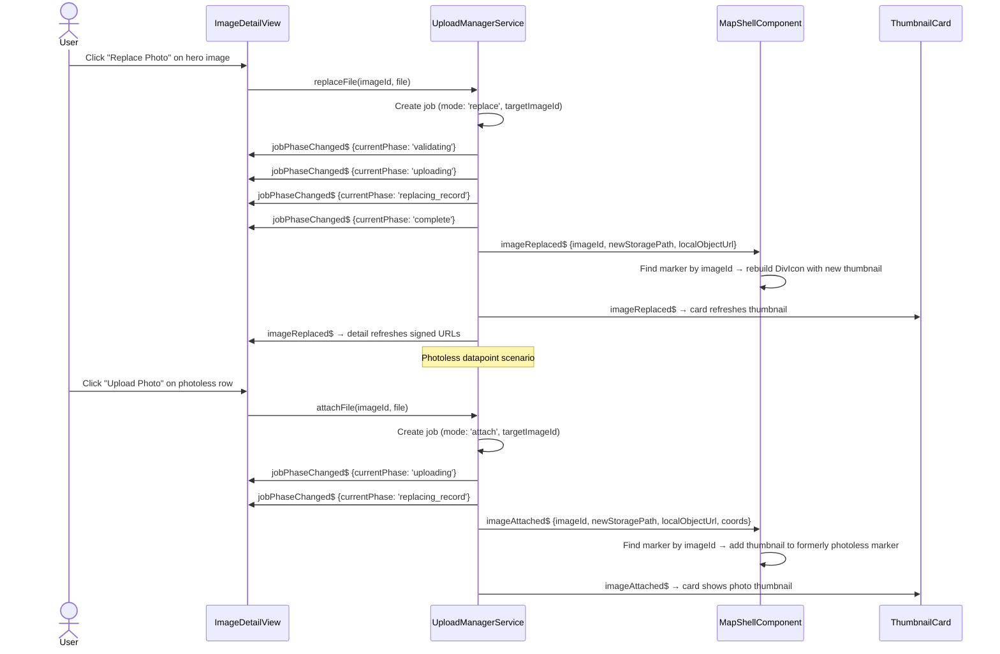
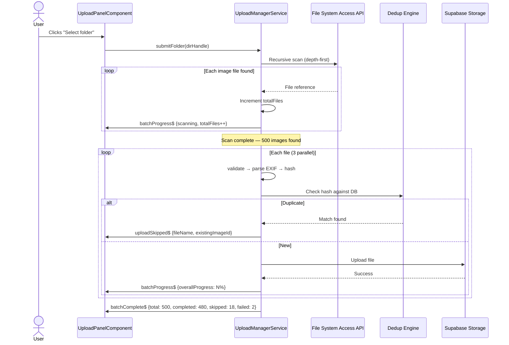
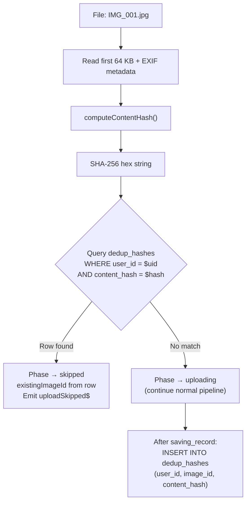
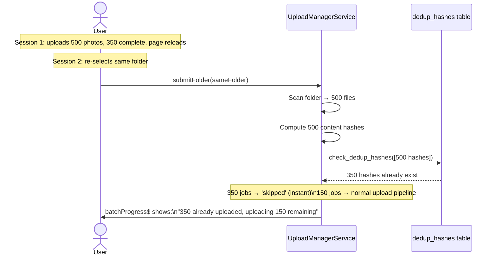
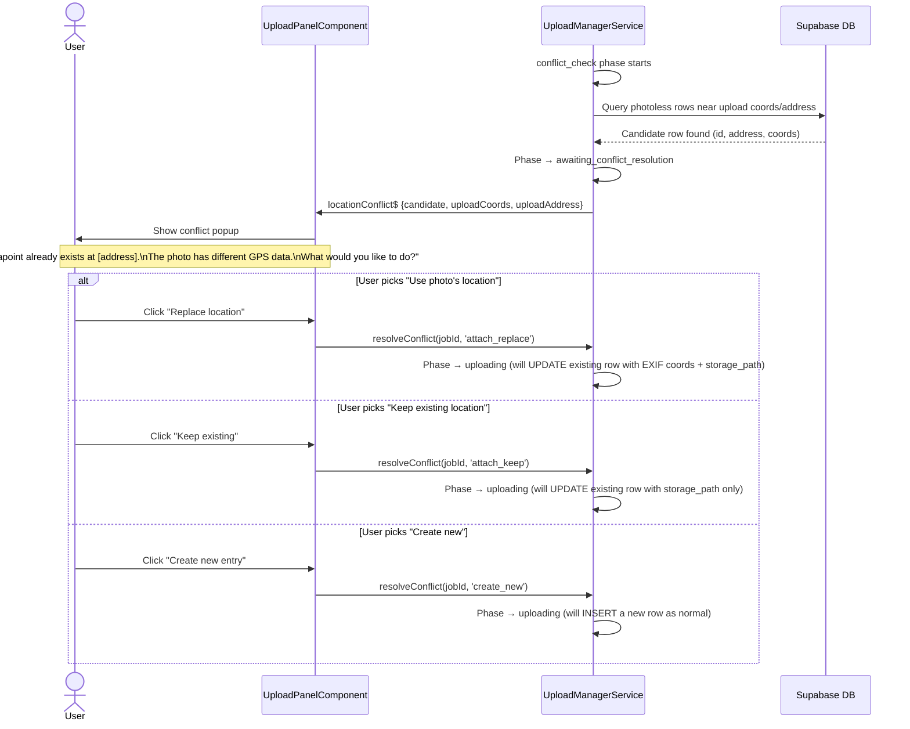
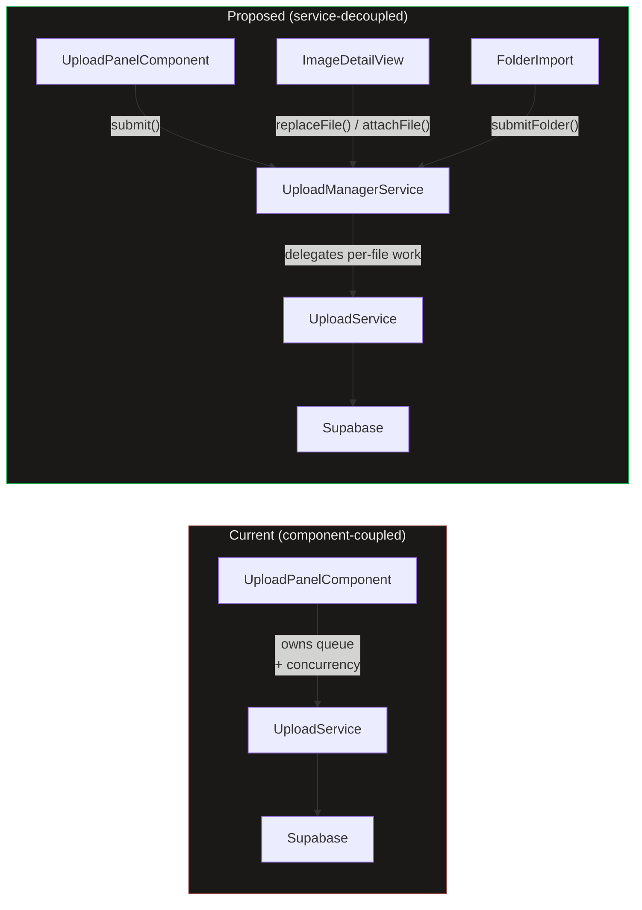
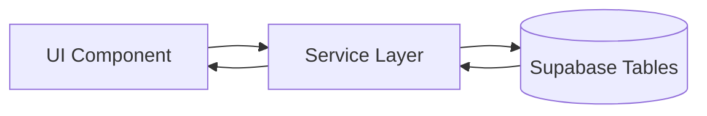
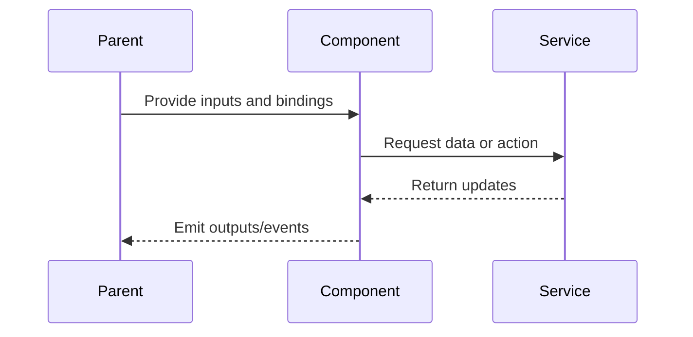

# Upload Manager

## What It Is

A **singleton, application-wide service** that owns the entire upload pipeline: validation, EXIF parsing, storage upload, database insert, and address resolution. Any component in the app can submit files to the Upload Manager and immediately navigate away — uploads continue in the background until the browser tab is closed or the network is lost.

Today, queue management and concurrency live inside `UploadPanelComponent`. When the component is destroyed (e.g., user navigates from image detail view back to map), in-flight uploads are lost. The Upload Manager extracts that responsibility into a long-lived service layer so uploads survive component lifecycle.

## What It Looks Like

The Upload Manager is mostly invisible UI infrastructure, but it surfaces as consistent upload state across the app: upload rows progress through explicit phases, global progress can be shown from any route, and image detail actions can continue after navigation. Jobs expose stable phase labels and progress percentages, with non-blocking enrichment phases for reverse and forward geocoding. Conflict resolution states are modeled as explicit paused phases instead of silent failures.

## Where It Lives

- Service: `UploadManagerService` at `core/upload-manager.service.ts`
- Scope: `providedIn: 'root'` singleton, survives routing
- Consumers: Upload panel, image detail flows, folder import flows, and global progress UI

## Actions

| # | Trigger | System Response | Notes |
| --- | --- | --- | --- |
| 1 | Any entry point submits files | Creates jobs and batch, starts queued execution | Service-owned lifecycle |
| 2 | A job starts processing | Runs validation, EXIF parse, dedup, upload, DB write | Max 3 concurrent active jobs |
| 3 | Geocoding enrichment needed | Runs reverse or forward enrichment as non-blocking phase | Failure remains non-fatal |
| 4 | Conflict detected | Job pauses in awaiting conflict resolution | Resumes on user decision |
| 5 | User retries failed job | Requeues from start with new phase transitions | Job id retained |
| 6 | User cancels job or batch | Stops work and performs cleanup as needed | Emits cancellation events |

## Component Hierarchy

```
Upload Manager System
## Operational Summary

- Concurrency: max 3 active jobs; enrichment and awaiting conflict resolution do not consume slots.
- Lifecycle: root-scoped service survives route/component teardown; logout cancels active jobs.
- Events: uploads, replaces, attaches, failures, skips, phase transitions, batch progress/completion, and conflicts.
- Folder import: uses File System Access API when available; submit and submitFolder create batch ids.
- Dedup: deterministic content hash with single-RPC batch checks and `dedup_hashes` persistence.
- Conflicts: photoless-row conflict detection pauses job and offers attach_replace/attach_keep/create_new.
- Detailed implementation notes moved to `docs/implementation-blueprints/upload-manager.md`.

    alt Duplicate detected
      Manager->>Panel: uploadSkipped$ {fileName, existingImageId}
      Manager->>Panel: batchProgress$ {skippedFiles++}
    else Conflict with existing photoless row
      Manager->>Panel: jobPhaseChanged$ {currentPhase: 'conflict_check'}
      Manager->>Panel: locationConflict$ {candidate, uploadCoords}
      Note over Panel: Show conflict popup
      Panel->>Manager: resolveConflict(jobId, 'attach_keep')
      Manager->>Panel: jobPhaseChanged$ {currentPhase: 'uploading'}
    else New file (no conflict)
      Manager->>Panel: jobPhaseChanged$ {currentPhase: 'uploading'}
      Manager->>Marker: jobPhaseChanged$ → PendingRing shown
      Manager->>Card: jobPhaseChanged$ → uploading icon shown
      Manager->>Panel: jobPhaseChanged$ {currentPhase: 'complete'}
      Manager->>Marker: imageUploaded$ → marker created
      Manager->>Card: imageUploaded$ → card refreshed
      Manager->>Panel: batchProgress$ {completedFiles++}
    end
  end

  Manager->>Panel: batchComplete$ {totalFiles: 500, completed: 480, skipped: 18, failed: 2}
```

#### Replace / Attach Event Flow



### Event Consumers

| Event               | Consumer               | Reaction                                                                                                       |
| ------------------- | ---------------------- | -------------------------------------------------------------------------------------------------------------- |
| `imageUploaded$`    | `MapShellComponent`    | Adds optimistic marker to the map                                                                              |
| `imageUploaded$`    | `ThumbnailGrid`        | Refreshes grid if the uploaded image belongs to the active group                                               |
| `imageReplaced$`    | `MapShellComponent`    | Rebuilds marker DivIcon with `localObjectUrl` — instant swap, no placeholder (same as PL-4 optimistic)         |
| `imageReplaced$`    | `ThumbnailCard`        | Resets loading cycle: `signedThumbnailUrl = localObjectUrl` → `imgLoading` → blob loads (~0ms) → 200ms fade-in |
| `imageReplaced$`    | `ImageDetailView`      | Sets `heroSrc = localObjectUrl` instant → re-signs Tier 2/3 → crossfade to full-res                            |
| `imageAttached$`    | `MapShellComponent`    | Rebuilds marker DivIcon: CSS placeholder → `` with `localObjectUrl` — instant transition                  |
| `imageAttached$`    | `ThumbnailCard`        | Resets loading cycle: no-photo icon → `localObjectUrl` → blob loads (~0ms) → 200ms fade-in                     |
| `imageAttached$`    | `ImageDetailView`      | Switches from upload prompt to photo display → `heroSrc = localObjectUrl` → progressive Tier 2/3 reload        |
| `uploadFailed$`     | `MapShellComponent`    | Shows toast notification                                                                                       |
| `uploadSkipped$`    | `UploadPanelComponent` | Shows "Already uploaded" label on the file item                                                                |
| `locationConflict$` | `UploadPanelComponent` | Shows conflict resolution popup (attach replace / attach keep / create new)                                    |
| `jobPhaseChanged$`  | `UploadPanelComponent` | Updates per-file status label and icon                                                                         |
| `jobPhaseChanged$`  | `PhotoMarker`          | Shows/hides PendingRing on markers for files currently in `uploading` phase                                    |
| `jobPhaseChanged$`  | `ThumbnailCard`        | Shows/hides uploading overlay on cards for files currently in `uploading` phase                                |
| `batchProgress$`    | `UploadPanelComponent` | Updates the batch progress bar (0–100%)                                                                        |
| `batchProgress$`    | `UploadButtonZone`     | Shows progress ring/badge on the upload button                                                                 |
| `batchComplete$`    | `UploadPanelComponent` | Shows batch summary (completed, skipped, failed)                                                               |
| `missingData$`      | `MissingDataManager`   | Queues file for manual placement (future)                                                                      |

## Folder Upload (Multi-File / Directory Selection)

The Upload Manager supports two entry modes for multi-file uploads:

### Standard Multi-File (all browsers)

The HTML file input with `multiple` attribute lets users select many files at once. Each file becomes a job in a single batch.

```typescript
// In UploadPanelComponent template
<input type="file" multiple accept="image/*" (change)="onFilesSelected($event)">
```

### Folder Selection (Chromium only)

Uses the File System Access API (`showDirectoryPicker()`). The manager recursively scans the directory, filters to supported image types, and submits all found files as a single batch.

```typescript
// In UploadPanelComponent
async selectFolder(): Promise<void> {
  const dirHandle = await window.showDirectoryPicker({ mode: 'read' });
  const batchId = await this.uploadManager.submitFolder(dirHandle);
}
```

The `submitFolder()` method:

1. Sets batch status to `'scanning'` and emits `batchProgress$` with `totalFiles: 0`.
2. Recursively walks the directory, incrementing `totalFiles` as images are found.
3. Once the scan completes, sets batch status to `'uploading'` and begins the pipeline for each file.
4. The folder name becomes the batch label (e.g., `"Burgstraße_7 — 142 images"`).

Browser support detection:

```typescript
readonly isFolderImportSupported = typeof window !== 'undefined' && 'showDirectoryPicker' in window;
```

If unsupported, the "Select folder" option shows: _"Folder import requires Chrome or Edge."_

### Folder Upload Flow



## Deduplication (Resume-Safe Uploads)

When uploading hundreds or thousands of photos (especially re-selecting a folder after an interrupted session), the manager must detect and skip files that were already uploaded. This prevents duplicate entries and wasted bandwidth.

### Content Hash

Before uploading, the manager computes a **content hash** for each file. The hash is derived from stable, content-intrinsic properties that uniquely identify a photo regardless of filename changes or re-exports:

```typescript
interface ContentHashInput {
  /** First 64 KB of raw file bytes (fast, avoids reading entire file). */
  fileHeadBytes: ArrayBuffer;
  /** File size in bytes (cheap discriminator). */
  fileSize: number;
  /** EXIF GPS coordinates if available (latitude, longitude). */
  gpsCoords?: { lat: number; lng: number };
  /** EXIF capture timestamp if available. */
  capturedAt?: string;
  /** Camera bearing / direction from EXIF (degrees). */
  direction?: number;
}
```

The hash is computed as:

```typescript
async function computeContentHash(input: ContentHashInput): Promise<string> {
  const encoder = new TextEncoder();
  const parts = [
    new Uint8Array(input.fileHeadBytes),
    encoder.encode(`|size=${input.fileSize}`),
    encoder.encode(
      `|gps=${input.gpsCoords?.lat ?? ""},${input.gpsCoords?.lng ?? ""}`,
    ),
    encoder.encode(`|date=${input.capturedAt ?? ""}`),
    encoder.encode(`|dir=${input.direction ?? ""}`),
  ];
  const combined = concatArrayBuffers(parts);
  const hashBuffer = await crypto.subtle.digest("SHA-256", combined);
  return Array.from(new Uint8Array(hashBuffer))
    .map((b) => b.toString(16).padStart(2, "0"))
    .join("");
}
```

**Why these fields:**

- `fileHeadBytes` (first 64 KB): captures JPEG header, EXIF block, and the start of image data. Two genuinely different photos will almost certainly differ here.
- `fileSize`: cheap first-pass discriminator. Different images rarely share exact file sizes.
- `gpsCoords`: two photos of the same subject from different locations should be distinct.
- `capturedAt`: same location, different time → different photo.
- `direction`: same location, same time, different angle → different photo.

**Why NOT full file hash:** Reading an entire 20 MB file into memory just for hashing is slow and memory-intensive when processing 1000+ files. The 64 KB head + metadata combination provides high collision resistance while staying fast.

### Server-Side Hash Storage

Hashes are stored in a `dedup_hashes` table in Supabase:

```sql
CREATE TABLE dedup_hashes (
  id          uuid PRIMARY KEY DEFAULT gen_random_uuid(),
  user_id     uuid NOT NULL REFERENCES auth.users(id),
  image_id    uuid NOT NULL REFERENCES images(id) ON DELETE CASCADE,
  content_hash text NOT NULL,
  created_at  timestamptz NOT NULL DEFAULT now(),
  UNIQUE(user_id, content_hash)
);

-- RLS: users can only see/insert their own hashes
ALTER TABLE dedup_hashes ENABLE ROW LEVEL SECURITY;
CREATE POLICY "Users manage own hashes"
  ON dedup_hashes FOR ALL
  USING (auth.uid() = user_id)
  WITH CHECK (auth.uid() = user_id);
```

### Dedup Check Flow



### Batch Dedup Optimization

For large folder uploads (100+ files), individual hash lookups would be slow. Instead, the manager batches hash checks:

1. Compute hashes for all files in the batch (parallel, up to 10 concurrent hash computations).
2. Send hashes in a single RPC call: `supabase.rpc('check_dedup_hashes', { hashes: string[] })`.
3. The RPC returns the set of hashes that already exist, along with their `image_id`.
4. Jobs for matching hashes immediately transition to `skipped`.
5. Remaining jobs enter the normal pipeline.

```sql
-- Batch dedup check function
CREATE OR REPLACE FUNCTION check_dedup_hashes(hashes text[])
RETURNS TABLE(content_hash text, image_id uuid)
LANGUAGE sql STABLE SECURITY DEFINER
AS $$
  SELECT dh.content_hash, dh.image_id
  FROM dedup_hashes dh
  WHERE dh.user_id = auth.uid()
    AND dh.content_hash = ANY(hashes);
$$;
```

### Resume Scenario



## Location Conflict Detection

When an upload has GPS coordinates (from EXIF) or an address (from filename), the pipeline checks for **existing `images` rows that have location data but no photo file** (`storage_path IS NULL`). These "photoless datapoints" may have been created through bulk import, manual address entry, or other workflows. If the upload's location matches one of these rows, the user is prompted to decide whether to attach the photo to the existing row or create a new one.

### Why This Exists

| Problem                                                                                          | Solution                                                                          |
| ------------------------------------------------------------------------------------------------ | --------------------------------------------------------------------------------- |
| Datapoints created with address/GPS but no photo file                                            | Upload can attach a photo to an existing row instead of always creating a new one |
| EXIF GPS may differ slightly from the manually entered location                                  | User chooses whether to trust the EXIF location or keep the existing one          |
| Duplicate rows accumulate when photos are uploaded to addresses that already exist as datapoints | Conflict popup prevents accidental duplication                                    |

### Matching Criteria

A conflict is detected when **all** of the following are true:

1. The job has GPS coordinates (EXIF or forward-geocoded) OR a resolved address.
2. There exists an `images` row in the same organization where `storage_path IS NULL`.
3. **GPS match**: the existing row's coordinates are within **50 meters** of the upload's coordinates (PostGIS `ST_DWithin`), **OR**
4. **Address match**: the existing row's `address_label` is a case-insensitive match of the upload's title-derived address.

If multiple candidates match, the **closest by distance** (GPS match) or **first by `created_at`** (address match) is selected.

### Conflict Check Query

```sql
-- Find photoless rows near the upload's coordinates or matching address
SELECT id, address_label, latitude, longitude,
       ST_Distance(geog, ST_SetSRID(ST_MakePoint($lng, $lat), 4326)::geography) AS distance_m
FROM images
WHERE organization_id = $org_id
  AND storage_path IS NULL
  AND (
    -- GPS proximity match (50m radius)
    ($lat IS NOT NULL AND $lng IS NOT NULL AND
     ST_DWithin(geog, ST_SetSRID(ST_MakePoint($lng, $lat), 4326)::geography, 50))
    OR
    -- Address label match (case-insensitive)
    ($address IS NOT NULL AND LOWER(address_label) = LOWER($address))
  )
ORDER BY
  CASE WHEN $lat IS NOT NULL THEN
    ST_Distance(geog, ST_SetSRID(ST_MakePoint($lng, $lat), 4326)::geography)
  ELSE 0 END ASC,
  created_at ASC
LIMIT 1;
```

### Conflict Resolution Flow



### Saving Record with Conflict Resolution

When `conflictResolution` is set, the `saving_record` phase behaves differently:

- **`attach_replace`**: UPDATE the existing row — set `storage_path`, `exif_latitude`, `exif_longitude`, `latitude`, `longitude`, `direction`, `captured_at`. The existing address fields are overwritten by a subsequent reverse-geocode (Path A enrichment).
- **`attach_keep`**: UPDATE the existing row — set `storage_path`, `exif_latitude`, `exif_longitude`, `direction`, `captured_at` only. The `latitude`, `longitude`, and address fields are **preserved**. No enrichment phase runs (coordinates and address already present).
- **`create_new`**: Normal INSERT flow, as if no conflict was detected.

### Conflict Resolution Popup (UI)

The popup is a **modal dialog** (not inline in the file list) with:

- **Title**: "Existing datapoint found"
- **Body**: "A datapoint at **[existing address or coords]** already exists without a photo. The uploaded photo has **[EXIF coords / filename address]**."
- **Three action buttons** (stacked vertically, dd-item styling):
  - `place` icon + **"Replace location"** — attach photo and overwrite location with EXIF. Subtitle: "Use the photo's GPS coordinates"
  - `keep` icon + **"Keep existing location"** — attach photo, preserve current address/GPS. Subtitle: "Preserve the current address and coordinates"
  - `add` icon + **"Create new entry"** — create a separate row. Subtitle: "Upload as a new datapoint"
- **Dismiss (×)**: Equivalent to "Create new entry" (safe default).

### `awaiting_conflict_resolution` and Concurrency

Jobs in `awaiting_conflict_resolution` **release their concurrency slot**. This prevents one pending popup from blocking the entire upload queue. When the user resolves the conflict, the job re-enters the concurrency queue at the front (priority re-queue).

## Relationship to Existing Code



- **`UploadService`** keeps its current responsibilities (validation, EXIF, storage, DB insert/update, geocode). Gains an `updateImageFile()` method for the replace/attach pipeline (UPDATE instead of INSERT).
- **`UploadManagerService`** wraps `UploadService` with queue management, concurrency, state signals, and three entry points: `submit()`, `replaceFile()`, `attachFile()`.
- **`UploadPanelComponent`** becomes a thin UI that calls `uploadManager.submit()` and reads `uploadManager.jobs()` — it no longer manages its own queue.
- **`ImageDetailView`** calls `uploadManager.replaceFile()` or `uploadManager.attachFile()` instead of doing direct storage + DB operations.

## Data

### Data Flow (Mermaid)



| Field          | Source                                  | Type                          |
| -------------- | --------------------------------------- | ----------------------------- |
| Jobs           | `UploadManagerService.jobs()`           | `Signal<UploadJob[]>`         |
| Active count   | `UploadManagerService.activeCount()`    | `Signal<number>`              |
| Is busy        | `UploadManagerService.isBusy()`         | `Signal<boolean>`             |
| Batches        | `UploadManagerService.batches()`        | `Signal<UploadBatch[]>`       |
| Active batch   | `UploadManagerService.activeBatch()`    | `Signal<UploadBatch \| null>` |
| Per-job events | `UploadManagerService.jobPhaseChanged$` | `Observable<...>`             |
| Batch events   | `UploadManagerService.batchProgress$`   | `Observable<...>`             |
| Skip events    | `UploadManagerService.uploadSkipped$`   | `Observable<...>`             |

## State

| Name          | Type                            | Default | Controls                                         |
| ------------- | ------------------------------- | ------- | ------------------------------------------------ |
| `jobs`        | `WritableSignal<UploadJob[]>`   | `[]`    | Full upload queue + history                      |
| `activeJobs`  | `Signal<UploadJob[]>`           | `[]`    | Computed: non-terminal jobs                      |
| `isBusy`      | `Signal<boolean>`               | `false` | Computed: any non-terminal job exists            |
| `activeCount` | `Signal<number>`                | `0`     | Computed: jobs in uploading/saving/resolving     |
| `batches`     | `WritableSignal<UploadBatch[]>` | `[]`    | All batches (active + completed)                 |
| `activeBatch` | `Signal<UploadBatch \| null>`   | `null`  | Computed: first batch with status !== 'complete' |

## File Map

| File                                                     | Purpose                                                   |
| -------------------------------------------------------- | --------------------------------------------------------- |
| `core/upload-manager.service.ts`                         | Queue management, concurrency, pipeline orchestration     |
| `core/upload-manager.service.spec.ts`                    | Unit tests                                                |
| `core/content-hash.util.ts`                              | `computeContentHash()` — SHA-256 from file head + EXIF    |
| `core/content-hash.util.spec.ts`                         | Unit tests for hashing                                    |
| `core/upload.service.ts`                                 | Existing — per-file logic (validation, EXIF, storage, DB) |
| `core/geocoding.service.ts`                              | Existing — reverse geocoding                              |
| `features/upload/upload-panel/upload-panel.component.ts` | Refactor — delegate to UploadManagerService               |

## Wiring

### Wiring Flow (Mermaid)



- `UploadManagerService` is `providedIn: 'root'` — no module import needed
- Inject into `UploadPanelComponent` (replace internal queue logic)
- Inject into `ImageDetailView` for `replaceFile()` and `attachFile()`
- Subscribe to `imageUploaded$` in `MapShellComponent` to add new markers
- Subscribe to `imageReplaced$` in `MapShellComponent` to rebuild marker DivIcon with new thumbnail
- Subscribe to `imageAttached$` in `MapShellComponent` to update marker (add thumbnail to photoless marker)
- Subscribe to `imageReplaced$` and `imageAttached$` in `ImageDetailView` to refresh signed URLs
- Subscribe to `imageReplaced$` and `imageAttached$` in `ThumbnailCard` to refresh card thumbnail
- Subscribe to `uploadFailed$` for toast notifications
- Subscribe to `batchProgress$` in `UploadButtonZone` to show progress badge on the upload button
- Subscribe to `jobPhaseChanged$` in `PhotoMarker` (via MapShell) to show/hide PendingRing
- Subscribe to `jobPhaseChanged$` in `ThumbnailCard` to show uploading overlay
- Subscribe to `uploadSkipped$` in `UploadPanelComponent` to show "Already uploaded" status
- Subscribe to `locationConflict$` in `UploadPanelComponent` to show conflict resolution popup
- `dedup_hashes` table must exist in Supabase with RLS enabled (see Deduplication section)

## Acceptance Criteria

- [x] Uploads continue when the originating component is destroyed (navigate away)
- [x] Maximum 3 concurrent uploads enforced globally across all entry points
- [x] FIFO queue: first file submitted is first to upload
- [x] `missing_data` jobs do not consume concurrency slots
- [x] Job state is reactive (Angular signals) — any component can bind to `jobs()`
- [x] `imageUploaded$` fires with coords + imageId when a job completes
- [x] `uploadFailed$` fires when a critical phase fails
- [x] Failed jobs can be retried via `retryJob()`
- [x] Completed/failed jobs can be dismissed individually or in bulk
- [x] **Path A**: GPS in EXIF → upload → save → reverse-geocode address (non-blocking)
- [x] **Path B**: No GPS + address in title → upload → save with address → forward-geocode coords (non-blocking)
- [x] **Path C**: No GPS + no address → job enters `missing_data`, emits `missingData$` for MissingDataManager
- [x] Address resolution and coordinate resolution are enrichment — failure is silent
- [ ] Geocoding enrichment `401` performs one silent auth refresh and one retry before failing
- [ ] Persistent geocoding `401` causes controlled sign-out via `AuthService` (no manual storage-clearing workaround)
- [x] Orphaned storage files are cleaned up when DB insert fails
- [x] Auth change (logout) cancels all active jobs
- [ ] Global progress indicator visible from any page when uploads are active
- [x] `beforeunload` warning shown when `isBusy()` is true
