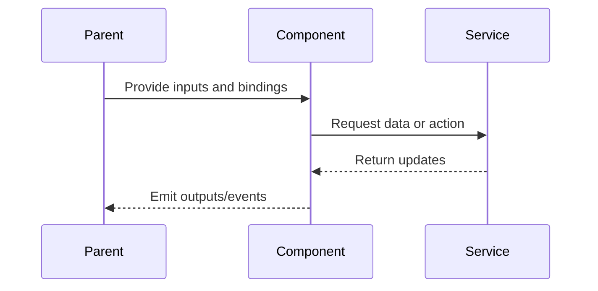

# Upload Manager

## What It Is

A **singleton, application-wide service** that owns the entire upload pipeline: validation, EXIF parsing, storage upload, database insert, and address resolution. Any component in the app can submit files to the Upload Manager and immediately navigate away — uploads continue in the background until the browser tab is closed or the network is lost.

Today, queue management and concurrency live inside `UploadPanelComponent`. When the component is destroyed (e.g., user navigates from image detail view back to map), in-flight uploads are lost. The Upload Manager extracts that responsibility into a long-lived service layer so uploads survive component lifecycle.

## Child Specs

This parent spec owns the top-level contract. Deep pipeline behavior is split into:

| Child Spec                                            | Covers                                                                                                 |
| ----------------------------------------------------- | ------------------------------------------------------------------------------------------------------ |
| [upload-manager-pipeline](upload-manager-pipeline.md) | Folder upload flow, deduplication, location-conflict detection, and replace/attach event orchestration |

## What It Looks Like

The Upload Manager is mostly invisible UI infrastructure, but it surfaces as consistent upload state across the app: upload rows progress through explicit phases, global progress can be shown from any route, and image detail actions can continue after navigation. Jobs expose stable phase labels and progress percentages, with non-blocking enrichment phases for reverse and forward geocoding. Conflict resolution states are modeled as explicit paused phases instead of silent failures.

## Where It Lives

- Service: `UploadManagerService` at `core/upload-manager.service.ts`
- Scope: `providedIn: 'root'` singleton, survives routing
- Consumers: Upload panel, image detail flows, folder import flows, and global progress UI

## Actions

| #   | Trigger                       | System Response                                          | Notes                        |
| --- | ----------------------------- | -------------------------------------------------------- | ---------------------------- |
| 1   | Any entry point submits files | Creates jobs and batch, starts queued execution          | Service-owned lifecycle      |
| 2   | A job starts processing       | Runs validation, EXIF parse, dedup, upload, DB write     | Max 3 concurrent active jobs |
| 3   | Geocoding enrichment needed   | Runs reverse or forward enrichment as non-blocking phase | Failure remains non-fatal    |
| 4   | Conflict detected             | Job pauses in awaiting conflict resolution               | Resumes on user decision     |
| 5   | User retries failed job       | Requeues from start with new phase transitions           | Job id retained              |
| 6   | User cancels job or batch     | Stops work and performs cleanup as needed                | Emits cancellation events    |

## Component Hierarchy

```
Upload Manager System
  ├── Job Queue Layer ← queued jobs, retries, cancellation, FIFO start order
  ├── Pipeline Layer ← validation, EXIF, dedup, upload, save, enrichment
  ├── Event Layer ← emits uploads, replacements, attachments, skips, failures, conflicts
  ├── Batch Layer ← tracks aggregate progress, completion, and scanning state
  └── Consumers
      ├── UploadPanelComponent ← per-file rows, progress, issue states
      ├── ImageDetailView ← replace/attach entry points and refresh behavior
      ├── MapShellComponent ← marker updates and optimistic sync
      ├── ThumbnailCard / ThumbnailGrid ← thumbnail refresh and upload overlays
      └── UploadButtonZone ← global progress badge/ring
```

## Data

### Data Flow (Mermaid)


| Field          | Source                                  | Type                    |
| -------------- | --------------------------------------- | ----------------------- | ------ |
| Jobs           | `UploadManagerService.jobs()`           | `Signal<UploadJob[]>`   |
| Active count   | `UploadManagerService.activeCount()`    | `Signal<number>`        |
| Is busy        | `UploadManagerService.isBusy()`         | `Signal<boolean>`       |
| Batches        | `UploadManagerService.batches()`        | `Signal<UploadBatch[]>` |
| Active batch   | `UploadManagerService.activeBatch()`    | `Signal<UploadBatch     | null>` |
| Per-job events | `UploadManagerService.jobPhaseChanged$` | `Observable<...>`       |
| Batch events   | `UploadManagerService.batchProgress$`   | `Observable<...>`       |
| Skip events    | `UploadManagerService.uploadSkipped$`   | `Observable<...>`       |

## State

| Name          | Type                            | Default | Controls                                     |
| ------------- | ------------------------------- | ------- | -------------------------------------------- | ------------------------------------------------ |
| `jobs`        | `WritableSignal<UploadJob[]>`   | `[]`    | Full upload queue + history                  |
| `activeJobs`  | `Signal<UploadJob[]>`           | `[]`    | Computed: non-terminal jobs                  |
| `isBusy`      | `Signal<boolean>`               | `false` | Computed: any non-terminal job exists        |
| `activeCount` | `Signal<number>`                | `0`     | Computed: jobs in uploading/saving/resolving |
| `batches`     | `WritableSignal<UploadBatch[]>` | `[]`    | All batches (active + completed)             |
| `activeBatch` | `Signal<UploadBatch             | null>`  | `null`                                       | Computed: first batch with status !== 'complete' |

## File Map

| File                                                     | Purpose                                                                      |
| -------------------------------------------------------- | ---------------------------------------------------------------------------- |
| `core/upload-manager.service.ts`                         | Queue management, concurrency, pipeline orchestration                        |
| `core/upload-manager.service.spec.ts`                    | Unit tests                                                                   |
| `core/content-hash.util.ts`                              | `computeContentHash()` — SHA-256 from file head + EXIF                       |
| `core/content-hash.util.spec.ts`                         | Unit tests for hashing                                                       |
| `core/upload.service.ts`                                 | Existing — per-file logic (validation, EXIF, storage, DB)                    |
| `core/geocoding.service.ts`                              | Existing — reverse geocoding                                                 |
| `docs/element-specs/upload-manager-pipeline.md`          | Child spec for pipeline, deduplication, folder upload, and conflict handling |
| `features/upload/upload-panel/upload-panel.component.ts` | Refactor — delegate to UploadManagerService                                  |

## Wiring

### Wiring Flow (Mermaid)



- `UploadManagerService` is `providedIn: 'root'` — no module import needed
- Inject into `UploadPanelComponent` (replace internal queue logic)
- Inject into `ImageDetailView` for `replaceFile()` and `attachFile()`
- Subscribe to `imageUploaded$` in `MapShellComponent` to add new markers
- Subscribe to `imageReplaced$` in `MapShellComponent` to rebuild marker DivIcon with new thumbnail
- Subscribe to `imageAttached$` in `MapShellComponent` to update marker (add thumbnail to photoless marker)
- Subscribe to `imageReplaced$` and `imageAttached$` in `ImageDetailView` to refresh signed URLs
- Subscribe to `imageReplaced$` and `imageAttached$` in `ThumbnailCard` to refresh card thumbnail
- Subscribe to `uploadFailed$` for toast notifications
- Subscribe to `batchProgress$` in `UploadButtonZone` to show progress badge on the upload button
- Subscribe to `jobPhaseChanged$` in `PhotoMarker` (via MapShell) to show/hide PendingRing
- Subscribe to `jobPhaseChanged$` in `ThumbnailCard` to show uploading overlay
- Subscribe to `uploadSkipped$` in `UploadPanelComponent` to show "Already uploaded" status
- Subscribe to `locationConflict$` in `UploadPanelComponent` to show conflict resolution popup
- `dedup_hashes` table and conflict-handling contract are defined in `upload-manager-pipeline.md`

### Event Consumers

| Event               | Consumer               | Reaction                                                         |
| ------------------- | ---------------------- | ---------------------------------------------------------------- |
| `imageUploaded$`    | `MapShellComponent`    | Adds optimistic marker to the map                                |
| `imageUploaded$`    | `ThumbnailGrid`        | Refreshes grid if the uploaded image belongs to the active group |
| `imageReplaced$`    | `MapShellComponent`    | Rebuilds marker DivIcon with the replacement thumbnail           |
| `imageReplaced$`    | `ThumbnailCard`        | Resets thumbnail loading cycle to the new local object URL       |
| `imageReplaced$`    | `ImageDetailView`      | Refreshes signed URLs and hero image                             |
| `imageAttached$`    | `MapShellComponent`    | Updates a formerly photoless marker with thumbnail content       |
| `imageAttached$`    | `ThumbnailCard`        | Replaces no-photo state with uploaded thumbnail                  |
| `imageAttached$`    | `ImageDetailView`      | Switches from upload prompt to photo display                     |
| `uploadFailed$`     | `MapShellComponent`    | Shows toast notification                                         |
| `uploadSkipped$`    | `UploadPanelComponent` | Shows "Already uploaded" label on the file item                  |
| `locationConflict$` | `UploadPanelComponent` | Shows conflict resolution popup                                  |
| `jobPhaseChanged$`  | `UploadPanelComponent` | Updates per-file status label and icon                           |
| `jobPhaseChanged$`  | `PhotoMarker`          | Shows or hides pending indicator on markers                      |
| `jobPhaseChanged$`  | `ThumbnailCard`        | Shows or hides uploading overlay                                 |
| `batchProgress$`    | `UploadPanelComponent` | Updates the batch progress bar                                   |
| `batchProgress$`    | `UploadButtonZone`     | Shows progress ring or badge on the upload button                |
| `batchComplete$`    | `UploadPanelComponent` | Shows batch summary                                              |
| `missingData$`      | `MissingDataManager`   | Queues file for manual placement                                 |

## Acceptance Criteria

- [x] Uploads continue when the originating component is destroyed (navigate away)
- [x] Maximum 3 concurrent uploads enforced globally across all entry points
- [x] FIFO queue: first file submitted is first to upload
- [x] `missing_data` jobs do not consume concurrency slots
- [x] Job state is reactive (Angular signals) — any component can bind to `jobs()`
- [x] `imageUploaded$` fires with coords + imageId when a job completes
- [x] `uploadFailed$` fires when a critical phase fails
- [x] Failed jobs can be retried via `retryJob()`
- [x] Completed/failed jobs can be dismissed individually or in bulk
- [x] **Path A**: GPS in EXIF → upload → save → reverse-geocode address (non-blocking)
- [x] **Path B**: No GPS + address in title → upload → save with address → forward-geocode coords (non-blocking)
- [x] **Path C**: No GPS + no address → job enters `missing_data`, emits `missingData$` for MissingDataManager
- [x] Address resolution and coordinate resolution are enrichment — failure is silent
- [ ] Geocoding enrichment `401` performs one silent auth refresh and one retry before failing
- [ ] Persistent geocoding `401` causes controlled sign-out via `AuthService` (no manual storage-clearing workaround)
- [x] Orphaned storage files are cleaned up when DB insert fails
- [x] Auth change (logout) cancels all active jobs
- [ ] Global progress indicator visible from any page when uploads are active
- [x] `beforeunload` warning shown when `isBusy()` is true
