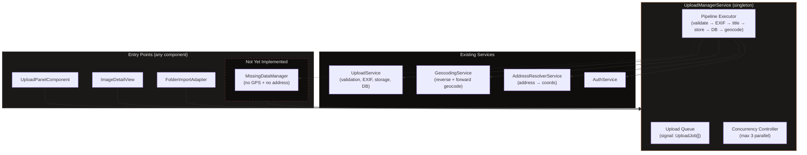
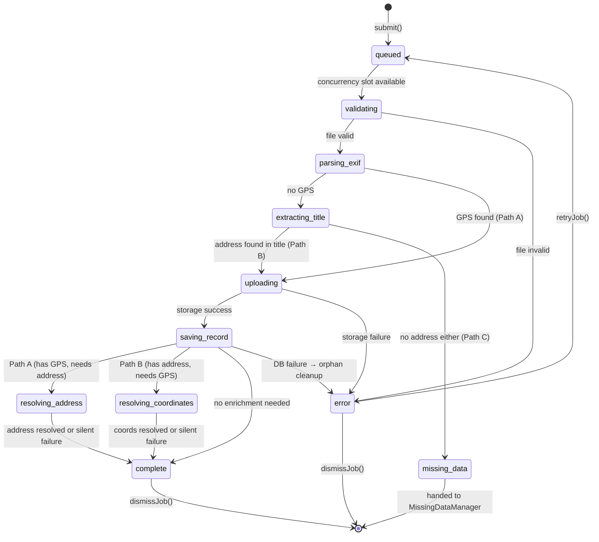
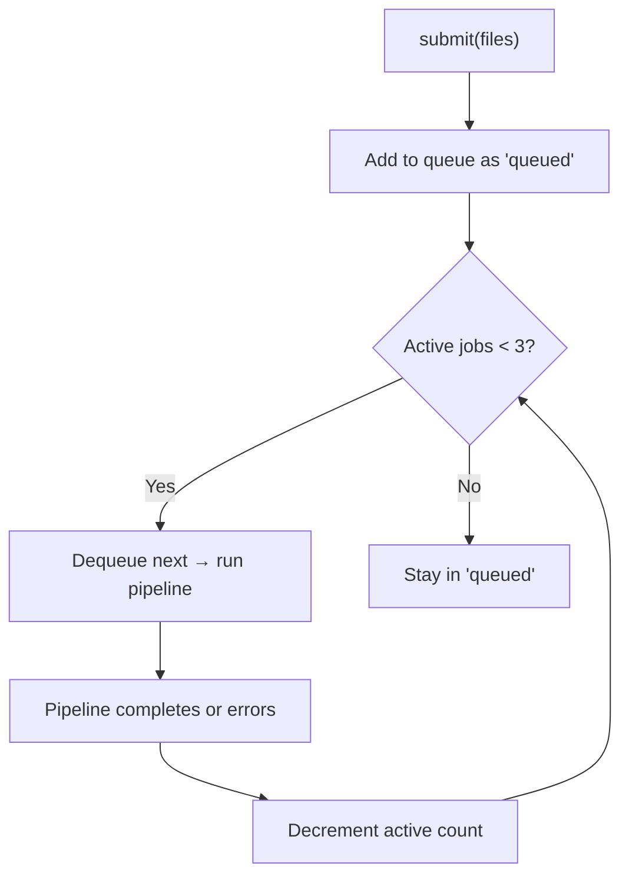
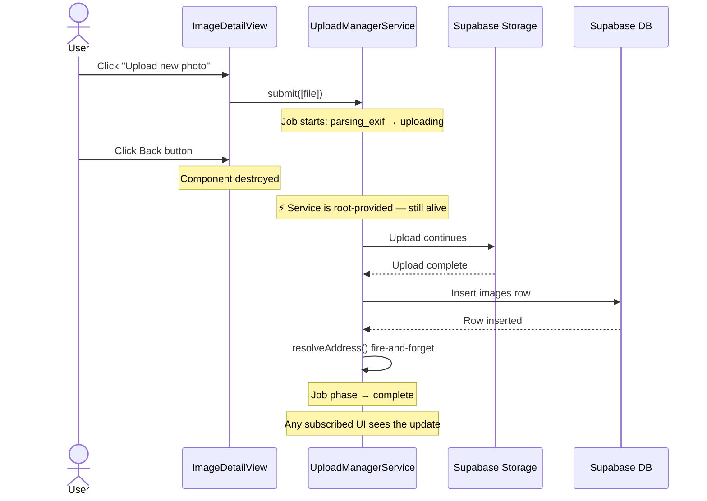
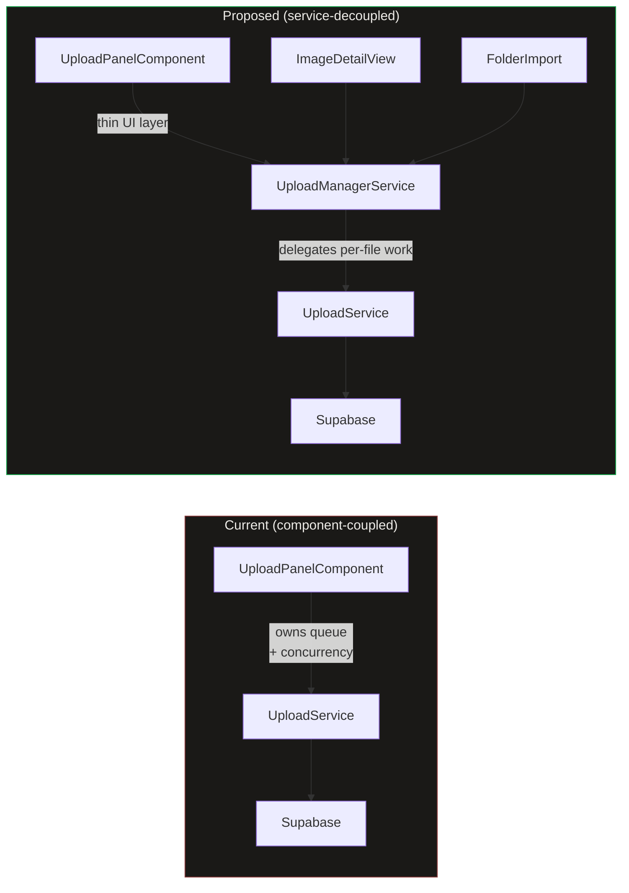

# Upload Manager

## What It Is

A **singleton, application-wide service** that owns the entire upload pipeline: validation, EXIF parsing, storage upload, database insert, and address resolution. Any component in the app can submit files to the Upload Manager and immediately navigate away — uploads continue in the background until the browser tab is closed or the network is lost.

Today, queue management and concurrency live inside `UploadPanelComponent`. When the component is destroyed (e.g., user navigates from image detail view back to map), in-flight uploads are lost. The Upload Manager extracts that responsibility into a long-lived service layer so uploads survive component lifecycle.

## Why It Exists

| Problem                                  | Solution                                                |
| ---------------------------------------- | ------------------------------------------------------- |
| Upload state lives in a component        | Move queue + concurrency to a root-provided service     |
| Navigating away kills active uploads     | Service persists for the app's lifetime                 |
| Multiple entry points (panel, detail, …) | Single `submit()` method callable from anywhere         |
| No global progress visibility            | Service exposes signal-based state; any UI can read it  |
| Address resolution is fire-and-forget    | Manager tracks it as an explicit async phase per upload |

## Architecture Overview



## Where It Lives

- **Service**: `UploadManagerService` at `core/upload-manager.service.ts`
- **Scope**: `providedIn: 'root'` — singleton, survives routing
- **Consumers**: Any component or service that needs to trigger or observe uploads

## Interface Contract

```typescript
@Injectable({ providedIn: "root" })
export class UploadManagerService {
  /** All jobs (active + completed + failed). Read-only signal for UI binding. */
  readonly jobs: Signal<ReadonlyArray<UploadJob>>;

  /** Active + pending jobs only. Convenience computed signal. */
  readonly activeJobs: Signal<ReadonlyArray<UploadJob>>;

  /** True when at least one job is in a non-terminal state. */
  readonly isBusy: Signal<boolean>;

  /** Count of jobs in 'uploading' or 'processing' phase. */
  readonly activeCount: Signal<number>;

  /**
   * Submit one or more files for upload. Returns immediately.
   * Each file becomes an UploadJob tracked in `jobs`.
   *
   * @param files     Files to upload.
   * @param options   Per-submission options (manual coords, project, etc.).
   * @returns         Array of job IDs for caller reference.
   */
  submit(files: File[], options?: SubmitOptions): string[];

  /** Retry a failed job from the beginning. */
  retryJob(jobId: string): void;

  /** Remove a terminal job (complete / error) from the list. */
  dismissJob(jobId: string): void;

  /** Remove all terminal jobs from the list. */
  dismissAllCompleted(): void;

  /** Cancel a pending or active job. Cleans up partial storage if needed. */
  cancelJob(jobId: string): void;
}
```

### Types

```typescript
interface SubmitOptions {
  /** Project to assign the uploaded images to. */
  projectId?: string;
}

type UploadPhase =
  | "queued" // Waiting for a concurrency slot
  | "validating" // Client-side file checks
  | "parsing_exif" // Reading EXIF GPS + timestamp
  | "extracting_title" // Parsing filename for address hint
  | "uploading" // Sending bytes to Supabase Storage
  | "saving_record" // Inserting the images row
  | "resolving_address" // Reverse geocoding: GPS → address (non-blocking)
  | "resolving_coordinates" // Forward geocoding: address → GPS (non-blocking)
  | "missing_data" // No GPS + no address → handed to MissingDataManager
  | "complete" // All phases done
  | "error"; // A critical phase failed

interface UploadJob {
  /** Stable unique ID for tracking. */
  id: string;
  /** Original file reference. */
  file: File;
  /** Current pipeline phase. */
  phase: UploadPhase;
  /** Upload progress 0–100 (meaningful during 'uploading' phase). */
  progress: number;
  /** Human-readable status label for the UI. */
  statusLabel: string;
  /** Error message when phase === 'error'. */
  error?: string;
  /** Which phase failed (for retry logic). */
  failedAt?: UploadPhase;
  /** Resolved coordinates (EXIF or forward-geocoded). */
  coords?: ExifCoords;
  /** Address extracted from filename (before geocoding). */
  titleAddress?: string;
  /** Camera direction from EXIF (degrees). */
  direction?: number;
  /** UUID of the inserted images row (set after 'saving_record'). */
  imageId?: string;
  /** Supabase storage path (set after 'uploading'). */
  storagePath?: string;
  /** Object URL for thumbnail preview. */
  thumbnailUrl?: string;
  /** Timestamp of submission. */
  submittedAt: Date;
}
```

## Pipeline Phases

Each upload job progresses through a deterministic pipeline. The path depends on what data the file carries:

- **Path A (GPS found)**: upload → save → reverse-geocode address (enrichment).
- **Path B (no GPS, address in title)**: upload → save with address → forward-geocode coordinates (enrichment).
- **Path C (no GPS, no address)**: hand to MissingDataManager (not yet implemented).

Phases 1–5 are **critical** (failure = hard stop). Phases 6–7 are **enrichment** (failure = silent fallback).



### Phase Detail

| #   | Phase                   | Critical? | Blocks UI? | Failure Behaviour                                                     |
| --- | ----------------------- | --------- | ---------- | --------------------------------------------------------------------- |
| 1   | `queued`                | —         | No         | Waits for a concurrency slot (max 3 parallel)                         |
| 2   | `validating`            | Yes       | Instant    | Rejects immediately with reason (size, MIME type)                     |
| 3   | `parsing_exif`          | Yes       | Brief      | No GPS → continue to title extraction; parse error → treat as no-EXIF |
| 4   | `extracting_title`      | Yes       | Brief      | Address found → continue; no address → `missing_data`                 |
| 5   | `uploading`             | Yes       | Yes        | Hard stop, error shown, job can be retried                            |
| 6   | `saving_record`         | Yes       | Yes        | Hard stop, attempt to delete orphaned storage file                    |
| 7a  | `resolving_address`     | No        | No         | Path A: reverse geocode. Silent — address stays null                  |
| 7b  | `resolving_coordinates` | No        | No         | Path B: forward geocode. Silent — coords stay null                    |
| —   | `missing_data`          | No        | No         | Parked. Handed to MissingDataManager (not yet implemented)            |

## Concurrency Model



- **Maximum parallel uploads**: 3 (matches `architecture.md §5`).
- **Queue is FIFO**: first submitted, first processed.
- When a job completes (success or error), the next queued job is started.
- `missing_data` jobs do **not** consume a concurrency slot — they are parked until the MissingDataManager resolves them.

## Lifecycle & Navigation Resilience



**Key invariant**: The Upload Manager is `providedIn: 'root'`. It is instantiated once by the Angular injector and lives for the entire app session. Component destruction has zero effect on active uploads.

### What Stops Uploads

| Event               | Effect                                                                                    |
| ------------------- | ----------------------------------------------------------------------------------------- |
| Page reload / close | All in-flight uploads are lost (browser constraint)                                       |
| Network loss        | Current upload fails → `error` phase; user can retry when reconnected                     |
| User cancels job    | If storage upload started, attempt to delete partial file; job moves to `error`           |
| Logout              | Manager detects auth change, cancels all active jobs (data belongs to authenticated user) |

## Events

The manager emits domain events so other parts of the app can react without polling:

```typescript
/** Emitted when a job reaches 'complete' with valid coordinates. */
readonly imageUploaded$: Observable<ImageUploadedEvent>;

/** Emitted when a job enters 'error'. */
readonly uploadFailed$: Observable<UploadFailedEvent>;

/** Emitted when a job enters 'missing_data'. */
readonly missingData$: Observable<MissingDataEvent>;
```

```typescript
interface ImageUploadedEvent {
  jobId: string;
  imageId: string;
  coords?: ExifCoords;
  direction?: number;
  thumbnailUrl?: string;
}

interface UploadFailedEvent {
  jobId: string;
  phase: UploadPhase;
  error: string;
}

interface MissingDataEvent {
  jobId: string;
  fileName: string;
  /** The image has no GPS EXIF and no address could be extracted from the filename. */
  reason: "no_gps_no_address";
}
```

## Relationship to Existing Code



- **`UploadService`** keeps its current responsibilities (validation, EXIF, storage, DB insert, geocode). No changes needed.
- **`UploadManagerService`** is a new service wrapping `UploadService` with queue management, concurrency, and state signals.
- **`UploadPanelComponent`** becomes a thin UI that calls `uploadManager.submit()` and reads `uploadManager.jobs()` — it no longer manages its own queue.

## Data

| Field        | Source                                | Type                  |
| ------------ | ------------------------------------- | --------------------- |
| Jobs         | `UploadManagerService.jobs()`         | `Signal<UploadJob[]>` |
| Active count | `UploadManagerService.activeCount()`  | `Signal<number>`      |
| Is busy      | `UploadManagerService.isBusy()`       | `Signal<boolean>`     |
| Events       | `UploadManagerService.imageUploaded$` | `Observable<...>`     |

## State

| Name          | Type                          | Default | Controls                                     |
| ------------- | ----------------------------- | ------- | -------------------------------------------- |
| `jobs`        | `WritableSignal<UploadJob[]>` | `[]`    | Full upload queue + history                  |
| `activeJobs`  | `Signal<UploadJob[]>`         | `[]`    | Computed: non-terminal jobs                  |
| `isBusy`      | `Signal<boolean>`             | `false` | Computed: any non-terminal job exists        |
| `activeCount` | `Signal<number>`              | `0`     | Computed: jobs in uploading/saving/resolving |

## File Map

| File                                                     | Purpose                                                   |
| -------------------------------------------------------- | --------------------------------------------------------- |
| `core/upload-manager.service.ts`                         | Queue management, concurrency, pipeline orchestration     |
| `core/upload-manager.service.spec.ts`                    | Unit tests                                                |
| `core/upload.service.ts`                                 | Existing — per-file logic (validation, EXIF, storage, DB) |
| `core/geocoding.service.ts`                              | Existing — reverse geocoding                              |
| `features/upload/upload-panel/upload-panel.component.ts` | Refactor — delegate to UploadManagerService               |

## Wiring

- `UploadManagerService` is `providedIn: 'root'` — no module import needed
- Inject into `UploadPanelComponent` (replace internal queue logic)
- Inject into `ImageDetailView` (or any future upload entry point)
- Subscribe to `imageUploaded$` in `MapShellComponent` to add markers
- Subscribe to `uploadFailed$` for toast notifications

## Acceptance Criteria

- [x] Uploads continue when the originating component is destroyed (navigate away)
- [x] Maximum 3 concurrent uploads enforced globally across all entry points
- [x] FIFO queue: first file submitted is first to upload
- [x] `missing_data` jobs do not consume concurrency slots
- [x] Job state is reactive (Angular signals) — any component can bind to `jobs()`
- [x] `imageUploaded$` fires with coords + imageId when a job completes
- [x] `uploadFailed$` fires when a critical phase fails
- [x] Failed jobs can be retried via `retryJob()`
- [x] Completed/failed jobs can be dismissed individually or in bulk
- [x] **Path A**: GPS in EXIF → upload → save → reverse-geocode address (non-blocking)
- [x] **Path B**: No GPS + address in title → upload → save with address → forward-geocode coords (non-blocking)
- [x] **Path C**: No GPS + no address → job enters `missing_data`, emits `missingData$` for MissingDataManager
- [x] Address resolution and coordinate resolution are enrichment — failure is silent
- [x] Orphaned storage files are cleaned up when DB insert fails
- [x] Auth change (logout) cancels all active jobs
- [ ] Global progress indicator visible from any page when uploads are active
- [x] `beforeunload` warning shown when `isBusy()` is true
