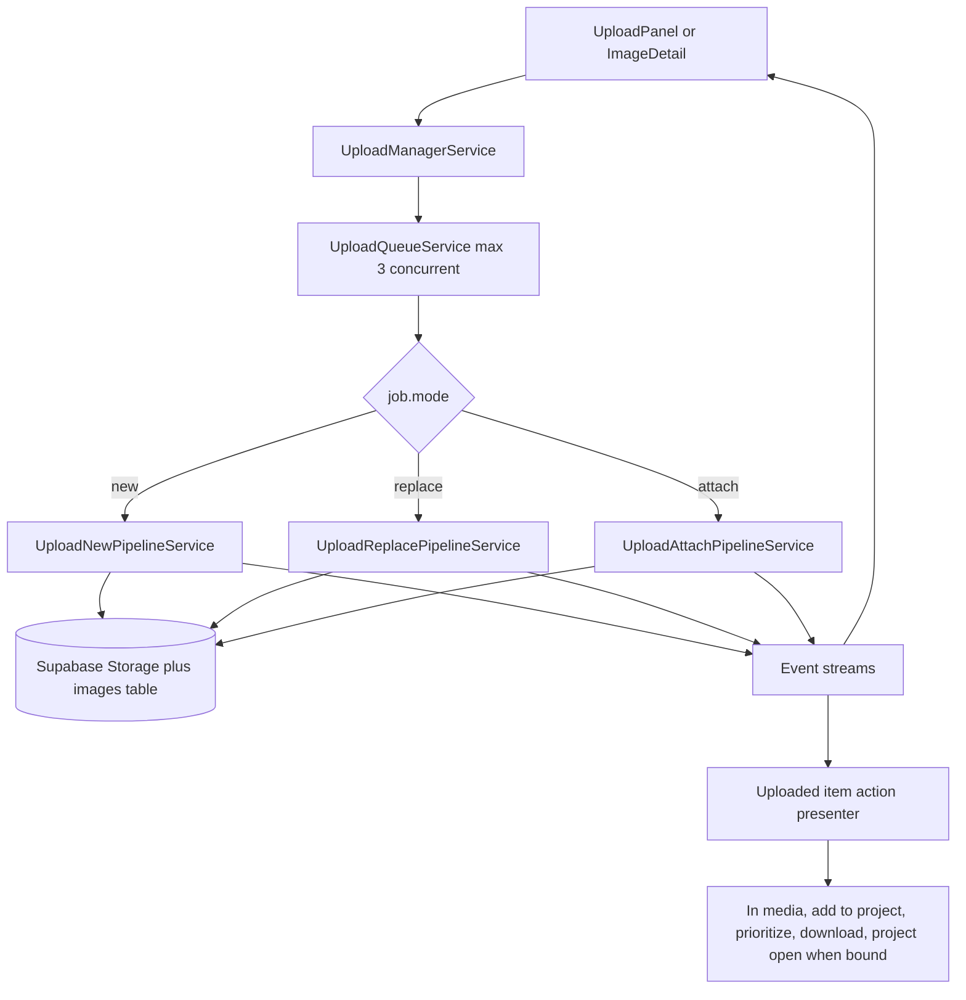
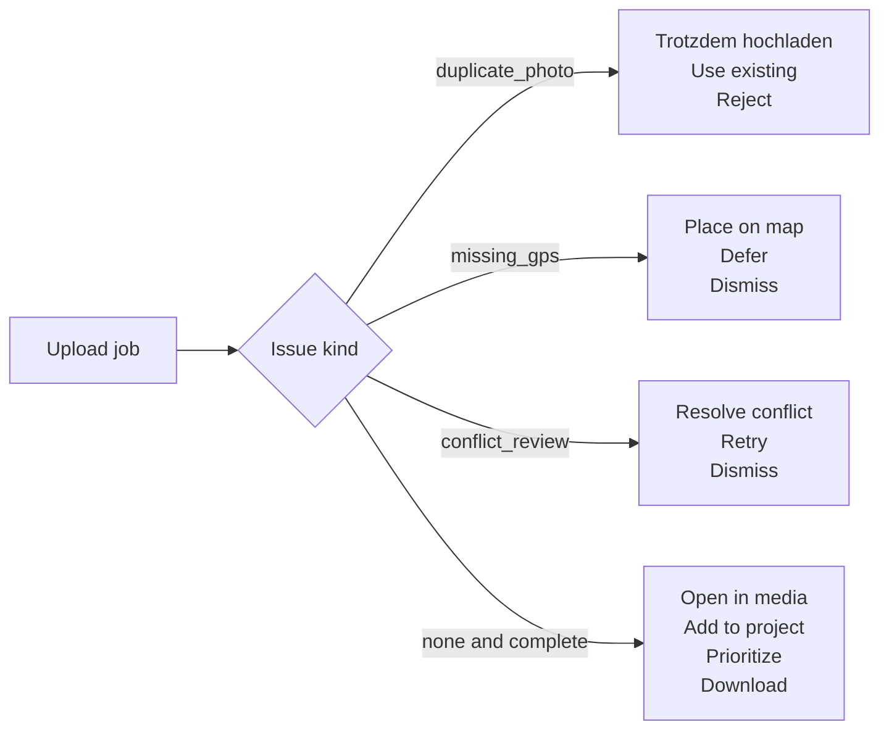
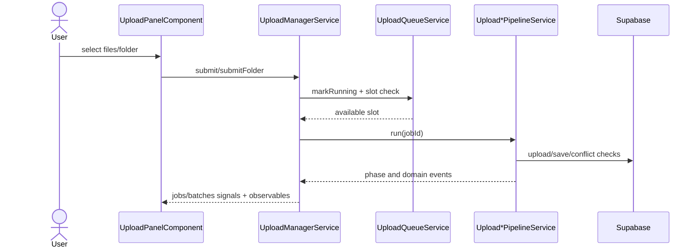

# Upload Manager

> **Related specs:** [media-renderer-system](media-renderer-system.md), [upload-panel](upload-panel.md), [photo-load-service](photo-load-service.md)

## What It Is

A **singleton, application-wide service** that owns the entire upload pipeline: validation, EXIF parsing, folder/title address handling, photo-only deduplication, duplicate resolution decisions, storage upload, database insert, and enrichment. Any component in the app can submit files and uploads continue independently of component lifecycle.

Queue management and concurrency are implemented inside `UploadManagerService` through `UploadQueueService` and pipeline services under `core/upload/`.

## Child Specs

This parent spec owns the top-level contract. Deep pipeline behavior is split into:

| Child Spec                                            | Covers                                                                                                 |
| ----------------------------------------------------- | ------------------------------------------------------------------------------------------------------ |
| [upload-manager-pipeline](upload-manager-pipeline.md) | Folder upload flow, deduplication, location-conflict detection, and replace/attach event orchestration |

## What It Looks Like

The Upload Manager is mostly invisible UI infrastructure, but it surfaces as consistent upload state across the app: upload rows progress through explicit phases, global progress can be shown from any route, and image detail actions can continue after navigation. Jobs expose stable phase labels and progress percentages, with non-blocking enrichment phases for reverse and forward geocoding. Conflict resolution states are modeled as explicit paused phases instead of silent failures. When folder or file titles contain addresses, textual location is reconciled with EXIF data without ever discarding EXIF coordinates.

Canonical document/office upload catalog for this manager contract is: `DOC`, `DOCX`, `ODT`, `ODG`, `TXT`, `XLS`, `XLSX`, `ODS`, `CSV`, `PPT`, `PPTX`, `ODP`, `PDF`.

## Where It Lives

- Service: `UploadManagerService` at `core/upload/upload-manager.service.ts`
- Scope: `providedIn: 'root'` singleton, survives routing
- Consumers: Upload panel, image detail flows, folder import flows, and global progress UI

## Actions

| #   | Trigger                                            | System Response                                                | Notes                              |
| --- | -------------------------------------------------- | -------------------------------------------------------------- | ---------------------------------- |
| 1   | Any entry point submits files                      | Creates jobs and batch, starts queued execution                | Service-owned lifecycle            |
| 2   | A job starts processing                            | Runs validation, EXIF parse, dedup, upload, DB write           | Max 3 concurrent active jobs       |
| 3   | Folder/file title provides address text            | Resolves textual location source with precedence rules         | File title overrides folder title  |
| 4   | EXIF and textual location both exist               | Performs tolerance-based reconciliation (15m)                  | Keeps both coordinate sources      |
| 5   | Duplicate hash match for photo/image               | Opens duplicate-resolution flow and moves item to issues       | Supports batch-wide decision apply |
| 5a  | User chooses `upload anyway` on duplicate issue    | Resumes pipeline with force-upload semantics                   | Only valid for duplicate review    |
| 5b  | User chooses `use existing` on duplicate issue     | Completes without creating duplicate persisted media           | Existing media reference retained  |
| 6   | Geocoding enrichment needed                        | Runs reverse or forward enrichment as non-blocking phase       | Failure remains non-fatal          |
| 7   | Conflict detected                                  | Job pauses in awaiting conflict resolution                     | Resumes on user decision           |
| 8   | User retries failed job                            | Requeues from start with new phase transitions                 | Job id retained                    |
| 9   | User cancels job or batch                          | Stops work and performs cleanup as needed                      | Emits cancellation events          |
| 10  | Persisted upload is shown in Uploaded lane actions | Exposes add-to-project, prioritize, download, media navigation | Only after saved media exists      |
| 10a | User selects `Standort ändern > Karte anklicken`   | Enters map-pick flow and persists clicked coordinates          | Existing media row is updated      |
| 10b | User selects `Standort ändern > Adresse eingeben`  | Opens address-finder overlay and persists selected suggestion  | Hover previews are map-only, no DB |

## Component Hierarchy

```
Upload Manager System
  ├── Job Queue Layer ← queued jobs, retries, cancellation, FIFO start order
  ├── Pipeline Layer ← validation, EXIF, dedup, upload, save, enrichment
  ├── Event Layer ← emits uploads, replacements, attachments, skips, failures, conflicts
  ├── Batch Layer ← tracks aggregate progress, completion, and scanning state
  └── Consumers
      ├── UploadPanelComponent ← per-file rows, progress, issue states
      ├── ImageDetailView ← replace/attach entry points and refresh behavior
      ├── MapShellComponent ← marker updates and optimistic sync
      ├── ThumbnailCard / ThumbnailGrid ← thumbnail refresh and upload overlays
      └── UploadButtonZone ← global progress badge/ring
```

## Data

### Data Flow (Mermaid)



### Issue and Action Semantics (Mermaid)



| Field            | Source                                  | Type                                                                                |
| ---------------- | --------------------------------------- | ----------------------------------------------------------------------------------- |
| Jobs             | `UploadManagerService.jobs()`           | `Signal<UploadJob[]>`                                                               |
| Active count     | `UploadManagerService.activeCount()`    | `Signal<number>`                                                                    |
| Is busy          | `UploadManagerService.isBusy()`         | `Signal<boolean>`                                                                   |
| Batches          | `UploadManagerService.batches()`        | `Signal<UploadBatch[]>`                                                             |
| Active batch     | `UploadManagerService.activeBatch()`    | `Signal<UploadBatch \| null>`                                                       |
| Per-job events   | `UploadManagerService.jobPhaseChanged$` | `Observable<...>`                                                                   |
| Batch events     | `UploadManagerService.batchProgress$`   | `Observable<...>`                                                                   |
| Skip events      | `UploadManagerService.uploadSkipped$`   | `Observable<...>`                                                                   |
| Issue kind       | upload lane presenter                   | `'duplicate_photo' \| 'missing_gps' \| 'conflict_review' \| 'upload_error' \| null` |
| Uploaded actions | upload row presenter                    | `UploadItemAction[]`                                                                |

## State

| Name                   | Type                            | Default | Controls                                                             |
| ---------------------- | ------------------------------- | ------- | -------------------------------------------------------------------- |
| `jobs`                 | `WritableSignal<UploadJob[]>`   | `[]`    | Full upload queue + history                                          |
| `activeJobs`           | `Signal<UploadJob[]>`           | `[]`    | Computed: non-terminal jobs                                          |
| `isBusy`               | `Signal<boolean>`               | `false` | Computed: any non-terminal job exists                                |
| `activeCount`          | `Signal<number>`                | `0`     | Computed: jobs in uploading/saving/resolving                         |
| `batches`              | `WritableSignal<UploadBatch[]>` | `[]`    | All batches (active + completed)                                     |
| `activeBatch`          | `Signal<UploadBatch \| null>`   | `null`  | Active upload/scanning batch                                         |
| `job.issueKind`        | `UploadIssueKind \| null`       | `null`  | Distinguishes duplicate review from GPS or hard error                |
| `job.availableActions` | `UploadItemAction[]`            | `[]`    | Contextual row actions derived from saved media state and issue kind |

## File Map

| File                                                     | Purpose                                                                      |
| -------------------------------------------------------- | ---------------------------------------------------------------------------- |
| `core/upload/upload-manager.service.ts`                  | Queue management, concurrency, pipeline orchestration                        |
| `core/upload/upload-manager.types.ts`                    | Shared upload domain types and event contracts                               |
| `core/upload/upload-job-state.service.ts`                | Job state signal store + phase events                                        |
| `core/upload/upload-batch.service.ts`                    | Batch lifecycle and progress computation                                     |
| `core/upload/upload-queue.service.ts`                    | Running-slot tracking and concurrency guard                                  |
| `core/upload/upload-new-pipeline.service.ts`             | New upload path including missing-data and conflict branching                |
| `core/upload/upload-replace-pipeline.service.ts`         | Replace existing image path                                                  |
| `core/upload/upload-attach-pipeline.service.ts`          | Attach media to photoless row path                                           |
| `core/content-hash.util.ts`                              | `computeContentHash()` — SHA-256 from file head + EXIF                       |
| `core/upload/upload.service.ts`                          | Per-file storage/DB operations and EXIF handling                             |
| `core/geocoding.service.ts`                              | Reverse/forward geocoding adapter                                            |
| `docs/element-specs/upload-manager-pipeline.md`          | Child spec for pipeline, deduplication, folder upload, and conflict handling |
| `features/upload/upload-panel/upload-panel.component.ts` | Refactor — delegate to UploadManagerService                                  |

## Wiring

### Wiring Flow (Mermaid)



- `UploadManagerService` is `providedIn: 'root'` — no module import needed
- Inject into `UploadPanelComponent` for intake, lane rows, and placement handoff
- Inject into `ImageDetailView` for `replaceFile()` and `attachFile()`
- Subscribe to `imageUploaded$` in `MapShellComponent` to upsert map markers
- Subscribe to `imageReplaced$` and `imageAttached$` in map/detail/grid consumers for immediate thumbnail refresh
- Subscribe to `uploadFailed$` for user-facing error notifications
- Subscribe to `batchProgress$` where global progress affordance is shown
- Consume `locationConflict$` through upload conflict UI flow before resume
- `dedup_hashes` table and conflict contract remain defined in `upload-manager-pipeline.md`

### Event Consumers

| Event               | Consumer               | Reaction                                                                    |
| ------------------- | ---------------------- | --------------------------------------------------------------------------- |
| `imageUploaded$`    | `MapShellComponent`    | Adds optimistic marker to the map                                           |
| `imageUploaded$`    | `ThumbnailGrid`        | Refreshes grid if the uploaded image belongs to the active group            |
| `imageReplaced$`    | `MapShellComponent`    | Rebuilds marker DivIcon with the replacement thumbnail                      |
| `imageReplaced$`    | `ThumbnailCard`        | Resets thumbnail loading cycle to the new local object URL                  |
| `imageReplaced$`    | `ImageDetailView`      | Refreshes signed URLs and hero image                                        |
| `imageAttached$`    | `MapShellComponent`    | Updates a formerly photoless marker with thumbnail content                  |
| `imageAttached$`    | `ThumbnailCard`        | Replaces no-photo state with uploaded thumbnail                             |
| `imageAttached$`    | `ImageDetailView`      | Switches from upload prompt to photo display                                |
| `uploadFailed$`     | `MapShellComponent`    | Shows toast notification                                                    |
| `uploadSkipped$`    | `UploadPanelComponent` | Shows skip reason (`duplicate_reject`, `already_uploaded`, `policy_denied`) |
| `locationConflict$` | `UploadPanelComponent` | Shows conflict resolution popup                                             |
| `jobPhaseChanged$`  | `UploadPanelComponent` | Updates per-file status label and icon                                      |
| `jobPhaseChanged$`  | `PhotoMarker`          | Shows or hides pending indicator on markers                                 |
| `jobPhaseChanged$`  | `ThumbnailCard`        | Shows or hides uploading overlay                                            |
| `batchProgress$`    | `UploadPanelComponent` | Updates the batch progress bar                                              |
| `batchProgress$`    | `UploadButtonZone`     | Shows progress ring or badge on the upload button                           |
| `batchComplete$`    | `UploadPanelComponent` | Shows batch summary                                                         |
| `missingData$`      | `UploadPanelComponent` | Emits placement request output to map shell                                 |

## Acceptance Criteria

- [x] Uploads continue when the originating component is destroyed (navigate away)
- [x] Maximum 3 concurrent uploads enforced globally across all entry points
- [x] FIFO queue: first file submitted is first to upload
- [x] `missing_data` jobs do not consume concurrency slots
- [x] Job state is reactive (Angular signals) — any component can bind to `jobs()`
- [x] `imageUploaded$` fires with coords + imageId when a job completes
- [x] `uploadFailed$` fires when a critical phase fails
- [x] Failed jobs can be retried via `retryJob()`
- [x] Completed/failed jobs can be dismissed individually or in bulk
- [x] **Path A**: GPS in EXIF → upload → save → reverse-geocode address (non-blocking)
- [x] **Path B**: No GPS + address in title → upload → save with address → forward-geocode coords (non-blocking)
- [x] **Path C**: No GPS + no address → job enters `missing_data`, emits `missingData$` for placement flow
- [ ] Folder-level title addresses are applied as defaults to files without file-level title addresses.
- [ ] File-level title addresses override folder-level defaults.
- [ ] EXIF GPS is preserved even when textual location is present.
- [ ] Title/folder-derived coordinates are compared against EXIF with a 15m tolerance and mismatches are persisted.
- [ ] Hash dedupe runs only for photos/images (never for videos, `DOC`, `DOCX`, `ODT`, `ODG`, `TXT`, `XLS`, `XLSX`, `ODS`, `CSV`, `PPT`, `PPTX`, `ODP`, `PDF`).
- [ ] Duplicate hash matches are resolved via explicit user decision (`use_existing`, `upload_anyway`, `reject`) rather than auto-skip.
- [ ] Duplicate resolution supports a batch apply option for matching items.
- [ ] Duplicate issue rows expose navigation to the existing placed media.
- [ ] Duplicate issue rows expose `Trotzdem hochladen` only for duplicate-photo review, never for GPS issues.
- [ ] Persisted successful uploads expose follow-up actions including `Zu Projekt hinzufügen`, `Priorisieren`, `In /media anzeigen`, and `Herunterladen`.
- [ ] `Projekt öffnen` appears only when the saved media item is already bound to a project.
- [ ] `Standort ändern` in uploaded rows exposes `Karte anklicken` and `Adresse eingeben` as separate flows.
- [ ] Address-suggestion hover previews map position without persisting until suggestion selection.
- [ ] Ambiguous street+house matches are auto-assigned only when disambiguation probability is at or above threshold (default `0.95`).
- [ ] Parser residual fragments are preserved as address notes and remain visible in media details.
- [x] Address resolution and coordinate resolution are enrichment — failure is silent
- [ ] Geocoding enrichment `401` performs one silent auth refresh and one retry before failing
- [ ] Persistent geocoding `401` causes controlled sign-out via `AuthService` (no manual storage-clearing workaround)
- [x] Orphaned storage files are cleaned up when DB insert fails
- [x] Auth change (logout) cancels all active jobs
- [ ] Global progress indicator visible from any page when uploads are active
- [x] `beforeunload` warning shown when `isBusy()` is true
