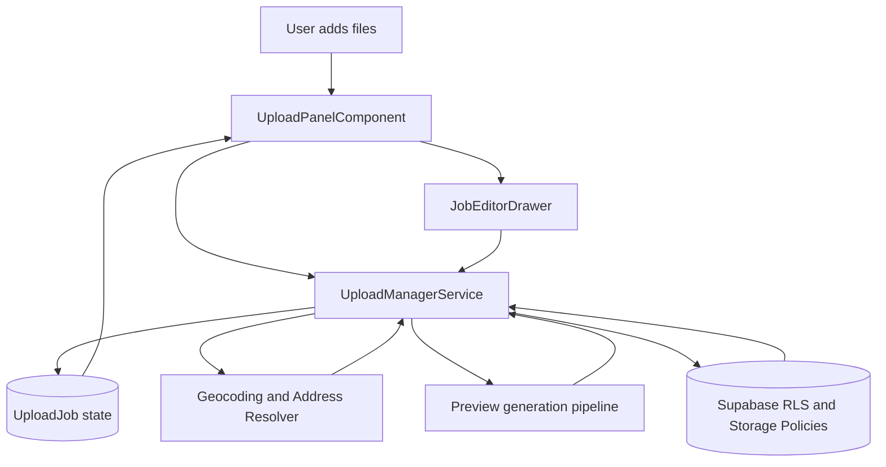
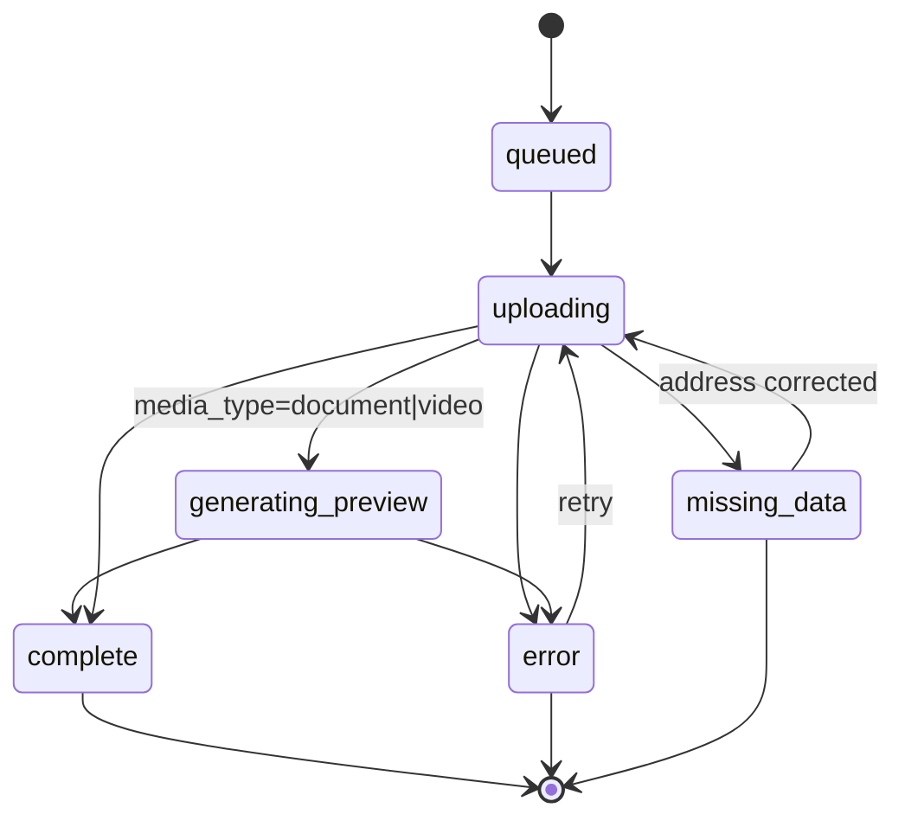
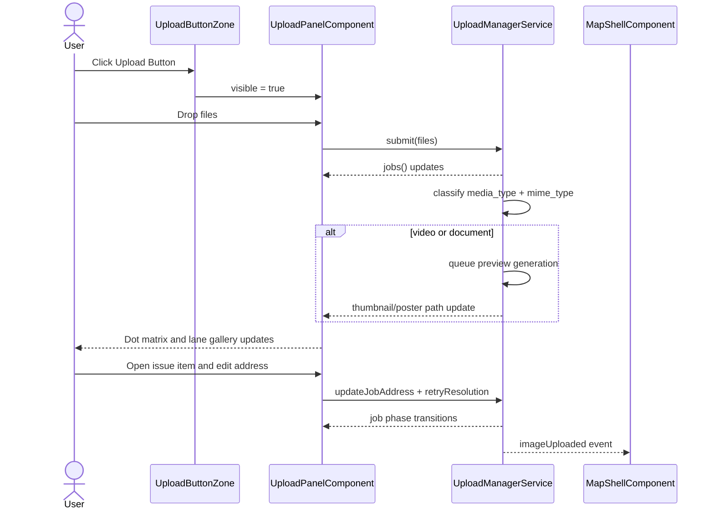

# Upload Panel

## What It Is

The Upload Panel is the compact upload workspace that appears from the Upload Button Zone. It lets users add mixed media files, watch per-file progress in a dot matrix, and triage uploads by state (uploading, uploaded, issues).

## What It Looks Like

The panel is a single `.ui-container` surface that feels like the button expanded into a small control card. The top section is a dashed Drop Zone, followed by a Last Upload summary when no active queue exists. When uploads are running, a progress board appears under the Drop Zone with a dense dot matrix and a segmented 3-option switch.

Primary upload intake supports photos, videos, PDFs, and office documents (`.doc`, `.docx`, `.xls`, `.xlsx`, `.ppt`, `.pptx`). Document-like files render thumbnail previews as generated cover snapshots when available; otherwise they fall back to deterministic type icons (`DOCX`, `XLSX`, `PPTX`, `PDF`) in lane rows.

The matrix defaults to a square board using up to 10 columns by 10 rows per visible page; each dot is 0.5rem (8px) with 0.25rem (4px) gap. Dot colors use design tokens: idle/queued `--color-bg-muted`, uploading `--color-primary` with pulse, uploaded `--color-success`, and issue `--color-warning`.

## Where It Lives

- **Parent**: Upload Button Zone in `MapShellComponent`
- **Component**: `UploadPanelComponent` at `features/upload/upload-panel/`
- **Appears when**: user toggles Upload Button open

## Actions

| #   | User Action                                       | System Response                                                               | Triggers                                        |
| --- | ------------------------------------------------- | ----------------------------------------------------------------------------- | ----------------------------------------------- |
| 1   | Clicks Upload Button                              | Opens compact Upload Panel container                                          | `uploadPanelOpen` signal                        |
| 2   | Drags files onto Drop Zone                        | Creates upload jobs and starts pipeline (max 3 parallel)                      | `UploadManagerService.submit()`                 |
| 3   | Clicks Drop Zone                                  | Opens file picker with multi-select                                           | Native file picker                              |
| 4   | Clicks Select Folder (when supported)             | Starts folder scan then enqueues discovered files                             | `UploadManagerService.submitFolder`             |
| 5   | Folder scan is running                            | Shows scanning status line and disables folder action                         | `activeBatch.state = scanning`                  |
| 6   | Clicks Take Photo                                 | Opens camera-capable file capture path and submits captured file              | Native capture input                            |
| 6b  | Uploads DOCX/XLSX/PPTX                            | File is accepted, classified as `document`, and queued for preview generation | `UploadService.validateFile()` + preview worker |
| 7   | Viewer attempts upload action                     | Upload is denied by RLS; UI shows permission error feedback                   | Supabase policy deny                            |
| 8   | No active jobs and no queued jobs                 | Shows Last Upload summary line                                                | `lastCompletedBatch()`                          |
| 9   | Active or queued jobs exist                       | Shows dot matrix board under Drop Zone                                        | `jobs().length > 0`                             |
| 10  | Job is queued / not started                       | Dot stays muted gray                                                          | Job phase in queued/parsing/hashing             |
| 11  | Job is actively uploading                         | Dot turns blue and pulses while in-flight                                     | Job phase `uploading`                           |
| 12  | Job succeeds                                      | Dot turns green                                                               | Job phase `complete`                            |
| 13  | Job has issue (GPS/title/address resolution etc.) | Dot turns orange and becomes selectable in Errors view                        | Job phase `error` or `missing_data`             |
| 14  | Switches segmented control to Uploading           | Gallery list filters to active jobs only                                      | `selectedLane = 'uploading'`                    |
| 15  | Switches segmented control to Uploaded            | Gallery list filters to completed jobs                                        | `selectedLane = 'uploaded'`                     |
| 16  | Switches segmented control to Issues              | Gallery list filters to problematic jobs                                      | `selectedLane = 'issues'`                       |
| 17  | Clicks item in Issues lane                        | Opens inline correction editor (address/title/coords retry path)              | `openJobEditor(jobId)`                          |
| 18  | Clicks item in Uploading lane                     | Opens live detail drawer (status + editable address draft where allowed)      | `openJobEditor(jobId)`                          |
| 19  | Saves address correction for issue                | Retries resolver/update path and updates dot color based on result            | `retryResolution(jobId, payload)`               |
| 20  | Closes panel                                      | Panel collapses; uploads continue in background                               | Root service lifecycle                          |
| 21  | Uploads document without embedded preview         | Lane row shows file-type fallback icon and stable metadata badge              | `DocumentPreviewService.fallback`               |

## Component Hierarchy

```
UploadPanel                                              ← compact `.ui-container` surface from button morph
├── PanelHeader                                          ← title "Upload" + collapse icon + busy counter
├── DropZone                                             ← dashed drag target, click to select files
│   ├── CameraIcon                                       ← upload affordance
│   ├── PrimaryHint                                      ← "Drop files or click to upload"
│   └── SecondaryHint                                    ← accepted formats and max size
├── IntakeActions                                        ← secondary intake actions under drop zone
│   ├── [if supported] SelectFolderButton                ← folder import trigger
│   └── TakePhotoButton                                  ← capture-enabled photo intake
├── [scanning] ScanStatus                                ← "Scanning folder..." feedback row
├── [idle only] LastUploadSummary                        ← summary of most recent batch/job result
│   ├── LastUploadLabel                                  ← "Last upload"
│   └── LastUploadValue                                  ← single file name OR "Batch · N files"
├── [queue or active exists] ProgressBoard               ← status board under Drop Zone
│   ├── DotMatrixCanvas                                  ← 10×10 visual grid page (100 dots max per page)
│   │   └── ProgressDot × N                              ← each job represented by one dot
│   ├── LaneSwitch                                       ← 3-option segmented switch
│   │   ├── UploadingLaneButton                          ← active jobs
│   │   ├── UploadedLaneButton                           ← successful jobs
│   │   └── IssuesLaneButton                             ← failed/needs-attention jobs
│   └── LaneGallery                                      ← thumbnail strip/list for selected lane
│       └── LaneItem × N                                 ← media preview/icon + file title + compact status
└── [job selected] JobEditorDrawer                        ← inline editor for selected Uploading/Issues item
    ├── Preview                                          ← selected media preview (image/video/doc)
    ├── AddressInput                                     ← editable address field
    ├── ResolutionMeta                                   ← resolver status text
    └── SaveAndRetryActions                              ← save, retry, dismiss
```

## Data

### Data Flow (Mermaid)



| Field                      | Source                                         | Type                                 |
| -------------------------- | ---------------------------------------------- | ------------------------------------ |
| Upload jobs                | `UploadManagerService.jobs()`                  | `Signal<UploadJob[]>`                |
| Active batch               | `UploadManagerService.activeBatch()`           | `Signal<UploadBatch \| null>`        |
| Last completed batch       | `UploadManagerService.lastCompletedBatch()`    | `Signal<UploadBatchSummary \| null>` |
| Selected lane items        | Derived from jobs by phase                     | `Computed<UploadJob[]>`              |
| Accepted document MIME map | `UploadService.ALLOWED_MIME_TYPES`             | `ReadonlySet<string>`                |
| Document preview path      | `media_items.thumbnail_path` / `poster_path`   | `string \| null`                     |
| Resolution retry           | `UploadManagerService.retryResolution(jobId)`  | `Promise<void>`                      |
| Address patch update       | `UploadManagerService.updateJobAddress(jobId)` | `Promise<void>`                      |

### Status Mapping (Mermaid)



## State

| Name                 | Type                                                           | Default       | Controls                                                   |
| -------------------- | -------------------------------------------------------------- | ------------- | ---------------------------------------------------------- |
| `dragOver`           | `boolean`                                                      | `false`       | Drop Zone hover treatment                                  |
| `selectedLane`       | `'uploading' \| 'uploaded' \| 'issues'`                        | `'uploading'` | Which lane is visible in lane gallery                      |
| `selectedJobId`      | `string \| null`                                               | `null`        | Which job is open in editor drawer                         |
| `matrixPage`         | `number`                                                       | `0`           | Dot matrix page for batches larger than 100                |
| `dotPulseEnabled`    | `boolean`                                                      | `true`        | Uploading-dot pulse animation toggle                       |
| `folderSupported`    | `boolean`                                                      | `false`       | Shows/hides folder intake action                           |
| `isScanning`         | `boolean`                                                      | `false`       | Folder scan feedback and action disablement                |
| `previewFallbackMap` | `Record<string, 'DOC' \| 'DOCX' \| 'XLSX' \| 'PPTX' \| 'PDF'>` | `{}`          | File-type fallback badges when no generated preview exists |

## File Map

| File                                                       | Purpose                                                                |
| ---------------------------------------------------------- | ---------------------------------------------------------------------- |
| `features/upload/upload-panel/upload-panel.component.ts`   | Upload panel orchestration, lane filters, matrix mapping               |
| `features/upload/upload-panel/upload-panel.component.html` | Compact panel UI: drop zone, last upload, matrix board, lane gallery   |
| `features/upload/upload-panel/upload-panel.component.scss` | Matrix dot styles, lane switch visuals, status animation tokens        |
| `core/upload-manager.service.ts`                           | Root upload lifecycle, per-job phases, last batch summary, retry hooks |
| `core/address-resolver.service.ts`                         | Address correction and forward resolution on issue retry               |

## Wiring

### Wiring Flow (Mermaid)



- Receives visibility from `MapShellComponent` and uses parent-controlled open/close behavior.
- Injects `UploadManagerService` to submit files, read job state, and apply correction retries.
- Uses one canonical intake pipeline for picker, drop, folder, and capture file sources.
- Derives matrix dots from stable job ordering so colors do not shuffle between rerenders.
- Opens `JobEditorDrawer` for selected jobs in Uploading and Issues lanes.
- Emits map-refresh events through the upload manager event bus when corrected jobs complete.
- Surfaces RLS permission denies as user-facing feedback while relying on backend enforcement.

## Acceptance Criteria

- [ ] Panel appears as compact container expansion from Upload Button
- [ ] Top section is a Drop Zone with drag-and-drop and click upload
- [ ] Select Folder action appears when the browser supports folder import
- [ ] Folder scan shows progress text and disables repeat folder action while scanning
- [ ] Take Photo action opens capture-capable intake and submits into the same upload pipeline
- [ ] If queue is empty, Last Upload summary appears under Drop Zone
- [ ] Last Upload shows file name for single upload
- [ ] Last Upload shows `Batch · N files` for multi-file upload
- [ ] If queue has jobs, Dot Matrix board appears under Drop Zone
- [ ] Dot Matrix uses neutral gray for not-started jobs
- [ ] Dot Matrix uses pulsing blue for active uploads
- [ ] Dot Matrix uses green for completed jobs
- [ ] Dot Matrix uses orange for jobs with issues
- [ ] Lane switch contains exactly 3 options: Uploading, Uploaded, Issues
- [ ] Clicking a lane filters visible image list to that lane only
- [ ] Clicking an item in Issues opens correction editor
- [ ] Clicking an item in Uploading opens live detail editor
- [ ] Saving correction in Issues triggers retry and updates status color
- [ ] Closing panel does not cancel active uploads
- [ ] Viewer upload attempts are blocked by RLS and shown as a clear error state
- [ ] Upload intake accepts office documents (`.doc`, `.docx`, `.xls`, `.xlsx`, `.ppt`, `.pptx`) in addition to photo/video/PDF types
- [ ] Document uploads generate a thumbnail preview asynchronously and update lane rows when ready
- [ ] If document preview generation fails, lane rows show deterministic type fallback badge (`DOCX`, `XLSX`, `PPTX`, `PDF`) instead of a broken thumbnail
