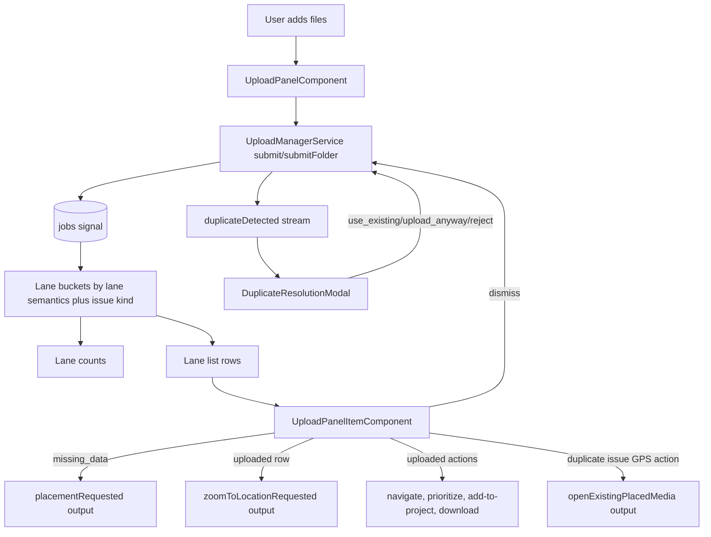
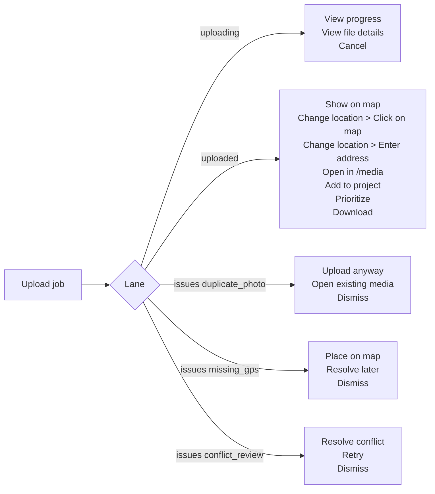
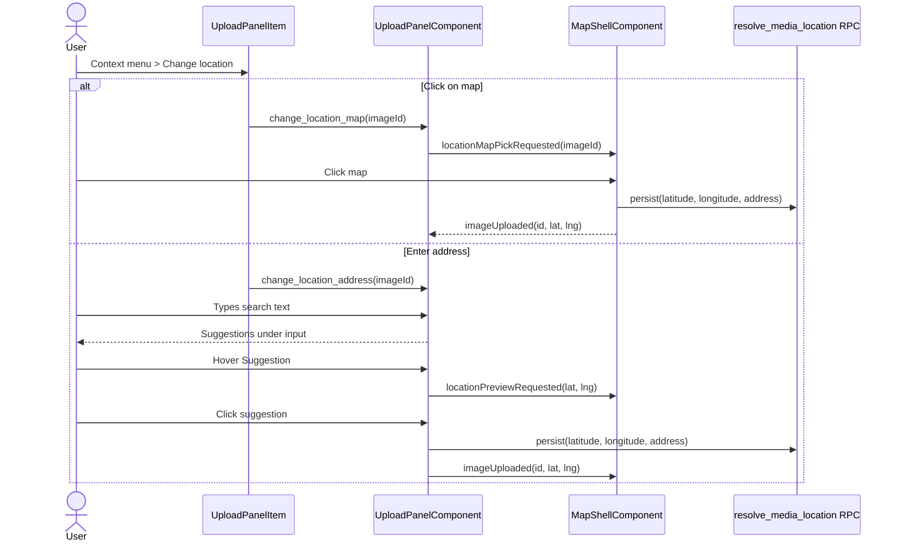
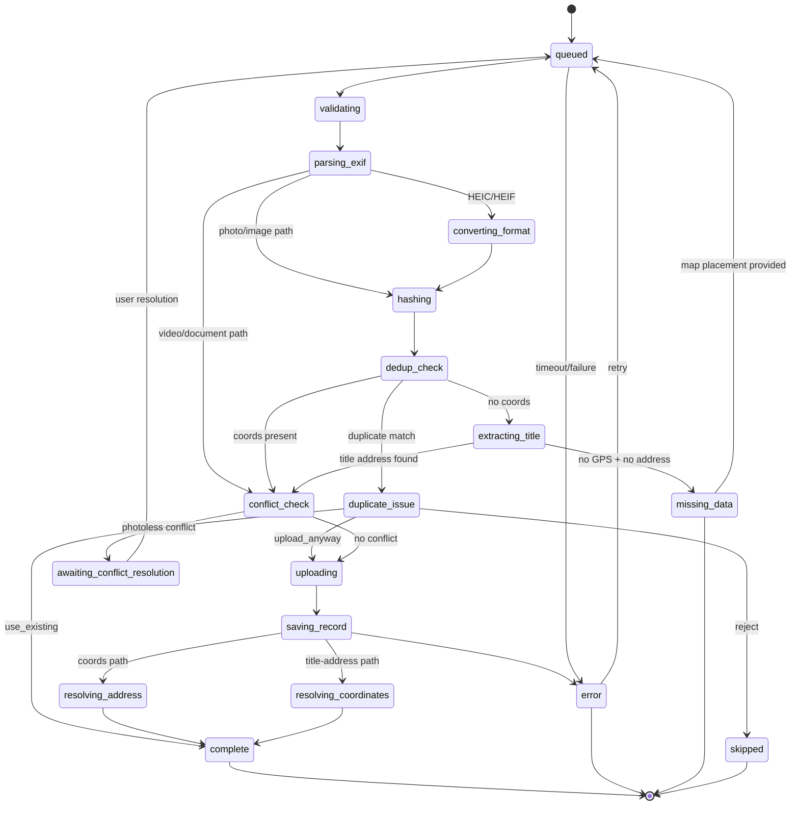
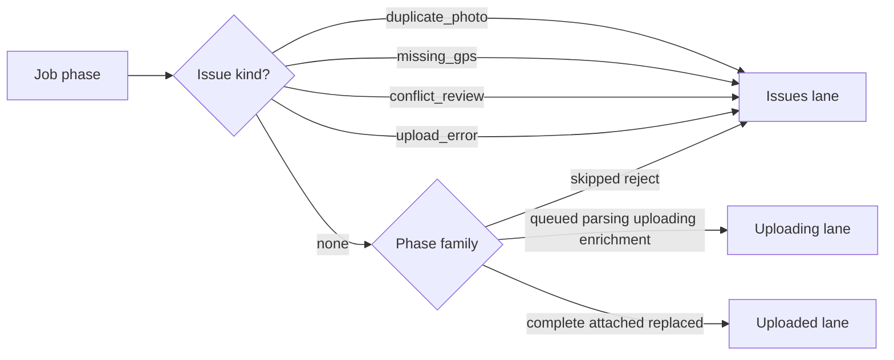
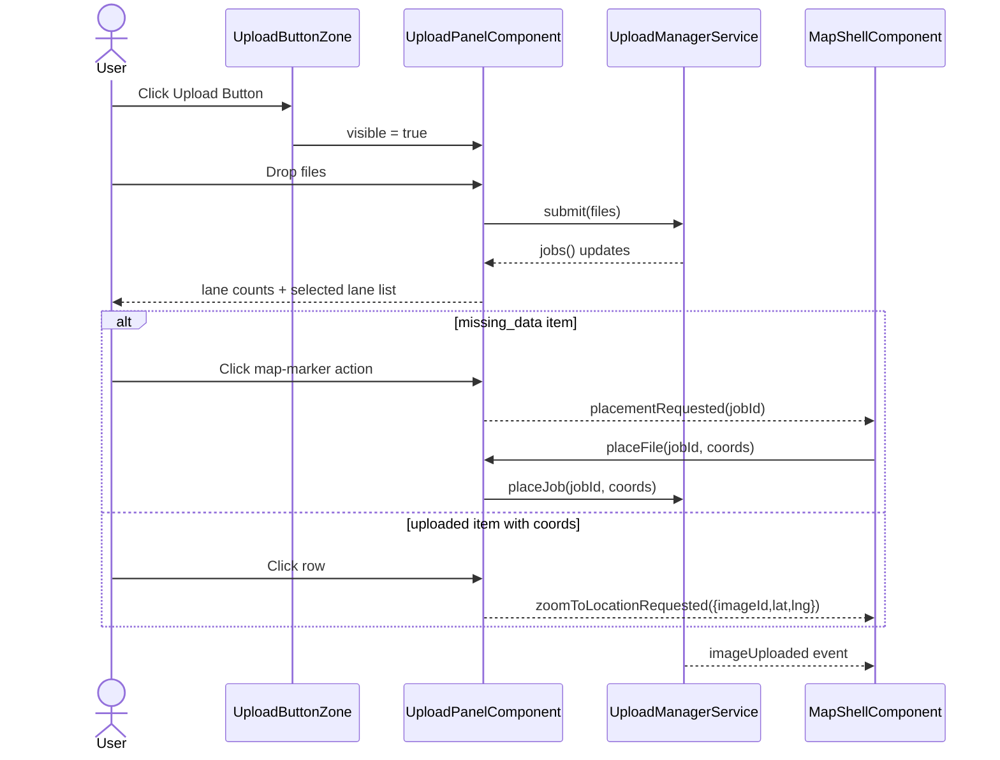

# Upload Panel

> **Related specs:** [media-renderer-system](media-renderer-system.md), [upload-manager](upload-manager.md), [file-type-chips](file-type-chips.md)

## What It Is

The Upload Panel is the compact upload workspace that appears from the Upload Button Zone. It lets users add mixed media files and triage uploads by state (uploading, uploaded, issues).

## What It Looks Like

The panel root is a single fixed-width section shell built from **4 vertically stacked full-width blocks**. All four blocks use the same left and right edges.

The root section is layout-only and intentionally unstyled: no padding, no border, no background, and no shadow. Visual container treatment belongs only to the inner blocks.

The shell itself is intentionally mostly transparent and acts as structure, not as a decorative card. The gaps between blocks are literal see-through spaces where the map/background behind the panel remains visible.

1. Upload area (title + subtitle + drop zone + file type chips).
2. Folder upload button.
3. Segmented switch / tab bar (`Uploading`, `Uploaded`, `Issues`).
4. File list stack.

These blocks are separated by a **vertical gap between distinct sections**. Separation is defined by real layout gap, not by decorative borders, separators, or fake divider surfaces.

The top section contains title/subtitle and the dashed Drop Zone. The `Folder upload` button is its own full-width block directly below the upload area.

The segmented switch is a separate full-width block under the folder button.
That block must not render an extra card/tile surface. The tab list itself is the container, and only the tab options live inside it.

The file list is a separate full-width block under the switch. File entries are stacked as individual full-width items with a gap between items.

The idle `No uploads yet` placeholder is not part of the compact intake layout contract.

The compact map-overlay panel is menu-first for row interactions: no row-level checkboxes and no multi-select in compact mode. Multi-select is allowed only when this panel is embedded in the Workspace Upload tab.

Primary upload intake supports photos, videos, PDFs, office documents (`.doc`, `.docx`, `.odt`, `.odg`, `.xls`, `.xlsx`, `.ods`, `.ppt`, `.pptx`, `.odp`), plain text (`.txt`), and CSV (`.csv`). Document-like files render thumbnail previews as generated cover snapshots when available; otherwise they fall back to deterministic type icons (`DOC`, `DOCX`, `ODT`, `ODG`, `TXT`, `XLS`, `XLSX`, `ODS`, `CSV`, `PPT`, `PPTX`, `ODP`, `PDF`) in lane rows. For folder uploads, a parseable address in the folder name acts as the default location hint for all files unless a file provides its own parseable address in its name.

Lane switch visuals are asymmetric by contract: `Queue` and `Uploaded` are compact square button forms, while `Issues` uses a stretched icon+text treatment to increase attention and actionability. The switch container itself is full width.

The lane item area uses a fully transparent overflow wrapper (no padding, no decorative surface) only for scrolling behavior. It shows up to 5 full rows at once; additional rows are reachable by internal scrolling. This applies equally to Queue, Uploaded, and Issues lanes.

Each file item in the list is full width, has no white card background, and is separated from the next item via gap spacing. The separator is the gap itself, not a table-row border, and the gap must stay visually transparent.

### Reference Structure (Contract)

```text
<UploadPanel>                          <!-- fixed width container -->

  <UploadZone />                       <!-- full width -->

  <FolderUploadButton />               <!-- full width -->

  <!-- gap -->

  <SegmentedSwitch>                    <!-- full width, same as container -->
    <Segment id="uploading" />
    <Segment id="uploaded" />
    <Segment id="issues" />
  </SegmentedSwitch>

  <!-- gap -->

  <FileItemStack>                      <!-- full width -->

    <FileItem />                       <!-- full width -->
    <!-- gap -->
    <FileItem />                       <!-- full width -->
    <!-- gap -->
    <FileItem />                       <!-- full width -->

  </FileItemStack>

</UploadPanel>
```

## Where It Lives

- **Parent**: Upload Button Zone in `MapShellComponent`
- **Component**: `UploadPanelComponent` at `features/upload/upload-panel/`
- **Appears when**: user toggles Upload Button open

## Actions

| #    | User Action                                           | System Response                                                                           | Triggers                                              |
| ---- | ----------------------------------------------------- | ----------------------------------------------------------------------------------------- | ----------------------------------------------------- |
| 1    | Clicks Upload Button                                  | Opens compact Upload Panel container                                                      | `uploadPanelOpen` signal                              |
| 2    | Drags files onto Drop Zone                            | Creates upload jobs and starts pipeline (max 3 parallel)                                  | `UploadManagerService.submit()`                       |
| 3    | Clicks Drop Zone                                      | Opens file picker with multi-select                                                       | Native file picker                                    |
| 4    | Clicks Select Folder                                  | Starts folder scan then enqueues discovered files                                         | `UploadManagerService.submitFolder`                   |
| 5    | Folder scan is running                                | Shows scanning status line and disables folder action                                     | `activeBatch.status = 'scanning'`                     |
| 5b   | Folder name contains parseable address                | Uses folder address as default location hint for queued files                             | folder-title parser in upload pipeline                |
| 5c   | A file inside folder has its own parseable address    | File-level address overrides inherited folder address                                     | filename parser precedence                            |
| 6    | Clicks Take Photo                                     | Opens camera-capable file capture path and submits captured file                          | Native capture input                                  |
| 6b   | Uploads DOCX/XLSX/PPTX/ODT/ODS/ODP/ODG/TXT/CSV        | File is accepted, classified as `document`, and queued for preview generation             | `UploadService.validateFile()` + preview worker       |
| 7    | Viewer attempts upload action                         | Upload is denied by RLS; UI shows permission error feedback                               | Supabase policy deny                                  |
| 9    | Active or queued jobs exist                           | Shows segmented lane switch under Drop Zone                                               | `jobs().length > 0`                                   |
| 10   | Switches segmented control to Queue (`uploading`)     | Lane list filters to upload pipeline jobs only                                            | `selectedLane = 'uploading'`                          |
| 11   | Switches segmented control to Uploaded                | Lane list filters to completed jobs                                                       | `selectedLane = 'uploaded'`                           |
| 12   | Switches segmented control to Issues                  | Lane list filters to problematic jobs                                                     | `selectedLane = 'issues'`                             |
| 13   | Clicks map-marker icon in Issues row (`missing_data`) | Emits placement request to map shell                                                      | `placementRequested.emit(jobId)`                      |
| 14   | Clicks row in Issues lane (`missing_data`)            | Enters placement mode from map shell                                                      | `placementRequested.emit(jobId)`                      |
| 15   | Clicks row in Uploaded lane with coords               | Requests map zoom to uploaded media location                                              | `zoomToLocationRequested.emit({ imageId, lat, lng })` |
| 15a  | Opens uploaded row action menu                        | Shows follow-up actions based on saved media state                                        | derived from `imageId`, `projectId`, coords           |
| 15b  | Job has EXIF and textual address mismatch (>15m)      | Row remains uploaded but carries mismatch indicator for detail follow-up                  | location reconciliation state                         |
| 15c  | Duplicate hash issue row shows secondary GPS button   | Clicking button opens/focuses the already placed existing media                           | duplicate target image reference                      |
| 15d  | Duplicate hash issue detected                         | Opens duplicate-resolution modal with `use existing`, `upload anyway`, `reject`           | Optional apply-to-batch checkbox                      |
| 15e  | Address parser found unresolved address fragments     | Row shows subtle address-note indicator and links to detail evidence section              | No parsing info is dropped                            |
| 15f  | Chooses `Add to project` on uploaded item             | Opens add-to-project flow for the saved media item                                        | requires persisted `imageId`                          |
| 15g  | Chooses `Prioritize` on uploaded item                 | Marks or queues the saved media item for prioritized follow-up                            | project/workflow integration                          |
| 15h  | Chooses `Open in /media` on uploaded item             | Navigates to `/media` and focuses or filters the persisted media item                     | router navigation with media context                  |
| 15i  | Chooses `Open project` on uploaded item               | Navigates to the bound project when the upload already belongs to one                     | only when `projectId` exists on job/media             |
| 15j  | Chooses `Change location` on uploaded item            | Opens suboptions for location correction                                                  | grouped action section in row context menu            |
| 15j1 | Chooses `Click on map`                                | Enters map-pick mode and persists clicked coordinates for the saved media item            | map banner + next map click commits coordinates       |
| 15j2 | Chooses `Enter address`                               | Opens taller address-finder overlay with search input and suggestions list                | suggestions render in vertical list under input       |
| 15j3 | Hovers an address suggestion                          | Shows preview pin on map at suggestion coordinates                                        | preview clears when hover ends or dialog closes       |
| 15j4 | Selects an address suggestion                         | Persists address + coordinates and refreshes marker position                              | same `resolve_media_location` contract                |
| 15k  | Chooses `Download` on uploaded item                   | Downloads the saved file via signed URL or download service                               | persisted storage path required                       |
| 16   | Clicks dismiss icon on terminal row                   | Removes row from queue/history                                                            | `UploadManagerService.dismissJob()`                   |
| 17   | Switches into empty lane                              | Lane stays selected even with zero items                                                  | `selectedLane` signal                                 |
| 18   | Closes panel                                          | Panel collapses; uploads continue in background                                           | Root service lifecycle                                |
| 19   | Uses compact map-overlay panel                        | Per-row interactions are menu-first; no row-selection checkboxes are shown                | compact mode (`embeddedInPane = false`)               |
| 20   | Uses embedded panel in Workspace Upload tab           | Row-selection checkboxes appear on hover/focus for multi-select workflows                 | embedded mode (`embeddedInPane = true`)               |
| 21   | Selects upload rows in embedded mode                  | Bottom toolbar appears with retry/download/remove/clear selection actions                 | `selectedUploadJobIds.size > 0`                       |
| 22   | Uses bulk remove in embedded mode                     | Active jobs are cancelled; terminal jobs are dismissed from the list                      | `cancelJob` + `dismissJob` dispatch                   |
| 23   | Opens 3-dot menu in any lane row                      | Bottom menu item is always destructive, separated by a divider                            | row action menu contract                              |
| 24   | Uses destructive 3-dot action on active upload row    | Label is `Cancel upload`; operation cancels active/pending job                            | `UploadManagerService.cancelJob()`                    |
| 25   | Uses destructive 3-dot action on uploaded row         | Label is `Remove from project`; operation removes item from project context               | project-bound persisted media contract                |
| 26   | Uses destructive 3-dot action on issue/failed row     | Label is `Dismiss`; operation dismisses terminal issue row                                | `UploadManagerService.dismissJob()`                   |
| 27   | Lane contains more than 5 rows                        | List remains constrained to 5 visible rows and scrolls internally via transparent wrapper | lane overflow wrapper contract                        |

## Lane Item Features

| Lane        | Availability                                                               | Item Actions                                                                                                                                                     | Notes                                                                                                                 |
| ----------- | -------------------------------------------------------------------------- | ---------------------------------------------------------------------------------------------------------------------------------------------------------------- | --------------------------------------------------------------------------------------------------------------------- |
| `uploading` | queued, parsing, validating, uploading, saving, enrichment                 | `View progress`, `View file details`, `Cancel`                                                                                                                   | No navigation to saved media targets before persistence is complete                                                   |
| `uploaded`  | persisted uploads and attachments with successful completion               | `Show on map`, `Change location > Click on map`, `Change location > Enter address`, `Open in /media`, `Add to project`, `Prioritize`, `Download`, `Open project` | `Open project` only appears when a project is already bound by folder/project context; otherwise use `Add to project` |
| `issues`    | duplicate-photo review, GPS/manual placement, conflict review, hard errors | `Place on map`, `Retry`, `Upload anyway`, `Dismiss`, `Open existing media`                                                                                       | `Upload anyway` is only valid for duplicate-photo review, never for GPS issues                                        |

## Destructive Menu Convention

The row 3-dot menu always ends with exactly one destructive entry, and this entry is always visually separated by a divider.

| Row State                        | Bottom destructive label | Required operation                              |
| -------------------------------- | ------------------------ | ----------------------------------------------- |
| Active upload (`uploading` lane) | `Cancel upload`          | `cancelJob(jobId)`                              |
| Uploaded (`uploaded` lane)       | `Remove from project`    | remove project-bound media from project context |
| Issue or failed (`issues` lane)  | `Dismiss`                | `dismissJob(jobId)`                             |

Notes:

- Compact mode and embedded mode share the same destructive naming convention.
- `Upload anyway` is a non-destructive duplicate-resolution action and MUST NOT replace the destructive bottom item.

## Component Hierarchy

**STRICT PRIMITIVE REQUIREMENT:** This component and all its children must explicitly use the standardized layout primitives from `src/styles/primitives/container.scss`. Do not introduce custom wrapper `div`s for basic flex or grid layouts. Use flatter DOM structures. The lane list items MUST use `.ui-item` without modifying its base geometry. The root `UploadPanel` section MUST remain unstyled and must not be rendered as a `.ui-container` surface.

```text
UploadPanel                                              ← compact fixed-width unstyled wrapper from button morph
├── UploadArea                                            ← full width block
│   ├── PanelHeader                                      ← title + subtitle
│   └── DropZone                                         ← dashed drag target + file type chips
├── FolderUploadButton                                    ← full width block under UploadArea
├── SegmentedSwitchBlock                                  ← full width block under FolderUploadButton
│   └── LaneSwitch                                       ← Uploading / Uploaded / Issues
├── [scanning] ScanStatus                                ← "Scanning folder..." feedback row
├── [queue or active exists] SegmentedSwitchBlock        ← lane switch under folder button
├── [selected lane has items] FileItemStack              ← full width block under segmented switch
│   ├── LaneOverflowWrapper                               ← fully transparent, no padding, overflow-only scroll helper
│   │   └── LaneList
│   │       └── UploadPanelItem × N                      ← full width items stacked with gap between items
│       ├── [compact overlay only] No selection checkbox
│       └── [embedded mode only] HoverSelectionCheckbox
├── [embedded mode AND selection > 0] UploadSelectionFooter (`app-pane-footer`)
│   ├── SelectedCount
│   ├── RetrySelectionAction
│   ├── DownloadSelectionAction
│   ├── RemoveSelectionAction
│   └── ClearSelectionAction
├── [duplicate issue selected] DuplicateResolutionModal  ← standardized modal primitive
│   └── ApplyToBatchCheckbox
└── [selected lane empty] No list rows
```

## Data

### Data Flow (Mermaid)



### Lane Actions (Mermaid)



### Change Location Flow (Mermaid)



| Field                   | Source                                      | Type                                                                                |
| ----------------------- | ------------------------------------------- | ----------------------------------------------------------------------------------- |
| Upload jobs             | `UploadManagerService.jobs()`               | `Signal<UploadJob[]>`                                                               |
| Active batch            | `UploadManagerService.activeBatch()`        | `Signal<UploadBatch \| null>`                                                       |
| Folder address hint     | Upload pipeline folder-title parsing        | `string \| null`                                                                    |
| Last completed batch    | `UploadPanelComponent.lastCompletedBatch()` | `Computed<UploadBatch \| null>`                                                     |
| Lane buckets            | `UploadPanelComponent.laneBuckets()`        | `Computed<Record<UploadLane, UploadJob[]>>`                                         |
| Lane counts             | `UploadPanelComponent.laneCounts()`         | `Computed<{ uploading:number; uploaded:number; issues:number }>`                    |
| Selected lane items     | `UploadPanelComponent.laneJobs()`           | `Computed<UploadJob[]>`                                                             |
| Selected upload rows    | `UploadPanelComponent.selectedUploadJobIds` | `WritableSignal<Set<string>>`                                                       |
| Accepted MIME set       | `UploadService.validateFile()`              | Runtime validation                                                                  |
| Document fallback badge | `documentFallbackLabel(job)`                | `string \| null`                                                                    |
| Location mismatch flag  | Upload pipeline EXIF/text reconciliation    | `boolean`                                                                           |
| Duplicate issue flag    | Upload pipeline dedupe decision flow        | `boolean`                                                                           |
| Duplicate target image  | Duplicate detection payload                 | `string \| null`                                                                    |
| Address parsing notes   | Upload parser residual fragments            | `string[]`                                                                          |
| Placement handoff       | `placementRequested` output                 | `jobId`                                                                             |
| Item action set         | upload row presenter                        | `UploadItemAction[]`                                                                |
| Issue kind              | upload lane mapping                         | `'duplicate_photo' \| 'missing_gps' \| 'conflict_review' \| 'upload_error' \| null` |

### Status Mapping (Mermaid)



### Lane Semantics (Mermaid)



## State

| Name                            | Type                                                             | Default       | Controls                                                                    |
| ------------------------------- | ---------------------------------------------------------------- | ------------- | --------------------------------------------------------------------------- |
| `isDragging`                    | `WritableSignal<boolean>`                                        | `false`       | Drop Zone hover treatment                                                   |
| `selectedLane`                  | `WritableSignal<'uploading' \| 'uploaded' \| 'issues'>`          | `'uploading'` | Which lane list is visible                                                  |
| `issueAttentionPulse`           | `WritableSignal<boolean>`                                        | `false`       | Temporary attention pulse on Issues lane button                             |
| `scanningLabel`                 | `Computed<string \| null>`                                       | `null`        | Folder-scan feedback text                                                   |
| `laneBuckets`                   | `Computed<Record<UploadLane, UploadJob[]>>`                      | empty buckets | Single source for list + tab counts                                         |
| `laneCounts`                    | `Computed<{ uploading:number; uploaded:number; issues:number }>` | zeros         | Counts rendered in segmented tabs                                           |
| `issueKind`                     | `Computed<UploadIssueKind \| null>`                              | `null`        | Determines row actions inside the Issues lane                               |
| `availableActions`              | `Computed<UploadItemAction[]>`                                   | `[]`          | Per-row action menu in any lane                                             |
| `selectedUploadJobIds`          | `WritableSignal<Set<string>>`                                    | empty set     | Embedded-mode row selection for workspace bulk actions                      |
| `laneViewportMaxRows`           | `number`                                                         | `5`           | Maximum simultaneously visible lane rows before internal scrolling          |
| `useTransparentOverflowWrapper` | `boolean`                                                        | `true`        | Enables dedicated transparent, padding-free wrapper for lane scrolling only |

## File Map

| File                                                       | Purpose                                                              |
| ---------------------------------------------------------- | -------------------------------------------------------------------- |
| `features/upload/upload-panel/upload-panel.component.ts`   | Upload panel orchestration, lane filters, row actions                |
| `features/upload/upload-panel/upload-panel.component.html` | Compact panel UI: drop zone, segmented switch, lane list             |
| `features/upload/upload-panel/upload-panel.component.scss` | Lane switch visuals, transparent section surfaces, status tokens     |
| `core/upload/upload-manager.service.ts`                    | Root upload lifecycle, per-job phases, batch tracking, event streams |
| `features/map/map-shell/map-shell.component.ts`            | Consumes placement and zoom outputs from the panel                   |

## Wiring

### Wiring Flow (Mermaid)



- Receives visibility from `MapShellComponent` and uses parent-controlled open/close behavior.
- Injects `UploadManagerService` to submit files and read reactive job/batch state.
- Uses one canonical intake pipeline for picker, drop, folder, and capture file sources.
- Keeps lane filters stable and deterministic as jobs move through phases.
- Emits placement and zoom intents to `MapShellComponent` through dedicated outputs.
- Keeps lane selection stable, including empty lanes.
- Surfaces RLS permission denies as user-facing feedback while relying on backend enforcement.

## Acceptance Criteria

- [ ] Panel appears as compact container expansion from Upload Button
- [ ] Top section is a Drop Zone with drag-and-drop and click upload
- [ ] Select Folder action appears when the browser supports folder import
- [ ] Folder scan shows progress text and disables repeat folder action while scanning
- [ ] Take Photo action opens capture-capable intake and submits into the same upload pipeline
- [ ] Folder uploads inherit folder-name address as default location hint when files do not provide their own title address.
- [ ] File-level title address overrides inherited folder-level address.
- [ ] If queue has jobs, segmented lane switch appears under Drop Zone
- [ ] Lane switch contains exactly 3 options: Queue (`uploading`), Uploaded, Issues
- [ ] Clicking a lane filters visible image list to that lane only
- [ ] Queue and Uploaded lane buttons use compact square treatment
- [ ] Issues lane button uses stretched icon+text treatment
- [ ] Segmented switch block is full width and shares the same left/right edges as upload area and folder button
- [ ] Segmented switch block has no additional tile/card shell around it; the tab list itself is the only visual container
- [ ] Lane list uses a fully transparent, padding-free overflow wrapper for scrolling only
- [ ] Queue/Uploaded/Issues lane lists show max 5 rows and scroll internally when more rows exist
- [ ] File list block is full width and shares the same left/right edges as upload area and folder button
- [ ] Lane list item surfaces are transparent (no white tile background)
- [ ] Gap between lane items is visually see-through
- [ ] File items are separated by vertical gap (not by table-like borders)
- [ ] Distinct panel blocks are separated by layout gap between sections (not by decorative separators)
- [ ] Upload panel shell remains mostly transparent; block gaps are literal see-through spaces to the map/background behind
- [ ] Compact intake layout does not render a `No uploads yet` placeholder block
- [ ] Compact map-overlay panel keeps row actions menu-first and does not render selection checkboxes
- [ ] Embedded workspace panel reveals row-selection checkbox on hover/focus for eligible rows
- [ ] Embedded workspace panel shows bottom selection toolbar only when one or more rows are selected
- [ ] Embedded selection toolbar provides retry/download/remove/clear actions with lane-safe behavior
- [ ] 3-dot row menu always contains a divider followed by exactly one destructive bottom action
- [ ] Destructive bottom action label is state-dependent: `Cancel upload` (active), `Remove from project` (uploaded), `Dismiss` (issues/failed)
- [ ] Clicking the map-marker action on a `missing_data` row emits a placement request
- [ ] Clicking an uploaded row with coordinates emits a zoom-to-location request
- [ ] Uploaded rows expose `Add to project` when the item is not yet bound to a project
- [ ] Uploaded rows expose `Prioritize` for saved media follow-up workflows
- [ ] Uploaded rows expose `Open project` only when the upload already belongs to a project context
- [ ] Uploaded rows expose `Open in /media`, `Change location`, and `Download` when persisted media data is available
- [ ] `Change location` exposes exactly two suboptions: `Click on map` and `Enter address`
- [ ] `Enter address` opens a vertically extended address-finder overlay with suggestions under the input
- [ ] Hovering a location suggestion previews that location on the map without committing the update
- [ ] Selecting a location suggestion persists both address and coordinates for the media item
- [ ] `Click on map` enters map-pick mode and commits the clicked location for the selected media item
- [ ] Uploaded rows with EXIF/text mismatch (>15m) expose a clear mismatch indicator for follow-up in media details.
- [ ] Duplicate-photo rows are shown in Issues and expose a secondary GPS action to open the existing placed media.
- [ ] Duplicate-resolution modal appears for duplicate-photo issues with `use existing`, `upload anyway`, and `reject` options.
- [ ] Duplicate-resolution modal provides "apply to all matching items in this batch" behavior.
- [ ] `Upload anyway` is available only for duplicate-photo issue rows, never for GPS issue rows
- [ ] GPS issue rows expose placement-oriented actions instead of force-upload actions
- [ ] Jobs with unresolved address fragments expose an address-note indicator that leads to detail evidence rows.
- [ ] Lane tabs display live counts derived from the same lane bucket data as the list
- [ ] Users can switch to an empty lane and keep that lane selected
- [ ] Closing panel does not cancel active uploads
- [ ] Viewer upload attempts are blocked by RLS and shown as a clear error state
- [ ] Upload intake accepts office documents (`.doc`, `.docx`, `.odt`, `.odg`, `.xls`, `.xlsx`, `.ods`, `.ppt`, `.pptx`, `.odp`) plus `.txt` and `.csv` in addition to photo/video/PDF types
- [ ] Document uploads without preview show deterministic type fallback badge (`DOC`, `DOCX`, `ODT`, `ODG`, `TXT`, `XLS`, `XLSX`, `ODS`, `CSV`, `PPT`, `PPTX`, `ODP`, `PDF`)
- [ ] Panel root section is layout-only (no padding, border, background, or shadow); inner blocks carry container styling.
- [ ] Panel rigidly adheres to `.ui-item` class primitives for list rendering geometry.
- [ ] Visual state changes (hover, active, selected) do NOT impact layout geometry or spacing.
