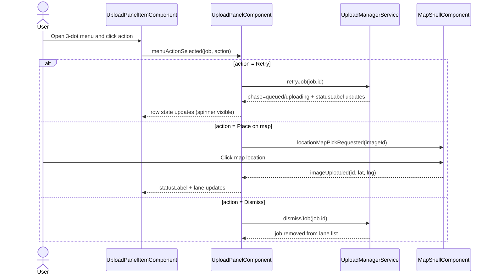
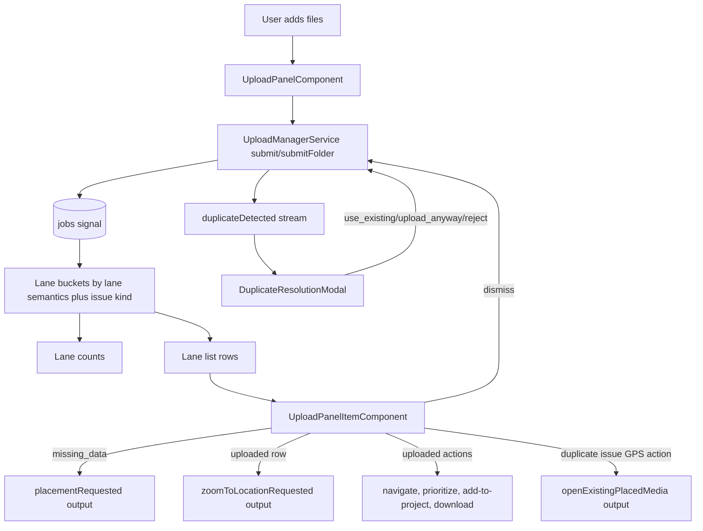
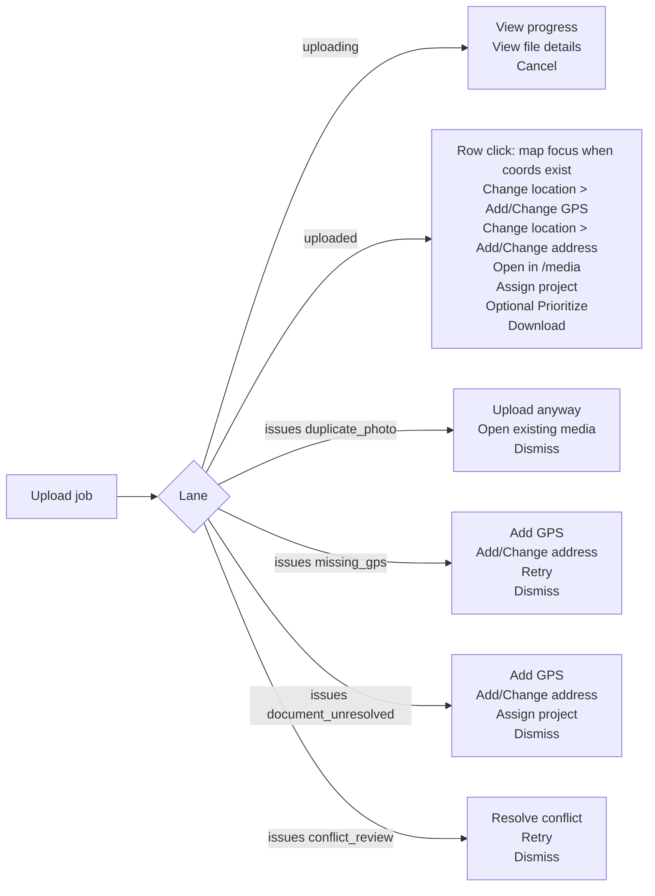
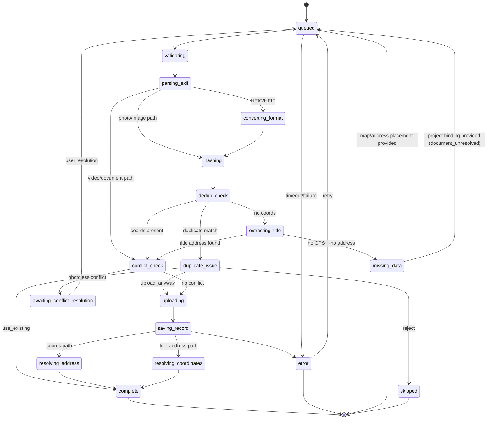
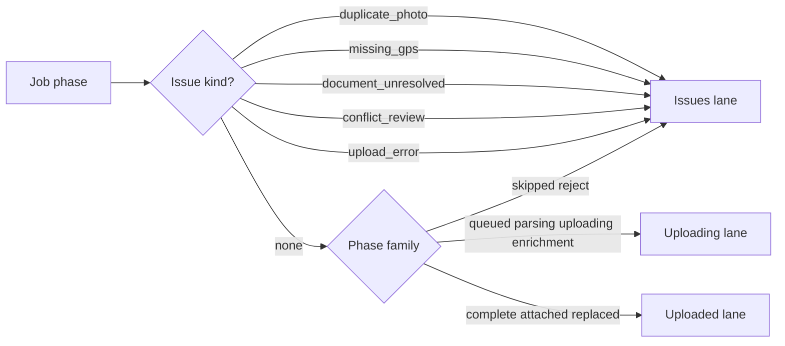
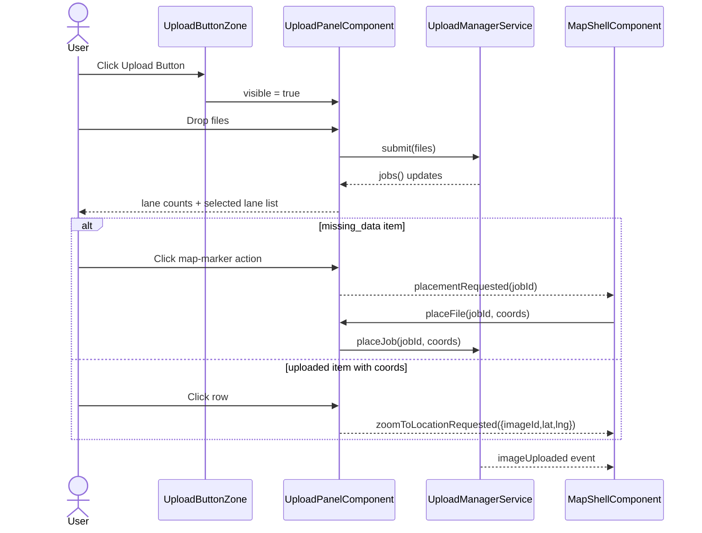

# Upload Panel

> **Related specs:** [media-renderer-system](media-renderer-system.md), [upload-manager](upload-manager.md), [file-type-chips](file-type-chips.md)

## What It Is

The Upload Panel is the compact upload workspace that appears from the Upload Button Zone. It lets users add mixed media files and triage uploads by state (uploading, uploaded, issues).

## What It Looks Like

The panel root is a single fixed-width section shell built from **3 vertically stacked blocks**. All blocks use the same left and right edges.

The root section is layout-only and intentionally unstyled: no padding, no border, no background, and no shadow. Visual container treatment belongs only to the inner blocks.

The shell itself is intentionally mostly transparent and acts as structure, not as a decorative card. The gaps between blocks are literal see-through spaces where the map/background behind the panel remains visible.

1. Intake Area (Upload zone + Folder upload button within the same container block).
2. Segmented switch / tab bar (`Uploading`, `Uploaded`, `Issues`).
3. File list stack.

These blocks are separated by a **vertical gap between distinct sections**. Separation is defined by real layout gap, not by decorative borders, separators, or fake divider surfaces.

The top section contains title/subtitle, the dashed Drop Zone, and the `Folder upload` button together in one shared full-width container card.

The Upload Zone instructional copy (title/subtitle/helper text) is persistent while the panel is open. It MUST NOT disappear due to drag state transitions, lane switches, or batch updates.

The segmented switch block comes directly after the gap.
That block has NO extra card/tile wrapper. The tab list itself (`ui-tab-list`) is the container.

- `Queue` (Uploading): Compact icon-only control (`cloud_upload`) with square footprint (control width equals control height).
- `Uploaded`: Compact icon-only control (`check_circle`) with square footprint (control width equals control height).
- `Issues`: Takes up the remaining available width (flex-grow) and contains both icon and text label; the key difference is content and width, not a separate base fill style.

The file list is a separate full-width block under the switch. File entries are stacked as individual full-width items with a gap between items.

Each media item row uses the same white/surface container treatment as other panel containers (`var(--color-bg-surface)`), with warning/error tint overlays per status state.

The lane item area uses a fully transparent overflow wrapper (no padding, no decorative surface) only for scrolling behavior. It shows up to 5 full rows at once; additional rows are reachable by internal scrolling. This applies equally to Queue, Uploaded, and Issues lanes.

When the 3-dot context menu is opened from a file item, the menu options must open **upwards** to avoid being clipped by the bottom of the map or panel overflow.

### Reference Structure (Contract)

```text
<UploadPanel>                          <!-- transparent wrapper, flex column, gap -->

  <IntakeArea>                         <!-- full width card, bg-surface, padding -->
    <UploadZone />
    <FolderUploadButton />
  </IntakeArea>

  <!-- gap (transparent to map) -->

  <SegmentedSwitch />                  <!-- ui-tab-list ONLY, no wrapping div -->
    <!-- Uploading (Icon only) -->
    <!-- Uploaded (Icon only) -->
    <!-- Issues (Icon + Text, flex grow) -->

  <!-- gap -->

  <FileItemStack>                      <!-- transparent overflow wrapper (max 5 items height) -->

    <FileItem />                       <!-- full width card, bg-surface, padding -->
    <!-- gap -->
    <FileItem state="error" />         <!-- error tint bg-surface, padding -->
    <!-- gap -->
    <FileItem />                       <!-- full width card, bg-surface, padding -->

  </FileItemStack>

</UploadPanel>
```

### Visual States (Mermaid)

```mermaid
stateDiagram-v2
    direction TB

    state FileItem {
        direction LR
        [*] --> default_item
        default_item --> uploading : phase='uploading'
        uploading --> complete : phase='complete'
        uploading --> missing_data : phase='missing_data'
        uploading --> error : phase='error'

        state default_item {
            bg: var(--color-bg-surface)
        }

        state complete {
            statusText: var(--color-success)
        }

        state missing_data {
            bg: var(--color-bg-surface) + warning tint
            statusText: var(--color-warning)
        }

        state error {
            bg: var(--color-bg-surface) + danger tint
            statusText: var(--color-danger)
        }
    }

    state SegmentedSwitch {
        [*] --> activeTab
        activeTab --> QueueTab
        activeTab --> UploadedTab
        activeTab --> IssuesTab

        state IssuesTab {
            [*] --> empty
            [*] --> attention
            empty : no items (default styles)
            attention : has items (tinted/distinguished style via .ui-tab--attention)
        }
    }
```

## Where It Lives

- **Parent**: Upload Button Zone in `MapShellComponent`
- **Component**: `UploadPanelComponent` at `features/upload/upload-panel/`
- **Appears when**: user toggles Upload Button open

## Feedback Triage (2026-03-30)

| Issue | Files involved | Possible solution (spec contract) | Priority |
| ----- | -------------- | --------------------------------- | -------- |
| Document `5._Minitest.pdf` reaches Uploaded despite meaningless title parsing | `apps/web/src/app/core/upload/upload-new-prepare-route.util.ts`, `apps/web/src/app/core/filename-parser.service.ts`, `apps/web/src/app/features/upload/upload-phase.helpers.ts` | Add filename-address confidence gate. Low-confidence title matches MUST NOT unlock upload completion; route to `issues: document_unresolved` with actionable resolution. | P0 |
| `Download` opens in browser tab instead of downloading | `apps/web/src/app/features/upload/upload-panel.component.ts`, `apps/web/src/app/core/upload/upload-manager.service.ts`, `apps/web/src/app/core/supabase.service.ts` | `Download` action MUST force attachment semantics (`Content-Disposition: attachment`) and trigger file download, never open inline preview tab. | P0 |
| `Choose project` UI quality is below toolbar dropdown quality | `apps/web/src/app/features/upload/upload-panel.component.html`, `apps/web/src/app/features/upload/upload-panel.component.ts`, `apps/web/src/app/shared/` | Reuse the same shared project-selection dropdown primitive/pattern used by toolbar project selection. Avoid feature-local degraded variant. | P1 |
| `Click on map` label is unclear for GPS correction | `apps/web/src/app/features/upload/upload-panel-item.component.ts`, `apps/web/src/app/features/upload/upload-panel-item.component.html`, `docs/i18n/translation-workbench.csv` | Replace label contract with contextual GPS wording: `Add GPS` when missing, `Change GPS` when existing coordinates are present. | P1 |
| `Add to project` is missing in some already-bound contexts | `apps/web/src/app/features/upload/upload-panel-item.component.ts`, `apps/web/src/app/features/upload/upload-panel.component.ts` | Keep project assignment action always available as `Assign project` (opens selector with current project preselected when already bound). | P1 |
| `Enter address` label is wrong when address already exists | `apps/web/src/app/features/upload/upload-panel-item.component.ts`, `docs/i18n/translation-workbench.csv` | Use contextual label contract: `Add address` when absent, `Change address` when present. | P1 |
| Changing address on uploaded photos can restart upload path | `apps/web/src/app/features/upload/upload-panel.component.ts`, `apps/web/src/app/features/map/map-shell/map-shell.component.ts`, `apps/web/src/app/core/upload/upload-manager.service.ts` | Persist location updates on existing media only; MUST call location update flow and MUST NOT requeue/reupload files. | P0 |
| Hover thumbnail preview is missing on media rows | `apps/web/src/app/features/upload/upload-panel-item.component.html`, `apps/web/src/app/features/upload/upload-panel-item.component.scss` | Enforce deterministic thumbnail rendering for rows with preview-capable media; hover must reveal media thumbnail reliably. | P1 |
| Segmented switch style mismatch (Queue/Uploaded should be icon-only square controls, Issues wider with icon+label) | `apps/web/src/app/features/upload/upload-panel.component.html`, `apps/web/src/app/features/upload/upload-panel.component.scss` | Lock segmented style contract: Queue/Uploaded remain icon-only with square footprint; Issues remains wider with icon+label. | P1 |
| Upload Zone text disappears intermittently | `apps/web/src/app/features/upload/upload-panel.component.html`, `apps/web/src/app/features/upload/upload-panel.component.ts` | Keep Upload Zone title/subtitle/helper text mounted and stable during all panel states. | P0 |

## Actions

| #    | User Action                                                     | System Response                                                                           | Triggers                                                   |
| ---- | --------------------------------------------------------------- | ----------------------------------------------------------------------------------------- | ---------------------------------------------------------- |
| 1    | Clicks Upload Button                                            | Opens compact Upload Panel container                                                      | `uploadPanelOpen` signal                                   |
| 2    | Drags files onto Drop Zone                                      | Creates upload jobs and starts pipeline (max 3 parallel)                                  | `UploadManagerService.submit()`                            |
| 3    | Clicks Drop Zone                                                | Opens file picker with multi-select                                                       | Native file picker                                         |
| 4    | Clicks Upload folder                                            | Starts folder scan then enqueues discovered files                                         | `UploadManagerService.submitFolder`                        |
| 4a   | Browser does not support folder import                          | `Upload folder` control remains visible but disabled with explanatory tooltip/text        | capability guard + UX fallback                             |
| 5    | Folder scan is running                                          | Shows scanning status line and disables folder action                                     | `activeBatch.status = 'scanning'`                          |
| 5b   | Folder name contains parseable address                          | Uses folder address as default location hint for queued files                             | folder-title parser in upload pipeline                     |
| 5c   | A file inside folder has its own parseable address              | File-level address overrides inherited folder address                                     | filename parser precedence                                 |
| 5d   | File/folder title contains low-confidence or nonsense address   | Address hint is recorded as note only; file stays unresolved and lands in Issues         | confidence gate before routing                             |
| 6    | Clicks Take Photo                                               | Opens camera-capable file capture path and submits captured file                          | Native capture input                                       |
| 6b   | Uploads DOCX/XLSX/PPTX/ODT/ODS/ODP/ODG/TXT/CSV/PDF              | File is accepted and classified as `document`; if no GPS/address exists it enters Issues  | `UploadService.validateFile()` + location-context gate     |
| 6c   | Document has no GPS and no parseable address                    | Item stays in Issues with status `Choose location or project`                             | issue kind `document_unresolved`                           |
| 7    | Viewer attempts upload action                                   | Upload is denied by RLS; UI shows permission error feedback                               | Supabase policy deny                                       |
| 9    | Active or queued jobs exist                                     | Shows segmented lane switch under Drop Zone                                               | `jobs().length > 0`                                        |
| 10   | Switches segmented control to Queue (`uploading`)               | Lane list filters to upload pipeline jobs only                                            | `selectedLane = 'uploading'`                               |
| 11   | Switches segmented control to Uploaded                          | Lane list filters to completed jobs                                                       | `selectedLane = 'uploaded'`                                |
| 12   | Switches segmented control to Issues                            | Lane list filters to problematic jobs                                                     | `selectedLane = 'issues'`                                  |
| 13   | Clicks map-marker icon in Issues row (`missing_data`)           | Emits placement request to map shell                                                      | `placementRequested.emit(jobId)`                           |
| 14   | Clicks row in Issues lane (`missing_data`)                      | Enters placement mode from map shell                                                      | `placementRequested.emit(jobId)`                           |
| 15   | Clicks row in Uploaded lane with coords                         | Requests map zoom to uploaded media location                                              | `zoomToLocationRequested.emit({ imageId, lat, lng })`      |
| 15a  | Opens uploaded row action menu                                  | Shows follow-up actions based on saved media state and workflow capability                | derived from `imageId`, `projectId`, coords, feature flags |
| 15b  | Job has EXIF and textual address mismatch (>15m)                | Row remains uploaded but carries mismatch indicator for detail follow-up                  | location reconciliation state                              |
| 15c  | Duplicate hash issue row shows secondary GPS button             | Clicking button opens/focuses the already placed existing media                           | duplicate target image reference                           |
| 15d  | Duplicate hash issue detected                                   | Opens duplicate-resolution modal with `use existing`, `upload anyway`, `reject`           | Optional apply-to-batch checkbox                           |
| 15e  | Address parser found unresolved address fragments               | Row shows subtle address-note indicator and links to detail evidence section              | No parsing info is dropped                                 |
| 15f  | Chooses `Assign project` on uploaded item                       | Opens project selector (shared toolbar dropdown pattern), supports assign and reassign     | persisted media; current project preselected when present  |
| 15g  | Chooses `Prioritize` on uploaded item                           | Marks or queues the saved media item for prioritized follow-up                            | project/workflow integration                               |
| 15h  | Chooses `Open in /media` on uploaded item                       | Navigates to `/media` and focuses or filters the persisted media item                     | router navigation with media context                       |
| 15i  | Chooses `Open project` on uploaded item                         | Navigates to the bound project when the upload already belongs to one                     | only when `projectId` exists on job/media                  |
| 15j  | Chooses `Change location` on uploaded item                      | Opens suboptions for location correction                                                  | grouped action section in row context menu                 |
| 15j1 | Chooses `Add GPS` or `Change GPS`                               | Enters map-pick mode and persists clicked coordinates for the saved media item            | label depends on whether coordinates exist                 |
| 15j2 | Chooses `Add address` or `Change address`                       | Opens taller address-finder overlay with search input and suggestions list                | label depends on whether address exists                    |
| 15j3 | Hovers an address suggestion                                    | Shows preview pin on map at suggestion coordinates                                        | preview clears when hover ends or dialog closes            |
| 15j4 | Selects an address suggestion                                   | Persists address + coordinates and refreshes marker position                              | same `resolve_media_location` contract                     |
| 15k  | Chooses `Download` on uploaded item                             | Forces file download with attachment semantics; never opens inline browser tab            | persisted storage path required                            |
| 15l  | Chooses `Assign project` on document issue row                  | Binds or rebinds the document to a project and moves it to Uploaded lane                  | project-bound document resolution path                     |
| 15m  | Chooses `Add GPS/Change GPS` or `Add address/Change address` on document issue row | Persists location context and moves item to Uploaded lane                                 | same resolver contract as uploaded location edits          |
| 15n  | Opens 3-dot menu on issue row                                   | Shows only issue-kind-specific options plus one destructive final action                  | contract matrix by `issueKind`                             |
| 16   | Clicks dismiss icon on terminal row                             | Removes row from queue/history                                                            | `UploadManagerService.dismissJob()`                        |
| 17   | Switches into empty lane                                        | Lane stays selected even with zero items                                                  | `selectedLane` signal                                      |
| 18   | Closes panel                                                    | Panel collapses; uploads continue in background                                           | Root service lifecycle                                     |
| 19   | Uses compact map-overlay panel                                  | Per-row interactions are menu-first; no row-selection checkboxes are shown                | compact mode (`embeddedInPane = false`)                    |
| 20   | Uses embedded panel in Workspace Upload tab                     | Row-selection checkboxes appear on hover/focus for multi-select workflows                 | embedded mode (`embeddedInPane = true`)                    |
| 21   | Selects upload rows in embedded mode                            | Bottom toolbar appears with retry/download/remove/clear selection actions                 | `selectedUploadJobIds.size > 0`                            |
| 22   | Uses bulk remove in embedded mode                               | Active jobs are cancelled; terminal jobs are dismissed from the list                      | `cancelJob` + `dismissJob` dispatch                        |
| 23   | Opens 3-dot menu in any lane row                                | Bottom menu item is always destructive, separated by a divider                            | row action menu contract                                   |
| 24   | Uses destructive 3-dot action on active upload row              | Label is `Cancel upload`; operation cancels active/pending job                            | `UploadManagerService.cancelJob()`                         |
| 25   | Uses destructive 3-dot action on uploaded row                   | Label is `Remove from project`; operation removes item from project context               | project-bound persisted media contract                     |
| 26   | Uses destructive 3-dot action on issue/failed row               | Label is `Dismiss`; operation dismisses terminal issue row                                | `UploadManagerService.dismissJob()`                        |
| 27   | Lane contains more than 5 rows                                  | List remains constrained to 5 visible rows and scrolls internally via transparent wrapper | lane overflow wrapper contract                             |

## Lane Item Features

| Lane                                       | Availability                                                 | Item Actions                                                                                                                                                 | Notes                                                                                                                                                      |
| ------------------------------------------ | ------------------------------------------------------------ | ------------------------------------------------------------------------------------------------------------------------------------------------------------ | ---------------------------------------------------------------------------------------------------------------------------------------------------------- |
| `uploading`                                | queued, parsing, validating, uploading, saving, enrichment   | `View progress`, `View file details`, `Cancel upload`                                                                                                        | No navigation to saved media targets before persistence is complete                                                                                        |
| `uploaded`                                 | persisted uploads and attachments with successful completion | `Change location > Add/Change GPS`, `Change location > Add/Change address`, `Open in /media`, `Assign project`, `Download`, optional `Prioritize` | Row click performs map focus only when coordinates exist; `Assign project` supports assign/reassign in one flow; `Prioritize` appears only when capability is enabled |
| `issues: duplicate_photo`                  | dedupe review                                                | `Open existing media`, `Upload anyway`, `Dismiss`                                                                                                            | `Upload anyway` only for duplicate-photo rows                                                                                                              |
| `issues: missing_gps`                      | GPS/manual placement needed                                  | `Add GPS`, `Add/Change address`, `Retry`, `Dismiss`                                                                                                          | `Retry` re-queues only when retry preconditions are met                                                                                                    |
| `issues: document_unresolved`              | document without GPS/address                                 | `Add GPS`, `Add/Change address`, `Assign project`, `Dismiss`                                                                                                 | `Assign project` resolves geospatially missing documents as project-bound artifacts                                                                        |
| `issues: conflict_review` / `upload_error` | conflict or hard error                                       | `Retry`, `Dismiss`                                                                                                                                           | No force-upload actions in these issue kinds                                                                                                               |

Row state rendering requirements:

- Each lane item uses a white/surface background (`var(--color-bg-surface)`), with status tints for error/warning states.
- During active upload and retry transitions, the thumbnail area shows an overlaid spinning loading indicator.
- Rows with preview-capable media always render deterministic thumbnail previews; hover MUST NOT collapse to empty placeholders.
- Row status text must update live as phase/statusLabel changes (including retry re-queue and upload progression).
- `document_unresolved` issue rows show status text `Choose location or project` (or localized equivalent) until resolved.

### Status Text Contract

| Phase / Issue Kind                            | Required status text (English fallback)      | Lane        | Notes                                      |
| --------------------------------------------- | -------------------------------------------- | ----------- | ------------------------------------------ |
| `queued`                                      | `Queued`                                     | `uploading` | Initial queued and post-resolution requeue |
| `validating`                                  | `Validating…`                                | `uploading` | File checks                                |
| `parsing_exif` / `extracting_title`           | `Reading metadata…` / `Checking filename…`   | `uploading` | Metadata context build                     |
| `hashing` / `dedup_check`                     | `Computing hash…` / `Checking duplicates…`   | `uploading` | Photo-only dedupe path                     |
| `uploading` / `saving_record`                 | `Uploading…` / `Saving…`                     | `uploading` | Persist path                               |
| `resolving_address` / `resolving_coordinates` | `Resolving address…` / `Resolving location…` | `uploading` | Enrichment path                            |
| `awaiting_conflict_resolution`                | `Waiting for decision…`                      | `issues`    | Conflict review hold                       |
| `missing_data` + `missing_gps`                | `Choose location`                            | `issues`    | Requires GPS/address placement             |
| `missing_data` + `document_unresolved`        | `Choose location or project`                 | `issues`    | Resolvable by location or project binding  |
| `skipped` + `duplicate_photo`                 | `Already uploaded`                           | `issues`    | Duplicate review entry                     |
| `error`                                       | `Upload failed`                              | `issues`    | Retry path allowed when supported          |
| `complete`                                    | `Uploaded`                                   | `uploaded`  | Terminal success                           |

### Media Item Menu Contract

| Lane / Issue Kind                           | Non-destructive actions                                                                                                                    | Destructive action (last item) | Destructive styling       |
| ------------------------------------------- | ------------------------------------------------------------------------------------------------------------------------------------------ | ------------------------------ | ------------------------- |
| `uploading`                                 | `View progress`, `View file details`                                                                                                       | `Cancel upload`                | danger text + danger icon |
| `uploaded` (with or without project binding) | `Change location > Add/Change GPS`, `Change location > Add/Change address`, `Open in /media`, `Assign project`, optional `Prioritize`, `Download` | `Remove from project` when project-bound; otherwise `Dismiss` | danger text + danger icon |
| `issues: duplicate_photo`                   | `Open existing media`, `Upload anyway`                                                                                                     | `Dismiss`                      | danger text + danger icon |
| `issues: missing_gps`                       | `Add GPS`, `Add/Change address`, `Retry`                                                                                                   | `Dismiss`                      | danger text + danger icon |
| `issues: document_unresolved`               | `Add GPS`, `Add/Change address`, `Assign project`                                                                                           | `Dismiss`                      | danger text + danger icon |
| `issues: conflict_review` or `upload_error` | `Retry`                                                                                                                                    | `Dismiss`                      | danger text + danger icon |

### Action Label Contract

| Action family | Label when value missing | Label when value already exists |
| ------------- | ------------------------ | ------------------------------- |
| GPS action | `Add GPS` | `Change GPS` |
| Address action | `Add address` | `Change address` |
| Project action | `Assign project` | `Assign project` (opens preselected current project) |

### Media Item Action Wiring (Mermaid)



## Destructive Menu Convention

The row 3-dot menu always ends with exactly one destructive entry, and this entry is always visually separated by a divider.

| Row State                        | Bottom destructive label | Required operation                              |
| -------------------------------- | ------------------------ | ----------------------------------------------- |
| Active upload (`uploading` lane) | `Cancel upload`          | `cancelJob(jobId)`                              |
| Uploaded (`uploaded` lane)       | `Remove from project`    | remove project-bound media from project context |
| Issue or failed (`issues` lane)  | `Dismiss`                | `dismissJob(jobId)`                             |

Notes:

- Compact mode and embedded mode share the same destructive naming convention.
- `Upload anyway` is a non-destructive duplicate-resolution action and MUST NOT replace the destructive bottom item.
- The destructive menu item (`Dismiss`, `Cancel upload`, `Remove from project`) uses danger styling for label and icon.

## Component Hierarchy

**STRICT PRIMITIVE REQUIREMENT:** This component and all its children must explicitly use the standardized layout primitives from `src/styles/primitives/container.scss`. Do not introduce custom wrapper `div`s for basic flex or grid layouts. Use flatter DOM structures. The lane list items MUST use `.ui-item` without modifying its base geometry. The root `UploadPanel` section MUST remain unstyled and must not be rendered as a `.ui-container` surface.

```text
UploadPanel                                              ← compact fixed-width unstyled wrapper from button morph
├── UploadArea                                            ← full width block
│   ├── PanelHeader                                      ← title + subtitle
│   └── DropZone                                         ← dashed drag target + file type chips
├── FolderUploadButton                                    ← full width block under UploadArea
├── SegmentedSwitchBlock                                  ← full width block under FolderUploadButton
│   └── LaneSwitch                                       ← Uploading / Uploaded / Issues
├── [scanning] ScanStatus                                ← "Scanning folder..." feedback row
├── [queue or active exists] SegmentedSwitchBlock        ← lane switch under folder button
├── [selected lane has items] FileItemStack              ← full width block under segmented switch
│   ├── LaneOverflowWrapper                               ← fully transparent, no padding, overflow-only scroll helper
│   │   └── LaneList
│   │       └── UploadPanelItem × N                      ← full width items stacked with gap between items
│       ├── [compact overlay only] No selection checkbox
│       └── [embedded mode only] HoverSelectionCheckbox
├── [embedded mode AND selection > 0] UploadSelectionFooter (`app-pane-footer`)
│   ├── SelectedCount
│   ├── RetrySelectionAction
│   ├── DownloadSelectionAction
│   ├── RemoveSelectionAction
│   └── ClearSelectionAction
├── [duplicate issue selected] DuplicateResolutionModal  ← standardized modal primitive
│   └── ApplyToBatchCheckbox
└── [selected lane empty] No list rows
```

## Data

### Data Flow (Mermaid)



### Lane Actions (Mermaid)



### Change Location Flow (Mermaid)

```mermaid
sequenceDiagram
  actor User
  participant Row as UploadPanelItem
  participant Panel as UploadPanelComponent
  participant Map as MapShellComponent
  participant DB as resolve_media_location RPC

  User->>Row: Context menu > Change location
  alt Add/Change GPS
    Row->>Panel: change_location_map(imageId)
    Panel->>Map: locationMapPickRequested(imageId)
    User->>Map: Click map
    Map->>DB: persist(latitude, longitude, address)
    Map-->>Panel: imageUploaded(id, lat, lng)
  else Add/Change address
    Row->>Panel: change_location_address(imageId)
    User->>Panel: Types search text
    Panel-->>User: Suggestions under input
    User->>Panel: Hover Suggestion
    Panel->>Map: locationPreviewRequested(lat, lng)
    User->>Panel: Click suggestion
    Panel->>DB: persist(latitude, longitude, address)
    Panel->>Map: imageUploaded(id, lat, lng)
  end
  Note over Panel,DB: Persisted media location update only; do not requeue upload pipeline
```

| Field                   | Source                                      | Type                                                                                                         |
| ----------------------- | ------------------------------------------- | ------------------------------------------------------------------------------------------------------------ |
| Upload jobs             | `UploadManagerService.jobs()`               | `Signal<UploadJob[]>`                                                                                        |
| Active batch            | `UploadManagerService.activeBatch()`        | `Signal<UploadBatch \| null>`                                                                                |
| Folder address hint     | Upload pipeline folder-title parsing        | `string \| null`                                                                                             |
| Last completed batch    | `UploadPanelComponent.lastCompletedBatch()` | `Computed<UploadBatch \| null>`                                                                              |
| Lane buckets            | `UploadPanelComponent.laneBuckets()`        | `Computed<Record<UploadLane, UploadJob[]>>`                                                                  |
| Lane counts             | `UploadPanelComponent.laneCounts()`         | `Computed<{ uploading:number; uploaded:number; issues:number }>`                                             |
| Selected lane items     | `UploadPanelComponent.laneJobs()`           | `Computed<UploadJob[]>`                                                                                      |
| Selected upload rows    | `UploadPanelComponent.selectedUploadJobIds` | `WritableSignal<Set<string>>`                                                                                |
| Accepted MIME set       | `UploadService.validateFile()`              | Runtime validation                                                                                           |
| Document fallback badge | `documentFallbackLabel(job)`                | `string \| null`                                                                                             |
| Location mismatch flag  | Upload pipeline EXIF/text reconciliation    | `boolean`                                                                                                    |
| Duplicate issue flag    | Upload pipeline dedupe decision flow        | `boolean`                                                                                                    |
| Duplicate target image  | Duplicate detection payload                 | `string \| null`                                                                                             |
| Address parsing notes   | Upload parser residual fragments            | `string[]`                                                                                                   |
| Thumbnail overlay state | Upload row presenter                        | `Computed<'none' \| 'spinner'>`                                                                              |
| Placement handoff       | `placementRequested` output                 | `jobId`                                                                                                      |
| Item action set         | upload row presenter                        | `UploadItemAction[]`                                                                                         |
| Issue kind              | upload lane mapping                         | `'duplicate_photo' \| 'missing_gps' \| 'document_unresolved' \| 'conflict_review' \| 'upload_error' \| null` |

### Status Mapping (Mermaid)



### Lane Semantics (Mermaid)



## State

| Name                            | Type                                                             | Default       | Controls                                                                                                                                   |
| ------------------------------- | ---------------------------------------------------------------- | ------------- | ------------------------------------------------------------------------------------------------------------------------------------------ |
| `isDragging`                    | `WritableSignal<boolean>`                                        | `false`       | Drop Zone hover treatment                                                                                                                  |
| `selectedLane`                  | `WritableSignal<'uploading' \| 'uploaded' \| 'issues'>`          | `'uploading'` | Which lane list is visible                                                                                                                 |
| `issueAttentionPulse`           | `WritableSignal<boolean>`                                        | `false`       | Temporary attention pulse on Issues lane button                                                                                            |
| `scanningLabel`                 | `Computed<string \| null>`                                       | `null`        | Folder-scan feedback text                                                                                                                  |
| `laneBuckets`                   | `Computed<Record<UploadLane, UploadJob[]>>`                      | empty buckets | Single source for list + tab counts                                                                                                        |
| `laneCounts`                    | `Computed<{ uploading:number; uploaded:number; issues:number }>` | zeros         | Counts rendered in segmented tabs                                                                                                          |
| `issueKind`                     | `Computed<UploadIssueKind \| null>`                              | `null`        | Determines row actions inside the Issues lane (`duplicate_photo`, `missing_gps`, `document_unresolved`, `conflict_review`, `upload_error`) |
| `availableActions`              | `Computed<UploadItemAction[]>`                                   | `[]`          | Per-row action menu in any lane                                                                                                            |
| `thumbnailOverlayState`         | `Computed<'none' \| 'spinner'>`                                  | `'none'`      | Spinner overlay visibility for uploading/retrying rows                                                                                     |
| `selectedUploadJobIds`          | `WritableSignal<Set<string>>`                                    | empty set     | Embedded-mode row selection for workspace bulk actions                                                                                     |
| `laneViewportMaxRows`           | `number`                                                         | `5`           | Maximum simultaneously visible lane rows before internal scrolling                                                                         |
| `useTransparentOverflowWrapper` | `boolean`                                                        | `true`        | Enables dedicated transparent, padding-free wrapper for lane scrolling only                                                                |

## File Map

| File                                                       | Purpose                                                              |
| ---------------------------------------------------------- | -------------------------------------------------------------------- |
| `features/upload/upload-panel/upload-panel.component.ts`   | Upload panel orchestration, lane filters, row actions                |
| `features/upload/upload-panel/upload-panel.component.html` | Compact panel UI: drop zone, segmented switch, lane list             |
| `features/upload/upload-panel/upload-panel.component.scss` | Lane switch visuals, transparent section surfaces, status tokens     |
| `core/upload/upload-manager.service.ts`                    | Root upload lifecycle, per-job phases, batch tracking, event streams |
| `features/map/map-shell/map-shell.component.ts`            | Consumes placement and zoom outputs from the panel                   |

## Wiring

### Wiring Flow (Mermaid)



- Receives visibility from `MapShellComponent` and uses parent-controlled open/close behavior.
- Injects `UploadManagerService` to submit files and read reactive job/batch state.
- Uses one canonical intake pipeline for picker, drop, folder, and capture file sources.
- Keeps lane filters stable and deterministic as jobs move through phases.
- Emits placement and zoom intents to `MapShellComponent` through dedicated outputs.
- Keeps lane selection stable, including empty lanes.
- Surfaces RLS permission denies as user-facing feedback while relying on backend enforcement.

## Acceptance Criteria

- [ ] Panel appears as compact container expansion from Upload Button
- [x] Top section is a Drop Zone with drag-and-drop and click upload
- [x] `Upload folder` action is always visible in intake area
- [x] When folder import is unsupported, `Upload folder` is disabled and shows fallback guidance
- [x] Folder scan shows progress text and disables repeat folder action while scanning
- [x] Take Photo action opens capture-capable intake and submits into the same upload pipeline
- [ ] Folder uploads inherit folder-name address as default location hint when files do not provide their own title address.
- [ ] File-level title address overrides inherited folder-level address.
- [ ] If queue has jobs, segmented lane switch appears under Drop Zone
- [x] Lane switch contains exactly 3 options: Queue (`uploading`), Uploaded, Issues
- [x] Clicking a lane filters visible image list to that lane only
- [x] Queue and Uploaded lane buttons are icon-only controls with square footprint (width equals height)
- [x] Issues lane button uses icon+label content and a wider footprint (flex-grow) than Queue/Uploaded
- [x] Segmented switch block is full width and shares the same left/right edges as upload area and folder button
- [x] Segmented switch block has no additional tile/card shell around it; the tab list itself is the only visual container
- [x] Lane list uses a fully transparent, padding-free overflow wrapper for scrolling only
- [x] Queue/Uploaded/Issues lane lists show max 5 rows and scroll internally when more rows exist
- [ ] File list block is full width and shares the same left/right edges as upload area and folder button
- [ ] Lane list item surfaces use white/surface background (`var(--color-bg-surface)`) with state-aware warning/error tinting
- [ ] Gap between lane items is visually see-through
- [ ] File items are separated by vertical gap (not by table-like borders)
- [ ] Distinct panel blocks are separated by layout gap between sections (not by decorative separators)
- [ ] Upload panel shell remains mostly transparent; block gaps are literal see-through spaces to the map/background behind
- [x] Compact intake layout does not render a `No uploads yet` placeholder block
- [ ] Compact map-overlay panel keeps row actions menu-first and does not render selection checkboxes
- [ ] Embedded workspace panel reveals row-selection checkbox on hover/focus for eligible rows
- [x] Embedded workspace panel shows bottom selection toolbar only when one or more rows are selected
- [ ] Embedded selection toolbar provides retry/download/remove/clear actions with lane-safe behavior
- [x] 3-dot row menu always contains a divider followed by exactly one destructive bottom action
- [x] Destructive bottom action label is state-dependent: `Cancel upload` (active), `Remove from project` (uploaded), `Dismiss` (issues/failed)
- [ ] Destructive bottom action uses danger styling for both label and icon
- [x] Clicking the map-marker action on a `missing_data` row emits a placement request
- [x] Clicking an uploaded row with coordinates emits a zoom-to-location request
- [ ] Uploaded rows expose `Assign project` in all states (assign and reassign through one selector flow)
- [ ] Project assignment UI in upload panel reuses the same shared dropdown primitive/pattern as toolbar project selection
- [x] Uploaded rows expose `Prioritize` for saved media follow-up workflows
- [x] Uploaded rows expose `Open in /media`, `Change location`, and `Download` when persisted media data is available
- [ ] `Change location` exposes exactly two suboptions with contextual labels: `Add/Change GPS` and `Add/Change address`
- [x] `Add/Change address` opens a vertically extended address-finder overlay with suggestions under the input
- [x] Hovering a location suggestion previews that location on the map without committing the update
- [x] Selecting a location suggestion persists both address and coordinates for the media item
- [ ] `Add/Change GPS` enters map-pick mode and commits the clicked location for the selected media item
- [ ] Location edits on already uploaded media never trigger re-upload or re-queue; they update persisted media location only
- [ ] `Download` always triggers file download behavior and never opens inline browser preview tabs
- [ ] Uploaded rows with EXIF/text mismatch (>15m) expose a clear mismatch indicator for follow-up in media details.
- [ ] Duplicate-photo rows are shown in Issues and expose a secondary GPS action to open the existing placed media.
- [ ] Duplicate-resolution modal appears for duplicate-photo issues with `use existing`, `upload anyway`, and `reject` options.
- [ ] Duplicate-resolution modal provides "apply to all matching items in this batch" behavior.
- [x] Non-photo/video documents without GPS and without parseable address land in Issues as `document_unresolved`.
- [x] `document_unresolved` rows show status text `Choose location or project` (localized fallback allowed).
- [ ] `document_unresolved` row menu exposes exactly `Add GPS`, `Add/Change address`, and `Assign project` before the destructive action.
- [ ] Choosing `Add GPS`, `Add/Change address`, or `Assign project` from `document_unresolved` resolves the item and moves it to Uploaded lane.
- [x] Issue-row menu visibility is strict by `issueKind` (no cross-kind leakage of actions).
- [x] Uploaded-row menu exposes `Prioritize` only when priority workflow capability is enabled.
- [x] Phase and issue status texts follow the status-text contract for every lane transition.
- [x] `Upload anyway` is available only for duplicate-photo issue rows, never for GPS issue rows
- [x] GPS issue rows expose placement-oriented actions instead of force-upload actions
- [x] `Retry` action in row menu is operational and re-queues eligible issue rows into uploading flow
- [x] `Place on map` action in row menu is operational for placement-related issue rows
- [x] Uploading/retrying rows show a spinning loading indicator overlay over the thumbnail
- [ ] Hovering media rows with available previews always shows a stable thumbnail/media preview (no blank hover state)
- [ ] Row status text updates live while retrying and uploading phases progress
- [ ] Jobs with unresolved address fragments expose an address-note indicator that leads to detail evidence rows.
- [x] Lane tabs display live counts derived from the same lane bucket data as the list
- [ ] Users can switch to an empty lane and keep that lane selected
- [ ] Closing panel does not cancel active uploads
- [ ] Viewer upload attempts are blocked by RLS and shown as a clear error state
- [x] Upload intake accepts office documents (`.doc`, `.docx`, `.odt`, `.odg`, `.xls`, `.xlsx`, `.ods`, `.ppt`, `.pptx`, `.odp`) plus `.txt` and `.csv` in addition to photo/video/PDF types
- [ ] Document uploads without preview show deterministic type fallback badge (`DOC`, `DOCX`, `ODT`, `ODG`, `TXT`, `XLS`, `XLSX`, `ODS`, `CSV`, `PPT`, `PPTX`, `ODP`, `PDF`)
- [ ] Upload Zone instructional text remains visible and stable across drag states, lane switches, and queue updates while panel is open
- [x] Panel root section is layout-only (no padding, border, background, or shadow); inner blocks carry container styling.
- [ ] Panel rigidly adheres to `.ui-item` class primitives for list rendering geometry.
- [ ] Visual state changes (hover, active, selected) do NOT impact layout geometry or spacing.
