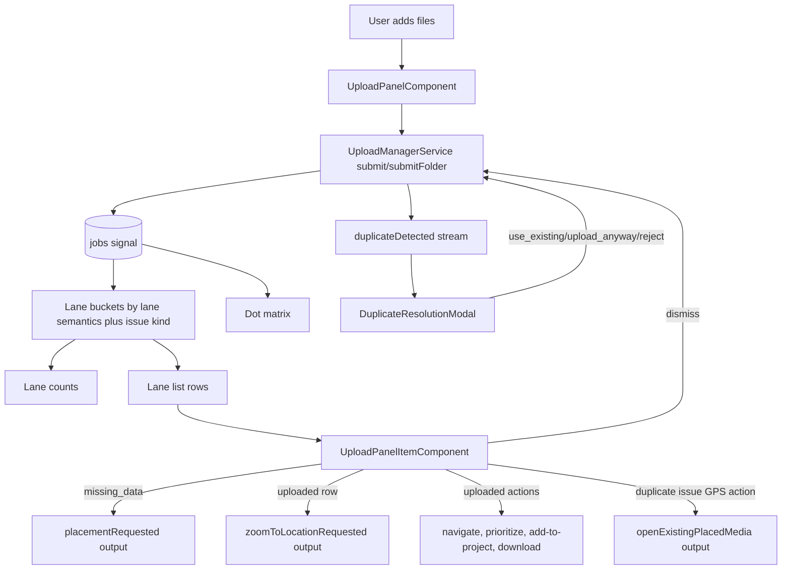
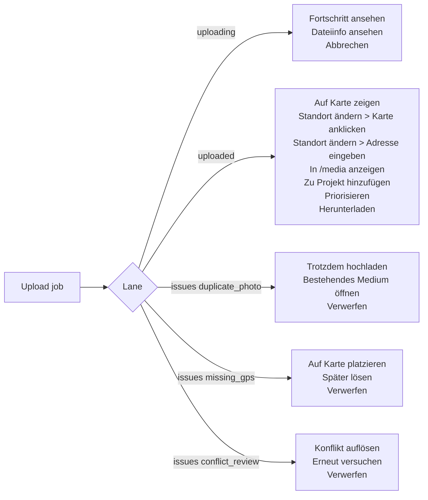
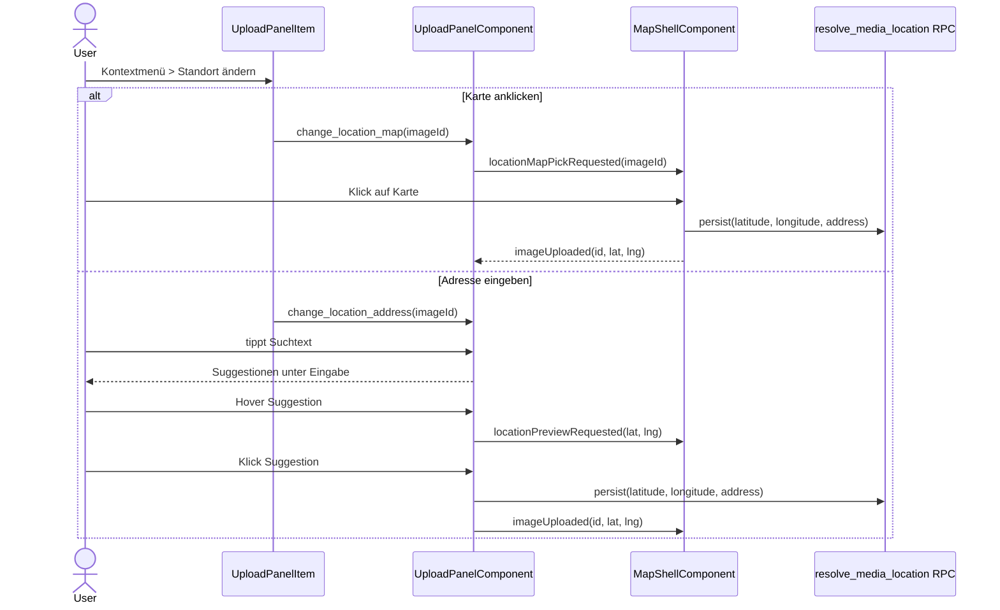
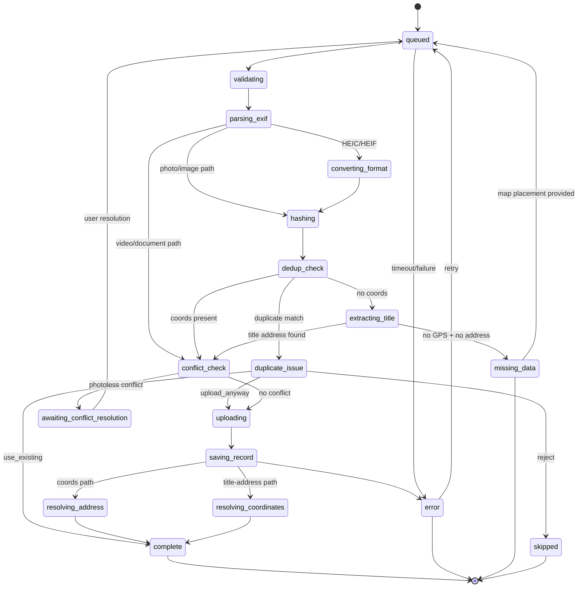
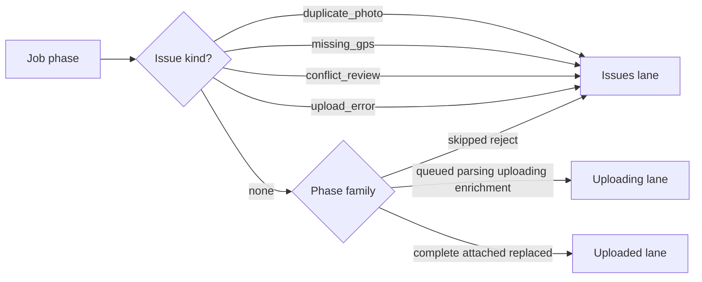
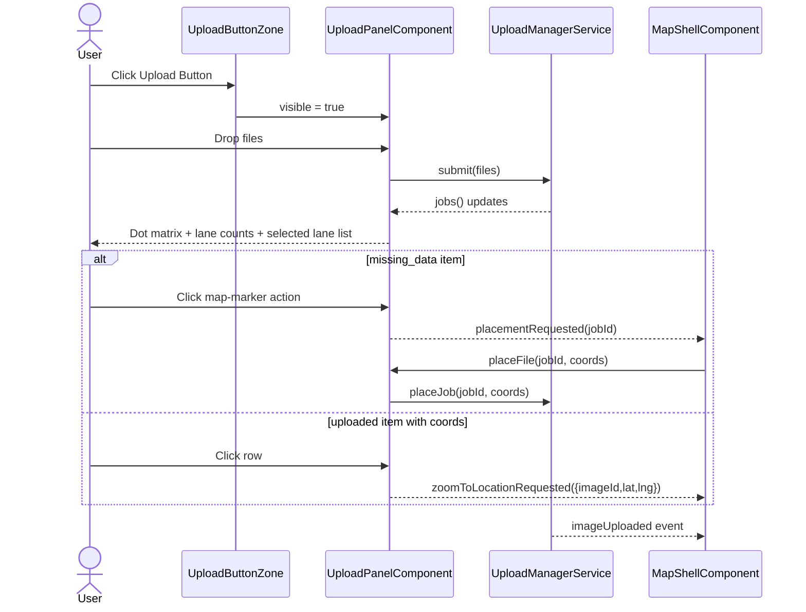

# Upload Panel

> **Related specs:** [media-renderer-system](media-renderer-system.md), [upload-manager](upload-manager.md), [file-type-chips](file-type-chips.md)

## What It Is

The Upload Panel is the compact upload workspace that appears from the Upload Button Zone. It lets users add mixed media files, watch per-file progress in a dot matrix, and triage uploads by state (uploading, uploaded, issues).

## What It Looks Like

The panel is a single `.ui-container` surface that feels like the button expanded into a small control card. The top section is a dashed Drop Zone, followed by a Last Upload summary when no active queue exists. When uploads are running, a progress board appears under the Drop Zone with a dense dot matrix and a segmented 3-option switch.

Primary upload intake supports photos, videos, PDFs, office documents (`.doc`, `.docx`, `.odt`, `.odg`, `.xls`, `.xlsx`, `.ods`, `.ppt`, `.pptx`, `.odp`), plain text (`.txt`), and CSV (`.csv`). Document-like files render thumbnail previews as generated cover snapshots when available; otherwise they fall back to deterministic type icons (`DOC`, `DOCX`, `ODT`, `ODG`, `TXT`, `XLS`, `XLSX`, `ODS`, `CSV`, `PPT`, `PPTX`, `ODP`, `PDF`) in lane rows. For folder uploads, a parseable address in the folder name acts as the default location hint for all files unless a file provides its own parseable address in its name.

The matrix defaults to a square board using up to 10 columns by 10 rows per visible page; each dot is 0.5rem (8px) with 0.25rem (4px) gap. Dot colors use design tokens: idle/queued `--color-bg-muted`, uploading `--color-primary` with pulse, uploaded `--color-success`, and issue `--color-warning`.

## Where It Lives

- **Parent**: Upload Button Zone in `MapShellComponent`
- **Component**: `UploadPanelComponent` at `features/upload/upload-panel/`
- **Appears when**: user toggles Upload Button open

## Actions

| #   | User Action                                           | System Response                                                                 | Triggers                                                |
| --- | ----------------------------------------------------- | ------------------------------------------------------------------------------- | ------------------------------------------------------- |
| 1   | Clicks Upload Button                                  | Opens compact Upload Panel container                                            | `uploadPanelOpen` signal                                |
| 2   | Drags files onto Drop Zone                            | Creates upload jobs and starts pipeline (max 3 parallel)                        | `UploadManagerService.submit()`                         |
| 3   | Clicks Drop Zone                                      | Opens file picker with multi-select                                             | Native file picker                                      |
| 4   | Clicks Select Folder (when supported)                 | Starts folder scan then enqueues discovered files                               | `UploadManagerService.submitFolder`                     |
| 5   | Folder scan is running                                | Shows scanning status line and disables folder action                           | `activeBatch.status = 'scanning'`                       |
| 5b  | Folder name contains parseable address                | Uses folder address as default location hint for queued files                   | folder-title parser in upload pipeline                  |
| 5c  | A file inside folder has its own parseable address    | File-level address overrides inherited folder address                           | filename parser precedence                              |
| 6   | Clicks Take Photo                                     | Opens camera-capable file capture path and submits captured file                | Native capture input                                    |
| 6b  | Uploads DOCX/XLSX/PPTX/ODT/ODS/ODP/ODG/TXT/CSV        | File is accepted, classified as `document`, and queued for preview generation   | `UploadService.validateFile()` + preview worker         |
| 7   | Viewer attempts upload action                         | Upload is denied by RLS; UI shows permission error feedback                     | Supabase policy deny                                    |
| 8   | No active jobs and no queued jobs                     | Shows Last Upload summary line                                                  | `lastCompletedBatch()`                                  |
| 9   | Active or queued jobs exist                           | Shows dot matrix board under Drop Zone                                          | `jobs().length > 0`                                     |
| 10  | Job is queued / not started                           | Dot stays muted gray                                                            | Job phase in queued/parsing/hashing                     |
| 11  | Job is actively uploading                             | Dot turns blue and pulses while in-flight                                       | Job phase `uploading`                                   |
| 12  | Job succeeds                                          | Dot turns green                                                                 | Job phase `complete`                                    |
| 13  | Job has issue (GPS/title/address resolution etc.)     | Dot turns orange and becomes selectable in Errors view                          | Job phase `error`, `missing_data`, or `duplicate_issue` |
| 14  | Switches segmented control to Uploading               | Lane list filters to active jobs only                                           | `selectedLane = 'uploading'`                            |
| 15  | Switches segmented control to Uploaded                | Lane list filters to completed jobs                                             | `selectedLane = 'uploaded'`                             |
| 16  | Switches segmented control to Issues                  | Lane list filters to problematic jobs                                           | `selectedLane = 'issues'`                               |
| 17  | Clicks map-marker icon in Issues row (`missing_data`) | Emits placement request to map shell                                            | `placementRequested.emit(jobId)`                        |
| 18  | Clicks row in Issues lane (`missing_data`)            | Enters placement mode from map shell                                            | `placementRequested.emit(jobId)`                        |
| 19  | Clicks row in Uploaded lane with coords               | Requests map zoom to uploaded media location                                    | `zoomToLocationRequested.emit({ imageId, lat, lng })`   |
| 19a | Opens uploaded row action menu                        | Shows follow-up actions based on saved media state                              | derived from `imageId`, `projectId`, coords             |
| 19b | Job has EXIF and textual address mismatch (>15m)      | Row remains uploaded but carries mismatch indicator for detail follow-up        | location reconciliation state                           |
| 19c | Duplicate hash issue row shows secondary GPS button   | Clicking button opens/focuses the already placed existing media                 | duplicate target image reference                        |
| 19d | Duplicate hash issue detected                         | Opens duplicate-resolution modal with `use existing`, `upload anyway`, `reject` | Optional apply-to-batch checkbox                        |
| 19e | Address parser found unresolved address fragments     | Row shows subtle address-note indicator and links to detail evidence section    | No parsing info is dropped                              |
| 19f | Chooses `Zu Projekt hinzufügen` on uploaded item      | Opens add-to-project flow for the saved media item                              | requires persisted `imageId`                            |
| 19g | Chooses `Priorisieren` on uploaded item               | Marks or queues the saved media item for prioritized follow-up                  | project/workflow integration                            |
| 19h | Chooses `In /media anzeigen` on uploaded item         | Navigates to `/media` and focuses or filters the persisted media item           | router navigation with media context                    |
| 19i | Chooses `Projekt öffnen` on uploaded item             | Navigates to the bound project when the upload already belongs to one           | only when `projectId` exists on job/media               |
| 19j | Chooses `Standort ändern` on uploaded item            | Opens suboptions for location correction                                        | grouped action section in row context menu              |
| 19j1 | Chooses `Karte anklicken`                            | Enters map-pick mode and persists clicked coordinates for the saved media item  | map banner + next map click commits coordinates         |
| 19j2 | Chooses `Adresse eingeben`                           | Opens taller address-finder overlay with search input and suggestions list      | suggestions render in vertical list under input         |
| 19j3 | Hovers an address suggestion                         | Shows preview pin on map at suggestion coordinates                              | preview clears when hover ends or dialog closes         |
| 19j4 | Selects an address suggestion                        | Persists address + coordinates and refreshes marker position                    | same `resolve_media_location` contract                  |
| 19k | Chooses `Herunterladen` on uploaded item              | Downloads the saved file via signed URL or download service                     | persisted storage path required                         |
| 20  | Clicks dismiss icon on terminal row                   | Removes row from queue/history                                                  | `UploadManagerService.dismissJob()`                     |
| 21  | Switches into empty lane                              | Lane stays selected even with zero items                                        | `selectedLane` signal                                   |
| 22  | Closes panel                                          | Panel collapses; uploads continue in background                                 | Root service lifecycle                                  |

## Lane Item Features

| Lane        | Availability                                                               | Item Actions                                                                                                                            | Notes                                                                                                                          |
| ----------- | -------------------------------------------------------------------------- | --------------------------------------------------------------------------------------------------------------------------------------- | ------------------------------------------------------------------------------------------------------------------------------ |
| `uploading` | queued, parsing, validating, uploading, saving, enrichment                 | `Fortschritt ansehen`, `Dateiinfo ansehen`, `Abbrechen`                                                                                 | No navigation to saved media targets before persistence is complete                                                            |
| `uploaded`  | persisted uploads and attachments with successful completion               | `Auf Karte zeigen`, `Standort ändern > Karte anklicken`, `Standort ändern > Adresse eingeben`, `In /media anzeigen`, `Zu Projekt hinzufügen`, `Priorisieren`, `Herunterladen`, `Projekt öffnen` | `Projekt öffnen` only appears when a project is already bound by folder/project context; otherwise use `Zu Projekt hinzufügen` |
| `issues`    | duplicate-photo review, GPS/manual placement, conflict review, hard errors | `Auf Karte platzieren`, `Erneut versuchen`, `Trotzdem hochladen`, `Verwerfen`, `Bestehendes Medium öffnen`                              | `Trotzdem hochladen` is only valid for duplicate-photo review, never for GPS issues                                            |

## Component Hierarchy

**STRICT PRIMITIVE REQUIREMENT:** This component and all its children must explicitly use the standardized layout primitives from `src/styles/primitives/container.scss`. Do not introduce custom wrapper `div`s for basic flex or grid layouts. Use flatter DOM structures. The lane list items MUST use `.ui-item` without modifying its base geometry.

```text
UploadPanel                                              ← compact `.ui-container` surface from button morph
├── PanelHeader                                          ← title "Upload" + collapse icon + busy counter
├── DropZone                                             ← dashed drag target, click to select files
│   ├── CameraIcon                                       ← upload affordance
│   ├── PrimaryHint                                      ← "Drop files or click to upload"
│   └── SecondaryHint                                    ← accepted formats and max size
├── IntakeActions                                        ← secondary intake actions under drop zone
│   ├── [if supported] SelectFolderButton                ← folder import trigger
│   └── TakePhotoButton                                  ← capture-enabled photo intake
├── [scanning] ScanStatus                                ← "Scanning folder..." feedback row
├── [idle only] LastUploadSummary                        ← summary of most recent batch/job result
│   ├── LastUploadLabel                                  ← "Last upload"
│   └── LastUploadValue                                  ← single file name OR "Batch · N files"
├── [queue or active exists] ProgressBoard               ← status board under Drop Zone
│   ├── DotMatrixCanvas                                  ← 10×10 visual grid page (100 dots max per page)
│   │   └── ProgressDot × N                              ← each job represented by one dot
│   ├── LaneSwitch                                       ← 3-option segmented switch
│   │   ├── UploadingLaneButton                          ← active jobs
│   │   ├── UploadedLaneButton                           ← successful jobs
│   │   └── IssuesLaneButton                             ← failed/needs-attention jobs
├── [selected lane has items] LaneList                   ← `.ui-container` (or list equivalent)
│   └── UploadPanelItem × N                              ← strict `.ui-item` row (left action + preview + title/status wrapper + dismiss)
├── [duplicate issue selected] DuplicateResolutionModal  ← standardized modal primitive
│   └── ApplyToBatchCheckbox
└── [selected lane empty] No list rows
```

## Data

### Data Flow (Mermaid)



### Lane Actions (Mermaid)



### Change Location Flow (Mermaid)



| Field                   | Source                                      | Type                                                                                |
| ----------------------- | ------------------------------------------- | ----------------------------------------------------------------------------------- |
| Upload jobs             | `UploadManagerService.jobs()`               | `Signal<UploadJob[]>`                                                               |
| Active batch            | `UploadManagerService.activeBatch()`        | `Signal<UploadBatch \| null>`                                                       |
| Folder address hint     | Upload pipeline folder-title parsing        | `string \| null`                                                                    |
| Last completed batch    | `UploadPanelComponent.lastCompletedBatch()` | `Computed<UploadBatch \| null>`                                                     |
| Lane buckets            | `UploadPanelComponent.laneBuckets()`        | `Computed<Record<UploadLane, UploadJob[]>>`                                         |
| Lane counts             | `UploadPanelComponent.laneCounts()`         | `Computed<{ uploading:number; uploaded:number; issues:number }>`                    |
| Selected lane items     | `UploadPanelComponent.laneJobs()`           | `Computed<UploadJob[]>`                                                             |
| Accepted MIME set       | `UploadService.validateFile()`              | Runtime validation                                                                  |
| Document fallback badge | `documentFallbackLabel(job)`                | `string \| null`                                                                    |
| Location mismatch flag  | Upload pipeline EXIF/text reconciliation    | `boolean`                                                                           |
| Duplicate issue flag    | Upload pipeline dedupe decision flow        | `boolean`                                                                           |
| Duplicate target image  | Duplicate detection payload                 | `string \| null`                                                                    |
| Address parsing notes   | Upload parser residual fragments            | `string[]`                                                                          |
| Placement handoff       | `placementRequested` output                 | `jobId`                                                                             |
| Item action set         | upload row presenter                        | `UploadItemAction[]`                                                                |
| Issue kind              | upload lane mapping                         | `'duplicate_photo' \| 'missing_gps' \| 'conflict_review' \| 'upload_error' \| null` |

### Status Mapping (Mermaid)



### Lane Semantics (Mermaid)



## State

| Name                  | Type                                                             | Default       | Controls                                        |
| --------------------- | ---------------------------------------------------------------- | ------------- | ----------------------------------------------- |
| `isDragging`          | `WritableSignal<boolean>`                                        | `false`       | Drop Zone hover treatment                       |
| `selectedLane`        | `WritableSignal<'uploading' \| 'uploaded' \| 'issues'>`          | `'uploading'` | Which lane list is visible                      |
| `issueAttentionPulse` | `WritableSignal<boolean>`                                        | `false`       | Temporary attention pulse on Issues lane button |
| `scanningLabel`       | `Computed<string \| null>`                                       | `null`        | Folder-scan feedback text                       |
| `laneBuckets`         | `Computed<Record<UploadLane, UploadJob[]>>`                      | empty buckets | Single source for list + tab counts             |
| `laneCounts`          | `Computed<{ uploading:number; uploaded:number; issues:number }>` | zeros         | Counts rendered in segmented tabs               |
| `issueKind`           | `Computed<UploadIssueKind \| null>`                              | `null`        | Determines row actions inside the Issues lane   |
| `availableActions`    | `Computed<UploadItemAction[]>`                                   | `[]`          | Per-row action menu in any lane                 |

## File Map

| File                                                       | Purpose                                                              |
| ---------------------------------------------------------- | -------------------------------------------------------------------- |
| `features/upload/upload-panel/upload-panel.component.ts`   | Upload panel orchestration, lane filters, matrix mapping             |
| `features/upload/upload-panel/upload-panel.component.html` | Compact panel UI: drop zone, last upload, matrix board, lane list    |
| `features/upload/upload-panel/upload-panel.component.scss` | Matrix dot styles, lane switch visuals, status animation tokens      |
| `core/upload/upload-manager.service.ts`                    | Root upload lifecycle, per-job phases, batch tracking, event streams |
| `features/map/map-shell/map-shell.component.ts`            | Consumes placement and zoom outputs from the panel                   |

## Wiring

### Wiring Flow (Mermaid)



- Receives visibility from `MapShellComponent` and uses parent-controlled open/close behavior.
- Injects `UploadManagerService` to submit files and read reactive job/batch state.
- Uses one canonical intake pipeline for picker, drop, folder, and capture file sources.
- Derives matrix dots from stable job ordering so colors do not shuffle between rerenders.
- Emits placement and zoom intents to `MapShellComponent` through dedicated outputs.
- Keeps lane selection stable, including empty lanes.
- Surfaces RLS permission denies as user-facing feedback while relying on backend enforcement.

## Acceptance Criteria

- [ ] Panel appears as compact container expansion from Upload Button
- [ ] Top section is a Drop Zone with drag-and-drop and click upload
- [ ] Select Folder action appears when the browser supports folder import
- [ ] Folder scan shows progress text and disables repeat folder action while scanning
- [ ] Take Photo action opens capture-capable intake and submits into the same upload pipeline
- [ ] If queue is empty, Last Upload summary appears under Drop Zone
- [ ] Last Upload shows file name for single upload
- [ ] Last Upload shows `Batch · N files` for multi-file upload
- [ ] Folder uploads inherit folder-name address as default location hint when files do not provide their own title address.
- [ ] File-level title address overrides inherited folder-level address.
- [ ] If queue has jobs, Dot Matrix board appears under Drop Zone
- [ ] Dot Matrix uses neutral gray for not-started jobs
- [ ] Dot Matrix uses pulsing blue for active uploads
- [ ] Dot Matrix uses green for completed jobs
- [ ] Dot Matrix uses orange for jobs with issues
- [ ] Lane switch contains exactly 3 options: Uploading, Uploaded, Issues
- [ ] Clicking a lane filters visible image list to that lane only
- [ ] Clicking the map-marker action on a `missing_data` row emits a placement request
- [ ] Clicking an uploaded row with coordinates emits a zoom-to-location request
- [ ] Uploaded rows expose `Zu Projekt hinzufügen` when the item is not yet bound to a project
- [ ] Uploaded rows expose `Priorisieren` for saved media follow-up workflows
- [ ] Uploaded rows expose `Projekt öffnen` only when the upload already belongs to a project context
- [ ] Uploaded rows expose `In /media anzeigen`, `Standort ändern`, and `Herunterladen` when persisted media data is available
- [ ] `Standort ändern` exposes exactly two suboptions: `Karte anklicken` and `Adresse eingeben`
- [ ] `Adresse eingeben` opens a vertically extended address-finder overlay with suggestions under the input
- [ ] Hovering a location suggestion previews that location on the map without committing the update
- [ ] Selecting a location suggestion persists both address and coordinates for the media item
- [ ] `Karte anklicken` enters map-pick mode and commits the clicked location for the selected media item
- [ ] Uploaded rows with EXIF/text mismatch (>15m) expose a clear mismatch indicator for follow-up in media details.
- [ ] Duplicate-photo rows are shown in Issues and expose a secondary GPS action to open the existing placed media.
- [ ] Duplicate-resolution modal appears for duplicate-photo issues with `use existing`, `upload anyway`, and `reject` options.
- [ ] Duplicate-resolution modal provides "apply to all matching items in this batch" behavior.
- [ ] `Trotzdem hochladen` is available only for duplicate-photo issue rows, never for GPS issue rows
- [ ] GPS issue rows expose placement-oriented actions instead of force-upload actions
- [ ] Jobs with unresolved address fragments expose an address-note indicator that leads to detail evidence rows.
- [ ] Lane tabs display live counts derived from the same lane bucket data as the list
- [ ] Users can switch to an empty lane and keep that lane selected
- [ ] Closing panel does not cancel active uploads
- [ ] Viewer upload attempts are blocked by RLS and shown as a clear error state
- [ ] Upload intake accepts office documents (`.doc`, `.docx`, `.odt`, `.odg`, `.xls`, `.xlsx`, `.ods`, `.ppt`, `.pptx`, `.odp`) plus `.txt` and `.csv` in addition to photo/video/PDF types
- [ ] Document uploads without preview show deterministic type fallback badge (`DOC`, `DOCX`, `ODT`, `ODG`, `TXT`, `XLS`, `XLSX`, `ODS`, `CSV`, `PPT`, `PPTX`, `ODP`, `PDF`)
- [ ] Panel rigidly adheres to `.ui-container` and `.ui-item` class primitives for all list rendering and top-level shells.
- [ ] Visual state changes (hover, active, selected) do NOT impact layout geometry or spacing.
