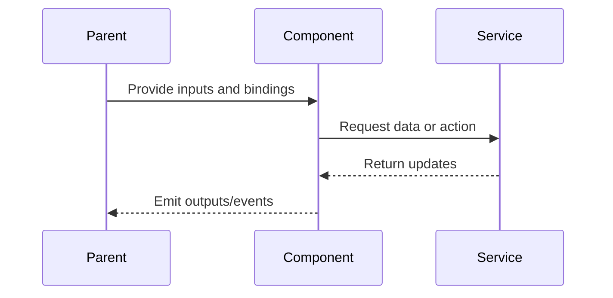

# Upload Panel

## What It Is

The file upload interface that slides open from the Upload Button. Users drag-and-drop or pick files, see upload progress per file, and handle files that need manual map placement (missing GPS).

## What It Looks Like

Slides down from Upload Button. Uses the shared `.ui-container` panel shell so outer radius, panel padding, and panel gap align with the Sidebar and Search Bar. Glassmorphic background (`--color-bg-surface` at 95% opacity + `backdrop-filter: blur(12px)`). Contains: header with title + close, a dashed drop zone, and a scrollable file list. Max height ~400px, scrolls internally.

## Where It Lives

- **Parent**: Upload Button Zone in `MapShellComponent`
- **Component**: `UploadPanelComponent` at `features/upload/upload-panel/`
- **Appears when**: Upload Button is toggled open

## Actions

| #   | User Action                  | System Response                                                                       | Triggers                                     |
| --- | ---------------------------- | ------------------------------------------------------------------------------------- | -------------------------------------------- |
| 1   | Drags files onto Drop Zone   | Files added to queue, EXIF parsing starts                                             | Status → `parsing`                           |
| 2   | Clicks Drop Zone             | Opens file picker dialog (multi-select enabled)                                       | Same as drag                                 |
| 2b  | Clicks "Select folder"       | Opens native folder picker (`showDirectoryPicker()`), scans recursively for images    | Batch created, scan counter shown            |
| 3   | Files have EXIF GPS          | Upload starts automatically (up to 3 parallel)                                        | Status → `uploading` → `complete`            |
| 4   | File has no EXIF GPS         | Shows placement prompt, status = `awaiting_placement`                                 | Placement mode                               |
| 4b  | File is a duplicate          | Shows "Already uploaded" label, status = `skipped`                                    | `uploadSkipped$` event                       |
| 5   | Upload fails                 | Shows error message + Retry button on that file                                       | Status → `error`                             |
| 6   | Clicks Dismiss (×) on a file | Removes file from queue, revokes object URL                                           | File removed                                 |
| 7   | Clicks Retry on failed file  | Re-attempts upload                                                                    | Status → `uploading`                         |
| 8   | Upload succeeds              | Marker appears on map at EXIF/placed coordinates                                      | `imageUploaded` event                        |
| 9   | Upload succeeds + GPS known  | Background reverse-geocode populates address fields (city, district, street, country) | `GeocodingService.reverse()` fire-and-forget |
| 10  | All uploads complete         | Panel stays open showing results (user closes manually)                               | —                                            |
| 11  | Batch completes              | Shows summary: "480 uploaded, 18 already existed, 2 failed"                           | `batchComplete$` event                       |

## Component Hierarchy

```
UploadPanel                                ← `.ui-container` glassmorphic panel, slides down from button
├── PanelHeader                            ← "Upload Photos" title + close button
├── DropZone                               ← dashed border area
│   ├── CameraIcon                         ← centered icon
│   ├── "Drag photos here or click to select"
│   ├── AcceptedTypesHint                  ← "JPEG, PNG, HEIF — max 20MB"
│   └── [chromium] FolderSelectButton      ← "Select folder" text button (Chromium only)
├── [batch active] BatchProgressBar        ← two-segment stacked bar: uploaded (--color-primary) + skipped (--color-bg-muted)
│   ├── UploadedSegment                    ← left segment, width = uploadedPercent%, --color-primary
│   ├── SkippedSegment                     ← right segment, width = skippedPercent%, --color-bg-muted (striped pattern)
│   ├── ProgressPercent                    ← "67%" text (overallProgress)
│   ├── BatchLabel                         ← "Burgstraße_7 — 142 images"
│   └── BatchStats                         ← "96 uploaded · 12 skipped · 1 failed"
└── FileList                               ← scrollable <ul>, max-height ~300px
    └── FileItem × N                       ← one per queued file
        ├── DismissButton (×)              ← left side, removes from queue
        ├── FileThumbnail                  ← 48×48px object-fit:cover preview
        ├── FileInfo
        │   ├── FileName                   ← truncated, text-sm
        │   └── FileStatusLabel            ← "Queued" / "Hashing…" / "Uploading…" / "Already uploaded" / etc.
        ├── [uploading] UploadProgressBar  ← <progress> element, 0–100
        ├── [skipped] SkippedBadge         ← "Already uploaded" with check icon, muted style
        ├── [error] RetryButton            ← "↺ Retry" ghost button
        └── [awaiting_placement] PlacementPrompt  ← "No GPS — click map to place"
```

### File status colors

- Queued / parsing / hashing: neutral background
- Uploading: `--color-primary` progress bar
- Complete: subtle `--color-success` tint
- Skipped (duplicate): subtle `--color-bg-muted` tint, muted text
- Error: subtle `--color-danger` tint
- Awaiting placement: `--color-warning` tint

## Data

### Data Flow (Mermaid)


| Field           | Source                               | Type                          |
| --------------- | ------------------------------------ | ----------------------------- |
| Upload jobs     | `UploadManagerService.jobs()`        | `Signal<UploadJob[]>`         |
| Batch progress  | `UploadManagerService.activeBatch()` | `Signal<UploadBatch \| null>` |
| File validation | `UploadService.validateFile()`       | `FileValidation`              |
| Parsed EXIF     | `UploadService.parseExif()`          | `ParsedExif`                  |
| Upload result   | `UploadService.uploadImage()`        | `{ imageId, storagePath }`    |

## State

| Name       | Type      | Default | Controls                                     |
| ---------- | --------- | ------- | -------------------------------------------- |
| `dragOver` | `boolean` | `false` | Visual feedback on drag hover over drop zone |
| `scanning` | `boolean` | `false` | True while folder scan is in progress        |

Types: `FileUploadState` and `FileUploadStatus` are defined in the component file.

## File Map

| File                                                       | Purpose                                                    |
| ---------------------------------------------------------- | ---------------------------------------------------------- |
| `features/upload/upload-panel/upload-panel.component.ts`   | Component (already exists)                                 |
| `features/upload/upload-panel/upload-panel.component.html` | Template                                                   |
| `features/upload/upload-panel/upload-panel.component.scss` | Styles                                                     |
| `core/upload.service.ts`                                   | EXIF parsing, validation, Supabase upload (already exists) |
| `core/geocoding.service.ts`                                | Nominatim reverse geocoding (address resolution on upload) |

## Wiring

### Wiring Flow (Mermaid)



- Receives `[visible]` input from parent to control slide animation
- Injects `UploadManagerService` to call `submit()` / `submitFolder()` and read `jobs()` / `activeBatch()`
- Subscribes to `batchProgress$` for the aggregate progress bar
- Subscribes to `batchComplete$` for the batch summary
- Subscribes to `uploadSkipped$` to show "Already uploaded" labels
- Subscribes to `jobPhaseChanged$` to update per-file status
- Emits `(imageUploaded)` with coordinates + image ID when upload completes
- Emits `(placementRequested)` when a file needs manual map placement
- Parent (`MapShellComponent`) handles placement mode and coordinates

## Acceptance Criteria

- [ ] Slide-down animation from upload button
- [x] Glassmorphic background with blur
- [x] Uses `.ui-container` as the shared panel shell
- [x] Drag-and-drop works (visual feedback on drag-over)
- [x] Click on drop zone opens file picker (multi-select)
- [ ] "Select folder" button visible on Chromium, hidden on unsupported browsers
- [ ] Folder scan shows live counter ("Scanning… 142 images found")
- [x] Per-file progress with status labels
- [x] Up to 3 parallel uploads
- [ ] Batch progress bar is a two-segment stacked bar (uploaded + skipped)
- [ ] Uploaded segment uses `--color-primary`, skipped segment uses `--color-bg-muted` with subtle stripe pattern
- [ ] Both segments grow left-to-right as `uploadedPercent` and `skippedPercent` update
- [ ] Batch summary shown on completion (uploaded / skipped / failed)
- [ ] Skipped files show "Already uploaded" with check icon (muted style)
- [x] Failed files show Retry button
- [x] Missing-GPS files show placement prompt
- [x] Dismiss button removes file and revokes object URL
- [x] Accepted types: JPEG, PNG, HEIF/HEIC, WebP; max 25MB
- [x] New marker appears on map after successful upload
