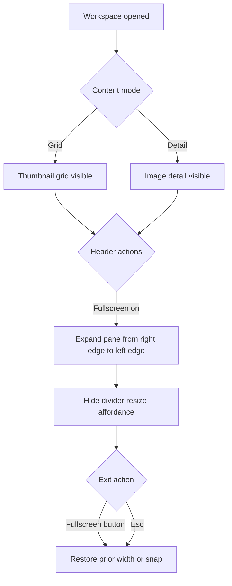
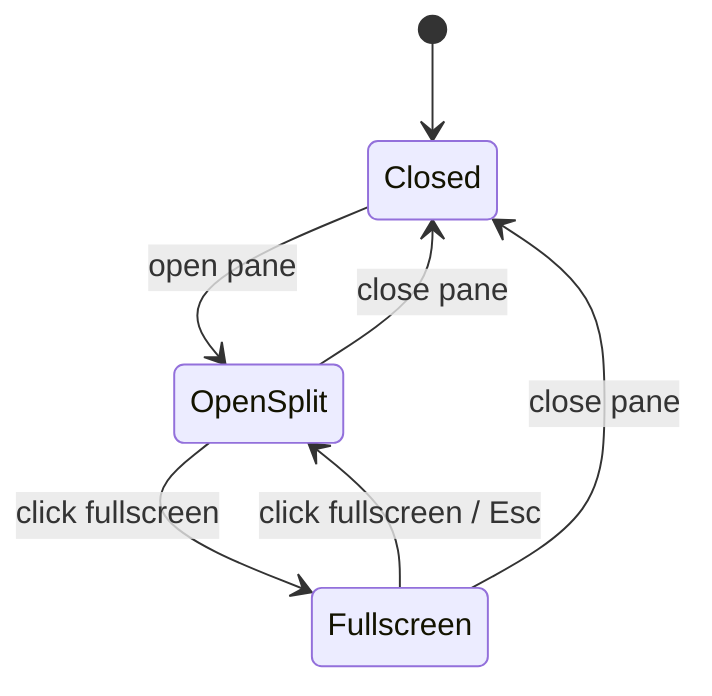
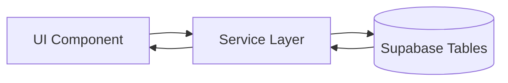
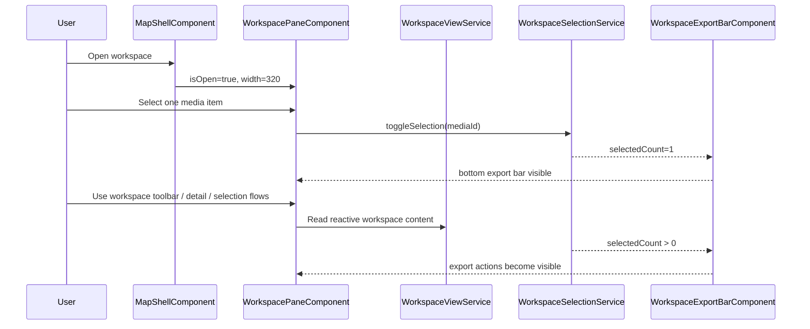
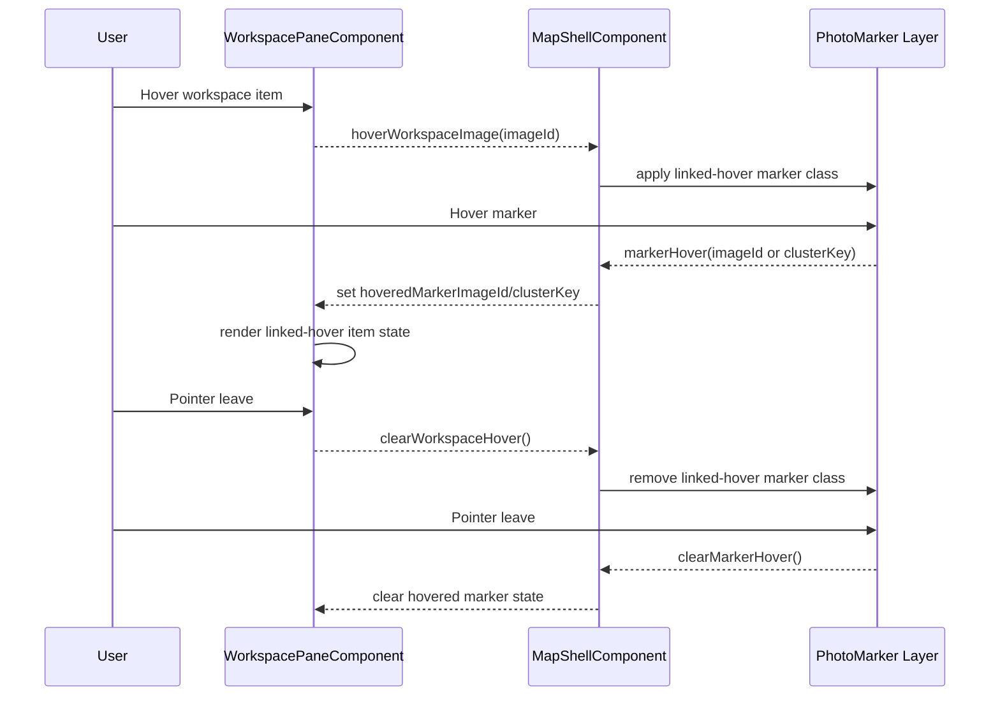

# Workspace Pane

## What It Is

The right-side panel for reviewing and organizing photos. It is currently implemented as a standalone `WorkspacePaneComponent` mounted by `MapShellComponent`.

## What It Looks Like

**Desktop:** right-side pane rendered inside the Map Shell layout. It uses the shared `.ui-container` shell with `--color-bg-surface`, full-height column layout, and an internal switch between thumbnail-grid mode and image-detail mode.

The currently implemented pane shows `PaneHeaderComponent`, then either `ImageDetailViewComponent` or `WorkspaceToolbarComponent` plus `ThumbnailGridComponent`. When one or more media items are selected, `WorkspaceExportBarComponent` appears at the bottom of grid mode.

**Planned but not primary implemented structure:** mobile bottom-sheet snapping and fullscreen workspace mode remain product intent, but are not the main implemented behavior today.

## Where It Lives

- **Parent**: `MapShellComponent` template
- **Appears when**: `MapShellComponent` opens workspace content after marker, detail, or selection flows

## Actions

| #   | User Action                                 | System Response                                                                                                                        | Triggers                                           |
| --- | ------------------------------------------- | -------------------------------------------------------------------------------------------------------------------------------------- | -------------------------------------------------- |
| 1   | Clicks a single photo marker on map         | Workspace pane opens with image detail view for that photo; thumbnail grid loads in background                                         | `workspacePaneOpen` → true, `detailImageId` set    |
| 1b  | Clicks a cluster marker on map              | Workspace pane opens showing thumbnail grid with all images in the cluster; any open detail view is dismissed (`detailImageId` → null) | `workspacePaneOpen` → true, `detailImageId` → null |
| 2   | Drags the Drag Divider                      | Resizes workspace pane width                                                                                                           | Parent shell layout change                         |
| 3   | Clicks close button                         | Workspace pane slides out                                                                                                              | `workspacePaneOpen` → false                        |
| 4   | Swipes down on bottom sheet handle (mobile) | Snaps to lower position or closes                                                                                                      | Snap point logic                                   |
| 5   | Swipes up on bottom sheet handle (mobile)   | Snaps to higher position                                                                                                               | Snap point logic                                   |
| 6   | Clicks a thumbnail in the grid              | Image Detail View replaces grid, back arrow to return                                                                                  | Detail view state                                  |
| 7   | Updates workspace toolbar controls          | Workspace view re-groups, re-sorts, or re-filters current raw images                                                                   | `WorkspaceViewService` reactive recompute          |
| 8   | Clicks pane-header close button             | Workspace pane emits `closed` to parent shell                                                                                          | `closed` output                                    |
| 10  | Selects one or more media items             | Workspace Export Bar animates in at pane bottom                                                                                        | `selectedMediaIds.size > 0`                        |
| 11  | Clears last selected item                   | Workspace Export Bar animates out                                                                                                      | `selectedMediaIds.size === 0`                      |
| 12  | Uses export bar actions                     | Opens curation/share/download flows for selected media                                                                                 | Workspace export wiring                            |
| 15  | Hovers media item in workspace list/grid    | Matching map marker receives linked-hover highlight; if marker is already selected, linked-hover is applied as extra emphasis layer    | `hoveredWorkspaceImageId`                          |
| 16  | Hovers marker on map                        | Matching workspace media item receives linked-hover highlight state                                                                    | `hoveredMarkerImageId` / cluster hover payload     |
| 17  | Leaves hover (either side)                  | Linked-hover highlight is removed on both sides; persistent selection state remains unchanged                                          | hover clear events                                 |

### Interaction Flowchart



### Fullscreen State



## Component Hierarchy

```
WorkspacePane                              ← `.ui-container` right panel rendered by `WorkspacePaneComponent`
├── PaneHeaderComponent                    ← title, title editing, color token, close action
└── ContentArea                            ← switches between:
    ├── [detailImageId set] ImageDetailViewComponent
    └── GridMode
        ├── WorkspaceToolbarComponent
        ├── ThumbnailGridComponent
        └── [selectionService.selectedCount() > 0] WorkspaceExportBarComponent
```

### Bottom Sheet (mobile variant)

```
BottomSheet                                ← fixed bottom, full width
├── DragHandle                             ← 40×4px pill at top center
├── [minimized] GroupNamePreview           ← tab name + image count
└── [half/full] same children as WorkspacePane above
```

## Data

### Data Flow (Mermaid)



| Field               | Source                                                   | Type                        |
| ------------------- | -------------------------------------------------------- | --------------------------- |
| Cluster image IDs   | Viewport query cluster cell lookup via `SupabaseService` | `string[]` from `images.id` |
| Cluster thumbnails  | Supabase Storage signed URLs (batch-loaded)              | `string[]` (URLs)           |
| Cluster image count | Cluster marker `count` field from viewport query         | `number`                    |

## State

| Name                      | Type                                      | Default       | Controls                                                                                                         |
| ------------------------- | ----------------------------------------- | ------------- | ---------------------------------------------------------------------------------------------------------------- |
| `isOpen`                  | `boolean`                                 | `false`       | Pane visibility in parent shell                                                                                  |
| `width`                   | `number`                                  | `320`         | Desktop pane width in parent shell                                                                               |
| `activeTabId`             | `string`                                  | `'selection'` | Internal tab tracking inside `WorkspacePaneComponent`                                                            |
| `detailImageId`           | `string \| null`                          | `null`        | If set, show detail view instead of grid                                                                         |
| `activeClusterImageIds`   | `string[] \| null`                        | `null`        | When set, Active Selection tab is populated with these cluster image IDs; cleared on pane close or new selection |
| `mobileSnapPoint`         | `'minimized' \| 'half' \| 'full'`         | `'minimized'` | Planned mobile bottom-sheet position                                                                             |
| `isFullscreen`            | `boolean`                                 | `false`       | Planned fullscreen workspace mode                                                                                |
| `restoreWidth`            | `number \| null`                          | `null`        | Planned restore width after fullscreen                                                                           |
| `restoreSnapPoint`        | `'minimized' \| 'half' \| 'full' \| null` | `null`        | Planned restore snap point after fullscreen                                                                      |
| `selectedMediaIds`        | `Set<string>`                             | empty set     | Current media selection that drives Workspace Export Bar visibility and actions                                  |
| `hoveredWorkspaceImageId` | `string \| null`                          | `null`        | Current workspace item under pointer for map-linked hover highlight                                              |
| `hoveredMarkerImageId`    | `string \| null`                          | `null`        | Current map marker image reference mirrored into workspace linked-hover                                          |
| `hoveredMarkerClusterKey` | `string \| null`                          | `null`        | Current hovered cluster marker key used to highlight all matching workspace items                                |

## File Map

| File                                                                 | Purpose                                                  |
| -------------------------------------------------------------------- | -------------------------------------------------------- |
| `features/map/workspace-pane/workspace-pane.component.ts`            | Main pane component                                      |
| `features/map/workspace-pane/workspace-pane.component.html`          | Template                                                 |
| `features/map/workspace-pane/workspace-pane.component.scss`          | Desktop pane styles                                      |
| `features/map/workspace-pane/drag-divider/drag-divider.component.ts` | Resize handle (see [drag-divider spec](drag-divider.md)) |
| `features/map/workspace-pane/pane-header.component.ts`               | Header actions and title surface                         |
| `core/workspace-selection.service.ts`                                | Selection state used by export bar visibility/actions    |

## Wiring

### Wiring Flow (Mermaid)



### Hover Link Flow (Map ↔ Workspace)



- Imported in `MapShellComponent` template, placed alongside the map layout
- Receives `detailImageId`, title, title-edit props, color props, and linked-hover inputs from parent
- Emits close/detail/zoom/title/color/hover outputs back to `MapShellComponent`
- Uses `WorkspaceViewService` for current image scope and `WorkspaceSelectionService` for selection/export state

## Acceptance Criteria

- [x] Desktop pane is implemented as `WorkspacePaneComponent`
- [x] Desktop: resizable via Drag Divider (280–640px range)
- [x] Desktop shell uses `.ui-container` for shared panel geometry
- [ ] Mobile: bottom sheet with 3 snap points (64px, 50vh, 100vh)
- [ ] Mobile: drag handle works for snapping
- [x] Map stays interactive when pane is open
- [x] Close button hides the pane
- [x] Content switches between thumbnail grid and image detail
- [ ] Group Tab Bar is mounted as part of the workspace-pane contract where group tabs are active
- [ ] Header includes fullscreen button at top-right
- [ ] Fullscreen mode expands workspace pane right→left until it spans full content width and disables divider drag while active
- [ ] Exiting fullscreen restores prior desktop width or mobile snap point
- [ ] `Esc` exits fullscreen before other pane-level escape behavior
- [x] Workspace Export Bar appears whenever at least one media item is selected
- [x] Workspace Export Bar hides when selection count returns to zero
- [ ] Selection and export state persist through fullscreen toggle transitions
- [ ] Hovering a workspace item applies linked-hover marker highlight on the map
- [ ] Hovering a marker applies linked-hover item highlight in the workspace list/grid
- [ ] Linked-hover is additive to selected state (selected + extra emphasis can coexist)
- [ ] Clearing hover removes linked-hover only; selected state remains intact
- [ ] Cluster click opens pane with Active Selection tab active
- [ ] Active Selection tab shows all images that belong to the clicked cluster
- [ ] Pane header shows image count when cluster content is loaded (e.g., "12 photos")
- [x] Map does NOT zoom or re-center when a cluster is clicked
- [x] Closing the pane clears `activeClusterImageIds`
- [ ] Thumbnails for large clusters (> 50 images) load progressively as the user scrolls
