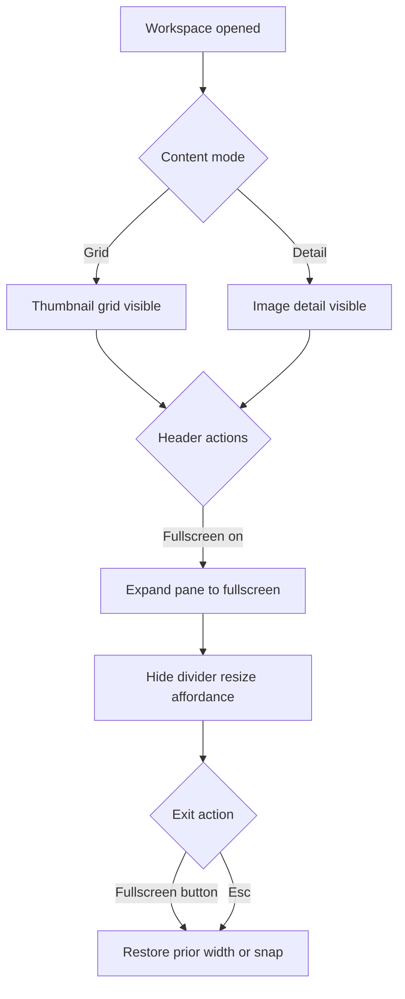
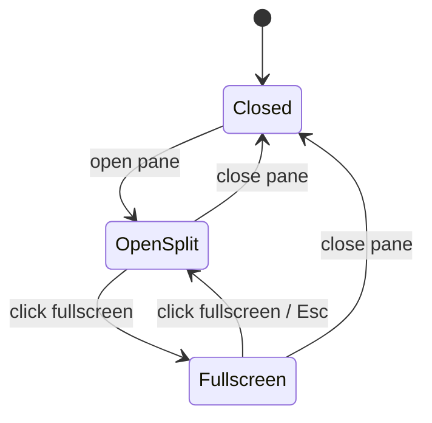

/im# Workspace Pane

## What It Is

The right-side panel that shows image groups, thumbnails, and detail views. It's the user's working area for reviewing and organizing photos. Desktop: slides in from the right. Mobile: becomes a bottom sheet with three snap points.

**Related docs:**

- Interaction scenarios: [use-cases/map-shell.md](../use-cases/map-shell.md) (IS-2, IS-3, IS-4)
- Implementation blueprint: [implementation-blueprints/workspace-pane.md](../implementation-blueprints/workspace-pane.md)
- Parent spec: [map-shell](map-shell.md)
- Child specs: [drag-divider](drag-divider.md), [group-tab-bar](group-tab-bar.md), [active-selection-view](active-selection-view.md), [thumbnail-grid](thumbnail-grid.md), [image-detail-view](image-detail-view.md)
- Product use cases: UC1 (Technician on Site) §6–7, UC2 (Clerk Preparing a Quote) §6–10

## What It Looks Like

**Desktop:** 320px wide by default, resizable 280–640px via Drag Divider. Uses the shared `.ui-container` panel shell so the workspace aligns with the same outer radius and panel padding language as other app surfaces. `--color-bg-surface` background. Slides in from the right edge when opened. Contains Group Tab Bar at top, content area below (thumbnail grid or image detail).

Pane header includes a Notion-like fullscreen toggle button at top-right. Fullscreen mode expands the workspace pane to occupy the available app content area and hides divider resize affordances while active.

**Mobile:** Bottom Sheet with drag handle. Three snap points: minimized (64px, shows handle + group name), half-screen (50vh, shows thumbnails), full-screen (100vh, shows detail). Map stays interactive in minimized and half-screen states.

**Drag Divider:** See [drag-divider spec](drag-divider.md) for full details. Vertical resize handle between map and workspace pane. Desktop only.

## Where It Lives

- **Parent**: `MapShellComponent` template
- **Appears when**: User clicks a marker, selects images, or opens a group tab

## Actions

| #   | User Action                                   | System Response                                                                                                                        | Triggers                                           |
| --- | --------------------------------------------- | -------------------------------------------------------------------------------------------------------------------------------------- | -------------------------------------------------- |
| 1   | Clicks a single photo marker on map           | Workspace pane opens with image detail view for that photo; thumbnail grid loads in background                                         | `workspacePaneOpen` → true, `detailImageId` set    |
| 1b  | Clicks a cluster marker on map                | Workspace pane opens showing thumbnail grid with all images in the cluster; any open detail view is dismissed (`detailImageId` → null) | `workspacePaneOpen` → true, `detailImageId` → null |
| 2   | Drags the Drag Divider                        | Resizes workspace pane width (clamped 280–640px)                                                                                       | CSS width change                                   |
| 3   | Clicks close button                           | Workspace pane slides out                                                                                                              | `workspacePaneOpen` → false                        |
| 4   | Swipes down on bottom sheet handle (mobile)   | Snaps to lower position or closes                                                                                                      | Snap point logic                                   |
| 5   | Swipes up on bottom sheet handle (mobile)     | Snaps to higher position                                                                                                               | Snap point logic                                   |
| 6   | Clicks a thumbnail in the grid                | Image Detail View replaces grid, back arrow to return                                                                                  | Detail view state                                  |
| 7   | Selects a group tab                           | Content switches to that group's thumbnails                                                                                            | Active tab change                                  |
| 8   | Clicks fullscreen button in pane header       | Workspace enters fullscreen mode (desktop: expands pane; mobile: snaps to full and locks)                                              | `isFullscreen` → true                              |
| 9   | Clicks fullscreen button again or presses Esc | Workspace exits fullscreen and restores prior width/snap                                                                               | `isFullscreen` → false                             |

### Interaction Flowchart



### Fullscreen State



## Component Hierarchy

```
WorkspacePane                              ← `.ui-container` right panel (desktop) or bottom sheet (mobile)
├── [desktop] DragDivider                  ← resize handle (see drag-divider spec)
├── PaneHeader                             ← close button + group name + fullscreen button
│   ├── FullscreenToggleButton             ← top-right, notion-like control
│   └── CloseButton
├── GroupTabBar                            ← scrollable horizontal tabs (see group-tab-bar spec)
├── SortingControls                        ← Date↓, Date↑, Distance, Name
└── ContentArea                            ← switches between:
    ├── ThumbnailGrid                      ← default view (see thumbnail-grid spec)
    └── [detail selected] ImageDetailView  ← replaces grid (see image-detail-view spec)
```

### Bottom Sheet (mobile variant)

```
BottomSheet                                ← fixed bottom, full width
├── DragHandle                             ← 40×4px pill at top center
├── [minimized] GroupNamePreview           ← tab name + image count
└── [half/full] same children as WorkspacePane above
```

## State

| Name                    | Type                                      | Default       | Controls                                                                                                         |
| ----------------------- | ----------------------------------------- | ------------- | ---------------------------------------------------------------------------------------------------------------- |
| `isOpen`                | `boolean`                                 | `false`       | Pane visibility                                                                                                  |
| `width`                 | `number`                                  | `320`         | Desktop pane width in px                                                                                         |
| `activeTabId`           | `string`                                  | `'selection'` | Which group tab is active                                                                                        |
| `detailImageId`         | `string \| null`                          | `null`        | If set, show detail view instead of grid                                                                         |
| `activeClusterImageIds` | `string[] \| null`                        | `null`        | When set, Active Selection tab is populated with these cluster image IDs; cleared on pane close or new selection |
| `mobileSnapPoint`       | `'minimized' \| 'half' \| 'full'`         | `'minimized'` | Mobile bottom sheet position                                                                                     |
| `isFullscreen`          | `boolean`                                 | `false`       | Fullscreen workspace mode                                                                                        |
| `restoreWidth`          | `number \| null`                          | `null`        | Stored desktop width to restore after fullscreen                                                                 |
| `restoreSnapPoint`      | `'minimized' \| 'half' \| 'full' \| null` | `null`        | Stored mobile snap point to restore after fullscreen                                                             |

## File Map

| File                                                                 | Purpose                                                  |
| -------------------------------------------------------------------- | -------------------------------------------------------- |
| `features/map/workspace-pane/workspace-pane.component.ts`            | Main pane component                                      |
| `features/map/workspace-pane/workspace-pane.component.html`          | Template                                                 |
| `features/map/workspace-pane/workspace-pane.component.scss`          | Styles + responsive behavior                             |
| `features/map/workspace-pane/drag-divider/drag-divider.component.ts` | Resize handle (see [drag-divider spec](drag-divider.md)) |

## Wiring

- Imported in `MapShellComponent` template, placed after Map Zone
- Receives `activeTabId` and `detailImageId` from parent or via service
- Drag Divider emits width changes to parent for map reflow

## Data

| Field               | Source                                                   | Type                        |
| ------------------- | -------------------------------------------------------- | --------------------------- |
| Cluster image IDs   | Viewport query cluster cell lookup via `SupabaseService` | `string[]` from `images.id` |
| Cluster thumbnails  | Supabase Storage signed URLs (batch-loaded)              | `string[]` (URLs)           |
| Cluster image count | Cluster marker `count` field from viewport query         | `number`                    |

## Acceptance Criteria

- [ ] Desktop: slides in from right with smooth transition
- [x] Desktop: resizable via Drag Divider (280–640px range)
- [x] Desktop shell uses `.ui-container` for shared panel geometry
- [ ] Mobile: bottom sheet with 3 snap points (64px, 50vh, 100vh)
- [ ] Mobile: drag handle works for snapping
- [x] Map stays interactive when pane is open
- [x] Close button hides the pane
- [x] Content switches between thumbnail grid and image detail
- [x] Group Tab Bar is scrollable horizontally
- [ ] Header includes fullscreen button at top-right
- [ ] Fullscreen mode expands workspace pane and disables divider drag while active
- [ ] Exiting fullscreen restores prior desktop width or mobile snap point
- [ ] `Esc` exits fullscreen before other pane-level escape behavior
- [ ] Cluster click opens pane with Active Selection tab active
- [ ] Active Selection tab shows all images that belong to the clicked cluster
- [ ] Pane header shows image count when cluster content is loaded (e.g., "12 photos")
- [x] Map does NOT zoom or re-center when a cluster is clicked
- [x] Closing the pane clears `activeClusterImageIds`
- [ ] Thumbnails for large clusters (> 50 images) load progressively as the user scrolls
