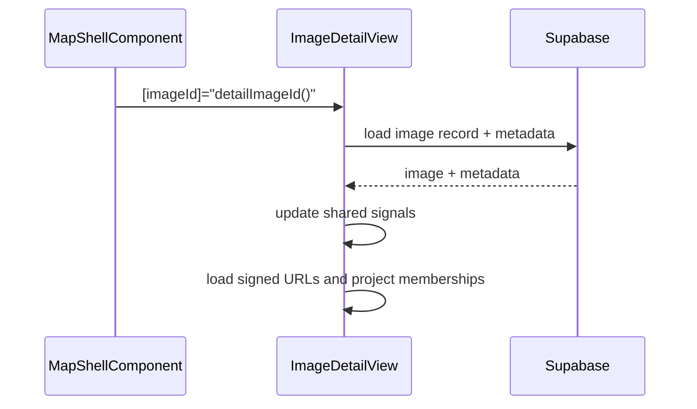
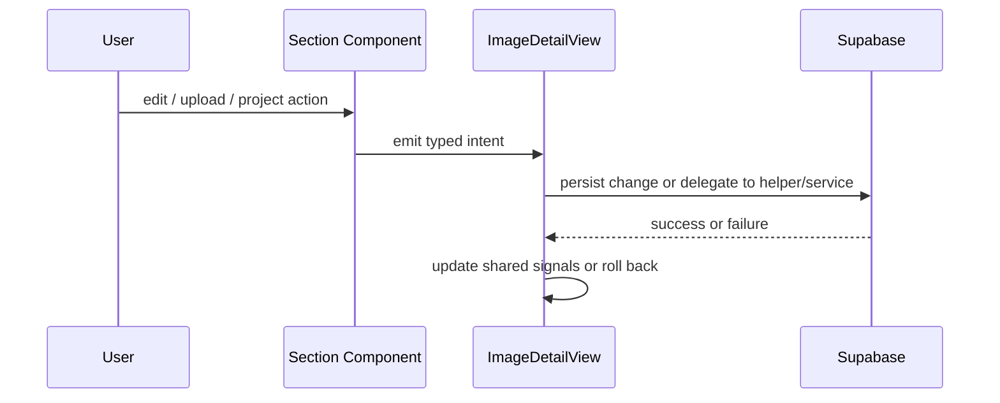

# Image Detail View - Implementation Blueprint

> **Spec**: [element-specs/image-detail-view.md](../element-specs/image-detail-view.md)
> **Status**: Refactored into a parent coordinator plus extracted section components. Remaining work should focus on behavioral gaps against child specs, not on further monolith reduction inside `ImageDetailViewComponent`.

## Existing Infrastructure

| File                                                                      | What it provides |
| ------------------------------------------------------------------------- | ---------------- |
| `features/map/workspace-pane/image-detail-view.component.ts`              | Parent coordinator: load record, own shared state, wire child events |
| `features/map/workspace-pane/image-detail-header/*`                       | Header UI and context-menu intent emission |
| `features/map/workspace-pane/image-detail-photo-viewer/*`                 | Photo area UI, file-selection handoff, lightbox |
| `features/map/workspace-pane/image-detail-inline-section/*`               | Details/location editing UI and project picker |
| `features/map/workspace-pane/image-detail-project-membership.helper.ts`   | Project membership loading and persistence rules |
| `core/supabase.service.ts`                                                | `SupabaseService.client` for queries |
| `core/upload.service.ts`                                                  | File validation for replace/attach flow |
| `core/photo-load.service.ts`                                              | Signed URL lookup, load-state tracking, preload |

## Service Contract

### ImageDetailViewComponent

```typescript
imageId: InputSignal<string | null>;

image: WritableSignal<ImageRecord | null>;
metadata: WritableSignal<MetadataEntry[]>;
loading: WritableSignal<boolean>;
error: WritableSignal<string | null>;
fullResUrl: WritableSignal<string | null>;
thumbnailUrl: WritableSignal<string | null>;
showContextMenu: WritableSignal<boolean>;
showDeleteConfirm: WritableSignal<boolean>;

isCorrected: Signal<boolean>;
displayTitle: Signal<string>;
captureDate: Signal<string | null>;

closed: OutputEmitterRef<void>;
zoomToLocationRequested: OutputEmitterRef<{ imageId: string; lat: number; lng: number }>;
```

### Child Boundaries

- `ImageDetailHeaderComponent`: header presentation only; emits title and context-menu intents.
- `ImageDetailPhotoViewerComponent`: photo/upload presentation only; emits selected files back to the parent.
- `ImageDetailInlineSectionComponent`: details and location presentation only; emits edit, save, project, and location intents.
- `MetadataSectionComponent` and `DetailActionsComponent`: focused presenter components retained from the earlier split.

## Data Flow

### Image Loading



### Parent / Child Coordination



## Notes

- `ImageDetailViewComponent` remains the integration point for record loading and upload-manager subscriptions.
- Project membership rules and persistence now live behind `image-detail-project-membership.helper.ts`.
- Photo viewer state remains parent-owned for now; the extracted viewer is a presenter that emits file-selection intent.
