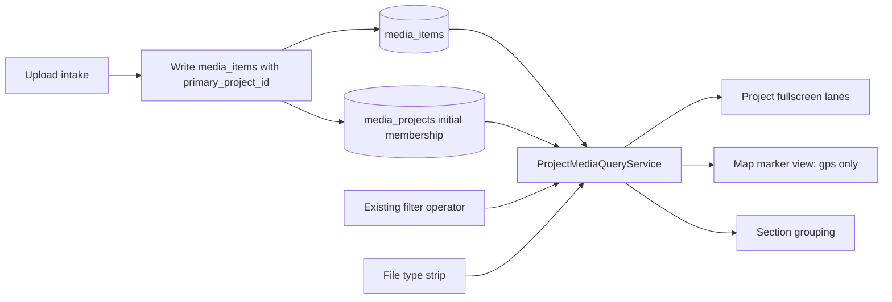
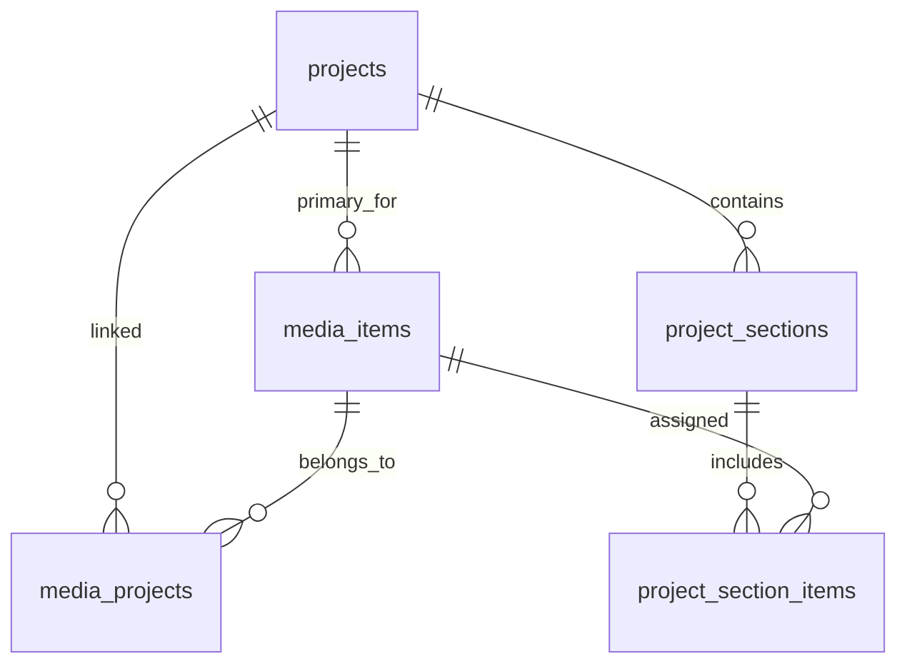
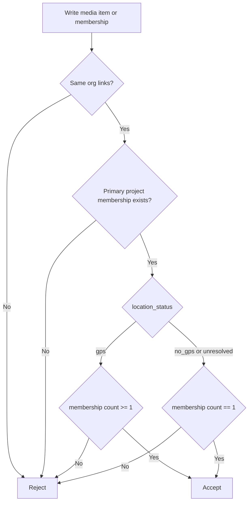
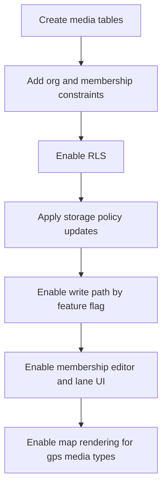

# Project Mixed Media Data Model - Implementation Blueprint

> Related specs:
>
> - [project-mixed-media-pre-spec](../element-specs/project-mixed-media-pre-spec.md)
> - [project-details-view](../element-specs/project-details-view.md)
> - [upload-panel](../element-specs/upload-panel.md)
> - [filter-panel](../element-specs/filter-panel.md)
>
> Related use cases:
>
> - [project-mixed-media](../use-cases/project-mixed-media.md)

## Goal

Ship mixed media (photos, videos, documents) with low migration risk and explicit project ownership semantics.

Primary rules:

- Every media item has exactly one `primary_project_id`.
- GPS media may have multiple project memberships.
- No-GPS media must have exactly one project membership.
- Membership and location constraints are enforced in database logic, not only UI.

## Scope

In scope:

- New mixed-media schema (`media_items`, `media_projects`, section tables).
- RLS and organization-guard triggers.
- Constraint triggers for primary-project and no-GPS rules.
- Rollout, backfill, validation, and rollback strategy.

Out of scope:

- Final UI visuals.
- Video transcoding details.
- OCR/document text search.

## Architecture Decision

Use hybrid ownership plus membership:

- `media_items.primary_project_id` = canonical ownership anchor.
- `media_projects` = membership set used for cross-project reuse.
- `project_sections` and `project_section_items` stay project-scoped.

### System Flow (Mermaid)

## Proposed Tables

### Data Model (Mermaid)

### 1) media_items

Columns:

- `id` uuid primary key default `gen_random_uuid()`
- `organization_id` uuid not null references `organizations(id)` on delete cascade
- `primary_project_id` uuid not null references `projects(id)` on delete cascade
- `created_by` uuid references `auth.users(id)` on delete set null
- `media_type` text not null check in (`photo`, `video`, `document`)
- `mime_type` text not null
- `storage_path` text not null
- `thumbnail_path` text null
- `poster_path` text null
- `file_name` text not null
- `file_size_bytes` bigint not null check (`file_size_bytes > 0`)
- `captured_at` timestamptz null
- `duration_ms` integer null check (`duration_ms is null or duration_ms >= 0`)
- `page_count` integer null check (`page_count is null or page_count >= 1`)
- `exif_latitude` numeric(10,7) null
- `exif_longitude` numeric(11,7) null
- `latitude` numeric(10,7) null
- `longitude` numeric(11,7) null
- `geog` geography(Point, 4326) null
- `location_status` text not null check in (`gps`, `no_gps`, `unresolved`)
- `gps_assignment_allowed` boolean not null default true
- `source_image_id` uuid unique null references `images(id)` on delete cascade
- `created_at` timestamptz not null default `now()`
- `updated_at` timestamptz not null default `now()`

### 2) media_projects

Columns:

- `media_item_id` uuid not null references `media_items(id)` on delete cascade
- `project_id` uuid not null references `projects(id)` on delete cascade
- `created_at` timestamptz not null default `now()`
- primary key (`media_item_id`, `project_id`)

### 3) project_sections

Columns:

- `id` uuid primary key default `gen_random_uuid()`
- `organization_id` uuid not null references `organizations(id)` on delete cascade
- `project_id` uuid not null references `projects(id)` on delete cascade
- `name` text not null
- `sort_order` integer not null default 0
- `archived_at` timestamptz null
- `created_by` uuid references `auth.users(id)` on delete set null
- `created_at` timestamptz not null default `now()`
- `updated_at` timestamptz not null default `now()`

Constraints:

- unique (`project_id`, `name`) where `archived_at is null`
- check (`length(trim(name)) between 1 and 80`)

### 4) project_section_items

Columns:

- `section_id` uuid not null references `project_sections(id)` on delete cascade
- `media_item_id` uuid not null references `media_items(id)` on delete cascade
- `sort_order` integer not null default 0
- `created_at` timestamptz not null default `now()`
- primary key (`section_id`, `media_item_id`)

## Required Indexes

- `media_items`: (`organization_id`, `primary_project_id`)
- `media_items`: (`media_type`, `location_status`, `captured_at desc`)
- `media_items`: GiST index on `geog`
- `media_projects`: (`project_id`, `media_item_id`) and (`media_item_id`, `project_id`)
- `project_sections`: (`project_id`, `sort_order`)
- `project_section_items`: (`section_id`, `sort_order`), (`media_item_id`)

## Trigger and Integrity Rules

### 1) Organization guards

Trigger checks:

- `media_items.organization_id = projects.organization_id` (for primary project)
- `media_projects` row must connect same-org media and project
- `project_sections.organization_id = projects.organization_id`
- section/media org must match in `project_section_items`

### 2) geog maintenance

- Trigger computes `geog` from `latitude` and `longitude` when coordinates exist.
- Trigger updates `updated_at`.

### 3) Membership consistency

Constraint trigger on `media_projects` and `media_items` updates:

- A `media_items.primary_project_id` membership must exist in `media_projects`.
- Last membership delete is rejected.
- For `location_status in ('no_gps','unresolved')`: membership count must equal 1.
- For `location_status = 'gps'`: membership count must be >= 1.

### 4) GPS-assignment policy hook

- If `gps_assignment_allowed = false`, any operation that tries to set coordinates from null to non-null is rejected.
- Intended use: lock document-like files from manual map placement.

### Integrity Rules (Mermaid)

## RLS Policies

Enable RLS on every new table.

### media_items

- SELECT: `organization_id = user_org_id()`
- INSERT: `organization_id = user_org_id()` and `not is_viewer()`
- UPDATE/DELETE: owner (`created_by = auth.uid()`) or admin, same org, and `not is_viewer()`

### media_projects

- SELECT: same org via joined media row
- INSERT/DELETE: same org via joined media row and project row, and `not is_viewer()`

### project_sections

- SELECT: same org as project
- INSERT/UPDATE/DELETE: same org and `not is_viewer()`

### project_section_items

- SELECT: same org via section and media joins
- INSERT/UPDATE/DELETE: same org and `not is_viewer()`

## Storage Strategy

Option A (recommended now): one private `images` bucket with type-prefixed paths.

- Photos: `{org_id}/{user_id}/photos/{uuid}.jpg`
- Videos: `{org_id}/{user_id}/videos/{uuid}.mp4`
- Documents: `{org_id}/{user_id}/documents/{uuid}.pdf`
- Thumbnails: `{org_id}/{user_id}/thumbs/{uuid}.jpg`
- Posters: `{org_id}/{user_id}/posters/{uuid}.jpg`

## Query Contract

### Project fullscreen query

Input: current `project_id`, filter operator, file type filter.

Output partitions:

- `gpsItems`: membership contains project and `location_status = 'gps'`
- `projectOnlyItems`: membership contains project and `location_status in ('no_gps','unresolved')`

### Map query

- membership contains active project scope (or global map scope if configured)
- `location_status = 'gps'`
- coordinates/geog present
- file type filter composed additively

## Migration Sequence

1. `20260317090000_media_items_core.sql`
2. `20260317091000_media_projects.sql`
3. `20260317092000_media_items_indexes_triggers.sql`
4. `20260317093000_media_membership_constraints.sql`
5. `20260317094000_media_items_rls.sql`
6. `20260317095000_media_projects_rls.sql`
7. `20260317100000_project_sections.sql`
8. `20260317101000_project_sections_rls.sql`
9. `20260317102000_project_section_items.sql`
10. `20260317103000_project_section_items_rls.sql`
11. `20260317104000_storage_policy_mixed_media.sql`
12. `20260317105000_media_items_photo_shadow_backfill.sql` (optional by flag)

### Migration Rollout (Mermaid)

## Backfill Strategy

If backfill is enabled:

- Create one `media_items` row per `images` row (`media_type = 'photo'`, `source_image_id = images.id`).
- Set `primary_project_id`:
  - Use `images.project_id` when present.
  - Otherwise choose canonical project from `image_projects` (oldest membership by `created_at`, tie-break by `project_id`).
- Insert mandatory primary membership into `media_projects`.
- Optionally backfill remaining `image_projects` rows as additional memberships for GPS photos.

Parity checks:

- photo row counts match
- every backfilled media row has primary membership
- no-GPS backfilled rows have exactly one membership

## Rollback Plan

- Disable mixed-media feature flag.
- Stop writes to new tables from app layer.
- Keep schema and data for forensics.
- Re-enable only after integrity and parity checks pass.

## Validation SQL Checklist

- Cross-org insert into `media_projects` fails.
- Viewer insert/update/delete on new tables fails.
- Primary-project membership missing is rejected.
- No-GPS item with second membership is rejected.
- Last membership delete is rejected.
- GPS-locked item coordinate assignment is rejected.
- Map query excludes no-GPS/unresolved media.

## Risk Register

1. Membership-trigger complexity can increase write latency.
   Mitigation: narrow trigger logic, index joins, benchmark on batch inserts.

2. Dual-model inconsistency during migration window.
   Mitigation: feature flag and parity dashboard before read cutover.

3. RLS drift across new tables.
   Mitigation: policy templates and role-based SQL acceptance suite.

4. Locked GPS assignment may confuse users.
   Mitigation: explicit UI message and help tooltip in detail view.

## Release Gates

Gate A (schema ready):

- all new tables created
- constraints and triggers active
- RLS enabled and tested

Gate B (write path ready):

- upload writes primary project plus membership
- no-photo regressions in upload tests

Gate C (read path ready):

- fullscreen lanes render correctly
- shared badges and membership editor behave correctly

Gate D (map ready):

- gps media render correctly on map
- no-gps never leaks into map markers
