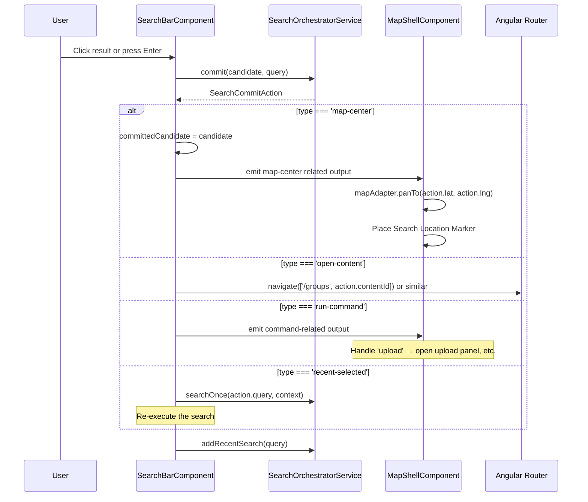
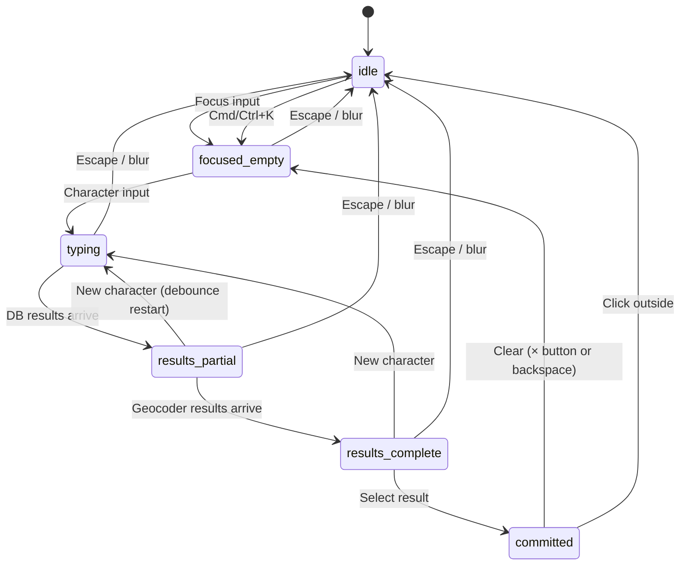

# Search Bar — Implementation Blueprint

> **Spec**: [element-specs/search-bar.md](../element-specs/search-bar.md)
> **Status**: Core component and service layer are implemented. This blueprint only tracks follow-up implementation notes beyond the spec.

## Existing Infrastructure

| File                                         | What it provides                                                                                             |
| -------------------------------------------- | ------------------------------------------------------------------------------------------------------------ |
| `core/search/search-orchestrator.service.ts` | Full orchestrator: debounce, cache, parallel resolve, dedup, ranking                                         |
| `core/search/search.models.ts`               | All types: `SearchState`, `SearchCandidate` unions, `SearchResultSet`, `SearchCommitAction`, `SearchSection` |
| `core/map-adapter.ts`                        | `panTo()` for map centering on commit                                                                        |

## Follow-Up Infrastructure Review

| What                            | File                                            | Why                                                                                  |
| ------------------------------- | ----------------------------------------------- | ------------------------------------------------------------------------------------ |
| Search resolver split           | `core/search/*`                                 | Decide whether current resolver/helper split is clear enough or should be simplified |
| Geocoding abstraction alignment | `core/geocoding.service.ts` and search services | Keep adapter/service boundaries consistent with project adapter rules                |
| Status cleanup                  | search docs + blueprint set                     | Remove stale claims about unimplemented component work                               |

### Follow-Up Note

Keep this blueprint at the level of resolver boundaries and cleanup questions.
Do not document hypothetical class splits here as if they already exist unless the codebase actually adopts them.

## Data Flow

### Typing → Results

```mermaid
sequenceDiagram
    participant Input as <input>
    participant SB as SearchBarComponent
    participant Orch as SearchOrchestratorService
    participant DB_Addr as DB Address Retrieval
    participant DB_Cont as DB Content Retrieval
    participant Geo as Geocoder Retrieval

    Input->>SB: keyup → query$ emits "park st"
    SB->>Orch: searchInput(query$, context$)
    Note over Orch: Debounce 300ms, check cache

    par Parallel resolution
        Orch->>DB_Addr: resolve("park st", context)
        Orch->>DB_Cont: resolve("park st", context)
        Orch->>Geo: resolve("park st", context)
    end

    Note over Orch: Emit "typing" immediately (empty sections, geocoder loading)

    DB_Addr-->>Orch: SearchAddressCandidate[]
    DB_Cont-->>Orch: SearchContentCandidate[]
    Note over Orch: Emit "results-partial" (DB results, geocoder still loading)
    Orch-->>SB: SearchResultSet { state: 'results-partial' }
    SB->>SB: Render Address + Content sections, geocoder skeleton

    Geo-->>Orch: SearchAddressCandidate[]
    Note over Orch: deduplicateGeocoderNearDb() — haversine < 30m → remove
    Note over Orch: Emit "results-complete"
    Orch-->>SB: SearchResultSet { state: 'results-complete' }
    SB->>SB: Render all sections, remove skeleton
```



### Commit Flow



## Keyboard Navigation — Implementation Details

```typescript
// In SearchBarComponent:
private flatItems = computed<SearchCandidate[]>(() => {
  // Flatten all sections' items into a single array for keyboard nav
  return this.resultSet().sections.flatMap(s => s.items);
});

activeIndex = signal(-1);

handleKeydown(event: KeyboardEvent): void {
  const items = this.flatItems();

  switch (event.key) {
    case 'ArrowDown':
      event.preventDefault();
      this.activeIndex.update(i => Math.min(i + 1, items.length - 1));
      break;
    case 'ArrowUp':
      event.preventDefault();
      this.activeIndex.update(i => Math.max(i - 1, -1));
      break;
    case 'Enter':
      event.preventDefault();
      const idx = this.activeIndex();
      const candidate = idx >= 0 ? items[idx] : items[0];
      if (candidate) this.commitCandidate(candidate);
      break;
    case 'Escape':
      if (this.dropdownOpen()) {
        this.dropdownOpen.set(false);
      } else {
        this.inputEl.nativeElement.blur();
      }
      break;
  }
}

// Scroll active item into view
activeIndexEffect = effect(() => {
  const idx = this.activeIndex();
  if (idx >= 0) {
    const el = this.listboxEl?.nativeElement?.querySelector(`[data-index="${idx}"]`);
    el?.scrollIntoView({ block: 'nearest' });
  }
});
```

## Geocoder Dedup Logic (already implemented)

The `SearchOrchestratorService.deduplicateGeocoderNearDb()` method already handles this:

- Uses `haversineMeters()` to compute distance between each geocoder result and each DB address result
- If distance ≤ `geocoderDedupMeters` (default: 30m), the geocoder result is removed
- No component-level work needed — the orchestrator handles it internally

## Animation Constraints

The spec requires panel height animation without animating row height, padding, media width, or corner radius.

```scss
// search-bar.component.scss
:host {
  // Results panel is inside the container, not an overlay
  .search-results-panel {
    display: grid;
    // Animate height with grid-template-rows trick:
    grid-template-rows: 0fr;
    transition: grid-template-rows var(--duration-normal) var(--ease-standard);
    overflow: hidden;

    > .search-results-inner {
      min-height: 0; // Required for grid-template-rows animation
    }
  }

  &.dropdown-open .search-results-panel {
    grid-template-rows: 1fr;
  }
}
```

This approach:

- ✅ Animates outer panel height smoothly
- ✅ Does NOT animate row height, row padding, media width, or panel radius
- ✅ Uses CSS only (no JS measurement needed)

## Component Outputs

The component currently emits focused outputs such as map-centering, clear, drop-pin, QR-invite, and query-change events rather than one generic `searchCommit` event. Keep the spec authoritative and avoid freezing temporary output shapes here unless they are part of the intended contract.

## State Machine


