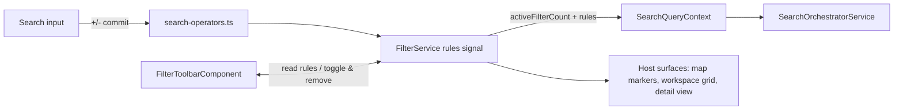

# Universal Search Provider System — Implementation Blueprint

> **Specs**: [element-specs/search-bar.md](../element-specs/search-bar.md) (host surface),
> [element-specs/filter-toolbar.md](../element-specs/filter-toolbar.md) (chip toolbar),
> [element-specs/search-bar-query-behavior.md](../element-specs/search-bar-query-behavior.md) (base query rules)
> **Status**: Planned. Extends the implemented search stack (orchestrator + 3 resolvers + `/` command mode) with a formal provider interface, `#`/`+`/`-` keyword operators, and a reusable filter toolbar.

## Goals

1. **Providers, not hardcoded resolvers.** Formalize the existing three sources
   (DB address, DB content, geocoder) plus commands and filters behind one
   `SearchProvider` interface so new sources register instead of being wired into
   the orchestrator by hand.
2. **Keyword operators.** `#` scopes the search exclusively to one provider;
   `+`/`-` add/remove filter chips — exactly equivalent to toggling a chip in the
   filter toolbar.
3. **Reusable filter toolbar.** A floating chip row that docks under *any* search
   bar host (map first; workspace pane / image detail and photos page later) and
   stays in sync with `FilterService` and the operator grammar.

## Existing Infrastructure (verified)

| File | What it provides |
| --- | --- |
| `core/search/search-orchestrator.service.ts` | Debounce (300ms), 5-min cache, staged emission (`typing → results-partial → results-complete`), ranking, dedup; `configureSources()` accepts exactly 3 resolver slots; `/` command mode with 3 hardcoded commands |
| `core/search/search-bar-resolvers.ts` | DB address / DB content / geocoder resolution + scoring |
| `core/search/search.models.ts` | `SearchCandidate` union, `SearchSection`, `SearchQueryContext` (already carries `activeProjectId`, `activeFilterCount`, `commandMode`) |
| `core/filter.service.ts` | `FilterRule { conjunction, property, operator, value }` signal store, client-side evaluation, `activeCount` computed |
| `features/map/search-bar/search-bar.component.ts` | Input handling, keyboard nav, ghost completion, commit routing |
| `docs/element-specs/active-filter-chips.md` | Earlier chip-row spec — **superseded by the Filter Toolbar** (see below) |

## 1. Provider Interface

```typescript
// core/search/providers/search-provider.ts
export interface SearchProvider {
  /** Stable id, used by #-scoping and section keys. */
  readonly id: 'project' | 'address' | 'place' | 'group' | 'command' | string;
  /** i18n keys: noun shown in meta rows + section header. */
  readonly labelKey: string;        // e.g. 'search.provider.project' → "Projekt"
  readonly descriptionKey: string;  // e.g. "Suche nach einem konkreten Projekt"
  /** Aliases matched after '#', lowercase, per locale (e.g. ['projekt','project','proj']). */
  readonly aliases: string[];
  /** Which operators this provider participates in. */
  readonly capabilities: { scope: boolean; filter: boolean };
  resolve(query: string, context: SearchQueryContext): Observable<SearchCandidate[]>;
  /** Map a committed candidate to a FilterRule (only if capabilities.filter). */
  toFilterRule?(candidate: SearchCandidate): FilterRule;
}
```

Registration replaces the 3-slot `configureSources()`:

```typescript
// core/search/providers/search-provider.registry.ts
@Injectable({ providedIn: 'root' })
export class SearchProviderRegistry {
  register(provider: SearchProvider): void;
  byId(id: string): SearchProvider | undefined;
  matchAlias(prefix: string): SearchProvider[]; // for '#proj…' narrowing
  all(): SearchProvider[];
}
```

Migration is mechanical: wrap the three existing resolver functions in provider
objects (`AddressProvider`, `PlaceProvider`, and split DB content into
`ProjectProvider` + `GroupProvider` so `#project` can be exclusive). The
orchestrator iterates registered providers instead of its three fields; staged
emission, caching, dedup, and ranking are unchanged. `/` command mode becomes a
`CommandProvider` with `capabilities: { scope: true, filter: false }`.

## 2. Operator Grammar

Parsing happens in a new pure module `core/search/search-operators.ts`, invoked in
`onInput()` **before** debounce/orchestration (like coordinate detection today).

```
input        := operator-token | plain-query
operator-token := ('#' | '+' | '-') rest
rest         := '' | provider-alias [' ' term] | term
```

| Input | Meaning | Behavior |
| --- | --- | --- |
| `#` (bare) | "scope my search" | Dropdown shows **meta rows**: one two-line row per scopable provider (line 1 noun e.g. "Projekt", line 2 description e.g. "Suche nach einem konkreten Projekt"), contextually ranked (active project context boosts Projekt; map viewport boosts Adresse/Ort) |
| `#proj` | narrowing | Meta rows filtered by alias prefix; Enter/click selects the provider |
| `#projekt term` (or provider selected) | exclusive scope | Orchestrator queries **only** that provider; section header shows the provider noun; all other sections suppressed |
| `+` (bare) | "add a filter" | Meta rows for filterable providers/dimensions: Projekt, Zeitraum, Metadatum (set TBD — start with Projekt, extend per `FilterService` properties) |
| `+term` | add filter chip | Resolves `term` against filterable providers (projects first); committing a candidate calls `toFilterRule()` → `FilterService.add()`, chip appears in the toolbar, input clears. Identical to toggling the chip on |
| `-` (bare) | "remove a filter" | Meta rows list the **currently active chips**; selecting one removes it |
| `-term` | remove filter chip | Fuzzy-matches `term` against active chips; commit removes the matching rule. Identical to clicking a chip's × |
| `/…` | commands | Unchanged, internally now `#`-scoping the `CommandProvider` |

Rules:

- Operator detection only at position 0 of the trimmed input; `Bahnhofstr. 5 #3`
  is a plain query (no mid-string operators in v1).
- Escape/backspace from an active scope returns to plain search with the operator
  text still editable (the scope is part of the input string, not hidden state).
- Selecting an entity that is **already an active chip** via `+`/`#` toggles it
  **off** (re-selecting toggles — same as clicking the chip).
- Coordinate detection keeps priority over operator detection only when the input
  parses as coordinates (unchanged behavior); `#`/`+`/`-` never collide with it.

### Meta-suggestion rows

New candidate family `meta` in `search.models.ts`:

```typescript
export interface SearchMetaCandidate {
  family: 'meta';
  providerId: string;
  operator: '#' | '+' | '-';
  label: string;        // resolved i18n noun, e.g. "Projekt"
  description: string;  // resolved i18n line 2
}
```

Rendered by `search-dropdown-item.component.ts` as a two-line row (noun on line 1
in primary text, description on line 2 in `--color-text-secondary`), icon by
provider (folder for Projekt, location for Adresse, globe for Ort, history/chip
icon for active-chip rows under `-`). Committing a meta row **rewrites the input**
(`#` + alias + space, focus kept) rather than performing a search — one mental
model: operators always travel through the input text.

### i18n

All operator nouns/descriptions go through the mandatory i18n workflow
(`docs/i18n/translation-workbench.csv` → `supabase/seed_i18n.sql`), en/de/it.
Initial keys: `search.operator.scopeHint`, `search.provider.{project,address,place,group,command}.label`,
`search.provider.*.description`, `search.operator.addFilterHint`, `search.operator.removeFilterHint`.
German reference copy: "Projekt" / "Suche nach einem konkreten Projekt".

## 3. Filter Toolbar Sync Contract

Full UI contract in [element-specs/filter-toolbar.md](../element-specs/filter-toolbar.md).
Architecture decision (resolves the "map-only vs reusable" question): **reusable
component, single source of truth in `FilterService`**, map ships first.



- The toolbar never owns filter state; it renders `FilterService.rules()` and
  calls `add/remove/toggle`. Operator commits go through the same service
  methods — chips created by typing `+x` and by clicking are indistinguishable.
- `SearchQueryContext` gains `activeFilterRules` (today only `activeFilterCount`)
  so providers can boost/suppress candidates that are already filtered.
- Host surfaces subscribe to `FilterService` exactly as the map does today;
  docking the toolbar under another search bar requires no new wiring beyond
  placing the component (see spec for the docking contract).

### Where the toolbar appears

| Surface | Status | Notes |
| --- | --- | --- |
| Map (below Search Bar, top-center) | **v1** | Replaces the planned Active Filter Chips strip |
| Workspace pane / image detail view | **v2** | No search bar exists there yet; when one lands, the toolbar docks beneath it with the same `FilterService`. Until then the workspace inherits map filters (already the case via shared service) |
| Photos page | **deferred** | Page is a stub; adopt the same docking contract when it gets a search bar |

`active-filter-chips.md` is superseded by the Filter Toolbar spec — do not
implement both. The chips spec's acceptance criteria are absorbed.

## 4. Implementation Phases

| Phase | Scope | Files |
| --- | --- | --- |
| 1 | Provider interface + registry; wrap existing resolvers; split project/group providers; orchestrator iterates registry (behavior-neutral refactor, all existing specs stay green) | `core/search/providers/*`, `search-orchestrator.service.ts` |
| 2 | Operator parser + `meta` candidate family + meta rows + `#` exclusive scoping | `core/search/search-operators.ts`, `search.models.ts`, `search-bar.component.ts`, `search-dropdown-item.component.ts` |
| 3 | Filter Toolbar component (map) + `+`/`-` bridge to `FilterService` + toggle-off semantics | `shared/filter-toolbar/*`, `core/filter.service.ts` |
| 4 | Context enrichment (`activeFilterRules`), provider boosts, second surface adoption | `search.models.ts`, host components |

Each phase is independently shippable; phase 2 without phase 3 degrades
gracefully (`+`/`-` hidden from meta suggestions until the toolbar exists).

## Testing Notes

- `search-operators.spec.ts`: pure parser table tests (bare ops, alias narrowing,
  toggle-off, position-0 rule, coordinate precedence).
- Extend `search-orchestrator.service.spec.ts`: registry iteration preserves
  staged emission and ranking parity with the pre-refactor snapshot.
- Toolbar specs per element spec acceptance criteria; chip↔operator equivalence
  asserted by driving both paths and diffing `FilterService.rules()`.
