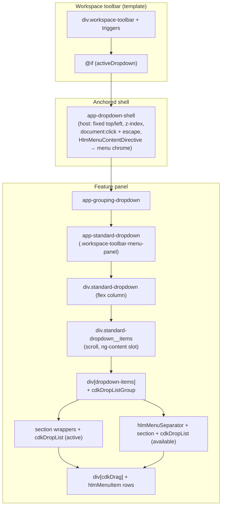

# Toolbar menu / dropdown DOM structure audit

**Date:** 2026-05-17  
**Scope:** Workspace and projects toolbars (`app-workspace-toolbar`, `projects-toolbar`), shared `apps/web/src/app/shared/dropdown-trigger/*`, and normative docs.  
**Related specs:** [dropdown-system.md](../../specs/component/filters/dropdown-system.md), [popover-panel-contract.md](../../design/design-system/popover-panel-contract.md)  
**Companion report:** [dropdown-deep-analysis-2026-05-17.md](./dropdown-deep-analysis-2026-05-17.md) (CD cost, layout jump inventory, duplicate Escape, broken-link fixes, **Reconciliation** + follow-up table).

---

## Reconciliation (2026-05-17)

Aligned with the deep analysis and **`dropdown-system.md`**: same **three-layer** toolbar stack (`shell` → feature → **`app-standard-dropdown`**), same **C-first** recommendation (DRY toolbar orchestration before flattening). **Spec paths** for sort/grouping/filter now point at **`apps/web/src/app/shared/dropdown-trigger/`** (see spec **Where It Lives** / **File Map** — replaces legacy `workspace-toolbar/` file rows).

| Follow-up | Owner |
| --- | --- |
| Refresh **`DropdownShellComponent`** callsite comment; optional **Escape** dedupe on workspace toolbar | code |
| **Toolbar orchestrator** + shared clamp helper (Approach C) | code |
| **Stacking** contract (inline shell `z-index` vs menu CVA) — one normative story | docs and/or code |
| Optional **DOM diagram / test oracle** in `dropdown-system.md` | docs |

**Token waves:** Phase **7 Batch 48** removed **`--menu-*`** from the legacy bridge; new or migrated menu SCSS should follow tweakcn + **`docs/design/token-layers.md`** / **`docs/design/tokens.md`** and **`docs/specs/component/filters/dropdown-system.md`**, not **`var(--menu-*)`**. **Batch 49** (any remaining **`--action-*`** bridge shrink) is **pending** for this audit until the design token inventory and Phase **7** batch notes are re-checked—do not assume a **`--action-*`** name exists without verifying **`token-layers.md`**.

---

## 1. Executive summary

Feldpost toolbar menus are built as a **stack of small Angular components** rather than one monolithic panel: the parent toolbar owns **open state, pixel anchoring (`top`/`left`), and which panel is active**, while `app-dropdown-shell` owns **fixed positioning, z-index, outside-click and Escape close**, and applies **Spartan-style menu chrome** via `HlmMenuContentDirective` on the shell host (until CDK Overlay / `BrnMenu` exist, per in-code TODOs). Inside the shell, each feature (`app-grouping-dropdown`, `app-sort-dropdown`, `app-filter-dropdown`, `app-projects-dropdown`) composes **`app-standard-dropdown`** for the recurring **search row + scrollable items region + optional footer action** pattern, using **`ng-content` with `[dropdown-items]`** so the inner layout stays generic while rows stay feature-specific.

The DOM is therefore **deep by design**: every `app-*` is an extra host element, and grouping adds **structural wrappers** for sections plus **`cdkDropListGroup` / `cdkDropList` / `cdkDrag`** from Angular CDK, which require a sensible ancestor tree. Filter adds a **sibling flyout** (`filter-rule__picker-flyout`) positioned beside the shell content for inline pickers, which increases **stacking and click-outside complexity** but avoids forcing all filter UI through one scroll list. This architecture **aligns with `dropdown-system.md`** (shared `dd-*` visuals, toolbar width floors, interaction inventory) and **documents the shell in `popover-panel-contract.md`**, but it trades **DOM depth and change-detection boundaries** for **clear separation of concerns** and **reuse of one shell implementation** across workspace, projects page, map, media, and upload.

The main risks are **developer experience** (mental model spans 3–4 files to change one panel), **test selectors** that break when wrapper depth shifts, and **future refactors** (CDK Overlay, `BrnMenu`) that must preserve **document click containment** (`stopPropagation` on shell), **drag vs outside-close** (`outsideCloseEnabled` tied to `isDragging()`), and **horizontal clamp math** synchronized between `toolbar-menu-panel-layout.ts` and `dropdown-shell.component.scss`.

---

## 2. Current tree (representative paths)

### 2.1 Representative path: **Grouping** (workspace toolbar)

Source: `workspace-toolbar.component.html` (shell + `@switch`) → `grouping-dropdown.component.html` → `standard-dropdown.component.html`.



**ASCII (same path, condensed):**

```
@if activeDropdown
  app-dropdown-shell          ← overlay host: fixed geom, z-index, outside close, Escape; hlmMenuContent on host
    app-grouping-dropdown     ← CDK + grouping UX + service wiring boundary
      app-standard-dropdown   ← shared search / items host / footer chrome
        (grouping: showSearch false + reserveProjectedSearchActionSlot true — no visible search row; header reset / spacer contract per dropdown-system.md)
        div.standard-dropdown
          div.standard-dropdown__items
            div[dropdown-items][cdkDropListGroup]
              div.grouping-section … cdkDropList … cdkDrag …
              div[hlmMenuSeparator]
              div.grouping-section … cdkDropList … cdkDrag …
```

**Why each layer exists**

| Layer | Primary responsibility |
| --- | --- |
| Toolbar `@if` / `@switch` | Single open panel id; avoids mounting all panels at once. |
| `app-dropdown-shell` | Manual popover positioning; `click` stopPropagation; document click + Escape; `HlmMenuContentDirective` for **option-menu-surface** styling; `panelClass` for **toolbar-dropdown** width floors. |
| `app-grouping-dropdown` | **CDK drag/drop** (`CdkDropListGroup` connects two lists), multi-select rows, reset control, i18n; keeps **standard-dropdown** free of CDK. |
| `app-standard-dropdown` | **Composable body**: optional search grid, **`[dropdown-items]`** projection, optional `actionLabel` footer, `itemsScroll` for filter dismiss; **Tailwind + SCSS** min-height contract per `dropdown-system.md`. |
| Inner `div`s | **Semantic sections**, drop zones, **hlm** primitives (`hlmMenuItem`, `hlmMenuLabel`, `hlmMenuSeparator`). |

### 2.2 Shorter note: **Filter** and **Projects**

- **Filter** (`filter-dropdown.component.html`): `div.filter-dropdown-host` → **`app-standard-dropdown`** (rules band, `itemsScroll`, footer “Add a filter”) → projected **`div[dropdown-items]`** with rule rows → **sibling** `@if (openRulePicker)` **`div.filter-rule__picker-flyout`** (fixed `top`/`left`/`width`/`maxHeight`, `role="listbox"`). The flyout is **not** inside `standard-dropdown`’s items slot; it is a **second positioned surface** under the same toolbar shell sibling tree (still inside `app-filter-dropdown`).

- **Projects** (`projects-dropdown.component.ts` inline template): **`app-projects-dropdown`** → **`app-standard-dropdown`** → **`div[dropdown-items].projects-list`** with checkbox **`label hlmMenuItem`** rows. Same shell wrapping pattern as workspace when embedded under `app-dropdown-shell` in `workspace-toolbar.component.html`.

---

## 3. Issues and problem analysis

### 3.1 Developer experience (DX)

- **Navigation cost:** A single visual panel spans toolbar template + shell TS + standard-dropdown + feature component + global `dd-*` / `dropdown-system.md`.
- **Projection mental overhead:** Content must use **`dropdown-items`** attribute for `ng-content select="[dropdown-items]"`; missing the attribute yields **empty panels** with no compile-time error.
- **Duplicate toolbar wiring:** `workspace-toolbar` and `projects-toolbar` both replicate **`@if` + `app-dropdown-shell` + `@switch`** pattern (projects toolbar omits `projects` case but repeats grouping/filter/sort).

### 3.2 Runtime cost

- Each **`app-*`** host is a **component instance** (change detection boundary unless `OnPush` + immutable inputs — current pattern uses **signals** in toolbars/dropdowns, which is good, but boundaries remain).
- **`contentChildren(DropdownSearchActionAnchorDirective)`** in `StandardDropdownComponent` adds **query list** maintenance when search slots exist.
- **CDK drag-drop** adds listeners and preview DOM during drag; **`outsideCloseEnabled`** is explicitly disabled while dragging to avoid **closing the shell mid-drag** (`workspace-toolbar` binds `!isDragging()`).

### 3.3 Layout and reflow

- **Width sync:** CSS `min-width` / viewport clamp on `:host.toolbar-dropdown` must stay aligned with **`toolbarDropdownPositionWidthPx`** used when computing **`left`** clamp — documented in `dropdown-system.md` and `toolbar-menu-panel-layout.ts`.
- **Nested scroll + gutter:** Filter uses **`standard-dropdown__items--filter-rules-band`** to pin **`scrollbar-gutter: stable`** to one scroll owner (see spec) — deep trees make **accidental double scroll** easier if new wrappers gain `overflow`.

### 3.4 Accessibility (a11y)

- **Trigger semantics** live on toolbar buttons (`aria-expanded`, `aria-haspopup`); **panel** is not necessarily a single `role="menu"` — rows use **`hlmMenuItem`** patterns; filter pickers use **`role="listbox"`** on flyouts.
- **Focus management** is largely **manual** (shell is not CDK FocusTrap); deep nesting does not by itself break a11y, but **keyboard order** across **shell + flyout** must stay intentional when restructuring.

### 3.5 Test fragility

- E2E / component tests often use **CSS deep chains**; extra hosts (`app-standard-dropdown`, `app-grouping-dropdown`) make **brittle selectors** likely.
- **Multiple positioned layers** (filter flyout) require tests to distinguish **which** overlay receives click.

### 3.6 z-index / stacking

- Shell uses **inline `z-index: 300`** (dropdown plane; **Batch 43**); `menuContentVariants` also includes **`z-50`** on menu content styling — **two layers of “elevation” semantics** (positioned shell + inner Tailwind z) can confuse future overlays.
- Filter **flyout** must stay **above** rule rows but **below** or **alongside** future global overlays; any flattening must **preserve stacking contracts**.

### 3.7 Duplicate shells / drift risk

- **`app-dropdown-shell`** is reused in **map-shell, media, upload, workspace-selected-items, media-detail-***, etc. (grep: multiple callsites). Toolbar-specific **`panelClass`** / width behavior is **concentrated** in `toolbarDropdownPanelClass`, which is good — but **non-toolbar** shells can drift from **toolbar menu** behavior unless changes stay spec-driven.

---

## 4. Three distinct solution approaches

### Approach A — **Flatten: merge shell + standard body for toolbar-only**

**Idea:** Introduce e.g. `ToolbarMenuShellComponent` that combines **`DropdownShellComponent` responsibilities** + **`StandardDropdownComponent` layout** into **one** `app-*` for workspace/projects toolbars only; feature panels become **template partials** or a single child with **no intermediate `app-standard-dropdown`**.

| Pros | Cons |
| --- | --- |
| Fewer DOM nodes and **one** change-detection shell for the common case | **Forks** shell behavior (toolbar vs map/media) → duplication or `*ngIf` spaghetti unless abstracted carefully |
| Easier mental model for the **90% path** | **High regression risk** for document click, Escape, `minWidth` / clamp, `itemsScroll`, search slot contract |
| | Filter flyout and CDK grouping may still need **extra** wrappers → savings may be smaller than expected |

**Risks:** Breaking **`outsideCloseEnabled`** interaction with drag; losing **`HlmMenuContentDirective`** host wiring if merged incorrectly.

---

### Approach B — **Composition-only inner feature (drop redundant `app-` hosts)**

**Idea:** Keep **`app-dropdown-shell`** as the **only** overlay host. Replace **`app-grouping-dropdown`** / parts of **`app-standard-dropdown`** with **directives + presentational components** that **do not add hosts** (e.g. `*groupingMenuBody` structural directive is usually wrong in Angular; prefer **`ng-template` + host-less directives** or **single feature component** that inlines what `standard-dropdown` does for that panel only).

| Pros | Cons |
| --- | --- |
| Targets **redundant** middle hosts while keeping shell | **`StandardDropdown`** projection API is valuable; inlining **four** panels duplicates **search row**, **footer**, **scroll** behavior |
| Can preserve CDK tree under one feature root | Risk of violating **“no duplicate geometry ownership”** if Tailwind/SCSS splits across new abstractions |

**Risks:** **Projection / content child** APIs move — every consumer must migrate; easy to break **sort** search-action slot layout.

---

### Approach C — **Single `ToolbarMenuPanel` orchestrator with `ng-template` outlets**

**Idea:** One component **`app-toolbar-menu-panel`** owns `@switch (activeDropdown)` **inside** the shell (or wraps shell), exposes **`ng-template`** refs or **typed context** for each panel body; **shell + positioning + panelClass** live in one TS module; features supply **templates** or **lazy standalone** imports.

| Pros | Cons |
| --- | --- |
| **One DOM path** for toolbar wiring; removes duplicate **`projects-toolbar` vs `workspace-toolbar`** shell blocks | Large component or heavy **dynamic import** wiring; reviewers may dislike “god” orchestrator |
| Clear place for **clamp width**, **`isDragging`**, shared behavior | Template outlets can hurt **readability** vs explicit child components |
| Phased: start by **moving duplicate HTML** without changing leaf rows | **Inputs/outputs** must be threaded through context objects |

**Risks:** Outlet-based APIs can complicate **static typing** and **Angular language service** ergonomics unless well-typed.

---

## 5. Recommendation

**Recommended direction: Approach C first (consolidate toolbar shell + switch), then selectively Approach B (reduce hosts only where a spec proves redundancy).**

**Rationale:** The deepest pain is **duplicated toolbar orchestration** and **cross-file width/clamp coupling**, not the mere presence of `app-standard-dropdown`, which **encodes a real shared contract** (search band, items scroll host, footer, `itemsScroll`) already documented in **`dropdown-system.md`**. Merging shell + standard (Approach A) **conflates overlay lifecycle with menu body layout** and multiplies regression surface for **all** `app-dropdown-shell` callsites if done hastily. A dedicated **`ToolbarMenuPanel`** (or equivalent) preserves **`app-dropdown-shell`** as the **popover host** aligned with **`popover-panel-contract.md`**, centralizes **`toolbarDropdownPanelClass` / `toolbarDropdownPositionWidthPx`**, and leaves **`app-standard-dropdown`** as the **shared menu body** until CDK Overlay migration changes the shell fundamentally.

**Phased migration steps (low break risk)**

1. **Extract duplicate `@if (activeDropdown) { app-dropdown-shell @switch … }`** from `workspace-toolbar` and `projects-toolbar` into **one** shared component (Approach C) with **unchanged** children (`app-grouping-dropdown`, etc.) — **no DOM depth reduction yet**, only **DRY orchestration**.
2. Add **component tests** (or storybook harness) that assert **document click closes**, **Escape closes**, **drag keeps panel open**, and **filter flyout** receives clicks without closing shell.
3. **Document the canonical DOM tree** in `dropdown-system.md` (link from this report) as the **test oracle** for toolbar menus.
4. When **CDK Overlay / `BrnMenu`** land (per `DropdownShellComponent` TODO), **migrate shell only** — inner **`app-standard-dropdown`** and feature components should require **minimal or no** changes if boundaries stay clean.
5. **Optional later:** For panels that **do not** use search/footer (e.g. grouping today), evaluate a **slimmer projection API** (Approach B) *only if* duplication becomes measurable; avoid merging with shell (Approach A) until overlay migration completes.

---

## 6. Reference links (repo paths)

| Document | Path |
| --- | --- |
| Dropdown / toolbar menu contract | `docs/specs/component/filters/dropdown-system.md` |
| Popover panel contract (toolbar shell called out) | `docs/design/design-system/popover-panel-contract.md` |
| Shell implementation | `apps/web/src/app/shared/dropdown-trigger/dropdown-shell.component.ts` |
| Shell toolbar width SCSS | `apps/web/src/app/shared/dropdown-trigger/dropdown-shell.component.scss` |
| Toolbar width / panel class helpers | `apps/web/src/app/shared/dropdown-trigger/toolbar-menu-panel-layout.ts` |
| Standard body layout | `apps/web/src/app/shared/dropdown-trigger/standard-dropdown.component.html` |
| Grouping + CDK | `apps/web/src/app/shared/dropdown-trigger/grouping-dropdown.component.html` |
| Workspace wiring | `apps/web/src/app/shared/workspace-pane/toolbar/workspace-toolbar/workspace-toolbar.component.html` |
| Projects page wiring | `apps/web/src/app/features/projects/projects-toolbar.component.html` |
| Menu chrome CVA | `apps/web/src/app/shared/ui/menu/menu-variants.ts` |

---

## 7. Code citations (anchors)

**Shell:** fixed geometry, z-index, document click / escape, `HlmMenuContentDirective` host directive — `apps/web/src/app/shared/dropdown-trigger/dropdown-shell.component.ts`.

**Toolbar → shell → feature switch:** `apps/web/src/app/shared/workspace-pane/toolbar/workspace-toolbar/workspace-toolbar.component.html` (lines 58–86 region).

**Grouping → standard → `cdkDropListGroup`:** `apps/web/src/app/shared/dropdown-trigger/grouping-dropdown.component.html` (opens with `app-standard-dropdown`, inner `div` with `dropdown-items` + `cdkDropListGroup`).

**Standard dropdown items projection:** `apps/web/src/app/shared/dropdown-trigger/standard-dropdown.component.html` (`ng-content select="[dropdown-items]"`).

**Filter flyout sibling:** `apps/web/src/app/shared/dropdown-trigger/filter-dropdown.component.html` (block after `</app-standard-dropdown>`).

---

*End of report.*
