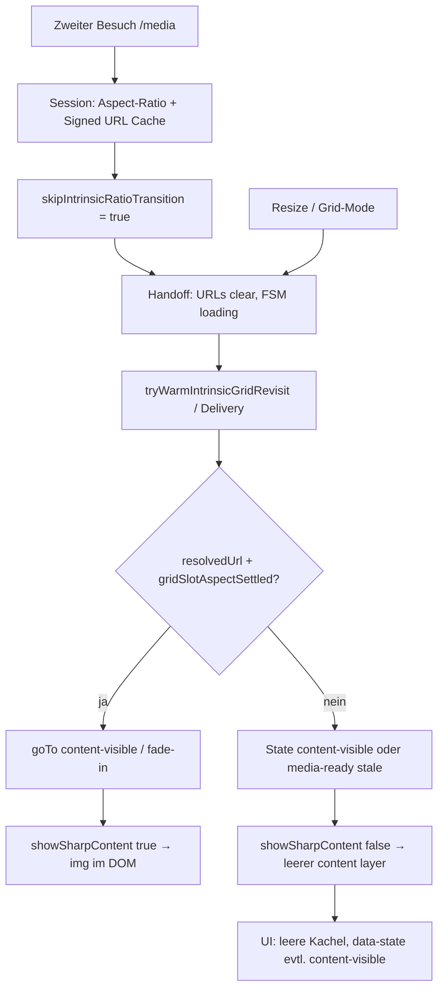

# Media-Grid: Warm-Revisit / State-Skip — Regressionsbericht

**Datum:** 2026-05-27  
**Repo:** `/home/matthias/Projects/feldpost`  
**Scope:** `/media`-Galerie (Grid intrinsic), `MediaItemComponent` + `MediaDisplayComponent`, `MediaDownloadService`, Session-Caches  
**Auslöser (Product):** Leere Kacheln trotz Upload, springendes Layout, schlechte Übergänge — **erst sichtbar nach** Implementierung „States überspringen, wenn man schon mal auf `/media` war“.

**Verwandte Artefakte:**

- Spec: [`docs/specs/component/media/media-display.md`](../specs/component/media/media-display.md) § Intrinsic grid warm revisit  
- Opacity-Matrix: [`docs/specs/component/media/media-display.rendering-matrix.supplement.md`](../specs/component/media/media-display.rendering-matrix.supplement.md)  
- Session-Notizen: [`docs/ai-diary/2026-05-25.md`](../../ai-diary/2026-05-25.md)  
- Live-Check-Pflicht: [`docs/agent-workflows/agent-communication.md`](../../agent-workflows/agent-communication.md) (LIVE VERIFICATION, zweiter `/media`-Besuch)

---

## 1. Kurzfassung

Die Media-Grid-Vorschau wurde auf einen **mehrstufigen FSM** (`MediaDisplayComponent`) mit **Session-Aspect-Cache**, **Warm-Revisit** (signierte URL + Ratio aus Cache) und **übersprungenen Zwischenzuständen** beim erneuten Betreten von `/media` umgestellt.

**Ziel:** Kein erneutes 1:1-Pulse → Shrink → Fade bei Revisit; schnellere, ruhigere Kacheln.

**Beobachtetes Ergebnis:** Neue Fehlerklassen — u. a. Kacheln mit **`data-state="content-visible"`** aber **ohne `` im DOM**, zufällig leere Vorschauen, unruhiges Grid (300 ms Aspect-Transition pro Kachel, gestaffelt), dunkle/leere Flächen mit trotzdem sichtbarem JPEG-Chip.

**Kernursache (architektonisch):** Es gibt **zwei unabhängige „Wahrheiten“**:

| Schicht | Was sie steuert | Sichtbar für DevTools |
| --- | --- | --- |
| FSM `data-state` auf `.media-display__viewport` | Layer-**Opacity** (CSS-Matrix) | `content-visible` = „finale Phase“ |
| `showSharpContent()` + `gridSlotAspectSettled` | Ob `` **gemountet** wird | Leerer `.media-display__layer--content` trotz `content-visible` |

Warm-Revisit verkürzt bewusst den FSM-Pfad (`media-ready` → `content-visible` ohne Fade, `skipIntrinsicRatioTransition`, vorgefüllte Ratio). Dadurch steigt die Wahrscheinlichkeit von **Races** (URL geleert / Handoff / Resize, State bleibt „fertig“, Gate blockiert Bild).

**Zeitliche Einordnung:** Probleme korrelieren mit Commits **~2026-05-25–26** (Media-Display-FSM, Warm-Revisit, Aspect-Cache, pixelbasierte Slot-Messung), nicht mit fehlenden DB-Daten allein.

---

## 2. Was implementiert wurde („States skippen“)

### 2.1 Session-Aspect-Ratio-Cache

- **Service:** `MediaAspectRatioCacheService` (`8bb4bdf1` u. a.)  
- **Grid:** `media-item` setzt initiale Slot-Ratio aus Cache oder `1` ([`media-item-grid-aspect.helpers.ts`](../../../apps/web/src/app/shared/media-item/media-item-grid-aspect.helpers.ts)).  
- **Parent-Input:** `[skipIntrinsicRatioTransition]="gridSessionAspectPrefilled()"` — wenn Ratio in Session, **keine** 300 ms Shrink-Animation ([`media-item.component.html`](../../../apps/web/src/app/shared/media-item/media-item.component.html)).

### 2.2 Warm-Revisit im Display

- **Helper:** `canWarmSkipGridLoadingSurface()` — Grid + intrinsic + Session-Ratio + gecachte Preview-URL ([`media-display-warm-revisit.helpers.ts`](../../../apps/web/src/app/shared/media-display/media-display-warm-revisit.helpers.ts)).  
- **Ablauf (Spec):** Handoff → `registerPreviewPaths` → optional URL aus Cache seeden → legaler FSM-Pfad, **kein** Shortcut `loading-surface-visible` → `content-visible` ([`media-display.md`](../specs/component/media/media-display.md) § Intrinsic grid warm revisit).  
- **Skip-Fade:** Transition-Map erlaubt `media-ready` → `content-visible` ([`media-display-state.ts`](../../../apps/web/src/app/shared/media-display/media-display-state.ts)); Fix für früheren No-Op-Bug dokumentiert in [`2026-05-25.md`](../../ai-diary/2026-05-25.md) (#1).

### 2.3 DOM-Gate für scharfes Bild (Grid)

- Sharp-`` nur bei `showSharpContent()`:
  - State `content-fade-in` **oder** `content-visible`
  - **und** `resolvedUrl()`
  - **und** `gridSlotAspectSettled` (Grid intrinsic)  
- Spec: Bild erst nach committed Slot-Aspect — verhindert Letterboxing während Shrink; auf Warm-Revisit soll `gridSlotAspectSettled` früh `true` sein.

### 2.4 Weitere Verstärker (gleiche Zeitscheibe)

- **Pixel-Slot-Messung** für Signing-Tier (`c72da7ea`) — `ResizeObserver` → `slotPixels` → Handoff-Key enthält gerundete px-Größe → bei Größenänderung **neuer Handoff** (URLs geleert, FSM zurück auf `loading-surface-visible`).  
- **Media-Page-State / Listen-Cache** (`fd017cf9`, `5e23152c`) — Route-Reentry ohne Full-Reload der Liste.

---

## 3. Beobachtete Symptome (Product + DevTools)

| Symptom | UI | Typische DevTools-Signatur |
| --- | --- | --- |
| **Leere Kachel** | Weiß/dunkel, JPEG-Chip sichtbar | `app-media-item` hat Daten; `.media-display__layer--content` ohne `` |
| **„Geladen“ ohne Bild** | Eine Kachel in voller Grid, Nachbarn OK | `app-media-display` **`data-state="content-visible"`**, Content-Layer leer (`<!--container-->`) |
| **Springendes Grid** | Kacheln wechseln Höhe/Breite nacheinander | `--media-aspect-ratio` Transition 300 ms; gestaffeltes Ratio-Probing |
| **Schlechte Übergänge** | Pulse → leer → Bild; oder nie Bild | FSM-Opacity vs. fehlendes ``; staged layer leer |
| **Revisit schlechter als Erstbesuch** | Zweiter `/media`-Besuch bricht eher | Warm-Pfad + Handoff-Clear + früher `content-visible` ohne URL |

**Wichtig:** `app-media-item` **`data-state="idle"`** = **nicht ausgewählt**, nicht „lädt nicht“. Für Preview nur **`app-media-display`** / `.media-display__viewport` auswerten.

---

## 4. Reproduktion (minimal)

1. App starten, **Map → Media** (erster Besuch) — Grid teils OK, teils leer (je nach Timing).  
2. **Map → Media** erneut (zweiter Besuch, Warm-Revisit) — höhere Rate leerer Kacheln / `content-visible` ohne ``.  
3. Grid-Dichte wechseln (sm / md / lg) — erneutes Springen + ggf. neue leere Kacheln (Resize-Handoff).  
4. DevTools: betroffene Kachel → `data-state` + prüfen ob `.media-display__layer--content img` existiert.

`ng build` / Unit-Tests allein **beweisen** diesen Pfad nicht (siehe Diary: „Build green ≠ revisit OK“).

---

## 5. Root-Cause-Analyse

### 5.1 Desync: FSM vs. DOM-Gate (bestätigter Fall)

**Befund (User-Screenshots 2026-05-27):**

- `data-state="content-visible"` auf Host und Viewport  
- Kein `` in `.media-display__layer--content`  
- `showSharpContent()` ist damit **false**, obwohl der FSM „finale Sichtbarkeit“ meldet.

**Folge:** CSS setzt Content-Layer auf `opacity: 1` (Matrix-Zeile `content-visible`), aber die Layer ist **leer** → Kachel wirkt leer/dunkel; Chip kommt vom Parent.

**Wahrscheinliche Mechanismen:**

1. **`resolvedUrl` leer**, State nicht zurückgesetzt (Handoff sollte `loading-surface-visible` setzen; Race oder früher Return in `handleDelivery` bei bereits `content-visible`).  
2. **`gridSlotAspectSettled === false`** bei State `content-visible` (seltener, gleiches Symptom).  
3. **Handoff** in einem Tick: URL clear + später `content-visible` ohne erneutes Setzen der URL (Effekt-Reihenfolge / `tryWarmIntrinsicGridRevisit` / Delivery `loaded` mit frühem `return`).

Relevanter Code-Pfad bei `content-visible` + Delivery `loaded`:

```352:362:apps/web/src/app/shared/media-display/media-display.component.ts
        if (current === 'content-fade-in' || current === 'content-visible') {
          // ...
          // Tier upgrade after resize / grid-lg: keep visible state, swap sharp URL only.
          return;
        }
```

Wenn `delivery.resolvedUrl` fehlt, wird die URL **nicht** geleert, aber auch **nicht** gesetzt — bei bereits leerem Signal bleibt die Kachel in `content-visible` ohne Mount.

### 5.2 Warm-Revisit erhöht Race-Fläche

| Cold path | Warm revisit (skip) |
| --- | --- |
| Pulse → ratio-known-contain → shrink → media-ready → fade → content-visible | loading → (kurz) media-ready → **content-visible** (skip fade) |
| `gridSlotAspectSettled` wird durch `transitionend` / Microtasks gesetzt | oft **sofort** `true` via `skipIntrinsicRatioTransition` |
| URL kommt typisch nach Ratio-Choreography | URL aus Cache **seeded**, Handoff **cleared** URL zuerst |

Jeder **Resize** mit geändertem Handoff-Key (`slotPixels`):

```163:182:apps/web/src/app/shared/media-display/media-display.component.ts
      if (isNewHandoff) {
        this.resolvedUrl.set('');
        this.stagedContentUrl.set('');
        // ...
        this.goTo('loading-surface-visible');
      }
```

Wenn danach Reveal nicht vollständig läuft, kann ein **stale** `content-visible` (z. B. via `transitionend` oder vorherigem Tick) mit leerer URL entstehen.

### 5.3 Layout „springt“ — teils beabsichtigt

- Grid-Host: festes **Quadrat** (`aspect-ratio: 1` auf `app-media-item`).  
- Innerer Slot: **animierte** Ratio (`300ms` auf `aspect-ratio` + `inline-size`).  
- Pro Kachel asynchrones Ratio-Probing → gestaffelte Größenänderung = wahrgenommenes „Springen“.  
- Warm-Revisit **reduziert** Shrink pro Kachel, **ersetzt** ihn aber durch Handoff/Resize-Risiken.

### 5.4 Nicht-primary: fehlende Datei

JPEG-Chip + `data-has-item="true"` sprechen gegen „kein Datensatz“. Signing (`thumbnail_path` stale, 400) kann zusätzlich einzelne Kacheln treffen; das erklärt nicht zuverlässig **`content-visible` ohne ``** — das ist ein **Renderer-State-Bug**.

---

## 6. Kausalkette (User-Hypothese ↔ Code)



**Fazit zur Hypothese:** Die Probleme sind **konsistent mit** der Warm-Revisit-/Skip-Implementierung, nicht mit einem unrelated Regression in der Gallerie-Query allein.

---

## 7. Bekannte Issues aus Implementierung (bereits dokumentiert)

Aus [`docs/ai-diary/2026-05-25.md`](../../ai-diary/2026-05-25.md) (Auszug):

| # | Issue | Status im Code |
| --- | --- | --- |
| 1 | `media-ready` → `content-visible` war No-Op | **Behoben** in Transition-Map (`ce0d5799`) |
| 3 | FSM ≠ sichtbares Bild (`showSharpContent`, `gridSlotAspectSettled`) | **Offen** — User-Fall 2026-05-27 |
| 4 | Warm cache + cold choreography races | **Teilweise** mit Effects / `syncGridIntrinsicRevealAfterUrlUpdate` |
| 5 | Stale `no-media` vs cached URL | Service-Anpassung dokumentiert |
| 6 | Illegale Shortcuts | Guard `FORBIDDEN_SHORTCUTS` |

---

## 8. Empfohlene Fix-Richtungen (nur Planung)

Priorität nach Impact / Aufwand:

1. **Invariante durchsetzen:** Wenn `state` ∈ `{ content-fade-in, content-visible }` und `!resolvedUrl()` oder (grid intrinsic && `!gridSlotAspectSettled`) → **regress** zu `loading-surface-visible` oder `media-ready`, nie „fertig“ ohne Gate.  
2. **`handleDelivery`:** Bei `content-visible` + `loaded` ohne `resolvedUrl` nicht blind `return` — State downgraden oder erneut `syncGridIntrinsicRevealAfterUrlUpdate`.  
3. **Handoff:** URL clear und FSM-Reset **atomar**; verhindern, dass `content-visible` ohne URL erreichbar bleibt (inkl. stale `transitionend`).  
4. **Resize-Handoff:** Handoff-Key entkoppeln oder debouncen, wenn nur Sub-pixel / Aspect-Animation (weniger URL-Clear während Reveal).  
5. **Observability:** Dev-only `data-debug` oder Konsole wenn `content-visible && !showSharpContent` (hilft LIVE CHECK).  
6. **Spec-Update:** Matrix um Spalte „`` mounted“ ergänzen; Warm-Revisit-AC: „zweiter Besuch: jede Kachel mit `content-visible` hat ``“.

Keine Änderung an JPEG-Chip / `media-item`-Selection-FSM nötig für diesen Bug.

---

## 9. Verifikation (Pflicht vor „fixed“)

| Schritt | Erwartung |
| --- | --- |
| Map → Media (1) | Alle sichtbaren Bild-Kacheln mit `` |
| Map → Media (2) | Gleich; **kein** `content-visible` ohne `` |
| Grid sm → lg | Keine dauerhaft leeren Kacheln; Springen akzeptabel oder reduziert (Product-Entscheid) |
| DevTools Stichprobe | `data-state` ∈ `content-fade-in`, `content-visible` ⇒ Content-Layer hat `img` |
| Network | Sign 200 für `thumbnail_path` oder Fallback `storage_path` |

---

## 10. Code-Index

| Datei | Rolle |
| --- | --- |
| `apps/web/src/app/shared/media-display/media-display.component.ts` | FSM, Handoff, `showSharpContent`, Warm-Revisit |
| `apps/web/src/app/shared/media-display/media-display.component.html` | Layer + `@if (showSharpContent())` |
| `apps/web/src/app/shared/media-display/media-display-state.ts` | Transition-Map, verbotene Shortcuts |
| `apps/web/src/app/shared/media-display/media-display-warm-revisit.helpers.ts` | Warm-Skip-Bedingung |
| `apps/web/src/app/shared/media-item/media-item.component.ts` | `gridSessionAspectPrefilled`, Aspect-Bootstrap |
| `apps/web/src/app/core/media/media-aspect-ratio-cache.service.ts` | Session-Ratio |
| `apps/web/src/app/core/media-download/media-download.service.ts` | Delivery, URL-Cache, Tier |
| `apps/web/src/app/shared/media-item/media-item.component.scss` | 300 ms Slot-Transition |

**Relevante Commits (Auswahl):**

- `8bb4bdf1` — aspect ratio caching  
- `ce0d5799` — FSM + layer matrix + `content-visible` edge  
- `c72da7ea` — pixel slot measurement / handoff key  
- `fd017cf9` — media-page-state cache  

---

## 11. Offene Fragen / Entscheidungen Product

1. Ist **gestaffeltes Shrink** (300 ms pro Kachel) auf Erstbesuch noch gewünscht, wenn Warm-Revisit Shrink skippt?  
2. Dürfen wir auf Revisit **immer** `content-fade-in` erzwingen (langsamer, konsistenter)?  
3. Soll bei Desync **`error`** oder **`loading`** angezeigt werden statt leerer „fertiger“ Kachel?

---

## 12. Fix (2026-05-27)

**Implementiert:** `media-display-sharp-content-gate.helpers.ts` + Anpassungen in `media-display.component.ts`

- `goTo()` leitet `content-fade-in` / `content-visible` auf `media-ready` oder `loading-surface-visible` um, wenn kein Sharp-Mount möglich.
- `reconcileContentRevealState()` korrigiert nur noch **fehlende URL** (nicht mehr `gridSlotAspectSettled` während Shrink — verhinderte „Bild weg“ mitten in `content-fade-in`).
- **Handoff-Key ohne `slotPixels`:** Resize während Aspect-Animation löst kein URL-Clear mehr aus; Tier-Upgrade nur über `getState(id, slot)`-Subscription.
- **Warm identity handoff:** bei Cache-Hit keine URL-Löschung / kein Reset auf `loading-surface-visible`.

**LIVE CHECK:** Map → Media → Map → Media; Bilder bleiben sichtbar (kein Laden-und-Verschwinden); keine Kachel mit `content-*` und leerem Content-Layer.

---

*Bericht erstellt aus Code-Review, Specs und User-DevTools (2026-05-27). Fix in §12.*
