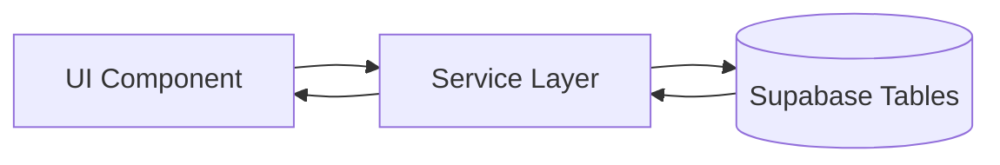
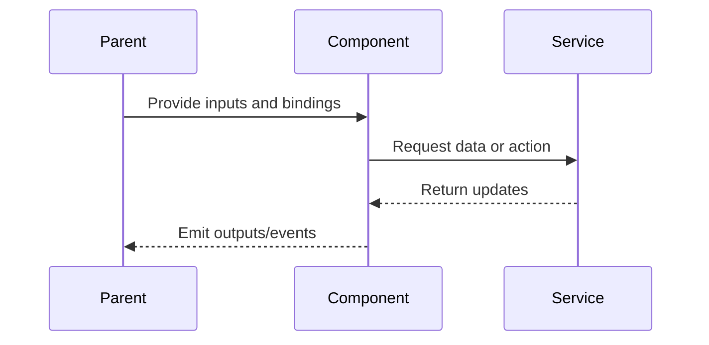

# Active Filter Chips

> **Service contract:** [filter-service](../service/filter/filter-service.md)

## What It Is

A compact row of filter chips that appears above (or near) the search bar when any filter is active. Each chip shows one active filter with a "×" to remove it. Provides at-a-glance visibility of what's currently filtering the map — users should never wonder why results are missing.

## What It Looks Like

Horizontal row of small pills. Each pill: `--color-bg-elevated` background, text label describing the filter, "×" button on the right. Wraps to multiple rows if many filters active. Visible only when at least one filter is set. Positioned between the search bar and the map content.

## Where It Lives

- **Parent**: Map Zone, positioned below Search Bar
- **Appears when**: At least one filter is active in `FilterService`

## Actions

| #   | User Action        | System Response                              | Triggers                               |
| --- | ------------------ | -------------------------------------------- | -------------------------------------- |
| 1   | Clicks × on a chip | Removes that specific filter                 | `FilterService` update, map re-queries |
| 2   | Sees chips visible | Knows filters are active (Honesty principle) | —                                      |

## Component Hierarchy

```
ActiveFilterChips                          ← flex wrap row, gap-2, below search bar
└── FilterChip × N                         ← pill: label + × button
    ├── ChipLabel                          ← e.g. "Project: Building A" or "Date: Jan–Mar 2026"
    └── RemoveButton (×)                   ← 16px, ghost, removes this filter
```

## Data

### Data Flow (Mermaid)



| Field          | Source                         | Type             |
| -------------- | ------------------------------ | ---------------- |
| Active filters | `FilterService.activeFilters$` | `ActiveFilter[]` |

## State

No own state — derived from `FilterService`. Chips appear/disappear reactively.

## File Map

| File                                                         | Purpose              |
| ------------------------------------------------------------ | -------------------- |
| `features/map/filter-chips/active-filter-chips.component.ts` | Chip strip component |

## Wiring

### Wiring Flow (Mermaid)



- Import `ActiveFilterChipsComponent` in `MapShellComponent`
- Inject `FilterService` to read active filters
- Place below Search Bar in Map Zone template

## Acceptance Criteria

- [ ] Only visible when at least one filter is active
- [ ] Each chip shows a human-readable filter description
- [ ] Clicking × removes that filter and updates the map
- [ ] Chips never reset by search actions (unless user explicitly clears)
- [ ] Wraps gracefully when many filters are active
