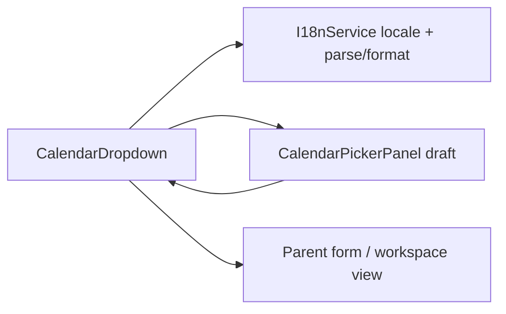
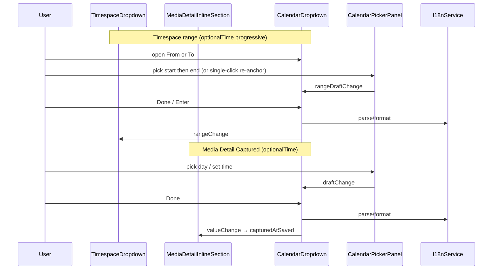

# Calendar Dropdown

## What It Is

Shared **date/time picker** for Feldpost: labeled text field, calendar affordance, and a **body-portaled** popover. Replaces ad-hoc pairings of `app-compact-date-field` + inline `app-captured-date-editor`. Parents pass variant (`timeMode`), bounds (`minDate` / `maxDate`), and optional disabled days; locale-aware typing uses active `I18nService` formatting (see [`language-locale-settings.md`](../../ui/settings-overlay/language-locale-settings.md)).

## What It Looks Like

Single control row: optional label, bordered shell (`2.25rem` min height — toolbar `hlmBtn size="sm"` parity), locale-ordered date text input, trailing `calendar_today` icon button. Open popover: frosted panel (`calendar-picker-panel`) below trigger with flip-above when needed; never clipped by toolbar `dropdown-shell` (`overflow-hidden`). Gold quiet emphasis on shell hover/focus per [`interaction-emphasis-ink-contract.md`](../../system/interaction-emphasis-ink-contract.md).

## Where It Lives

| Call site | Parent | Mode / variant |
| --- | --- | --- |
| Timespace From/To | [`app-timespace-dropdown`](../../component/map/map-filter-toolbar.md) | `mode='range'`, `timeMode='optionalTime'` (progressive), org domain bounds |
| Media Detail Captured | `app-media-detail-inline-section` | `mode='single'`, `optionalTime` — header time row; Done not blocked when time empty |
| Future filters/metadata | any form row | per parent |

**Selector:** `app-calendar-dropdown`

## Variants & constraints

Normative API (implementation mirrors `types.ts`):

| Input | Type | Default | Effect |
| --- | --- | --- | --- |
| `mode` | `'single' \| 'range'` | `'single'` | `range`: From/To pair + one shared popover — see [`calendar-dropdown.range-mode.supplement.md`](calendar-dropdown.range-mode.supplement.md) |
| `timeMode` | `'dateOnly' \| 'optionalTime' \| 'requiredTime'` | `'dateOnly'` | Panel time UI + Done validation; range uses progressive Add time (supplement) |
| `minDate` | `Date \| null` | `null` | Days before min **disabled** (muted, no select) |
| `maxDate` | `Date \| null` | `null` | Days after max **disabled** |
| `disabledDates` | `ReadonlySet<string> \| null` | `null` | Extra ISO `YYYY-MM-DD` disables (optional v1) |
| `nullable` | `boolean` | `true` | Clear action may emit `null` |
| `label` / `ariaLabel` | `string` | `''` | Accessible name |
| `value` | `CalendarDropdownValue` | `null` | Single mode only |
| `rangeValue` | `CalendarRangeValue` | `null` | Range mode only — `{ from, to }` halves |
| `fromLabel` / `toLabel` | `string` | `''` | Range mode field labels |

**Timespace bounds (normative):** parent MUST pass `minDate` = oldest media in scoped catalog (UTC day), `maxDate` = today (UTC day). Out-of-range days are disabled, not merely styled.

**Range mode (normative):** one `app-calendar-dropdown` with `mode='range'` replaces two independent instances. Both From/To fields open the same portaled panel; range pick FSM and progressive time: [`calendar-dropdown.range-mode.supplement.md`](calendar-dropdown.range-mode.supplement.md). Histogram stays in `app-timespace-dropdown`.

## Actions

| # | User action | System response |
| --- | --- | --- |
| 1 | Focus/type in text field | Parse with `I18nService.parseDateFieldValue` / time helpers; invalid stays draft until blur or commit |
| 2 | Click calendar icon (either field in range mode) | Toggle shared popover; anchor to opening field; portal to `document.body` |
| 3 | Pick day in panel | Updates draft per range FSM; does not close until **Done** |
| 4 | Edit time (when `timeMode` allows) | Local draft; `requiredTime` blocks Done until valid `HH:MM` |
| 5 | Click **Done** or **Enter** in panel | Emit `valueChange` + close popover if valid |
| 6 | Click **Clear** (when `nullable`) | Emit `null` date/time + close |
| 7 | **Escape** | Close without emit (revert draft to last committed `value`) |
| 8 | Outside click | Same as Escape (cancel draft) |

## Component hierarchy

**Single mode** (`mode='single'`):

```
app-calendar-dropdown
├── label [optional]
├── .calendar-dropdown__control
│   ├── input.calendar-dropdown__input
│   └── button.calendar-dropdown__trigger ← anchor
└── app-dropdown-shell → app-calendar-picker-panel (single pick)
```

**Range mode** (`mode='range'`):

```
app-calendar-dropdown
├── .calendar-dropdown__range-row
│   ├── .calendar-dropdown__control (From) ← anchor when opened via From
│   └── .calendar-dropdown__control (To)   ← anchor when opened via To
└── app-dropdown-shell (one instance) → app-calendar-picker-panel (range pick)
```

Panel contract: [`calendar-picker-panel.md`](calendar-picker-panel.md). Portal/placement: [`calendar-dropdown.range-mode.supplement.md`](calendar-dropdown.range-mode.supplement.md) § Shared popover (same rules apply to single mode).

## Data



| Field | Source | Notes |
| --- | --- | --- |
| Display text | `I18nService.formatDateFieldValue` | Order from active locale |
| Wire date | ISO `YYYY-MM-DD` UTC | Same as `date-field.helpers` |
| Wire time | `HH:MM` or `null` | When `timeMode` ≠ `dateOnly` |

## State

| State | Owner | Notes |
| --- | --- | --- |
| `popoverOpen` | `CalendarDropdownComponent` | FSM: closed ↔ open |
| `committedValue` | parent `value` or `rangeValue` | Source of truth |
| `draftValue` / `rangeDraft` | dropdown while open | Discarded on cancel |
| `anchorTarget` | range open FSM | `'from' \| 'to'` — field that opened popover; see range supplement |
| `timeExpanded` | range + optionalTime | Add time link toggles spinner row |

Popover MUST NOT render inside `app-dropdown-shell` content box — use body portal (same invariant as filter picker flyout).

## Interaction emphasis

| Surface | Tier | Hover / focus | Owner |
| --- | --- | --- | --- |
| `.calendar-dropdown__control` | **Primary** | gold border + wash | `calendar-dropdown.component.scss` |
| `.calendar-dropdown__trigger` | **Primary** | gold (inherit shell) | same |
| Panel days | per [`calendar-picker-panel.md`](calendar-picker-panel.md) | | |

## Migration (one cutover)

| Legacy | Replacement |
| --- | --- |
| `app-compact-date-field` | `app-calendar-dropdown` |
| Inline `app-captured-date-editor` in media detail | `app-calendar-dropdown` (`timeMode` per field) |
| [`captured-date-editor.md`](captured-date-editor.md) | Superseded by panel spec; remove after migration |

## File map

| File | Purpose |
| --- | --- |
| `apps/web/src/app/shared/calendar-dropdown/calendar-dropdown.component.ts` | Shell: control row, toggle open, text commit; imports `DropdownShellComponent` |
| `apps/web/src/app/shared/calendar-dropdown/calendar-dropdown.component.html` | |
| `apps/web/src/app/shared/calendar-dropdown/calendar-dropdown.component.scss` | Gold emphasis on `.calendar-dropdown__control` |
| `apps/web/src/app/shared/calendar-dropdown/calendar-dropdown.types.ts` | `CalendarDropdownValue`, `CalendarRangeValue`, `TimeMode`, `CalendarDay` |
| `apps/web/src/app/shared/calendar-dropdown/calendar-picker-panel.component.ts` | Panel (extract from `captured-date-editor`; uses `date-field.helpers`, not `formatEU` / `parseDateInput`) |
| `apps/web/src/app/shared/calendar-dropdown/calendar-picker-panel.component.html` | |
| `apps/web/src/app/shared/calendar-dropdown/calendar-picker-panel.component.scss` | |
| `apps/web/src/app/shared/dropdown-trigger/shell/dropdown-shell.component.scss` | Add `:host.calendar-dropdown-panel { overflow: visible; }` |

## Wiring



## Acceptance criteria

- [ ] See [`calendar-dropdown.acceptance-criteria.md`](calendar-dropdown.acceptance-criteria.md) (single + range + progressive time)

## Settings

- **Language / Locale**: date field order, placeholder, and typed parsing follow active locale via `I18nService` (not per-control override).
