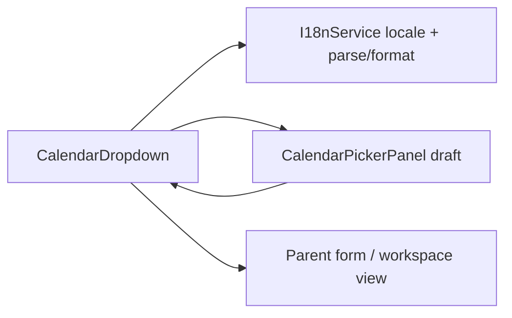

# Calendar Dropdown

## What It Is

Shared **date/time picker** for Feldpost: labeled text field, calendar affordance, and a **body-portaled** popover. Replaces ad-hoc pairings of `app-compact-date-field` + inline `app-captured-date-editor`. Parents pass variant (`timeMode`), bounds (`minDate` / `maxDate`), and optional disabled days; locale-aware typing uses active `I18nService` formatting (see [`language-locale-settings.md`](../../ui/settings-overlay/language-locale-settings.md)).

## What It Looks Like

Single control row: optional label, bordered shell (`2.25rem` min height — toolbar `hlmBtn size="sm"` parity), locale-ordered date text input, trailing `calendar_today` icon button. Open popover: frosted panel (`calendar-picker-panel`) below trigger with flip-above when needed; never clipped by toolbar `dropdown-shell` (`overflow-hidden`). Gold quiet emphasis on shell hover/focus per [`interaction-emphasis-ink-contract.md`](../../system/interaction-emphasis-ink-contract.md).

## Where It Lives

| Call site | Parent | Mode / variant |
| --- | --- | --- |
| Timespace From/To | [`app-timespace-dropdown`](../../component/map/map-filter-toolbar.md) | `mode='range'`, `layout='split'`, `timeMode='optionalTime'`, org domain bounds |
| Media Detail Captured | `app-media-detail-inline-section` | `mode='single'`, `optionalTime` — header time row; Done not blocked when time empty |
| Future filters/metadata | any form row | per parent |

**Selector:** `app-calendar-dropdown`

## Variants & constraints

Normative API (implementation mirrors `types.ts`):

| Input | Type | Default | Effect |
| --- | --- | --- | --- |
| `mode` | `'single' \| 'range'` | `'single'` | `range`: From/To pair + one shared popover — see [`calendar-dropdown.range-mode.supplement.md`](calendar-dropdown.range-mode.supplement.md) |
| `layout` | `'default' \| 'toolbar' \| 'split'` | `'default'` | `split` = timespace row (date + time + center range icon); `toolbar` = per-field calendar icon |
| `timeMode` | `'dateOnly' \| 'optionalTime' \| 'requiredTime'` | `'dateOnly'` | `optionalTime` in split layout shows [`time-field-control`](time-field-control.md) beside each date |
| `minDate` | `Date \| null` | `null` | Days before min **disabled** (muted, no select) |
| `maxDate` | `Date \| null` | `null` | Days after max **disabled** |
| `disabledDates` | `ReadonlySet<string> \| null` | `null` | Extra ISO `YYYY-MM-DD` disables (optional v1) |
| `nullable` | `boolean` | `true` | Clear action may emit `null` |
| `label` / `ariaLabel` | `string` | `''` | Accessible name |
| `value` | `CalendarDropdownValue` | `null` | Single mode only |
| `rangeValue` | `CalendarRangeValue` | `null` | Range mode only — `{ from, to }` halves |
| `fromLabel` / `toLabel` | `string` | `''` | Range mode field labels |

**Timespace bounds (normative):** parent MUST pass `minDate` = oldest media in scoped catalog (UTC day), `maxDate` = today (UTC day). Out-of-range days are disabled, not merely styled.

**Range mode (normative):** one `app-calendar-dropdown` with `mode='range'` replaces two independent instances. Both From/To fields open the same portaled panel; range pick FSM and progressive time: [`calendar-dropdown.range-mode.supplement.md`](calendar-dropdown.range-mode.supplement.md). Histogram stays in `app-timespace-dropdown`.

## Actions

| # | User action | System response |
| --- | --- | --- |
| 1 | Focus/type in date field (single or range split) | Parse with `I18nService.parseDateFieldValue`; range split: focus **opens** portaled panel anchored to that field (single-endpoint pick) |
| 2 | Focus/type in time field (`optionalTime` split) | `app-time-field-control` — type or scroll picker; commits immediately when popover closed |
| 3 | Click center calendar icon (`layout='split'`) | Toggle shared popover with `anchorTarget='pick'` — two-click **range** pick; **Done** required |
| 4 | Click calendar icon per field (`layout='toolbar'`) | Toggle shared popover; anchor to opening field |
| 5 | Pick day in panel | Split + field anchor: replace one endpoint only → **auto-commit** + close. Split + `pick`: two-click range FSM; **Done** when both set |
| 6 | Click **Done** or **Enter** in panel | Emit `valueChange` / `rangeChange` + close when valid |
| 7 | Click **Clear** (when `nullable`) | Emit `null` + close |
| 8 | **Escape** / outside click | Close without emit (revert draft) |

## Component hierarchy

**Single mode:** label → `.calendar-dropdown__control` (input + trigger) → portaled `app-calendar-picker-panel`.

**Range mode:** split / toolbar trees — [`calendar-dropdown.range-mode.supplement.md`](calendar-dropdown.range-mode.supplement.md) § Split layout. Panel: [`calendar-picker-panel.md`](calendar-picker-panel.md).

## Data

| Field | Source | Notes |
| --- | --- | --- |
| Display text | `I18nService.formatDateFieldValue` | Order from active locale |
| Wire date | ISO `YYYY-MM-DD` UTC | Same as `date-field.helpers` |
| Wire time | `HH:MM` or `null` | When `timeMode` ≠ `dateOnly` |

## State

| State | Owner | Notes |
| --- | --- | --- |
| `popoverOpen` | `CalendarDropdownComponent` | FSM: closed ↔ open |
| `committedValue` | parent `value` or `rangeValue` | Source of truth |
| `draftValue` / `rangeDraft` | dropdown while open | Discarded on cancel |
| `anchorTarget` | range open FSM | `'from' \| 'to' \| 'pick'` — field anchor, or center range pick (split only) |
| `viewAnchorAtOpen` | dropdown while open | ISO date for initial visible month; MUST NOT follow live draft (prevents dual-grid jump) |

Popover MUST NOT render inside `app-dropdown-shell` content box — use body portal (same invariant as filter picker flyout).

## Interaction emphasis

`.calendar-dropdown__control` owns hover/focus; trigger inherits `color` only — see [`interaction-emphasis-ink-contract.md`](../../system/interaction-emphasis-ink-contract.md) and range supplement Visual Behavior table.

## File map

Shell + panel + time field under `apps/web/src/app/shared/calendar-dropdown/` and `time-field-control/` — see child specs ([`time-field-control.md`](time-field-control.md) + [AC](time-field-control.acceptance-criteria.md)) for picker contract.

## Wiring

Timespace split + media detail single flows — [`calendar-dropdown.range-mode.supplement.md`](calendar-dropdown.range-mode.supplement.md) § Wiring.

## Acceptance criteria

- [ ] See [`calendar-dropdown.acceptance-criteria.md`](calendar-dropdown.acceptance-criteria.md) (single + range + progressive time)

## Settings

- **Language / Locale**: date field order, placeholder, and typed parsing follow active locale via `I18nService` (not per-control override).
