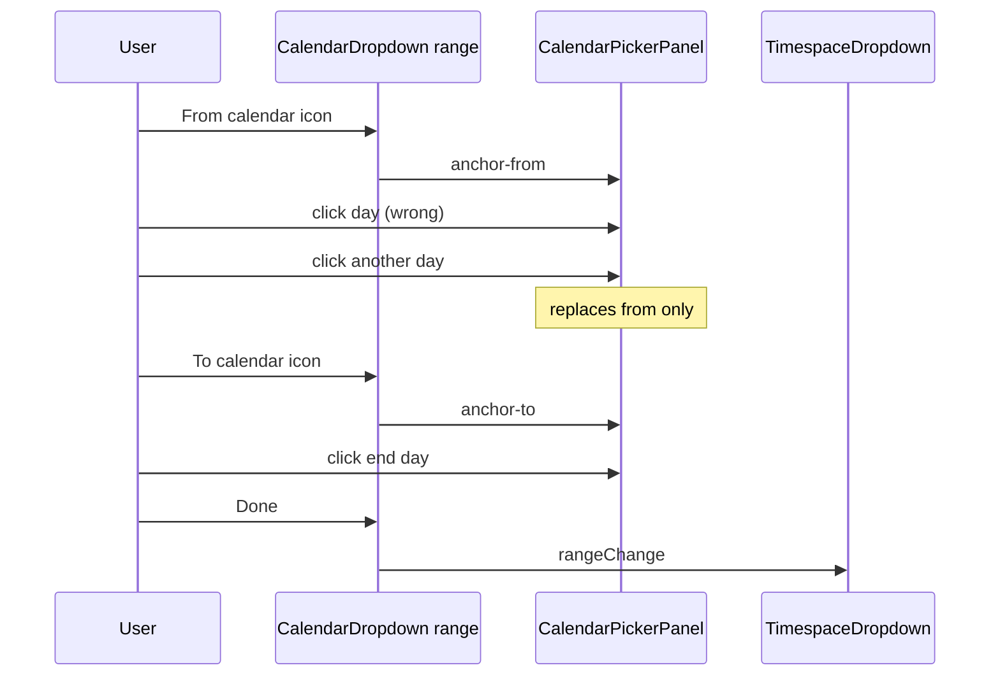

# Calendar Dropdown — Range Mode Supplement

Parent: [`calendar-dropdown.md`](calendar-dropdown.md) · Panel: [`calendar-picker-panel.md`](calendar-picker-panel.md)

## What It Is

**Range mode** on `app-calendar-dropdown`: two labeled summary fields (From / To) share **one** body-portaled calendar popover. Replaces the v1 pattern of two independent `app-calendar-dropdown` instances in [`app-timespace-dropdown`](../../component/map/map-filter-toolbar.md). Single-date mode (`mode='single'`) is unchanged for media detail and other one-shot pickers.

## What It Looks Like

Horizontal **From** and **To** fields. **`layout='split'`** (timespace): input-only From/To with one center `calendar_today` button — inputs focus one field for typing; center icon opens two-click range pick (`anchorTarget='pick'`). **`layout='toolbar'`**: leading icon per field. Inside the panel: dual consecutive month grids, in-range wash, secondary start/end ink, gold hover preview. Footer: **Clear** + **Done** (commit requires both bounds unless Clear).

## Split layout (timespace, normative)

```
From label          (gap)          To label
[ input only ]   [ calendar ]   [ input only ]
```

| User action | `anchorTarget` | Panel day-click behavior |
| --- | --- | --- |
| Focus From input | `from` | No panel; typing commits that half when popover closed |
| Focus To input | `to` | No panel; typing commits that half when popover closed |
| Click center calendar icon | `pick` | 1st click → `from`; 2nd click → `to`; 3rd click restarts range |

Popover anchors to the center button when `anchorTarget='pick'`.

## Field-anchored selection (toolbar / default layout)

Follows Airbnb / Google Flights / `react-dates` **focused-input** model — not blind two-click `pick` when From/To fields exist.

| User opens via | `anchorTarget` | Each enabled day click |
| --- | --- | --- |
| **From** icon | `from` | Replace **draft.from** only |
| **To** icon | `to` | Replace **draft.to** only |

**Corollaries:**

- Wrong first date: open **From** again → next click replaces start (never forces end on second click).
- Complete range in draft: open **To** → click replaces end; open **From** → click replaces start (keep opposite bound; normalize order if `from > to`).
- Fresh range: **Clear** in panel, or timespace footer reset icon.
- Popover already open: clicking the **other** field's calendar icon **re-anchors** (does not close).

**Removed:** `open-pick` / two-click-in-one-popover when range empty. Timespace always has From/To fields — use field anchors + **Done**.

## API (range mode)

| Input | Type | Default | Effect |
| --- | --- | --- | --- |
| `mode` | `'single' \| 'range'` | `'single'` | `range` renders From/To pair + shared popover |
| `layout` | `'default' \| 'toolbar' \| 'split'` | `'default'` | `toolbar` = per-field icon; `split` = input-only fields + center range-pick icon (timespace) |
| `rangeValue` | `CalendarRangeValue \| null` | `null` | Committed `{ from, to }` halves |
| `fromLabel` / `toLabel` | `string` | `''` | Visible labels |
| `minDate` / `maxDate` | `Date \| null` | `null` | Disables out-of-domain days |
| `nullable` | `boolean` | `true` | Clear emits null range |

| Output | Payload |
| --- | --- |
| `rangeChange` | `CalendarRangeValue \| null` |

**Invariant:** `mode='single'` MUST use `value` / `valueChange`. `mode='range'` MUST use `rangeValue` / `rangeChange`.

## Range pick FSM

| State | Meaning | Entered by |
| --- | --- | --- |
| `closed` | Popover hidden | default, Done, Clear, Escape, outside click |
| `open-anchor-from` | Next day click replaces **from** | Open via **From** calendar icon (toolbar layout) |
| `open-anchor-to` | Next day click replaces **to** | Open via **To** calendar icon (toolbar layout) |
| `open-anchor-pick` | Two-click range in panel | Open via **center** calendar icon (`layout='split'`) |

### Transitions (normative)

| From | Event | To | Draft effect |
| --- | --- | --- | --- |
| `closed` | Open via From icon | `open-anchor-from` | Draft = clone committed range |
| `closed` | Open via To icon | `open-anchor-to` | Draft = clone committed range |
| `open-anchor-from` | enabled day click | `open-anchor-from` | Replace `draft.from`; normalize order if end exists |
| `open-anchor-to` | enabled day click | `open-anchor-to` | Replace `draft.to`; normalize order if start exists |
| `open-anchor-*` | other field icon (popover open) | `open-anchor-{other}` | Re-anchor; draft unchanged |
| `open-anchor-*` | same field icon (popover open) | `closed` | Revert draft; no emit |
| `open-*` | **Done** (both bounds) | `closed` | `rangeChange` emit |
| `open-*` | **Clear** | `closed` | `rangeChange(null)` |
| `open-*` | Escape / outside | `closed` | Revert draft; no emit |

**Done gate:** Enabled when `draft.from` and `draft.to` are both set.

**Shell typing:** Popover **closed** → parse + `rangeChange` immediately (timespace inline edit). Popover **open** → update `rangeDraft` half only; set `anchorTarget` to typed field; no close.

**Keyboard:** Enter in panel commits when Done enabled.

## Shared popover

`DropdownShellComponent` — body portal, `z-index: 300`, `[panelClass]="'calendar-dropdown-panel'"`.

## Visual Behavior Contract

| Behavior | Geometry Owner | Stacking Owner | Hit-Area Owner | Selector(s) | Layer | Test Oracle |
| --- | --- | --- | --- | --- | --- | --- |
| From/To field row | `.calendar-dropdown__control` | `app-calendar-dropdown` `:host` | control | `.calendar-dropdown__input`, `.calendar-dropdown__trigger` | 0 | Full width in timespace toolbar — hover/focus owned by `__control`; `__trigger` inherits `color` only |
| Shared popover | `app-dropdown-shell` | shell host | panel | `.calendar-dropdown-panel` | 300 | Body portal |
| Range start/end | day button | grid | day button | `--range-start`, `--range-end` | 0 | Secondary ink |
| In-range wash | day button | grid | day button | `--in-range` | 0 | Muted secondary |
| Hover preview | day button | grid | day button | `--preview-in-range` | 0 | Gold 8% between fixed anchor + hover |

## Wiring (timespace)



## Acceptance criteria

See [`calendar-dropdown.acceptance-criteria.md`](calendar-dropdown.acceptance-criteria.md) § Range mode.
