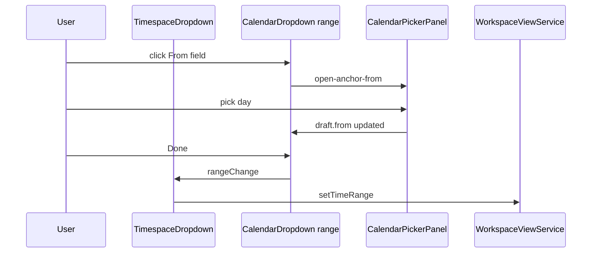

# Calendar Dropdown — Range Mode Supplement

Parent: [`calendar-dropdown.md`](calendar-dropdown.md) · Panel: [`calendar-picker-panel.md`](calendar-picker-panel.md)

## What It Is

**Range mode** on `app-calendar-dropdown`: two labeled summary fields (From / To) share **one** body-portaled calendar popover. Replaces the v1 pattern of two independent `app-calendar-dropdown` instances in [`app-timespace-dropdown`](../../component/map/map-filter-toolbar.md). Single-date mode (`mode='single'`) is unchanged for media detail and other one-shot pickers.

## What It Looks Like

Horizontal **From** and **To** rows — same bordered shell as single mode (`2.25rem` min height, locale date text input, trailing `calendar_today` icon each). Either field or either icon opens the **same** frosted panel anchored to the field that opened it. Inside the panel: month grid with **in-range wash** between start and end; start/end days use **secondary** selected ink; hover on enabled days uses **primary** gold. Below the grid (not in the header): optional **Add time** link; when expanded, compact **HH:MM** spinners for From and To inline. Footer keeps **Clear** and **Done** (normative — user commits with Done even after the second day click completes the draft range).

## Why one popover

| Two independent dropdowns | Single shared popover |
| --- | --- |
| Two interactions for one range | One conceptual control |
| No cross-picker range highlight | Continuous in-range fill on one grid |
| Unfamiliar for date ranges | Matches flight/hotel booking mental model |

## API (range mode)

| Input | Type | Default | Effect |
| --- | --- | --- | --- |
| `mode` | `'single' \| 'range'` | `'single'` | `range` renders From/To pair + shared popover |
| `rangeValue` | `CalendarRangeValue \| null` | `null` | Committed `{ from, to }` halves |
| `fromLabel` / `toLabel` | `string` | `''` | Visible labels (timespace: localized From/To) |
| `timeMode` | `TimeMode` | `'dateOnly'` | Timespace: **`optionalTime`** with progressive disclosure |
| `minDate` / `maxDate` | `Date \| null` | `null` | Disables out-of-domain days |
| `nullable` | `boolean` | `true` | Clear emits null range |

| Output | Payload |
| --- | --- |
| `rangeChange` | `CalendarRangeValue \| null` |

```typescript
/** Range wire value — each half matches single-mode CalendarDropdownValue. */
interface CalendarRangeValue {
  from: CalendarDropdownValue | null;
  to: CalendarDropdownValue | null;
}
```

**Invariant:** `mode='single'` MUST use `value` / `valueChange`. `mode='range'` MUST use `rangeValue` / `rangeChange`. Mixing APIs on one instance is forbidden.

## Range pick FSM

| State | Meaning | Entered by |
| --- | --- | --- |
| `closed` | Popover hidden | default, Done, Clear, Escape, outside click |
| `open-pick` | Two-click flow; no anchor role | Open when range empty or after Clear |
| `open-anchor-from` | Next day click replaces **from** | User focused/opened via **From** field or icon |
| `open-anchor-to` | Next day click replaces **to** | User focused/opened via **To** field or icon |

### Transitions (normative)

| From | Event | To | Draft effect |
| --- | --- | --- | --- |
| `closed` | Open via From (range exists) | `open-anchor-from` | Draft = committed range |
| `closed` | Open via To (range exists) | `open-anchor-to` | Draft = committed range |
| `closed` | Open via either (no range) | `open-pick` | Draft empty |
| `open-pick` | 1st enabled day click | `open-pick` | Set draft.from; highlight start |
| `open-pick` | 2nd enabled day click | `open-pick` | Set draft.to; normalize order (swap if from > to); in-range fill |
| `open-anchor-from` | enabled day click | `open-anchor-from` | Replace draft.from; normalize order |
| `open-anchor-to` | enabled day click | `open-anchor-to` | Replace draft.to; normalize order |
| `open-*` | **Done** (valid draft) | `closed` | `rangeChange` emit |
| `open-*` | **Clear** | `closed` | `rangeChange(null)` |
| `open-*` | Escape / outside | `closed` | Revert draft; no emit |

**Done gate:** Enabled when `draft.from` and `draft.to` are both set (or `nullable` and user clears). If optional time is expanded, empty time halves are allowed on Done (same as single `optionalTime`).

**Keyboard:** Typing in From/To fields parses locale date and updates the corresponding draft half on blur; does not close popover. **Enter** in an open panel commits when Done would be enabled (same as single mode).

## Progressive optional time (timespace)

| Step | UI |
| --- | --- |
| Popover opens, no start date | Grid only; no time controls |
| Start anchored (two-click step 1 or existing range) | **Add time** text link below grid |
| User clicks **Add time** | Inline From HH:MM + To HH:MM spinners below grid (not in header) |
| User collapses / Clear | Hide spinners; reset time draft halves |

Timespace parent MUST pass `timeMode='optionalTime'`. Default collapsed — construction searches remain day-granular unless the user opts in.

## Shared popover (single + range)

`CalendarDropdownComponent` MUST use `DropdownShellComponent` (`app-dropdown-shell`) — `portalHostToBody()`, flip placement, outside-click/Escape close, `z-index: 300`. Pass `[panelClass]="'calendar-dropdown-panel'"` (`overflow: visible` on host — same as `.toolbar-dropdown--timespace`).

## Visual Behavior Contract

| Behavior | Visual Geometry Owner | Stacking Context Owner | Interaction Hit-Area Owner | Selector(s) | Layer | Test Oracle |
| --- | --- | --- | --- | --- | --- | --- |
| From/To field row | `.calendar-dropdown__control` | `app-calendar-dropdown` `:host` | same control | `.calendar-dropdown__input`, `.calendar-dropdown__trigger` | content 0 | Both fields `2.25rem`; gold `:focus-within` on active field |
| Shared popover | `app-dropdown-shell` | shell host | panel interior | `.calendar-dropdown-panel` | dropdown 300 | Portal to body; not clipped in timespace toolbar |
| Range start/end day | day button | `.calendar-picker-panel__grid` | day button | `.calendar-picker-panel__day--range-start`, `--range-end` | content 0 | Secondary selected ink at rest |
| In-range days | day button | grid | day button | `.calendar-picker-panel__day--in-range` | content 0 | Subtle selected wash; not full gold fill |
| Pending second click | day button | grid | day button | start cell `--range-start` only | content 0 | Start highlighted; no in-range until end set |
| Add time link | footer-adjacent row | panel root | link button | `.calendar-picker-panel__add-time` | content 0 | Hidden until start exists |
| Time spinners | spinner row | panel root | inputs | `.calendar-picker-panel__time-spinners` | content 0 | Below grid; hidden until expanded |

## Wiring (timespace)



## Acceptance criteria

See [`calendar-dropdown.acceptance-criteria.md`](calendar-dropdown.acceptance-criteria.md) § Range mode.
