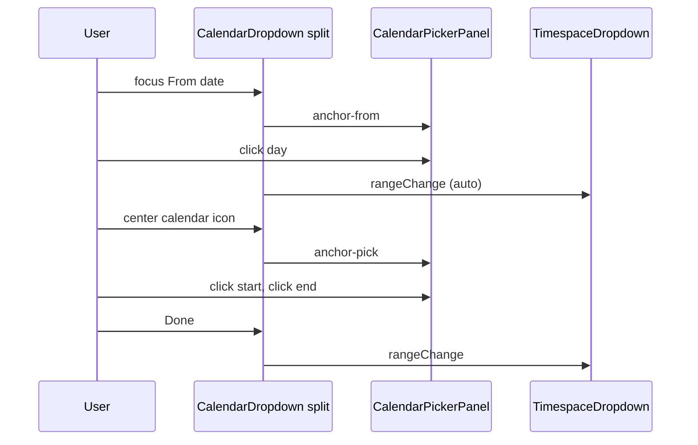

# Calendar Dropdown — Range Mode Supplement

Parent: [`calendar-dropdown.md`](calendar-dropdown.md) · Panel: [`calendar-picker-panel.md`](calendar-picker-panel.md) · Time: [`time-field-control.md`](time-field-control.md)

## What It Is

**Range mode** on `app-calendar-dropdown`: two labeled summary fields (From / To) share **one** body-portaled calendar popover. Replaces the v1 pattern of two independent `app-calendar-dropdown` instances in [`app-timespace-dropdown`](../../component/map/map-filter-toolbar.md). Single-date mode (`mode='single'`) is unchanged for media detail and other one-shot pickers.

## What It Looks Like

**`layout='split'`** (timespace): five-column control row — From date, From time, center `calendar_today` (range-only), To date, To time. All shells **`2.25rem`** tall (date control, time control, center button). Inside the panel: dual consecutive month grids, in-range wash, secondary start/end ink, gold hover preview. Footer: **Clear** + **Done** (required for `pick` anchor when both bounds needed).

**`layout='toolbar'`**: leading calendar icon per field. Same panel semantics as field-anchored selection below.

## Split layout (timespace, normative)

```
From label (date+time)     (gap)     To label (date+time)
[ date ] [ time ] [ 📅 ] [ date ] [ time ]
```

| User action | `anchorTarget` | Panel day-click behavior | Commit |
| --- | --- | --- | --- |
| Focus / click From **date** input | `from` | Replace **from.date** only (single endpoint) | **Auto-commit** + close on day click |
| Focus / click To **date** input | `to` | Replace **to.date** only | **Auto-commit** + close on day click |
| Edit From/To **time** (`app-time-field-control`) | — | No calendar panel | Immediate `rangeChange` when shell closed |
| Click **center** calendar icon | `pick` | 1st click → `from`; 2nd → `to`; 3rd restarts | **Done** (or Clear) — two-click **range** only here |

**Invariant:** Two-click range pick (`pick` anchor) MUST NOT activate from From/To date focus — only from center icon.

Popover anchors to the center button when `anchorTarget='pick'`; to the active date control when `anchorTarget` is `from` or `to`.

### Time semantics (timespace, `optionalTime`)

| Half | `time` empty | `time` set (`HH:MM`) |
| --- | --- | --- |
| `from` | Start of UTC day (`00:00`) | Exact UTC instant |
| `to` | End of UTC day (`23:59:59.999`) | Exact UTC instant |

Parent [`app-timespace-dropdown`](../../component/map/map-filter-toolbar.md) maps `CalendarRangeValue` → `WorkspaceViewService.timeRange`.

## Field-anchored selection (`layout='toolbar'` / `default`)

Follows Airbnb / Google Flights **focused-input** model when per-field calendar icons exist.

| User opens via | `anchorTarget` | Each enabled day click |
| --- | --- | --- |
| **From** icon | `from` | Replace **draft.from** only |
| **To** icon | `to` | Replace **draft.to** only |

**Corollaries:**

- Wrong first date: open **From** again → next click replaces start (never forces end on second click).
- Complete range in draft: open **To** → click replaces end; open **From** → click replaces start (normalize order if `from > to`).
- Fresh range: **Clear** in panel, or timespace footer reset icon.
- Popover already open: clicking the **other** field's calendar icon **re-anchors** (does not close).

## Dual-month view stability (normative)

When the panel shows two consecutive months, clicking a day in the **right** grid MUST NOT jump the visible months if that date is already visible in the left **or** right grid.

**Implementation contract:**

- Parent passes stable `viewAnchorDate` at popover open (`viewAnchorAtOpen`) — not live draft.
- Panel syncs visible month only when anchor date is **outside** the current dual-month window (`isDateVisibleInDualMonthView`).

## API (range mode)

| Input | Type | Default | Effect |
| --- | --- | --- | --- |
| `mode` | `'single' \| 'range'` | `'single'` | `range` renders From/To pair + shared popover |
| `layout` | `'default' \| 'toolbar' \| 'split'` | `'default'` | See above |
| `timeMode` | `TimeMode` | `'dateOnly'` | `≠ dateOnly` → time fields in split layout |
| `rangeValue` | `CalendarRangeValue \| null` | `null` | Committed `{ from, to }` halves |
| `fromLabel` / `toLabel` | `string` | `''` | Visible labels |
| `minDate` / `maxDate` | `Date \| null` | `null` | Disables out-of-domain days |
| `nullable` | `boolean` | `true` | Clear emits null range |

| Output | Payload |
| --- | --- |
| `rangeChange` | `CalendarRangeValue \| null` |

**Invariant:** `mode='single'` MUST use `value` / `valueChange`. `mode='range'` MUST use `rangeValue` / `rangeChange`.

## Range pick FSM

| State | Meaning | Entered by |
| --- | --- | --- |
| `closed` | Popover hidden | default, Done, Clear, auto-commit (split field anchor), Escape, outside |
| `open-anchor-from` | Single-endpoint from pick (split) or replace-from (toolbar) | Focus/click From date (split) or From icon (toolbar) |
| `open-anchor-to` | Single-endpoint to pick (split) or replace-to (toolbar) | Focus/click To date (split) or To icon (toolbar) |
| `open-anchor-pick` | Two-click range in panel | Center calendar icon (`layout='split'`) only |

### Transitions (normative)

| From | Event | To | Draft / emit effect |
| --- | --- | --- | --- |
| `closed` | Focus From date (split) | `open-anchor-from` | Draft = clone committed; `viewAnchorAtOpen` set |
| `closed` | Focus To date (split) | `open-anchor-to` | same |
| `closed` | Center icon (split) | `open-anchor-pick` | Draft = clone committed |
| `closed` | From icon (toolbar) | `open-anchor-from` | Draft = clone committed |
| `closed` | To icon (toolbar) | `open-anchor-to` | Draft = clone committed |
| `open-anchor-from` | enabled day click (split) | `closed` | Replace `from`; `rangeChange` emit |
| `open-anchor-to` | enabled day click (split) | `closed` | Replace `to`; `rangeChange` emit |
| `open-anchor-from/to` | enabled day click (toolbar) | `open-anchor-*` | Replace half; stay open until Done |
| `open-anchor-pick` | 1st / 2nd day click | `open-anchor-pick` | Two-click range draft |
| `open-anchor-pick` | **Done** (both bounds) | `closed` | `rangeChange` emit |
| `open-*` | **Clear** | `closed` | `rangeChange(null)` |
| `open-*` | Escape / outside | `closed` | Revert draft; no emit |

**Done gate (pick anchor):** Enabled when `draft.from` and `draft.to` are both set.

**Shell typing:** Popover **closed** → parse + `rangeChange` immediately. Popover **open** → update `rangeDraft` half only; no close (field anchor).

## Shared popover

`DropdownShellComponent` — body portal, `z-index: 300`, `[panelClass]="'calendar-dropdown-panel'"`.

## Visual Behavior Contract

| Behavior | Geometry Owner | Stacking Owner | Hit-Area Owner | Selector(s) | Layer | Test Oracle |
| --- | --- | --- | --- | --- | --- | --- |
| From/To date shell | `.calendar-dropdown__control` | `app-calendar-dropdown` `:host` | control | `.calendar-dropdown__input` | 0 | `2.25rem` height |
| From/To time shell | `.time-field__control` | `app-time-field-control` | control | `.time-field__input` | 0 | `2.25rem` height |
| Center range pick | `hlmBtn` + `.calendar-dropdown__range-pick` | same | button | `hlmBtn outline icon-sm` | 0 | Spartan sizing — no custom `width`/`height` in component SCSS |
| Shared popover | `app-dropdown-shell` | shell host | panel | `.calendar-dropdown-panel` | 300 | Body portal |
| Range start/end | day button | grid | day button | `--range-start`, `--range-end` | 0 | Secondary ink |
| In-range wash | day button | grid | day button | `--in-range` | 0 | Muted secondary |
| Hover preview | day button | grid | day button | `--preview-in-range` | 0 | Gold 8% between fixed anchor + hover |

## Wiring (timespace)



## Acceptance criteria

See [`calendar-dropdown.acceptance-criteria.md`](calendar-dropdown.acceptance-criteria.md) § Range mode + Split layout + Time.
