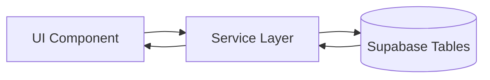
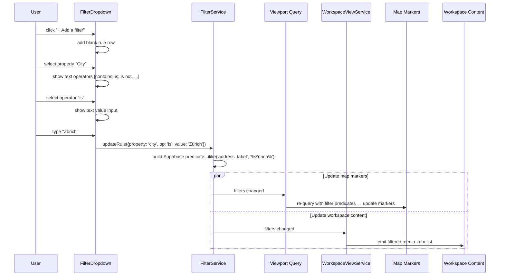
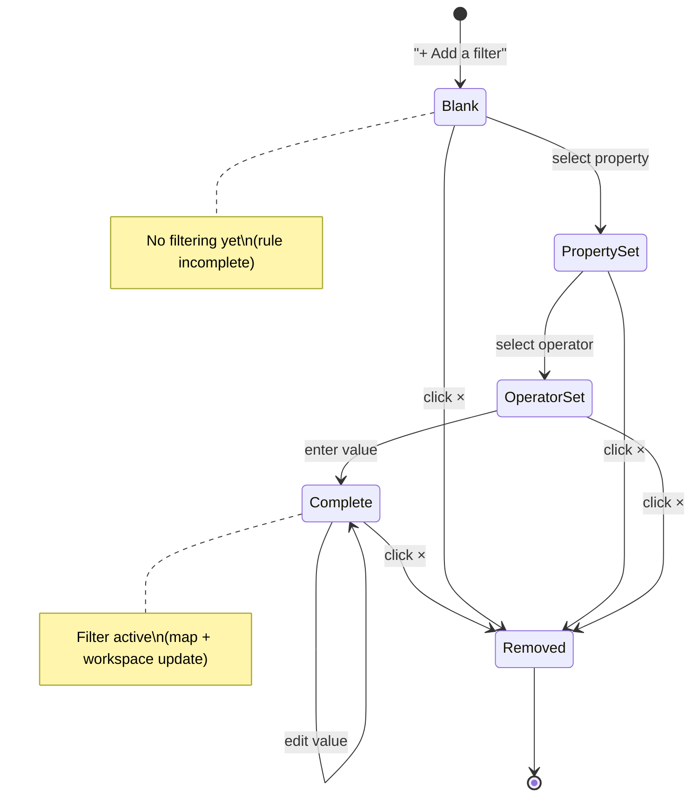
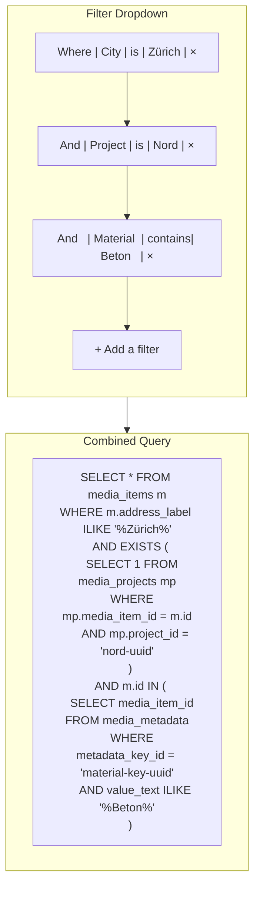
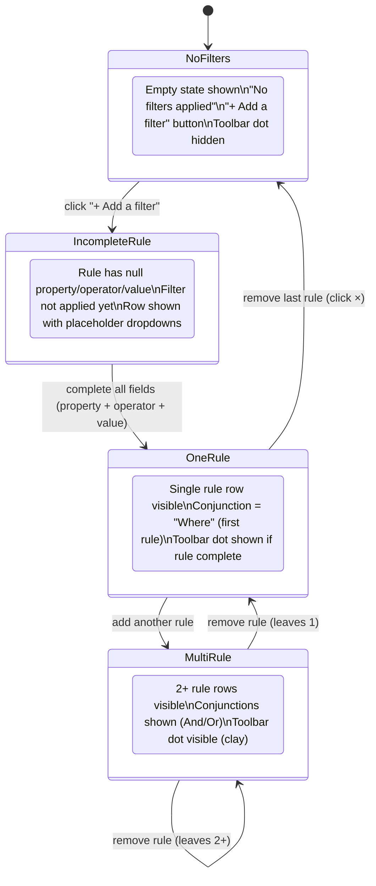
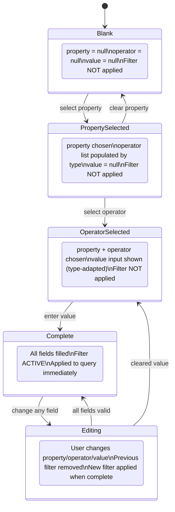
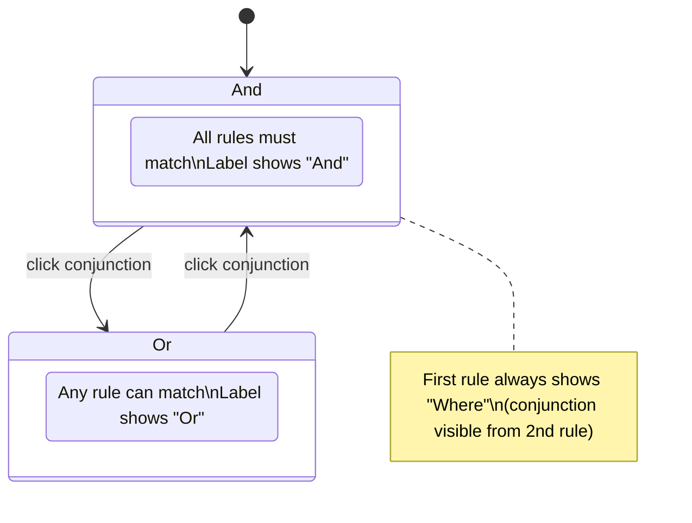
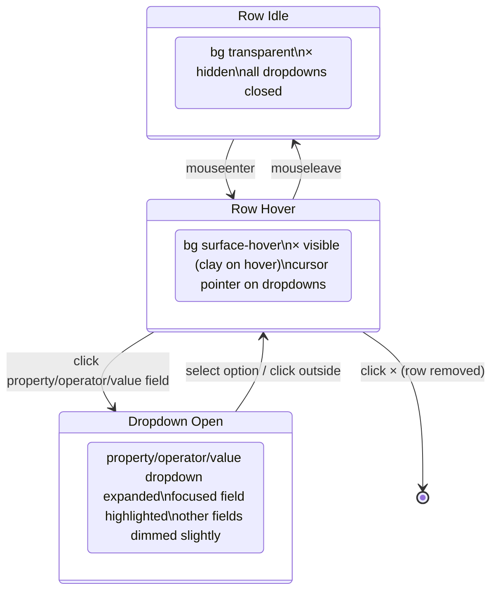

# Filter Dropdown (Notion-Style)

## What It Is

A Notion-inspired compound filter builder. Users add filter rules ("where [Property] [Operator] [Value]") and combine them with AND/OR logic. Each rule is a row. Rules can be added, removed, and edited inline. Supports built-in properties (date, location, project) and custom metadata keys. Replaces the previous accordion-based Filter Panel spec with a more composable and powerful pattern.

## What It Looks Like

Floating dropdown anchored below the workspace **Filter** toolbar button. **Width** is owned by the parent **`app-dropdown-shell`** when `panelClass` includes **`toolbar-dropdown toolbar-dropdown--filter`** (wider **32rem** floor vs **26rem** for other toolbar menus) — see [`dropdown-system.md`](./dropdown-system.md#toolbar-menu-panels-anchored-ui). Max height for the rules band and scroll behavior follow the same spec.

**Empty state**: "No filters applied" text with an "Add a filter" ghost button.

**With rules**: Each filter rule is a horizontal row:

- **Conjunction chip** (left): "Where" for the first rule, "And" / "Or" for subsequent rules (clickable to toggle And/Or) — **quiet** `hlmBtn` **outline** chip, **muted** label (neutral surface; not primary-tint row chrome).
- **Property selector**: **compact `hlmBtn` outline** trigger with **trailing `expand_more` chevron** (chevron stays **muted** on row hover). Opens a **fixed-position flyout list** of `hlmMenuItem` options (same vocabulary as toolbar menu rows), **not** a native `<select>`.
- **Operator selector**: same pattern as property — **styled flyout**; operators depend on property type.
- **Value input**: text input, date picker, or multi-select depending on property type (`hlmInput` where applicable).
- **Remove** (×): **`hlmBtn` ghost `size="icon"`** — **muted** close icon; **destructive** color **only** on hover / focus-visible (quiet destructive).

Below the rules: "+ Add a filter" ghost button.

## Where It Lives

- **Anchored shell + shared menu chrome (normative):** [`dropdown-system.md`](./dropdown-system.md) — toolbar width floors (`toolbar-dropdown--filter`), scroll bands, stacking, and shell vs filter flyout `document:click` scopes.
- **This component:** `apps/web/src/app/shared/dropdown-trigger/filter-dropdown.component.ts`, `.html`, `.scss` (detail: **File Map** below).
- **Callsite:** opened from `WorkspaceToolbarComponent` when the Filter toolbar panel is active (see **Wiring**).
- **Filter predicates / query integration:** `apps/web/src/app/core/filter.service.ts` (see **Data** / **Wiring**).

## Visual behavior contract (toolbar-aligned)

- **Row container**: **No** `hlmMenuItem` on the full row (avoids primary-tint hover washing conjunction + fields). Row hover = **neutral** `muted-foreground` **8%** surface mix only.
- **Rhythm**: Rule stack uses **`spacing-2`** gap and row padding (quiet density).
- **Picker flyout**: **`position: fixed`**, **`z-index: 302`** (dropdown plane **`300`** + **2**) so lists render above the rule stack and escape `.filter-rules` scroll clipping; closes on **outside click**, **rule-list scroll**, or **window resize**.
- **Chevron**: Trigger chevrons use **`data-dd-part="chevron"`** + **explicit muted** color so they **do not** pick up row-hover emphasis.

Shared shell width / scroll chrome: [`dropdown-system.md`](./dropdown-system.md).

### Interaction ownership (`document:click`)

Two document-level click handlers can be active while the filter menu is open; they are **orthogonal** (not duplicate tech debt):

- **`DropdownShellComponent`:** outside-click closes the **entire** anchored menu when the target is outside the shell element.
- **`FilterDropdownComponent`:** when a property/operator flyout is open, outside-click closes the **flyout only** (picker markers: `[data-filter-picker-flyout]`, `[data-filter-picker]`).

Normative table and rationale: [`dropdown-system.md` — document:click (shell vs filter flyout)](./dropdown-system.md#documentclick-shell-vs-filter-flyout).

- **Parent**: `WorkspaceToolbarComponent`
- **Appears when**: User clicks the "Filter" toolbar button

## Actions

| #   | User Action                      | System Response                                     | Triggers               |
| --- | -------------------------------- | --------------------------------------------------- | ---------------------- |
| 1   | Clicks "Add a filter"            | New blank rule row appears                          | Rule added             |
| 2   | Selects a property in a rule     | Operator list updates for that property type        | Rule.property set      |
| 3   | Selects an operator              | Value input type adjusts (text, date, multi-select) | Rule.operator set      |
| 4   | Enters/selects a value           | Filter applies immediately — map + workspace update | Rule.value set         |
| 5   | Clicks conjunction chip (And/Or) | Toggles between And/Or for that rule                | Rule.conjunction flips |
| 6   | Clicks × on a rule               | Removes the rule; filters update                    | Rule removed           |
| 7   | Clicks outside or Escape         | Closes dropdown; filters remain active              | Dropdown closes        |

## Component Hierarchy

```
FilterDropdown                             ← floating dropdown under shell; width floor **32rem** when shell has `toolbar-dropdown--filter` (see dropdown-system)
├── [no rules] EmptyState                  ← "No filters applied"
├── FilterRuleList                         ← vertical stack, gap-1
│   └── FilterRuleRow × N                  ← horizontal flex row, gap-1, items-center
│       ├── ConjunctionChip                ← "Where" | "And" | "Or", click to toggle
│       ├── PropertySelect                 ← compact **`hlmBtn` outline** + chevron; fixed flyout of `hlmMenuItem` rows
│       │   └── [open] PropertyPicker      ← flyout: search optional (future); list uses menu row chrome
│       ├── OperatorSelect                 ← same as property; options from `operatorsForPropertyType`
│       │   └── [open] OperatorPicker      ← flyout list (`hlmMenuItem`)
│       ├── ValueInput                     ← type varies by property
│       │   ├── [text] TextInput           ← for string properties
│       │   ├── [date] DateInput           ← for date properties (from/to)
│       │   ├── [select] MultiSelect       ← for enum-like properties (project, custom key values)
│       │   └── [number] NumberInput       ← for distance
│       └── [hover] RemoveButton (×)       ← ghost icon; destructive tint **only** on hover/focus
└── AddFilterButton                        ← ghost button "+ Add a filter"
```

### Property Types and Operators

| Property Type | Properties                         | Available Operators                              |
| ------------- | ---------------------------------- | ------------------------------------------------ |
| **text**      | Address, City, Country, Name, User | contains, does not contain, is, is not, is empty |
| **date**      | Date captured, Date uploaded       | is, is before, is after, is between              |
| **select**    | Project                            | is, is not, is empty                             |
| **metadata**  | _Custom text keys_                 | contains, does not contain, is, is not, is empty |
| **number**    | Distance, _Custom number keys_     | =, ≠, >, <, ≥, ≤                                 |
| **boolean**   | Has corrections, Has GPS           | is true, is false                                |

### Number Filter Operators

For number-type properties (built-in `distance` and custom number properties), the filter service compares values **numerically**:

- Values are parsed via `parseFloat()` before comparison
- `=` → exact numeric equality
- `≠` → not equal
- `>`, `<`, `≥`, `≤` → numeric comparison
- Media items with no value for the property are excluded by all numeric operators except `is empty`

### Dropdown Max-Height

The filter dropdown's rule list uses **`max-height: min(18rem, 50vh)`** with **`overflow-y: auto`** (see `filter-dropdown.component.scss`). Property and operator lists render in a **fixed flyout** with its own **`max-height`** (computed from viewport space) and internal scroll when needed.

## Data

### Data Flow (Mermaid)



| Field           | Source                                                                                         | Type            |
| --------------- | ---------------------------------------------------------------------------------------------- | --------------- |
| Properties list | Hardcoded built-ins + `metadata_keys` (org-scoped)                                             | `PropertyDef[]` |
| Project options | `supabase.from('projects').select('id, name').eq('organization_id', org)`                      | `Project[]`     |
| Metadata values | `supabase.from('media_metadata').select('value_text').eq('metadata_key_id', keyId)` (distinct) | `string[]`      |

## State

| Name          | Type           | Default | Controls                       |
| ------------- | -------------- | ------- | ------------------------------ |
| `rules`       | `FilterRule[]` | `[]`    | Active filter rules            |
| `activeCount` | `number`       | `0`     | Derived: completed rules count |

Where `FilterRule` = `{ id: string; conjunction: 'and' | 'or'; property: PropertyRef | null; operator: string | null; value: any }`.

## File Map

| File                                                         | Purpose                             |
| ------------------------------------------------------------ | ----------------------------------- |
| `apps/web/src/app/shared/dropdown-trigger/filter-dropdown.component.ts`   | Main filter builder                 |
| `apps/web/src/app/shared/dropdown-trigger/filter-dropdown.component.html` | Template                            |
| `apps/web/src/app/shared/dropdown-trigger/filter-dropdown.component.scss` | Styles                              |
| *(embedded in `filter-dropdown` template)*   | Single filter rule row              |
| `core/filter.service.ts`                                     | Filter state + query builder        |

## Wiring

- Rendered inside `WorkspaceToolbarComponent` via `@if (activeDropdown() === 'filter')`
- `FilterService` holds the active rules and converts them to Supabase query predicates
- Map viewport query incorporates active filters via `FilterService`
- `WorkspaceViewService` reads filtered media-item set from `FilterService`
- Active Filter Chips (existing spec) reads from the same `FilterService`

## Acceptance Criteria

- [x] Empty state "No filters applied" + "Add a filter" button
- [x] Each rule is a horizontal row: conjunction + property + operator + value + ×
- [x] Conjunction toggles between "And" / "Or" on click
- [ ] Property dropdown shows built-in + custom metadata keys
- [ ] Operator list changes based on property type
- [ ] Value input adapts: text, date picker, multi-select, number
- [ ] Filters apply immediately on value change
- [x] × removes a rule (visible on hover)
- [x] Multiple rules can be combined
- [ ] Closing dropdown does NOT clear filters
- [ ] Active filter count shown on toolbar button
- [x] Dropdown uses `position: fixed` to escape overflow
- [x] Row hover: clay 8% background tint, × appears

---

## Filter Builder Flow



## Filter Rule Lifecycle



## Notion-Style Filter Pattern Reference



## Filter Dropdown — State Machine



## Filter Rule Row — State Machine



## Conjunction Toggle



## Filter Rule Row — Visual States


