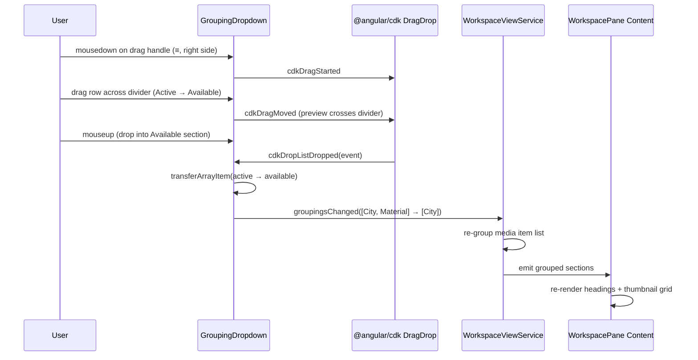
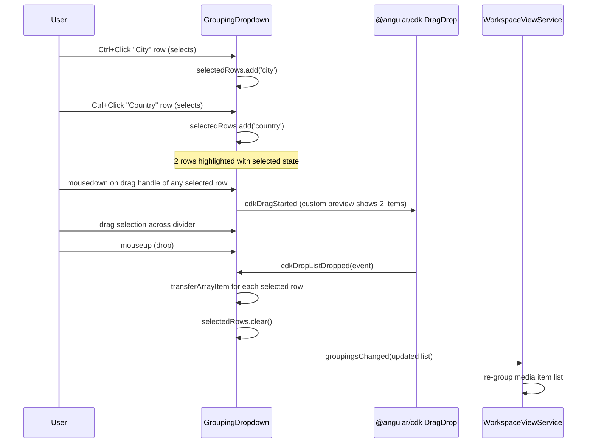
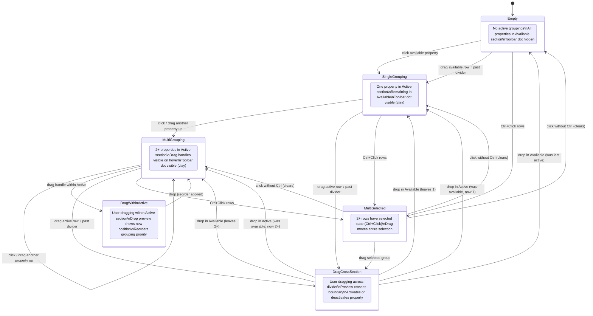
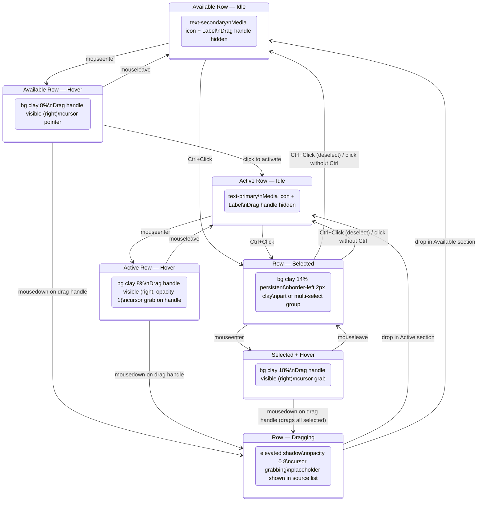

# grouping dropdown.drag and state machine.supplement

> Parent: [`grouping-dropdown.md`](./grouping-dropdown.md)

## Cross-Section Drag Interaction (CDK DragDrop)

Both sections share a `cdkDropListGroup`. Each section is a `cdkDropList` connected to the other via `[cdkDropListConnectedTo]`. Dragging an item across the divider transfers it between lists.

### Single-Item Drag



### Multi-Select Drag



## Grouping Dropdown — State Machine



## Grouping Row States



## Row Layout

```
┌─────────────────────────────────────┐
│  [icon]   Property Name        [≡]  │
│  media    label           drag handle│
│  (leading)               (trailing)  │
└─────────────────────────────────────┘

  • Media icon: always visible, property-type icon (calendar, location_on, etc.)
  • Label: always visible, property name
  • Drag handle (≡): trailing, visible on hover only (Quiet Actions)
  • No × button anywhere
```

