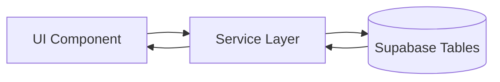
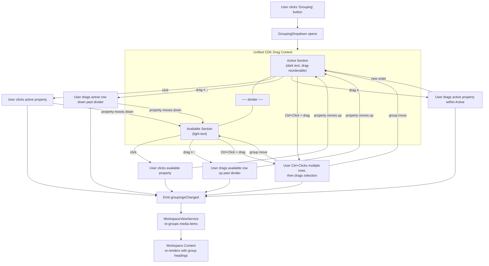
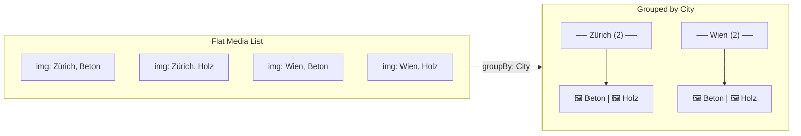
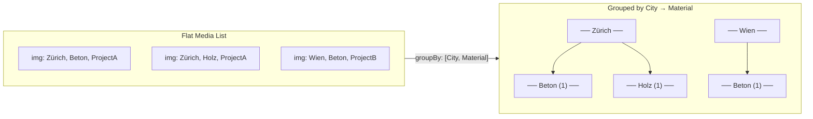

# Grouping Dropdown

## What It Is

A dropdown that lets the user choose and order the properties used to group workspace content. It manages an active list and an available list, supports drag-reordering and cross-section moves, and emits grouping changes back to `WorkspaceToolbarComponent` and `WorkspaceViewService`.

## What It Looks Like

A floating dropdown anchored below the "Grouping" toolbar button. Width is compact desktop dropdown width (~240px) and the content is rendered through `StandardDropdownComponent`. Two sections are shown inside one CDK drag context:

- **Upper section (Active)**: properties currently used for grouping. Header row shows the "Grouped by" label plus a reset button when at least one grouping is active. Clicking an active row deactivates it; dragging within the section reorders grouping priority.
- **Lower section (Available)**: properties not currently grouping. Text in `--color-text-secondary`. Click to activate (moves to upper section). Rows can also be dragged upward past the divider into Active to activate.

Each row is a `.dd-item` with icon, label, and trailing `drag_indicator` handle. There is no separate remove button; deactivation is done by clicking an active row or dragging it into the Available section.

**Multi-select**: Ctrl/Cmd-click selects multiple rows. Dragging a selected row can move the current selection group. Clicking without modifier clears the multi-selection before performing the default activate/deactivate action.

## Where It Lives

- **Parent**: `WorkspaceToolbarComponent`
- **Appears when**: User clicks the "Grouping" toolbar button
- **Positioned**: Below the button, left-aligned

## Actions

| #   | User Action                                            | System Response                                                                                    | Triggers                      |
| --- | ------------------------------------------------------ | -------------------------------------------------------------------------------------------------- | ----------------------------- |
| 1   | Clicks an available (inactive) property                | Moves property from Available to Active section (activates grouping); workspace regroups           | `activeGroupings` updated     |
| 2   | Clicks an active property                              | Moves property from Active to Available section (deactivates grouping); workspace regroups         | `activeGroupings` updated     |
| 3   | Drags an active row down past the divider              | Moves property from Active to Available (deactivates grouping); workspace regroups                 | `activeGroupings` updated     |
| 4   | Drags an available row up past the divider             | Moves property from Available to Active (activates grouping); workspace regroups                   | `activeGroupings` updated     |
| 5   | Drags an active property up/down within Active section | Reorders grouping priority; workspace regroups live                                                | `activeGroupings` reorder     |
| 6   | Ctrl+Click on a row                                    | Toggles selection on the row (adds/removes from multi-select). Does not activate/deactivate.       | `selectedRows` updated        |
| 7   | Drags any selected row (with multi-select active)      | Moves the entire selection group to the drop target section/position                               | `activeGroupings` bulk update |
| 8   | Clicks a row without Ctrl                              | Clears multi-selection; performs single-click action (activate if available, deactivate if active) | `selectedRows` cleared        |
| 9   | Clicks outside or Escape                               | Closes dropdown; selection is cleared when row interaction resumes                                 | Toolbar dropdown closes       |
| 10  | Hovers a row                                           | Reveals drag handle (≡) on the right side                                                          | Opacity 0→1, 80ms             |
| 11  | Clicks reset button next to "Grouped by" header        | Moves all active groupings back to Available; workspace ungroups                                   | `activeGroupings` cleared     |

## Component Hierarchy

```
GroupingDropdown                           ← floating dropdown rendered via `StandardDropdownComponent`
├── UnifiedDragContext (cdkDropListGroup)   ← single CDK drag context spanning both sections
│   ├── ActiveSection (cdkDropList)         ← upper drop zone
│   │   ├── SectionHeader                  ← flex row: label left, button right
│   │   │   ├── SectionLabel "Grouped by"   ← --text-caption, --color-text-secondary
│   │   │   └── ResetButton                 ← reset action, visible only when activeGroupings.length > 0
│   │   └── GroupingRow × N                ← .ui-item, cdkDrag
│   │       ├── MediaIcon                  ← leading property icon (e.g. calendar, location)
│   │       ├── PropertyLabel              ← property name, --color-text-primary
│   │       └── [hover] DragHandle (≡)     ← trailing icon, visible on hover, cdkDragHandle
│   ├── Divider                            ← 1px --color-border (visual only, not a drag boundary)
│   └── AvailableSection (cdkDropList)     ← lower drop zone
│       ├── SectionLabel "Available"       ← --text-caption, --color-text-secondary
│       └── GroupingRow × N                ← .ui-item, cdkDrag, click to activate
│           ├── MediaIcon                  ← leading property icon
│           ├── PropertyLabel              ← property name, --color-text-secondary
│           └── [hover] DragHandle (≡)     ← trailing icon, visible on hover, cdkDragHandle
```

## Data

### Data Flow (Mermaid)



| Field                | Source                                                                                                | Type                    |
| -------------------- | ----------------------------------------------------------------------------------------------------- | ----------------------- |
| Available properties | `PropertyRegistryService.groupableProperties()` filtered by active ids in `WorkspaceToolbarComponent` | `GroupingProperty[]`    |
| Active properties    | `WorkspaceToolbarComponent.activeGroupings`                                                           | `GroupingProperty[]`    |
| Grouping output      | `groupingsChanged` output from `GroupingDropdownComponent`                                            | `{ active, available }` |

### Property Source Notes

The dropdown does not query Supabase directly. Property availability is derived by `WorkspaceToolbarComponent` from `PropertyRegistryService`, then passed into `GroupingDropdownComponent` as inputs.

Detailed grouping derivation still lives in the workspace view pipeline and related use-case docs.

## State

| Name                  | Type                 | Default | Controls                                                      |
| --------------------- | -------------------- | ------- | ------------------------------------------------------------- |
| `activeGroupings`     | `GroupingProperty[]` | `[]`    | Ordered list of active groupings passed in from toolbar state |
| `availableProperties` | `GroupingProperty[]` | `[]`    | Properties not currently active                               |
| `selectedRows`        | `Set<string>`        | empty   | Rows currently multi-selected via Ctrl/Cmd-click              |
| `isDragging`          | `boolean`            | `false` | True while any row is being dragged                           |

Where `GroupingProperty` = `{ id: string; label: string; icon: string }`.

## File Map

| File                                                                             | Purpose                                      |
| -------------------------------------------------------------------------------- | -------------------------------------------- |
| `apps/web/src/app/shared/dropdown-trigger/grouping-dropdown.component.ts`   | Dropdown with drag-reorder (inline template) |
| `apps/web/src/app/shared/dropdown-trigger/grouping-dropdown.component.scss` | Base styles                                       |
| `apps/web/src/app/shared/workspace-pane/workspace-toolbar/grouping-dropdown.component.scss` | Toolbar-specific styling overrides |

## Wiring

- Rendered inside `WorkspaceToolbarComponent` when `activeDropdown() === 'grouping'`
- Receives `activeGroupings` and `availableProperties` as inputs from `WorkspaceToolbarComponent`
- Emits `{ active, available }` through `groupingsChanged`
- `WorkspaceToolbarComponent` maps active rows into `WorkspaceViewService.activeGroupings`
- `WorkspaceViewService` re-groups the media item list and emits grouped sections to the content area

## Acceptance Criteria

- [x] Two sections: active (dark text) and available (light text)
- [x] Divider line between sections (visual only — drag crosses it freely)
- [x] Click on available property activates it (moves to upper section)
- [x] Click on active property deactivates it (moves to lower section)
- [x] No × button — deactivation is done by clicking an active row or dragging it past the divider into Available
- [x] Drag handle on the **right** (trailing) side of each row, visible on hover only (Quiet Actions)
- [x] Row layout: Media icon → Label → Drag handle (≡)
- [x] Single CDK DragDrop context spanning both sections (cross-section dragging)
- [x] Dragging from Active ↓ past divider → deactivates property
- [x] Dragging from Available ↑ past divider → activates property
- [x] Drag reorder within Active updates grouping priority live
- [x] Ctrl+Click multi-selects rows; dragging any selected row moves the entire selection
- [x] Click without Ctrl clears multi-selection
- [x] Workspace pane content regrouped on every change (emits `groupingsChanged`)
- [x] Available properties are derived from registry-backed groupable properties
- [x] Reset button clears all active groupings
- [x] Dropdown uses `position: fixed` to escape overflow
- [x] Row hover: clay 8% background tint
- [x] Active row: text-primary, inactive row: text-secondary
- [x] Selected row: clay 14% background, 2px left border
- [x] CDK drag preview: elevated shadow, opacity 0.9
- [x] CDK drag placeholder: dashed border, 40% opacity
- [x] Empty active drop target shows default and drag-active copy states
- [x] `isDragging` signal tracks drag lifecycle (cdkDragStarted/cdkDragEnded)

---

## Grouping Flow



## Grouping Rendering in Workspace



## Multi-Level Grouping



## Empty Drop Target Pattern

When the Active section has no groupings, the drop zone must give clear visual feedback across the full drag lifecycle. A local signal `isDragging` tracks whether any row in the dropdown is being dragged.

### Empty Drop Zone States

| State                        | Condition                                          | Visual                                                                                                                       |
| ---------------------------- | -------------------------------------------------- | ---------------------------------------------------------------------------------------------------------------------------- |
| **Idle**                     | `activeGroupings.length === 0` and `!isDragging()` | "No grouping applied" in `--color-text-disabled`, no border                                                                  |
| **Drag active (invitation)** | `activeGroupings.length === 0` and `isDragging()`  | Dashed `--color-border` outline, text changes to "Drop here to group", `--color-text-secondary`, subtle `clay 4%` background |
| **Receiving (hover)**        | CDK adds `.cdk-drop-list-receiving`                | Strong `clay 10%` background, dashed `--color-clay` outline, text in `--color-text-primary`                                  |

### Implementation

- `isDragging = signal(false)` — set `true` on any `cdkDragStarted`, set `false` on any `cdkDragEnded`
- The `.dd-empty` placeholder and the `cdkDropList` drop zone are the **same element** — `.dd-drop-zone--empty` carries both roles
- Class binding: `[class.dd-drop-zone--dragging]="isDragging()"` on the drop zone
- CDK automatically adds `.cdk-drop-list-receiving` when a dragged item enters the zone — styles layer on top
- The `.dd-empty` text content switches via `@if (isDragging())` between "Drop here to group" and "No grouping applied"

### State flow

```
┌─────────────────────────────────┐
│  Idle                           │
│  "No grouping applied"          │
│  text-disabled, no border       │
├─────────────────────────────────┤
│         cdkDragStarted ↓        │
├─────────────────────────────────┤
│  Drag Active (invitation)       │
│  "Drop here to group"           │
│  text-secondary, border dashed  │
│  clay 4% bg                     │
├─────────────────────────────────┤
│     cursor enters zone ↓        │
├─────────────────────────────────┤
│  Receiving (hover)              │
│  "Drop here to group"           │
│  text-primary, clay outline     │
│  clay 10% bg                    │
└─────────────────────────────────┘
      ↓ cdkDragEnded → back to Idle
```

CDK cross-section drag, dropdown FSM, row states, and row layout: **[grouping-dropdown.drag-and-state-machine.supplement.md](./grouping-dropdown.drag-and-state-machine.supplement.md)**.


