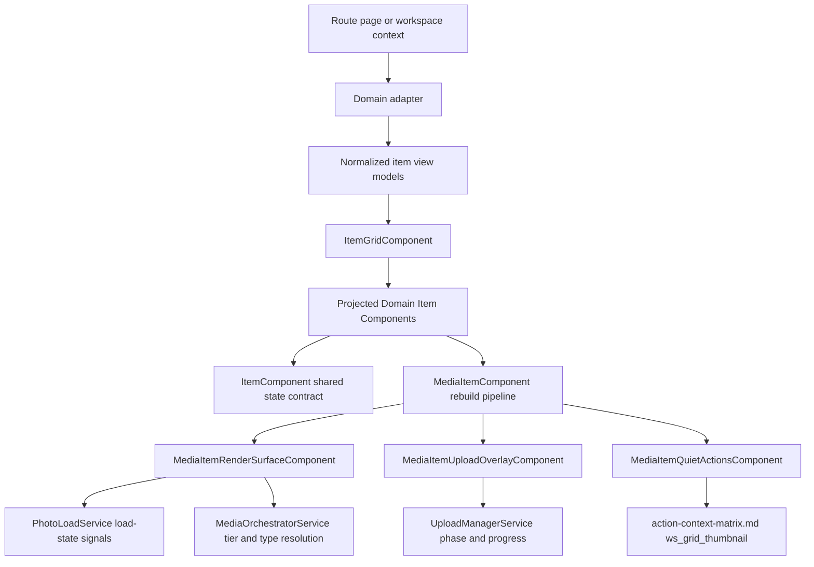
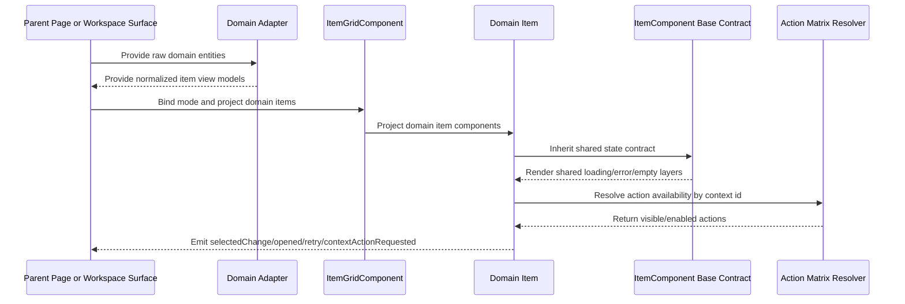

# Item Grid

## What It Is

Item Grid is the universal layout and item-rendering contract for all Feldpost list and grid surfaces. It defines one shared structure for media, projects, and future domain entities so loading, error, no-media, and selection behavior stay consistent across pages and workspace contexts.
This system is a full replacement contract: once a surface is migrated, legacy grid/card components for that surface are removed from active wiring and moved to archive for traceability.

## What It Looks Like

The system has two architectural layers: a layout-only `ItemGridComponent` and a state-contract `ItemComponent` base class consumed by domain-specific item components. Layout modes are `grid-sm`, `grid-md`, `grid-lg`, `row`, and `card`, with responsive transitions driven only by design tokens and shared primitives. Item content is projected from domain components; grid layout never renders domain text or actions itself. Shared loading is rendered as a pulse placeholder layer (spinner forbidden), while media loading is owned by `MediaItemRenderSurfaceComponent` and starts as a neutral gray, icon-free placeholder. State transitions follow one deterministic chain (`loading -> content | error | no-media`). For grid surfaces, media slot geometry is plain square and media content renders with native ratio via `object-fit: contain`; quick actions reveal select (top-left) and map (top-right icon-only), and file-type chip (icon + text) anchors lower-right. All styles use semantic component class names and component-scoped SCSS files.
For media items, `MediaItemComponent` rebuilds the visual/state contract in feature code (state layers, upload overlays, adaptive tier behavior, quiet actions, row-mode dynamic ratio), without runtime wrapping/importing of archived shared media components.
All media consumers (map marker, workspace selected-items, `/media`, and detail view) must resolve tier and URL fallback through the shared media-download-service contract.

## Where It Lives

- Shared location: `apps/web/src/app/shared/item-grid/`
- Child specs:
  - `docs/element-specs/component/media-item.md`
  - `docs/element-specs/component/project-item.md`
  - `docs/element-specs/component/item-state-frame.md`
  - `docs/element-specs/component/media-item-upload-overlay.md`
  - `docs/element-specs/component/media-item-quiet-actions.md`
  - `docs/element-specs/media-download/media-download-service.md`
- Domain consumers:
  - Media page (`/media`) via media domain item adapter
  - Projects page (`/projects`) via project domain item adapter
  - Workspace pane selected-items area via workspace media domain item adapter
- Trigger: any feature that renders repeated items in list/grid/card layouts

## Actions

| #   | User Action                                                                                | System Response                                                                                                                                                   | Trigger                           |
| --- | ------------------------------------------------------------------------------------------ | ----------------------------------------------------------------------------------------------------------------------------------------------------------------- | --------------------------------- |
| 1   | Parent surface sets `mode` to `grid-sm`, `grid-md`, `grid-lg`, `row`, or `card`            | ItemGrid applies matching semantic layout class and tokenized geometry                                                                                            | `mode` input change               |
| 2   | Parent projects domain items into ItemGrid                                                 | Grid renders projected item slots without domain logic                                                                                                            | Content projection                |
| 3   | Domain item enters loading state                                                           | Loading owner is resolved by domain contract: shared domains use ItemStateFrame pulse placeholder; media uses render-surface loading fallback (spinner forbidden) | `loading=true`                    |
| 4   | Domain item enters error state                                                             | Base ItemComponent renders shared error surface and exposes retry output                                                                                          | `error=true`                      |
| 5   | Parent provides empty collection                                                           | Parent-level empty region renders using shared empty contract while ItemGrid keeps layout shell stable                                                            | `items.length===0`                |
| 6   | User selects or deselects an item                                                          | Base ItemComponent propagates selected state and emits selection event; selected emphasis is rendered by the domain visual owner                                  | pointer/keyboard selection action |
| 7   | User opens item action menu on media item                                                  | MediaItem action set is resolved from action-context matrix for `ws_grid_thumbnail` contract                                                                      | action trigger in MediaItem       |
| 8   | Viewport crosses tokenized breakpoints                                                     | Grid column count and spacing adapt by design token values only                                                                                                   | responsive recalculation          |
| 9   | Migration step for a surface is completed                                                  | New item-grid system becomes the only runtime path for that surface in one cutover; legacy components move to archive, not deletion                               | migration completion gate         |
| 10  | Media item render state changes (`loading`, `content`, `error`, `no-media`)                | MediaItem render surface switches layers using one deterministic state chain with no visual gaps                                                                  | media render state update         |
| 11  | Upload phase/progress is active for the represented media                                  | MediaItem shows upload overlay (progress fill + icon + label), layered behind quiet actions                                                                       | upload state update               |
| 12  | User hovers/focuses media item on desktop                                                  | Quiet actions fade in without layout shift; selection/map actions remain keyboard reachable                                                                       | hover/focus interaction           |
| 13  | Media item slot dimensions change                                                          | MediaItem measures slot size in `rem`, resolves requested/effective tier via orchestrator, and keeps rendering stable                                             | resize observer event             |
| 14  | User triggers media item context action                                                    | MediaItem resolves full `ws_grid_thumbnail` action set and emits canonical action events                                                                          | context action trigger            |
| 15  | `/media` receives or appends large result sets                                             | Media list inserts rows progressively with deterministic batch size `columns x 3` to keep interaction fluid                                                       | list append / pagination          |
| 16  | Any media consumer requests preview rendering (`map`, `workspace`, `/media`, `detail`)     | Consumer resolves requested/effective tier and URL fallback through shared media-download-service chain before render binding                                     | media render request              |
| 17  | User changes route between `/map`, workspace detail, and `/media` while viewing same media | Existing cached tiers are reused across surfaces; media grid shows warm blurred preview or direct sharp render instead of forced cold reload                      | cross-surface cache reuse         |

## Component Hierarchy

```text
ItemGridSystem
├── ItemGridComponent (layout only, no domain knowledge)
│   ├── mode classes: item-grid--grid-sm | --grid-md | --grid-lg | --row | --card
│   └── <ng-content select="app-*-item"> projected domain items
├── ItemComponent (abstract base class, no layout geometry)
│   ├── Shared state frame
│   │   ├── Loading layer (pulse placeholder)
│   │   ├── Error layer
│   │   ├── Empty layer
│   │   └── No selected visual ownership (selection stays domain-owned)
│   └── Domain content outlet (overridden by subclasses)
├── MediaItemComponent (extends ItemComponent)
│   ├── MediaItemRenderSurfaceComponent (features/media; no shared wrapper)
│   │   ├── Layer: loading/content/error/no-media
│   │   ├── Row mode: dynamic height ratio from media metadata
│   │   └── MediaItemUploadOverlayComponent (features/media)
│   └── MediaItemQuietActionsComponent (features/media; ws_grid_thumbnail actions)
├── DocumentItemComponent (extends ItemComponent)
│   └── filetype-suitability contract: A4 behavior for eligible document-like previews
├── ProjectItemComponent (extends ItemComponent)
│   ├── Project metadata and status
│   └── Project actions bound to project context matrix contract
└── JobItemComponent (extends ItemComponent, placeholder contract only)
    └── Not implemented in this phase
```

## Data

Item Grid core does not query backend data directly. Domain adapters provide normalized item view models and action context metadata.

### Data Flow (Mermaid)



| Field             | Source                             | Type                                                                                    | Purpose                                              |
| ----------------- | ---------------------------------- | --------------------------------------------------------------------------------------- | ---------------------------------------------------- |
| `mode`            | Parent page/workspace container    | `'grid-sm' \| 'grid-md' \| 'grid-lg' \| 'row' \| 'card'`                                | Drives layout mode in ItemGrid                       |
| `items`           | Domain adapter output              | `ReadonlyArray<ItemViewModel>`                                                          | Rendered item collection                             |
| `loading`         | Domain adapter/item async pipeline | `boolean`                                                                               | Shared loading state in ItemComponent                |
| `error`           | Domain adapter/item async pipeline | `boolean`                                                                               | Shared error state in ItemComponent                  |
| `empty`           | Parent collection state            | `boolean`                                                                               | Shared empty state signaling                         |
| `selected`        | Selection service / parent state   | `boolean`                                                                               | Selected state propagation for domain-owned emphasis |
| `actionContextId` | Domain adapter                     | `string`                                                                                | Binds item action menus to matrix contract           |
| `mediaLoadState`  | `PhotoLoadService`                 | `'idle' \| 'loading' \| 'cached-low-res' \| 'cached-high-res' \| 'error' \| 'no-media'` | Canonical media loading and fallback state           |
| `slotWidthRem`    | Media item measurement             | `number \| null`                                                                        | Adaptive tier selection input                        |
| `slotHeightRem`   | Media item measurement             | `number \| null`                                                                        | Adaptive tier selection input                        |
| `requestedTier`   | Media item mode mapping            | `MediaTier`                                                                             | Target render tier before orchestration              |
| `effectiveTier`   | `MediaOrchestratorService`         | `MediaTier`                                                                             | Actual tier after slot-aware resolution              |
| `uploadOverlay`   | `UploadManagerService` bridge      | `UploadOverlayState \| null`                                                            | Upload progress and status layer                     |
| `gridColumns`     | Grid layout resolver               | `number`                                                                                | Current resolved column count                        |
| `batchInsertSize` | Media list progressive renderer    | `number`                                                                                | Deterministic append size (`gridColumns x 3`)        |

## State

| Name              | TypeScript Type                                          | Default     | What it controls                                         |
| ----------------- | -------------------------------------------------------- | ----------- | -------------------------------------------------------- |
| `mode`            | `'grid-sm' \| 'grid-md' \| 'grid-lg' \| 'row' \| 'card'` | `'grid-md'` | ItemGrid layout variant                                  |
| `loading`         | `boolean`                                                | `false`     | Non-overridable loading layer rendering in ItemComponent |
| `error`           | `boolean`                                                | `false`     | Non-overridable error layer rendering in ItemComponent   |
| `empty`           | `boolean`                                                | `false`     | Non-overridable empty layer rendering in ItemComponent   |
| `selected`        | `boolean`                                                | `false`     | Selected state propagation and ARIA                      |
| `disabled`        | `boolean`                                                | `false`     | Shared interaction gating for unavailable items          |
| `actionContextId` | `string \| null`                                         | `null`      | Resolves domain actions via action matrix                |
| `batchInsertSize` | `number \| null`                                         | `null`      | Progressive `/media` insertion size (`columns x 3`)      |

### Base Class Contract (Mandatory for all Domain Items)

Every domain item extending ItemComponent must expose these inputs/outputs:

- Inputs:
  - `mode`
  - `loading`
  - `error`
  - `empty`
  - `selected`
  - `disabled`
  - `actionContextId`
  - `itemId`
- Outputs:
  - `selectedChange`
  - `opened`
  - `retryRequested`
  - `contextActionRequested`

Shared state rendering (loading/error/empty) is owned by ItemComponent and is not overridable by domain subclasses. Selected emphasis is domain-owned.

### Pulse Placeholder Contract (Mandatory)

The loading visual standard for Item Grid surfaces is a pulse placeholder layer. Spinner-based loading is forbidden.

- Layer: placeholder fills the intended media slot dimensions from first paint
- Motion: gentle pulse only during `loading`
- Iconography: default is icon-free neutral placeholder; optional blurred cached bitmap is allowed when available from shared cache
- Transition: deterministic state chain `loading -> content | error | no-media`

### State-Frame Geometry Ownership (Mandatory)

- `ItemStateFrameComponent` is a neutral state/interaction wrapper and must not own domain thumbnail border/radius framing for media tiles.
- Media tile border and corner radius belong to `MediaItemRenderSurfaceComponent` slot geometry only.
- Outer frame styling on wrappers is allowed only when the wrapper is also the visible tile owner for that domain.

### Media Contract Rebuild Rule (Mandatory)

- Archived `universal-media.component.*` remains the visual/state reference contract, not a runtime dependency.
- `MediaItemComponent` must implement the same contract surface directly in feature code:
  - deterministic render state chain (`loading -> content | error | no-media`)
  - upload overlay behavior and layering
  - slot-measurement based adaptive tier selection
  - quiet actions behavior and accessibility
  - row-mode dynamic height ratio from media metadata plus fade in/out transitions
- Runtime wrapping, importing, or forwarding through `UniversalMediaComponent` is forbidden for migrated media item flows.

### Global Media Delivery Contract (Mandatory)

- Every media render consumer must use the same shared chain:
  1. `MediaOrchestratorService` for requested/effective tier and fallback-chain selection.
  2. `PhotoLoadService` for signed URL retrieval, cache lifecycle, and load-state updates.
- Per-surface custom URL/tier strategies are forbidden after migration.
- Allowed exception: row-mode ratio fallback can be consumer-specific, but URL/tier selection still comes from the shared chain.
- This contract applies to map markers, workspace selected-items, `/media` grid items, and detail preview surfaces.

### Aspect-Ratio Ownership Contract (Mandatory)

- `ItemComponent` base contract must not enforce one fixed aspect ratio rule.
- Every domain item owns its own aspect contract (for example media, project, document).
- `MediaItemComponent` owns photo/video ratio behavior:
  - row mode ratio is derived from metadata (not hardcoded square)
  - visual updates use fade in/out when ratio-relevant media source changes
- Document-like previews use A4 behavior by file-type suitability policy (not tied to `grid-lg`).
  - Reference: `media-item.md#document-preview-suitability-contract-mandatory` and file-type registry mapping.
  - Row mode ratio from media metadata remains higher priority when available.

### Media Domain Sub-Component Ownership (Mandatory)

- All media-specific rebuild sub-components belong to `apps/web/src/app/features/media/`.
- `shared/item-grid/` remains layout/state-frame only and must not host media domain render primitives.
- Required split:
  - `MediaItemComponent`: orchestration, measurement, state mapping, action emission
  - `MediaItemRenderSurfaceComponent` (features/media): visual media layers and asset rendering
  - `MediaItemUploadOverlayComponent` (features/media): upload progress overlay layer
  - `MediaItemQuietActionsComponent` (features/media): hover/focus action affordances and action triggers

## State Machine

FSM scope rule for this spec family:

- FSM is required whenever a component has programmatic state (not expressible by CSS pseudo-classes only).
- CSS pseudo-classes are not FSM states.

### State Enum

`ItemComponent` public visual API must migrate to one enum state input.

```ts
export type ItemVisualState =
  | "content"
  | "loading"
  | "error"
  | "empty"
  | "selected"
  | "disabled";
```

### Transition Map

```ts
export const ITEM_VISUAL_STATE_TRANSITIONS: Record<
  ItemVisualState,
  ItemVisualState[]
> = {
  content: ["loading", "error", "empty", "selected", "disabled"],
  loading: ["content", "error", "empty", "disabled"],
  error: ["loading", "content", "disabled"],
  empty: ["loading", "content", "disabled"],
  selected: ["content", "loading", "error", "disabled"],
  disabled: ["content", "loading", "error", "empty", "selected"],
};
```

### Transition Guard Contract

- Item-grid domain items must transition through guard-validated maps.
- Unlisted transitions are rejected.
- Stateful component roots bind one visual driver attribute: `[attr.data-state]`.
- Visual output may not be coordinated by multiple public boolean inputs.
- Parent/child coordination is required where child overlays depend on stable parent geometry or parent state gates.

### Transition Choreography Table (Required Before CSS)

| from -> to            | step | element               | property         | timing token                 | delay |
| --------------------- | ---- | --------------------- | ---------------- | ---------------------------- | ----- |
| `content -> loading`  | 1    | loading layer         | opacity          | `var(--transition-fade-in)`  | `0ms` |
| `content -> error`    | 1    | error layer           | opacity          | `var(--transition-fade-in)`  | `0ms` |
| `content -> empty`    | 1    | empty layer           | opacity          | `var(--transition-fade-in)`  | `0ms` |
| `loading -> content`  | 1    | loading layer         | opacity          | `var(--transition-fade-out)` | `0ms` |
| `content -> selected` | 1    | selected visual owner | emphasis visuals | `var(--transition-emphasis)` | `0ms` |

## Boolean Input Migration Required

- Migration required: yes.
- Current base contract is boolean-driven (`loading`, `error`, `empty`, `selected`, `disabled`).
- Target base contract is a single enum visual-state input plus non-visual data inputs.
- All domain-item call sites must migrate in one pass per feature cutover, then boolean visual-state inputs are removed.
- Parent call-site migration required: yes (`MediaContentComponent`, `/projects` item-grid consumers, and any state-frame bindings in domain items).

## Visual Behavior Contract

### Ownership Matrix

| Behavior                   | Visual Geometry Owner                           | Stacking Context Owner                   | Interaction Hit-Area Owner                   | Selector(s)                                         | Layer (z-index/token) | Test Oracle                                                                     |
| -------------------------- | ----------------------------------------------- | ---------------------------------------- | -------------------------------------------- | --------------------------------------------------- | --------------------- | ------------------------------------------------------------------------------- |
| Shared loading layer       | `.item-state-frame__state-layer--loading`       | `.item-state-frame` (grid overlay stack) | none (passive state)                         | `.item-state-frame__state-layer--loading`           | state/loading (1)     | loading layer covers projected content without changing grid geometry           |
| Media loading fallback     | `.media-item-render-surface__fallback--loading` | `app-media-item:host`                    | none (passive state)                         | `.media-item-render-surface__fallback--loading`     | layer/content (0)     | media loading placeholder is frame-scoped and does not use shared wrapper layer |
| Shared error layer         | `.item-state-frame__state-layer--error`         | `.item-state-frame`                      | `.item-state-frame__retry`                   | `.item-state-frame__state-layer--error`             | state/error (1)       | error layer is visible and retry button remains clickable                       |
| Shared empty layer         | `.item-state-frame__state-layer--empty`         | `.item-state-frame`                      | none (passive state)                         | `.item-state-frame__state-layer--empty`             | state/empty (1)       | empty message overlays projected content with stable slot bounds                |
| Media selected emphasis    | media render frame in domain item               | domain item host (`app-media-item:host`) | `.media-item__open` and quiet-action buttons | `.media-item-render-surface__media-frame--selected` | surface/selected      | selected ring is visible only on media frame, not on full tile                  |
| Media upload overlay       | media render frame bounds                       | domain item host (`app-media-item:host`) | none (passive overlay)                       | `.media-item__upload-overlay`                       | overlay/upload (1)    | upload overlay does not shift layout and stays below quiet actions              |
| Media quiet actions reveal | quiet action controls                           | domain item host (`app-media-item:host`) | `.media-item-quiet-actions__button*`         | `.media-item__quiet-actions`                        | overlay/actions (3)   | quiet actions reveal on hover/focus and remain keyboard reachable               |

### Ownership Triad Declaration

| Behavior                   | Geometry Owner                                  | State Owner                                         | Visual Owner                                        | Same element?                                              |
| -------------------------- | ----------------------------------------------- | --------------------------------------------------- | --------------------------------------------------- | ---------------------------------------------------------- |
| Shared loading layer       | `.item-state-frame__state-layer--loading`       | `.item-state-frame__state-layer--loading`           | `.item-state-frame__state-layer--loading`           | ✅                                                         |
| Media loading fallback     | `.media-item-render-surface__fallback--loading` | `.media-item-render-surface__fallback--loading`     | `.media-item-render-surface__fallback--loading`     | ✅                                                         |
| Shared error layer         | `.item-state-frame__state-layer--error`         | `.item-state-frame__state-layer--error`             | `.item-state-frame__state-layer--error`             | ✅                                                         |
| Shared empty layer         | `.item-state-frame__state-layer--empty`         | `.item-state-frame__state-layer--empty`             | `.item-state-frame__state-layer--empty`             | ✅                                                         |
| Media selected emphasis    | `.media-item-render-surface__media-frame`       | `.media-item-render-surface__media-frame--selected` | `.media-item-render-surface__media-frame--selected` | ✅                                                         |
| Media quiet actions reveal | `.media-item__quiet-actions`                    | `.media-item--selected` (parent state gate)         | `.media-item__quiet-actions`                        | ⚠️ exception — reveal is intentionally parent-state driven |

### Stacking Context

- Domain item host is the stacking-context owner for domain overlays.
- Shared wrappers (`ItemStateFrameComponent`) must remain transparent wrappers and must not create a separate stacking context.
- Visual geometry ownership can be a nested element (for example render frame) and must be listed separately in the ownership matrix.

### Layer Order (z-index)

| Layer                     | z-index                      | Owner                                               |
| ------------------------- | ---------------------------- | --------------------------------------------------- |
| Content (image/icon/text) | 0                            | Domain render surface content node                  |
| Upload overlay            | 1                            | Domain item upload overlay                          |
| Selected emphasis         | content/geometry owner layer | Domain visual geometry owner (frame-level selector) |
| Quiet actions             | 3                            | Domain item quiet actions                           |

No undeclared z-index values are allowed in domain item components.

### State Ownership

| Visual state  | Owner element                                                                                                                                        | Notes                                                               |
| ------------- | ---------------------------------------------------------------------------------------------------------------------------------------------------- | ------------------------------------------------------------------- |
| Loading pulse | Shared domains: `app-item-state-frame` (`.item-state-frame__state-layer--loading`); media exception: `.media-item-render-surface__fallback--loading` | Spinner forbidden; owner is explicitly declared per domain contract |
| Error surface | `app-item-state-frame` (`.item-state-frame__state-layer--error`)                                                                                     | Shared retry and message handling                                   |
| Empty surface | `app-item-state-frame` (`.item-state-frame__state-layer--empty`)                                                                                     | Shared empty fallback                                               |
| Selected ring | Domain visual geometry owner (media frame selector)                                                                                                  | Domain-owned selected emphasis                                      |
| Hover reveal  | `app-media-item` quiet-actions layer                                                                                                                 | Domain-owned interaction affordance                                 |

### Pseudo-CSS Contract

```css
/* Domain item host is the stacking context for overlay layers */
:host {
  display: block;
  position: relative;
}

/* Content is base layer */
.media-item-content {
  position: relative;
  z-index: 0;
}

/* Overlay layers are host children and fill the same bounds */
.media-item-upload-overlay,
.media-item-quiet-actions {
  position: absolute;
  inset: 0;
}

.media-item-upload-overlay {
  z-index: 1;
}
.media-item-quiet-actions {
  z-index: 3;
}

/* Selected emphasis can be rendered on the nested geometry owner */
.media-frame--selected {
  outline: 2px solid var(--color-clay);
  filter: drop-shadow(
    0 1px 2px color-mix(in srgb, var(--color-clay) 32%, transparent)
  );
}

/* Rendered media keeps native ratio inside owned content bounds */
img {
  width: 100%;
  height: 100%;
  object-fit: contain;
  object-position: top center;
}
```

## SCSS Responsibilities

### Single Ownership Rule

- Every SCSS file is responsible for exactly one component.
- Geometry ownership is strictly split:
  - `ItemGridComponent` SCSS defines only grid layout (columns, gaps, breakpoints).
  - `ItemComponent` / `ItemStateFrameComponent` SCSS defines only shared state frame surfaces (loading/error/empty).
  - Domain item SCSS (`MediaItemComponent`, `ProjectItemComponent`, etc.) defines only domain content styling (typography, icons, media affordances).
- Explicitly forbidden: setting the same dimension in multiple component layers.
  - No duplicate `width` / `height` / `max-height` ownership across grid, state-frame, and domain item styles.
  - Each dimension is defined exactly once, at the semantically owning layer.

### SCSS Comment Rule

- Every CSS class, every custom property variable, and every keyframe must have two comment lines directly above it.
  - Line 1: what it does.
  - Line 2: spec reference.

Example:

- `// Defines column layout for grid-md mode with token-based spacing`
- `// @see docs/element-specs/component/item-grid.md#scss-responsibilities`

## File Map

| File                                                                       | Purpose                                                                                       |
| -------------------------------------------------------------------------- | --------------------------------------------------------------------------------------------- |
| `apps/web/src/app/shared/item-grid/item-grid.component.ts`                 | Layout-only container with mode inputs and projection contract                                |
| `apps/web/src/app/shared/item-grid/item-grid.component.html`               | Semantic layout shell + projection slots                                                      |
| `apps/web/src/app/shared/item-grid/item-grid.component.scss`               | Tokenized grid/row/card geometry classes                                                      |
| `apps/web/src/app/shared/item-grid/item.component.ts`                      | Abstract base class defining mandatory inputs/outputs and non-overridable states              |
| `apps/web/src/app/shared/item-grid/item-state-frame.component.ts`          | Shared non-overridable state renderer used by ItemComponent                                   |
| `apps/web/src/app/shared/item-grid/item-state-frame.component.html`        | Loading/error/empty state-frame template                                                      |
| `apps/web/src/app/shared/item-grid/item-state-frame.component.scss`        | Unified state visuals including pulse placeholder behavior                                    |
| `apps/web/src/app/features/media/media-item.component.ts`                  | Domain media item extending ItemComponent                                                     |
| `apps/web/src/app/features/media/media-item.component.html`                | Media-specific content projection region                                                      |
| `apps/web/src/app/features/media/media-item.component.scss`                | Media item local styling only                                                                 |
| `apps/web/src/app/features/media/media-item-render-surface.component.ts`   | Media layer/state renderer implementing rebuilt universal contract                            |
| `apps/web/src/app/features/media/media-item-render-surface.component.html` | Media state-layer template (`loading/content/error/no-media`)                                 |
| `apps/web/src/app/features/media/media-item-render-surface.component.scss` | Media render-surface visuals and tokenized geometry                                           |
| `apps/web/src/app/features/media/media-item-upload-overlay.component.ts`   | Upload overlay presenter for media item                                                       |
| `apps/web/src/app/features/media/media-item-upload-overlay.component.html` | Upload overlay template (progress fill/icon/label)                                            |
| `apps/web/src/app/features/media/media-item-upload-overlay.component.scss` | Upload overlay visuals and layering                                                           |
| `apps/web/src/app/features/media/media-item-quiet-actions.component.ts`    | Quiet-actions presenter for media item actions                                                |
| `apps/web/src/app/features/media/media-item-quiet-actions.component.html`  | Quiet-actions template with keyboard-accessible controls                                      |
| `apps/web/src/app/features/media/media-item-quiet-actions.component.scss`  | Quiet-actions reveal transitions without layout shift                                         |
| `apps/web/src/app/features/projects/project-item.component.ts`             | Domain project item extending ItemComponent                                                   |
| `apps/web/src/app/features/projects/project-item.component.html`           | Project-specific content projection region                                                    |
| `apps/web/src/app/features/projects/project-item.component.scss`           | Project item local styling only                                                               |
| `apps/web/src/app/features/jobs/job-item.component.ts`                     | Placeholder contract type extending ItemComponent (no rendering implementation in this phase) |
| `apps/web/src/app/features/jobs/job-item.contract.md`                      | Placeholder documentation for future job item rollout                                         |

## Wiring

### Injected Services

- ItemGridComponent: None.
- ItemComponent: None required in base contract.
- MediaItemComponent: `PhotoLoadService`, `MediaOrchestratorService`, `UploadManagerService`, i18n, and action routing.
- ProjectItemComponent: domain services for project actions and metadata.

### Inputs / Outputs

- ItemGridComponent inputs:
  - `mode: 'grid-sm' | 'grid-md' | 'grid-lg' | 'row' | 'card'`
- ItemGridComponent outputs:
  - None (layout component only)
- ItemComponent mandatory inputs:
  - `itemId`, `mode`, `loading`, `error`, `empty`, `selected`, `disabled`, `actionContextId`
- ItemComponent mandatory outputs:
  - `selectedChange`, `opened`, `retryRequested`, `contextActionRequested`

### Subscriptions

- ItemGridComponent: None.
- ItemComponent: None in base class.
- Domain items: optional signal/computed subscriptions owned by each domain component and disposed by Angular lifecycle.
  - MediaItem-specific: photo load-state signal subscriptions, upload progress bridge, and resize observer cleanup.
  - Media page progressive rendering: batch append scheduling subscription using deterministic `columns x 3` chunk size.

### Supabase Calls

- ItemGridComponent: None.
- ItemComponent: None.
- Domain items: None direct; delegated to domain services.

### Wiring Flow (Mermaid)



## Migration and Archival Policy

- No parallel runtime operation is allowed after a surface migration cutover.
- Workspace selected-items migration must be one-shot at top-level wiring: no long-lived intermediate runtime with active `app-thumbnail-grid` host path.
- `universal-media.component.ts` and `card-grid.component.ts` are reference sources during migration, then archived after successful replacement by item-grid domain items.
- All replaced legacy grid/card implementations are archived instead of deleted so implementation history remains inspectable.
- Archive location convention:
  - `apps/web/src/app/archive/item-grid-legacy/<surface>/<original-file>`
  - `<surface>` uses one of: `workspace-pane`, `media-page`, `projects-page`, `shared-primitives`
- A migration is considered complete only when routing/wiring no longer imports the legacy component set for that surface.

### Migration Sequence

1. Build `ItemGridComponent` and `ItemComponent` base contract in isolation.
2. Build `MediaItemComponent`, migrate `/media`, then archive replaced media/grid shared components.
3. Build `ProjectItemComponent`, migrate `/projects`, then archive replaced projects grid/card components.
4. Migrate Workspace Pane selected-items surface in one cutover (active ItemGrid + MediaItem path), then archive thumbnail grid/card components.

### Legacy Targets to Archive

- Workspace pane:
  - `apps/web/src/app/features/map/workspace-pane/thumbnail-grid.component.ts`
  - `apps/web/src/app/features/map/workspace-pane/thumbnail-card/thumbnail-card.component.ts`
  - `apps/web/src/app/features/map/workspace-pane/thumbnail-card/thumbnail-card-media/thumbnail-card-media.component.ts`
- Media page:
  - `apps/web/src/app/features/media/media-grid.component.ts`
  - `apps/web/src/app/features/media/media-card.component.ts`
  - `apps/web/src/app/features/media/media-loading.component.ts`
- Projects page:
  - `apps/web/src/app/features/projects/projects-grid-view.component.ts`
  - `apps/web/src/app/features/projects/project-card.component.ts`
- Shared primitives:
  - `apps/web/src/app/shared/media/universal-media.component.ts`
  - `apps/web/src/app/shared/ui-primitives/card-grid.component.ts`

## Acceptance Criteria

- [x] ItemGridComponent provides only layout behavior and content projection, with no domain-specific labels, actions, or data dependencies.
- [x] ItemGridComponent supports exactly five modes: `grid-sm`, `grid-md`, `grid-lg`, `row`, `card`.
- [x] Responsive transitions are controlled only by design tokens; no hardcoded breakpoint literals in component SCSS.
- [x] ItemComponent defines one mandatory shared input/output contract for all domain item components.
- [x] Loading, error, and empty visuals are rendered by ItemComponent shared state frame and are not overridable by domain item subclasses.
- [x] Selected emphasis is domain-owned (for example media/project frame-level selectors) while base contract only propagates selected state and events.
- [x] Loading visuals use pulse placeholder contract; spinner is forbidden and loading icon semantics are domain-owned.
- [x] All SCSS uses semantic component names and token-based values; no generic menu/list utility class naming in new item-grid system files.
- [x] SCSS ownership is strict: grid layout in ItemGrid, state visuals in ItemStateFrame, domain visuals in domain item components.
- [x] Every class, custom property variable, and keyframe in item-grid system SCSS files includes a two-line comment with behavior and spec reference.
- [x] MediaItemComponent action exposure references action-context matrix contract for `ws_grid_thumbnail`.
- [ ] All media consumers (map, workspace, `/media`, detail) use the shared media-delivery orchestrator chain (`MediaOrchestratorService` + `PhotoLoadService`) for tier/URL selection.
- [ ] MediaItem rebuilds universal render-state contract directly (no runtime wrapper/import of archived `UniversalMediaComponent`).
- [ ] MediaItem render surface implements canonical state layers: `loading`, `content`, `error`, `no-media`.
- [ ] MediaItem loading/no-media visuals use canonical `PhotoLoadService` placeholder assets and state semantics.
- [x] MediaItem upload overlay renders progress/icon/label with correct z-order relative to quiet actions.
- [x] MediaItem quiet actions reveal on hover/focus without layout shift and remain keyboard accessible.
- [x] MediaItem measures slot size in `rem` and resolves adaptive requested/effective tier through orchestrator.
- [ ] MediaItem emits complete `ws_grid_thumbnail` action contract events, not only open/select shortcuts.
- [ ] MediaItem mode variants (`grid-sm`, `grid-md`, `grid-lg`, `row`, `card`) define explicit visual geometry and preview behavior.
- [ ] MediaItem row mode derives dynamic height ratio from media metadata and uses fade in/out for ratio-relevant source transitions.
- [ ] `/media` progressive row insertion uses deterministic batch size `columns x 3`.
- [ ] ItemComponent base contract defines no fixed aspect-ratio policy; each domain item declares and owns its aspect rules.
- [ ] Document-like media applies A4 by file-type suitability policy (not `grid-lg`-only), with row-mode metadata ratio override.
- [ ] ProjectItemComponent defines its action mapping through the action matrix contract for project contexts.
- [ ] JobItemComponent remains a non-rendering placeholder contract in this phase and is not wired into active routes.
- [ ] Workspace pane selected-items surface (`/map`) is migrated to `ItemGridComponent` with projected `MediaItemComponent`.
- [ ] Workspace pane selected-items runtime contains no active `app-thumbnail-grid` imports after migration cutover.
- [ ] Workspace pane selected-items cutover is executed in one migration step without a long-lived intermediate top-level `app-thumbnail-grid` runtime.
- [x] Each migrated surface has exactly one runtime grid/card path (item-grid system); replaced legacy files are archived under `apps/web/src/app/archive/item-grid-legacy/`.
- [ ] Cross-surface cache reuse avoids forced cold-loading when media was already fetched in map/workspace/detail flows.
- [ ] Exactly two geometry owners exist in each render path (outer layout owner and innermost content owner).
- [ ] Stateful item components use one enum state input with `[attr.data-state]`; boolean visual-state inputs are removed from public APIs.
- [ ] Transition choreography is tokenized (`var(--transition-*)`) with no magic-number timing values.
- [ ] `npm run lint` and `ng build` are clean for the migration scope.

## Comment Convention

Use this comment pattern in all item-grid system implementation files:

- First line explains behavior.
- Second line points to the governing spec section.

Example:

- `// Renders unified loading state for all item types`
- `// @see item-grid.md#state`

