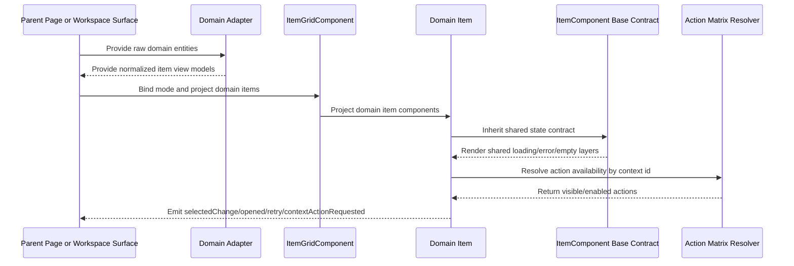

# Item Grid

## What It Is

Item Grid is the universal layout and item-rendering contract for all Feldpost list and grid surfaces. It defines one shared structure for media, projects, and future domain entities so loading, error, no-media, and selection behavior stay consistent across pages and workspace contexts.
This system is a full replacement contract: once a surface is migrated, legacy grid/card components for that surface are removed from active wiring and moved to archive for traceability.

## Documentation Phase Boundary

- This refactoring pass MUST modify only the `/media` page specification set.
- In this shared spec, edits MUST stay limited to media-path ownership, FSM boundary, and naming consistency constraints.
- Non-media item-grid cleanup MUST be deferred to later phases.

## What It Looks Like

The system has two architectural layers: a layout-only `ItemGridComponent` and a state-contract `ItemComponent` base class consumed by domain-specific item components. Layout modes are `grid-sm`, `grid-md`, `grid-lg`, `row`, and `card`, with responsive transitions driven only by design tokens and shared primitives. Item content is projected from domain components; grid layout never renders domain text or actions itself. Shared loading is rendered as a pulse placeholder layer (spinner forbidden), while media delivery semantics are owned by `MediaDisplayComponent` + `MediaDownloadService` (see their dedicated specs for canonical FSM details). Item-grid-level invariant: cached media paths must preserve loading-first ordering and may not shortcut directly to final visible content. For grid surfaces, media slot geometry is plain square and media content renders with native ratio via `object-fit: contain`; quick actions reveal select (top-left) and map (top-right icon-only), and file-type chip (icon + text) anchors lower-right. All styles use semantic component class names and component-scoped SCSS files.
For media items, `MediaItemComponent` stays an interaction shell (selection/upload/quiet actions) and delegates media rendering and delivery choreography to `MediaDisplayComponent`.
All media consumers (map marker, workspace selected-items, `/media`, and detail view) must resolve tier and URL fallback through `MediaDownloadService`.

## Where It Lives

- Shared location: `apps/web/src/app/shared/item-grid/`
- Child specs:
  - `docs/specs/component/media.component.md`
  - `docs/specs/component/media-content.md`
  - `docs/specs/component/media-item.md`
  - `docs/specs/component/project-item.md`
  - `docs/specs/component/item-state-frame.md`
  - `docs/specs/component/media-item-upload-overlay.md`
  - `docs/specs/component/media-item-quiet-actions.md`
  - `docs/specs/service/media-download-service/media-download-service.md`
- Domain consumers:
  - Media page (`/media`) via media domain item adapter
  - Projects page (`/projects`) via project domain item adapter
  - Workspace pane selected-items area via workspace media domain item adapter
- Trigger: any feature that renders repeated items in list/grid/card layouts

## Actions

| #   | User Action                                                                                | System Response                                                                                                                                                                                       | Trigger                           |
| --- | ------------------------------------------------------------------------------------------ | ----------------------------------------------------------------------------------------------------------------------------------------------------------------------------------------------------- | --------------------------------- |
| 1   | Parent surface sets `mode` to `grid-sm`, `grid-md`, `grid-lg`, `row`, or `card`            | ItemGrid applies matching semantic layout class and tokenized geometry                                                                                                                                | `mode` input change               |
| 2   | Parent projects domain items into ItemGrid                                                 | Grid renders projected item slots without domain logic                                                                                                                                                | Content projection                |
| 3   | Domain item enters loading state                                                           | Loading owner is resolved by domain contract: shared domains use ItemStateFrame pulse placeholder; media uses `MediaDisplayComponent` loading surface (`loading-surface-visible`) (spinner forbidden) | `state='loading'`                 |
| 4   | Domain item enters error state                                                             | Base ItemComponent renders shared error surface; media retry ownership remains in `MediaDownloadService` and/or parent shells                                                                         | `state='error'`                   |
| 5   | Parent provides empty collection                                                           | Parent-level empty region renders using shared empty contract while ItemGrid keeps layout shell stable                                                                                                | `items.length===0`                |
| 6   | User selects or deselects an item                                                          | Base ItemComponent propagates selected state and emits selection event; selected emphasis is rendered by the domain visual owner                                                                      | pointer/keyboard selection action |
| 7   | User opens item action menu on media item                                                  | MediaItem action set is resolved from action-context matrix for `ws_grid_thumbnail` contract                                                                                                          | action trigger in MediaItem       |
| 8   | Viewport crosses tokenized breakpoints                                                     | Grid column count and spacing adapt by design token values only                                                                                                                                       | responsive recalculation          |
| 9   | Migration step for a surface is completed                                                  | New item-grid system becomes the only runtime path for that surface in one cutover; legacy components move to archive, not deletion                                                                   | migration completion gate         |
| 10  | Media item delivery state changes (as defined by MediaDisplay contract)                    | Media display layers switch with deterministic choreography; cache-hit paths still begin with loading-first ordering                                                                                  | media render state update         |
| 11  | Upload phase/progress is active for the represented media                                  | MediaItem shows upload overlay (progress fill + icon + label), layered behind quiet actions                                                                                                           | upload state update               |
| 12  | User hovers/focuses media item on desktop                                                  | Quiet actions fade in without layout shift; selection/map actions remain keyboard reachable                                                                                                           | hover/focus interaction           |
| 13  | Media item slot dimensions change                                                          | MediaItem measures slot size in `rem`, resolves requested/effective tier via orchestrator, and keeps rendering stable                                                                                 | resize observer event             |
| 14  | User triggers media item context action                                                    | MediaItem resolves full `ws_grid_thumbnail` action set and emits canonical action events                                                                                                              | context action trigger            |
| 15  | `/media` receives or appends large result sets                                             | Media list inserts rows progressively with deterministic batch size `columns x 3` to keep interaction fluid                                                                                           | list append / pagination          |
| 16  | Any media consumer requests preview rendering (`map`, `workspace`, `/media`, `detail`)     | Consumer resolves requested/effective tier and URL fallback through shared media-download-service chain before render binding                                                                         | media render request              |
| 17  | User changes route between `/map`, workspace detail, and `/media` while viewing same media | Existing cached tiers are reused across surfaces; media flow still starts at `loading-surface-visible` and transitions deterministically without forced cold reload                                   | cross-surface cache reuse         |

## Normative Boundary Contract

- This file MUST be the single source of truth for shared `ItemGridComponent` and `ItemComponent` layout/state-frame contracts.
- Media route shell lifecycle behavior MUST remain owned by `docs/specs/component/media.component.md`.
- Media content render lifecycle behavior MUST remain owned by `docs/specs/component/media-content.md`.
- Media delivery/render lifecycle behavior MUST remain owned by `docs/specs/component/media-display.md`.
- This file MUST NOT redefine route-shell tab/orchestration ownership.

## Component Hierarchy

```text
ItemGridSystem
├── ItemGridComponent (layout only, no domain knowledge)
│   ├── mode classes: item-grid--grid-sm | --grid-md | --grid-lg | --row | --card
│   └── <ng-content select="app-*-item"> projected domain items
├── ItemComponent (abstract base class, no layout geometry)
│   ├── Shared state frame
│   │   ├── Loading layer (pulse placeholder)
│   │   ├── Error layer
│   │   ├── Empty layer
│   │   └── No selected visual ownership (selection stays domain-owned)
│   └── Domain content outlet (overridden by subclasses)
├── MediaItemComponent (extends ItemComponent)
│   ├── MediaDisplayComponent (shared renderer)
│   │   ├── Delivery states: idle/loading-surface-visible/ratio-known-contain/media-ready/content-fade-in/content-visible/icon-only/error/no-media
│   │   ├── Contain path includes ratio-known-contain
│   │   ├── Cover path skips ratio-known-contain
│   ├── MediaItemUploadOverlayComponent (features/media)
│   └── MediaItemQuietActionsComponent (features/media; ws_grid_thumbnail actions)
├── DocumentItemComponent (extends ItemComponent)
│   └── filetype-suitability contract: A4 behavior for eligible document-like previews
├── ProjectItemComponent (extends ItemComponent)
│   ├── Project metadata and status
│   └── Project actions bound to project context matrix contract
└── JobItemComponent (extends ItemComponent, placeholder contract only)
    └── Not implemented in this phase
```

## Data

Item Grid core does not query backend data directly. Domain adapters provide normalized item view models and action context metadata.

### Data Flow (Mermaid)

```mermaid
flowchart TD
  A[Route page or workspace context] --> B[Domain adapter]
  B --> C[Normalized item view models]
  C --> D[ItemGridComponent]
  D --> E[Projected Domain Item Components]
  E --> F[ItemComponent shared state contract]
  E --> G[MediaItemComponent composition pipeline]
  G --> H[MediaDisplayComponent]
  H --> I[MediaDownloadService.getState(mediaId, slotSizeRem)]
  I --> J[delivery states plus retry metadata]
  G --> K[MediaItemUploadOverlayComponent]
  K --> L[UploadManagerService phase and progress]
  G --> M[MediaItemQuietActionsComponent]
  M --> N[action-context-matrix.md ws_grid_thumbnail]
```

| Field             | Source                             | Type                                                                                                | Purpose                                                                                             |
| ----------------- | ---------------------------------- | --------------------------------------------------------------------------------------------------- | --------------------------------------------------------------------------------------------------- |
| `mode`            | Parent page/workspace container    | `'grid-sm' \| 'grid-md' \| 'grid-lg' \| 'row' \| 'card'`                                            | Drives layout mode in ItemGrid                                                                      |
| `items`           | Domain adapter output              | `ReadonlyArray<ItemViewModel>`                                                                      | Rendered item collection                                                                            |
| `state`           | Domain adapter/item async pipeline | `ItemVisualState`                                                                                   | Single visual-state driver for shared and domain item surfaces                                      |
| `actionContextId` | Domain adapter                     | `string`                                                                                            | Binds item action menus to matrix contract                                                          |
| `mediaLoadState`  | `MediaDownloadService`             | `MediaDisplayDeliveryState`                                                                         | Canonical media delivery state vocabulary (defined in media-display + media-download-service specs) |
| `slotSizeRem`     | Media item measurement             | `number \| null`                                                                                    | Short-edge size in rem for tier selection                                                           |
| `requestedTier`   | media request policy               | `MediaTier`                                                                                         | Target render tier before service reconciliation                                                    |
| `effectiveTier`   | `MediaDownloadService`             | `MediaTier`                                                                                         | Actual tier after slot-aware reconciliation                                                         |
| `uploadOverlay`   | `UploadManagerService` bridge      | `UploadOverlayState \| null`                                                                        | Upload progress and status layer                                                                    |
| `gridColumns`     | Grid layout resolver               | `number`                                                                                            | Current resolved column count                                                                       |
| `batchInsertSize` | Media list progressive renderer    | `number`                                                                                            | Deterministic append size (`gridColumns x 3`)                                                       |
| `querySignature`  | Media list query model             | `string`                                                                                            | Stable cache namespace for route re-entry hydration                                                 |
| `loadedWindows`   | Media list pagination cache        | `Array<{ windowId: string; offset: number; limit: number; mediaIds: string[]; syncedAt: string; }>` | Tracks hydrated windows for active `querySignature`                                                 |
| `indexEntries`    | Media list cache index             | `Record<string, { mediaId: string; dbUpdatedAt: string; urlExpiresAt: string; }>`                   | Enables dual-staleness reconciliation per item                                                      |

### QuerySignature Route Re-entry Contract

- If route context re-enters with the same `querySignature`, consumers must hydrate from cache-first.
- Same-signature re-entry must not perform a full list requery.
- Revalidation for same-signature re-entry is diff-only and uses `dbUpdatedAt` plus `urlExpiresAt` dual-staleness dimensions.
- `querySignature` ownership stays at media page/content orchestration boundaries and is consumed by ItemGrid integration wiring only.


## Child specs

| Document | Scope |
| --- | --- |
| [item-grid.state-and-fsm.md](item-grid.state-and-fsm.md) | State contract, FSM, pulse placeholder, boolean migration |
| [item-grid.visual-behavior-and-scss.md](item-grid.visual-behavior-and-scss.md) | Visual behavior contract, ownership matrix, SCSS rules |
| [item-grid.migration-acceptance-and-gates.md](item-grid.migration-acceptance-and-gates.md) | Migration policy, acceptance criteria, comment/registry gates |

## File Map

| File                                                                       | Purpose                                                                                       |
| -------------------------------------------------------------------------- | --------------------------------------------------------------------------------------------- |
| `apps/web/src/app/shared/item-grid/item-grid.component.ts`                 | Layout-only container with mode inputs and projection contract                                |
| `apps/web/src/app/shared/item-grid/item-grid.component.html`               | Semantic layout shell + projection slots                                                      |
| `apps/web/src/app/shared/item-grid/item-grid.component.scss`               | Tokenized grid/row/card geometry classes                                                      |
| `apps/web/src/app/shared/item-grid/item.component.ts`                      | Abstract base class defining mandatory inputs/outputs and non-overridable states              |
| `apps/web/src/app/shared/item-grid/item-state-frame.component.ts`          | Shared non-overridable state renderer used by ItemComponent                                   |
| `apps/web/src/app/shared/item-grid/item-state-frame.component.html`        | Loading/error/empty state-frame template                                                      |
| `apps/web/src/app/shared/item-grid/item-state-frame.component.scss`        | Unified state visuals including pulse placeholder behavior                                    |
| `apps/web/src/app/features/media/media-item.component.ts`                  | Domain media item extending ItemComponent                                                     |
| `apps/web/src/app/features/media/media-item.component.html`                | Media-specific content projection region                                                      |
| `apps/web/src/app/features/media/media-item.component.scss`                | Media item local styling only                                                                 |
| `apps/web/src/app/features/media/media-item-render-surface.component.ts`   | Legacy reference only; not part of active runtime render contract                             |
| `apps/web/src/app/features/media/media-item-render-surface.component.html` | Legacy reference only; not part of active runtime render contract                             |
| `apps/web/src/app/features/media/media-item-render-surface.component.scss` | Legacy reference only; not part of active runtime render contract                             |
| `apps/web/src/app/features/media/media-item-upload-overlay.component.ts`   | Upload overlay presenter for media item                                                       |
| `apps/web/src/app/features/media/media-item-upload-overlay.component.html` | Upload overlay template (progress fill/icon/label)                                            |
| `apps/web/src/app/features/media/media-item-upload-overlay.component.scss` | Upload overlay visuals and layering                                                           |
| `apps/web/src/app/features/media/media-item-quiet-actions.component.ts`    | Quiet-actions presenter for media item actions                                                |
| `apps/web/src/app/features/media/media-item-quiet-actions.component.html`  | Quiet-actions template with keyboard-accessible controls                                      |
| `apps/web/src/app/features/media/media-item-quiet-actions.component.scss`  | Quiet-actions reveal transitions without layout shift                                         |
| `apps/web/src/app/features/projects/project-item.component.ts`             | Domain project item extending ItemComponent                                                   |
| `apps/web/src/app/features/projects/project-item.component.html`           | Project-specific content projection region                                                    |
| `apps/web/src/app/features/projects/project-item.component.scss`           | Project item local styling only                                                               |
| `apps/web/src/app/features/jobs/job-item.component.ts`                     | Placeholder contract type extending ItemComponent (no rendering implementation in this phase) |
| `apps/web/src/app/features/jobs/job-item.contract.md`                      | Placeholder documentation for future job item rollout                                         |

## Wiring

### Injected Services

- ItemGridComponent: None.
- ItemComponent: None required in base contract.
- MediaItemComponent: `UploadManagerService`, i18n, and action routing. Media delivery dependencies stay inside `MediaDisplayComponent` and `MediaDownloadService` integration boundaries.
- ProjectItemComponent: domain services for project actions and metadata.

### Inputs / Outputs

- ItemGridComponent inputs:
  - `mode: 'grid-sm' | 'grid-md' | 'grid-lg' | 'row' | 'card'`
- ItemGridComponent outputs:
  - None (layout component only)
- ItemComponent mandatory inputs:
  - `itemId`, `mode`, `state`, `actionContextId`
- ItemComponent mandatory outputs:
  - `selectedChange`, `opened`, `retryRequested`, `contextActionRequested`

### Subscriptions

- ItemGridComponent: None.
- ItemComponent: None in base class.
- Domain items: optional signal/computed subscriptions owned by each domain component and disposed by Angular lifecycle.
  - MediaItem-specific: upload progress bridge and resize observer cleanup; media delivery lifecycle remains delegated to `MediaDisplayComponent`.
  - Media page progressive rendering: batch append scheduling subscription using deterministic `columns x 3` chunk size.

### Supabase Calls

- ItemGridComponent: None.
- ItemComponent: None.
- Domain items: None direct; delegated to domain services.

### Wiring Flow (Mermaid)



## Acceptance Criteria (rollup)

Normative detail: [item-grid.migration-acceptance-and-gates.md](item-grid.migration-acceptance-and-gates.md). State/FSM: [item-grid.state-and-fsm.md](item-grid.state-and-fsm.md). Visual/SCSS: [item-grid.visual-behavior-and-scss.md](item-grid.visual-behavior-and-scss.md).

- [ ] Item Grid behavior satisfies the linked child specs and this parent contract.
