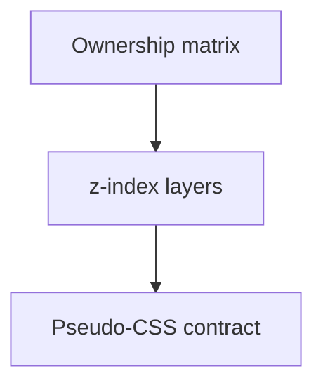

# Item Grid — Visual behavior and SCSS

> **Parent:** [item-grid.md](item-grid.md)

## What It Is

**Visual Behavior Contract** (geometry vocabulary, CSS variable matrix, ownership matrix, triad, stacking, layers, pseudo-CSS) and **SCSS responsibilities** for the item-grid system.

## What It Looks Like

Layering follows the ownership matrix; ItemGrid owns grid geometry only; state-frame owns loading/error/empty; domain items own media tile and overlays.

## Where It Lives

- **Specs:** `docs/specs/component/item-grid.visual-behavior-and-scss.md`

## Actions

| # | Trigger | System response |
| --- | --- | --- |
| 1 | Styling change | Must satisfy single-ownership and matrix below |

## Component Hierarchy

See parent [Component Hierarchy](item-grid.md#component-hierarchy).

## Data



## Visual Behavior Contract

### Geometry Ownership Vocabulary (Media Path)

- Constraint Owner: parent layout (`ItemGrid`) defines width/height limits for the slot.
- Effective Render Owner: media renderer (`MediaDisplayComponent`) resolves the used media box inside those limits via intrinsic ratio.
- Domain visuals in `MediaItemComponent` (selected ring, upload overlay, quiet actions) must align to the effective rendered box.
- `icon-only` media outcome keeps the effective box square (`1/1`) and domain visuals must stay square-aligned.

### CSS Variable Ownership & Dependency Matrix (Media Path)

| CSS Variable                                               | Set By                                                               | Consumed By                                 | Dependency Type               | Why                                                                               |
| ---------------------------------------------------------- | -------------------------------------------------------------------- | ------------------------------------------- | ----------------------------- | --------------------------------------------------------------------------------- |
| `--media-item-max-width` / `--media-item-max-height`       | `ItemGrid` slot/layout contract                                      | `MediaItem` and forwarded child constraints | parent-dependent              | Slot geometry limits belong to layout, not domain render internals.               |
| `--media-display-max-width` / `--media-display-max-height` | `MediaDisplayComponent` host inputs (forwarded from parent contract) | `MediaDisplayComponent` host sizing rules   | parent-derived child contract | Child consumes parent constraints without taking over constraint ownership.       |
| `--media-aspect-ratio`                                     | `MediaDisplayComponent` (hint/metadata)                              | `MediaDisplayComponent` host aspect-ratio   | child-owned intrinsic shape   | Intrinsic ratio shapes used box inside constraints and may change over lifecycle. |
| `--media-item-selected-ring-color`                         | global tokens/theme                                                  | `MediaItem` selected visuals                | global-dependent              | Selection semantics remain system-consistent across domains.                      |

Child dependency rule:

- `MediaItem` must not compute parent slot size from child CSS variables.
- `MediaItem` must visually conform to the child effective rendered box in normal layout flow.

### Ownership Matrix

| Behavior                   | Visual Geometry Owner                     | Stacking Context Owner                   | Interaction Hit-Area Owner                   | Selector(s)                               | Layer (z-index/token) | Test Oracle                                                                     |
| -------------------------- | ----------------------------------------- | ---------------------------------------- | -------------------------------------------- | ----------------------------------------- | --------------------- | ------------------------------------------------------------------------------- |
| Shared loading layer       | `.item-state-frame__state-layer--loading` | `.item-state-frame` (grid overlay stack) | none (passive state)                         | `.item-state-frame__state-layer--loading` | state/loading (1)     | loading layer covers projected content without changing grid geometry           |
| Media loading fallback     | `.media-display__layer--loading-surface`  | `app-media-item:host`                    | none (passive state)                         | `.media-display__layer--loading-surface`  | layer/content (0)     | media loading placeholder is frame-scoped and does not use shared wrapper layer |
| Shared error layer         | `.item-state-frame__state-layer--error`   | `.item-state-frame`                      | `.item-state-frame__retry`                   | `.item-state-frame__state-layer--error`   | state/error (1)       | error layer is visible and retry button remains clickable                       |
| Shared empty layer         | `.item-state-frame__state-layer--empty`   | `.item-state-frame`                      | none (passive state)                         | `.item-state-frame__state-layer--empty`   | state/empty (1)       | empty message overlays projected content with stable slot bounds                |
| Media selected emphasis    | media render frame in domain item         | domain item host (`app-media-item:host`) | `.media-item__open` and quiet-action buttons | `.media-item__frame--selected`            | surface/selected      | selected ring is visible only on media frame, not on full tile                  |
| Media upload overlay       | media render frame bounds                 | domain item host (`app-media-item:host`) | none (passive overlay)                       | `.media-item__upload-overlay`             | overlay/upload (1)    | upload overlay does not shift layout and stays below quiet actions              |
| Media quiet actions reveal | quiet action controls                     | domain item host (`app-media-item:host`) | `.media-item-quiet-actions__button*`         | `.media-item__quiet-actions`              | overlay/actions (3)   | quiet actions reveal on hover/focus and remain keyboard reachable               |

### Ownership Triad Declaration

| Behavior                   | Geometry Owner                            | State Owner                                 | Visual Owner                              | Same element?                                                                      |
| -------------------------- | ----------------------------------------- | ------------------------------------------- | ----------------------------------------- | ---------------------------------------------------------------------------------- |
| Shared loading layer       | `.item-state-frame__state-layer--loading` | `.item-state-frame__state-layer--loading`   | `.item-state-frame__state-layer--loading` | ✅                                                                                 |
| Media loading fallback     | `.media-display__layer--loading-surface`  | `.media-display__layer--loading-surface`    | `.media-display__layer--loading-surface`  | ✅                                                                                 |
| Shared error layer         | `.item-state-frame__state-layer--error`   | `.item-state-frame__state-layer--error`     | `.item-state-frame__state-layer--error`   | ✅                                                                                 |
| Shared empty layer         | `.item-state-frame__state-layer--empty`   | `.item-state-frame__state-layer--empty`     | `.item-state-frame__state-layer--empty`   | ✅                                                                                 |
| Media selected emphasis    | `.media-item__frame`                      | `.media-item__frame--selected`              | `.media-item__frame--selected`            | ✅                                                                                 |
| Media quiet actions reveal | `.media-item__quiet-actions`              | `.media-item--selected` (parent state gate) | `.media-item__quiet-actions`              | ⚠️ exception — CSS cascade trigger only — no FSM state crosses component boundary. |

### Stacking Context

- Domain item host is the stacking-context owner for domain overlays.
- Shared wrappers (`ItemStateFrameComponent`) must remain transparent wrappers and must not create a separate stacking context.
- Visual geometry ownership can be a nested element (for example render frame) and must be listed separately in the ownership matrix.

### Layer Order (z-index)

| Layer             | z-index | Owner                                               |
| ----------------- | ------- | --------------------------------------------------- |
| Media content     | 1       | Domain render surface content node                  |
| Selected emphasis | 2       | Domain visual geometry owner (frame-level selector) |
| Upload overlay    | 3       | Domain item upload overlay                          |
| Quiet actions     | 4       | Domain item quiet actions                           |

No undeclared z-index values are allowed in domain item components.

### State Ownership

| Visual state  | Owner element                                                                                                                                 | Notes                                                               |
| ------------- | --------------------------------------------------------------------------------------------------------------------------------------------- | ------------------------------------------------------------------- |
| Loading pulse | Shared domains: `app-item-state-frame` (`.item-state-frame__state-layer--loading`); media exception: `.media-display__layer--loading-surface` | Spinner forbidden; owner is explicitly declared per domain contract |
| Error surface | `app-item-state-frame` (`.item-state-frame__state-layer--error`)                                                                              | Shared retry and message handling                                   |
| Empty surface | `app-item-state-frame` (`.item-state-frame__state-layer--empty`)                                                                              | Shared empty fallback                                               |
| Selected ring | Domain visual geometry owner (media frame selector)                                                                                           | Domain-owned selected emphasis                                      |
| Hover reveal  | `app-media-item` quiet-actions layer                                                                                                          | Domain-owned interaction affordance                                 |

### Pseudo-CSS Contract

```css
/* Domain item host is the stacking context for overlay layers */
:host {
  display: block;
  position: relative;
}

/* Content is base layer */
.media-item-content {
  position: relative;
  z-index: 0;
}

/* Overlay layers are host children and fill the same bounds */
.media-item-upload-overlay,
.media-item-quiet-actions {
  position: absolute;
  inset: 0;
}

.media-item-upload-overlay {
  z-index: 1;
}
.media-item-quiet-actions {
  z-index: 3;
}

/* Selected emphasis can be rendered on the nested geometry owner */
.media-frame--selected {
  outline: 2px solid var(--color-clay);
  filter: drop-shadow(
    0 1px 2px color-mix(in srgb, var(--color-clay) 32%, transparent)
  );
}

/* Rendered media keeps native ratio inside owned content bounds */
img {
  width: 100%;
  height: 100%;
  object-fit: contain;
  object-position: top center;
}
```

## SCSS Responsibilities

### Single Ownership Rule

- Every SCSS file is responsible for exactly one component.
- Geometry ownership is strictly split:
  - `ItemGridComponent` SCSS defines only grid layout (columns, gaps, breakpoints).
  - `ItemComponent` / `ItemStateFrameComponent` SCSS defines only shared state frame surfaces (loading/error/empty).
  - Domain item SCSS (`MediaItemComponent`, `ProjectItemComponent`, etc.) defines only domain content styling (typography, icons, media affordances).
- Explicitly forbidden: setting the same dimension in multiple component layers.
  - No duplicate `width` / `height` / `max-height` ownership across grid, state-frame, and domain item styles.
  - Each dimension is defined exactly once, at the semantically owning layer.
- ItemGrid must not set spacing or framing on projected domain children.
  - `gap` and column definitions are ItemGrid-owned.
  - Projected-child `padding`/`margin` ownership stays with the domain item host.
  - `border-radius` and `overflow` ownership stays with the domain item host.

### SCSS Comment Rule

- Every CSS class, every custom property variable, and every keyframe must have two comment lines directly above it.
  - Line 1: what it does.
  - Line 2: spec reference.

Example:

- `// Defines column layout for grid-md mode with token-based spacing`
- `// @see docs/specs/component/item-grid.visual-behavior-and-scss.md#scss-responsibilities`

## Wiring

N/A — presentation contract only.

## Acceptance Criteria

- [ ] Ownership matrix and z-index layers match shipped templates and SCSS.
- [ ] No duplicate geometry across ItemGrid, ItemStateFrame, and domain items.
