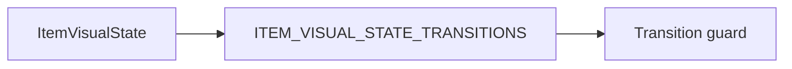

# Item Grid — State, FSM, and contracts

> **Parent:** [item-grid.md](item-grid.md)

## What It Is

Shared **State** contract for `ItemGridComponent` / `ItemComponent`: pulse placeholder, state-frame geometry, media rebuild and delivery rules, `ItemVisualState` enum, transition map, choreography, and boolean-input migration notes.

## What It Looks Like

Enumerated visual states and transitions apply to item shells; media **delivery** states remain owned by media-display and media-download specs.

## Where It Lives

- **Specs:** `docs/specs/component/item-grid/item-grid.state-and-fsm.md`
- **Code:** `apps/web/src/app/shared/item-grid/` (layout/state-frame base); domain items under `features/*`

## Actions

| # | Trigger | System response |
| --- | --- | --- |
| 1 | Implementer validates FSM | Transitions and `[attr.data-state]` match contracts below |

## Component Hierarchy

See parent [Component Hierarchy](item-grid.md#component-hierarchy).

## Data



## State

| Name              | TypeScript Type                                          | Default     | What it controls                                                         |
| ----------------- | -------------------------------------------------------- | ----------- | ------------------------------------------------------------------------ |
| `mode`            | `'grid-sm' \| 'grid-md' \| 'grid-lg' \| 'row' \| 'card'` | `'grid-md'` | ItemGrid layout variant                                                  |
| `state`           | `ItemVisualState`                                        | `'content'` | Non-overridable visual state routing for shared and domain item surfaces |
| `actionContextId` | `string \| null`                                         | `null`      | Resolves domain actions via action matrix                                |
| `batchInsertSize` | `number \| null`                                         | `null`      | Progressive `/media` insertion size (`columns x 3`)                      |

### Base Class Contract (Mandatory for all Domain Items)

Every domain item extending ItemComponent must expose these inputs/outputs:

- Inputs:
  - `mode`
  - `state`
  - `actionContextId`
  - `itemId`
- Outputs:
  - `selectedChange`
  - `opened`
  - `retryRequested`
  - `contextActionRequested`

Shared state rendering (loading/error/empty) is owned by ItemComponent and is not overridable by domain subclasses. Selected emphasis is domain-owned.

### Pulse Placeholder Contract (Mandatory)

The loading visual standard for Item Grid surfaces is a pulse placeholder layer. Spinner-based loading is forbidden.

- Layer: placeholder fills the intended media slot dimensions from first paint
- Motion: gentle pulse only during `loading`
- Iconography: default is icon-free neutral placeholder; optional blurred cached bitmap is allowed when available from shared cache
- Transition: deterministic media progression is defined by MediaDisplay/MediaDownloadService; ItemGrid enforces loading-first visibility and non-shortcut behavior at integration boundaries
- Replacement: when content arrives, real items replace placeholders in the same slot index and use item entry fade-in
- Tail behavior: placeholders without a matching real item must fade out and then be removed from DOM
- Layout stability: scroll containers keep reserved scrollbar space (`scrollbar-gutter: stable`) to prevent horizontal layout shift during loading/content swaps

### State-Frame Geometry Ownership (Mandatory)

- `ItemStateFrameComponent` is a neutral state/interaction wrapper and must not own domain thumbnail border/radius framing for media tiles.
- Media tile border and corner radius belong to the media render geometry owner (`MediaDisplayComponent` viewport / active media frame owner) only.
- Outer frame styling on wrappers is allowed only when the wrapper is also the visible tile owner for that domain.

### Media Contract Rebuild Rule (Mandatory)

- Archived `universal-media.component.*` remains historical reference only, not runtime dependency.
- `MediaItemComponent` must compose `MediaDisplayComponent` as the canonical media renderer and keep only interaction-shell responsibilities:
  - upload overlay behavior and layering
  - slot-measurement forwarding for adaptive tier selection
  - quiet actions behavior and accessibility
  - frame-level selection semantics
- Runtime wrapping, importing, or forwarding through `UniversalMediaComponent` is forbidden for migrated media item flows.

### Global Media Delivery Contract (Mandatory)

- Every media render consumer must use the same shared chain through `MediaDownloadService` for requested/effective tier reconciliation, signed URL retrieval, cache lifecycle, and delivery-state updates.
- Per-surface custom URL/tier strategies are forbidden after migration.
- Allowed exception: row-mode ratio fallback can be consumer-specific, but URL/tier selection still comes from the shared chain.
- This contract applies to map markers, workspace selected-items, `/media` grid items, and detail preview surfaces.
- Item-grid-level components (`ItemGridComponent`, `ItemComponent`, `MediaItemComponent`) are not write owners for route lifecycle state or operator/query state (`groupingMode`, `sortMode`, `activeFilters`).
- Item-grid-level components are not escalation routers; per-item failures remain local and systemic escalation is handled through `MediaDownloadService` -> `MediaContentComponent` -> route shell.

### Aspect-Ratio Ownership Contract (Mandatory)

- `ItemComponent` base contract must not enforce one fixed aspect ratio rule.
- Every domain item owns its own aspect contract (for example media, project, document).
- `MediaItemComponent` owns photo/video ratio behavior:
  - row mode ratio is derived from metadata (not hardcoded square)
  - visual updates use fade in/out when ratio-relevant media source changes
- Document-like previews use A4 behavior by file-type suitability policy (not tied to `grid-lg`).
  - Reference: `media-item.md#document-preview-suitability-contract-mandatory` and file-type registry mapping.
  - Row mode ratio from media metadata remains higher priority when available.

### Media Domain Sub-Component Ownership (Mandatory)

- All media-specific rebuild sub-components belong to `apps/web/src/app/features/media/`.
- `shared/item-grid/` remains layout/state-frame only and must not host media domain render primitives.
- Required split:
  - `MediaItemComponent`: orchestration, measurement forwarding, interaction action emission
  - `MediaDisplayComponent` (shared/media-display): visual media layers and asset rendering
  - `MediaItemUploadOverlayComponent` (features/media): upload progress overlay layer
  - `MediaItemQuietActionsComponent` (features/media): hover/focus action affordances and action triggers

## State Machine

Scope note:

- The `ItemVisualState` enum below governs shared item-frame interaction state.
- Media delivery state is owned by the media renderer/service chain and must be consumed from their canonical contracts, not redefined in ItemGrid.

FSM scope rule for this spec family:

- FSM is required whenever a component has programmatic state (not expressible by CSS pseudo-classes only).
- CSS pseudo-classes are not FSM states.

FSM ownership mapping for media route surfaces:

- MediaPage FSM is defined in `docs/specs/component/media/media.component.md`.
- MediaContent FSM is defined in `docs/specs/component/media/media-content.md`.
- ItemGrid must consume these contracts without redefining their state enums locally.

### State Enum

`ItemComponent` public visual API must migrate to one enum state input.

```ts
export type ItemVisualState =
  | "content"
  | "loading"
  | "error"
  | "empty"
  | "selected"
  | "disabled";
```

### Transition Map

```ts
export const ITEM_VISUAL_STATE_TRANSITIONS: Record<
  ItemVisualState,
  ItemVisualState[]
> = {
  content: ["loading", "error", "empty", "selected", "disabled"],
  loading: ["content", "error", "empty", "disabled"],
  error: ["loading", "content", "disabled"],
  empty: ["loading", "content", "disabled"],
  selected: ["content", "loading", "error", "disabled"],
  disabled: ["content", "loading", "error", "empty", "selected"],
};
```

### Transition Guard Contract

- Item-grid domain items must transition through guard-validated maps.
- Unlisted transitions are rejected.
- Stateful component roots bind one visual driver attribute: `[attr.data-state]`.
- Visual output may not be coordinated by multiple public boolean inputs.
- Parent/child coordination is required where child overlays depend on stable parent geometry or parent state gates.

### Transition Choreography Table (Required Before CSS)

| from -> to            | step | element               | property         | timing token                 | delay |
| --------------------- | ---- | --------------------- | ---------------- | ---------------------------- | ----- |
| `content -> loading`  | 1    | loading layer         | opacity          | `var(--transition-fade-in)`  | `0ms` |
| `content -> error`    | 1    | error layer           | opacity          | `var(--transition-fade-in)`  | `0ms` |
| `content -> empty`    | 1    | empty layer           | opacity          | `var(--transition-fade-in)`  | `0ms` |
| `loading -> content`  | 1    | loading layer         | opacity          | `var(--transition-fade-out)` | `0ms` |
| `content -> selected` | 1    | selected visual owner | emphasis visuals | `var(--transition-emphasis)` | `0ms` |

## Boolean Input Migration Required

- Migration required: in progress for legacy call sites only.
- Canonical base contract is enum-driven (`state: ItemVisualState`) plus non-visual data inputs.
- Boolean visual-state inputs (`loading`, `error`, `empty`, `selected`, `disabled`) are compatibility-only for legacy surfaces and forbidden for new work.
- Each feature cutover removes legacy booleans in one pass to avoid mixed visual-state models.

## Wiring

See parent [Wiring](item-grid.md#wiring) and media specs for service integration.

## Acceptance Criteria

- [ ] `ItemVisualState`, transition map, and choreography match implementation; legacy booleans removed per cutover rules.
- [ ] Stateful items expose `[attr.data-state]`; tokenized transitions only.
