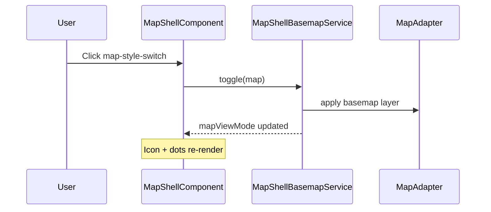

# Map Style Switch

## What It Is

Single **cycle/toggle** basemap control in the map zone: switches between **street map** and **satellite photo**. Implemented inline in `MapShellComponent` (not a standalone component). Shows a stacked icon + **cycle indicator dots** ([`cycle-indicator-dots.md`](../ui-primitives/cycle-indicator-dots.md)).

## What It Looks Like

- **Position:** bottom-right of map zone, above GPS button (`z-index: 200`)
- **Shape:** circular frosted outline button `2.75rem` (desktop) / `3rem` (mobile)
- **Icon:** shows the **target** mode (`satellite_alt` when on street, `map` when on photo) at `var(--font-size-lg)`
- **Dots:** two dots under icon — left = street, right = photo; active dot uses `var(--interaction-nav-ink)`
- **Rest:** muted icon + frosted `outline-control` chrome
- **Hover / focus-visible:** brand gold ink + gold frosted wash (`outline-control-hover`)

## Where It Lives

- **Parent:** [`map-zone.md`](./map-zone.md) → `MapShellComponent` template
- **SCSS:** `apps/web/src/app/features/map/map-shell/scss/_map-shell-style-switch.scss`
- **State:** `MapShellBasemapService.mapViewMode()` (`street` | `photo`)

## Actions

| # | User action | System response |
| - | ----------- | ---------------- |
| 1 | Tap button | Basemap toggles; icon and active dot update |
| 2 | Hover / focus-visible | Brand gold emphasis on button |
| 3 | Reload page | Last basemap restored from persistence ([`map-zone.md`](./map-zone.md)) |

## Interaction emphasis

| Surface | Rest | Hover / focus-visible |
| --- | --- | --- |
| Button | Muted ink; active mode shown on **dots** (violet), not full button fill | Brand gold ink + gold wash; icon inherits |

Active basemap is **tertiary** placement (violet dot) — same attention tier as sidebar route ink. The button body does not use `emphasis.nav()` fill at rest; only the active dot carries nav ink.

## Component Hierarchy

```text
.map-style-switch
└── button.map-style-switch__btn
    └── .map-style-switch__media
        ├── .map-style-switch__icon (Material icon)
        └── .map-style-switch__dots
            ├── .map-style-switch__dot (street)
            └── .map-style-switch__dot (photo)
```

## Visual Behavior Contract

| Behavior | Visual Geometry Owner | Stacking Context Owner | Interaction Hit-Area Owner | Selector(s) | Layer | Test Oracle |
| --- | --- | --- | --- | --- | --- | --- |
| Control shell | `.map-style-switch` | `.map-style-switch` | `.map-style-switch__btn` | `.map-style-switch` | 200 | Fixed above GPS offset |
| Circular button | `.map-style-switch__btn` | button | button | `:host button.map-style-switch__btn` | content | 2.75rem circle |
| Icon + dots stack | `.map-style-switch__media` | button | button | `__media`, `__icon`, `__dots` | content | Fits inside circle |
| Hover emphasis | button | button | button | `:hover`, `:focus-visible` | states | Gold ink + frosted hover |

## File Map

| File | Purpose |
| ---- | ------- |
| `features/map/map-shell/component/map-shell.component.html` | `.map-style-switch` markup |
| `features/map/map-shell/scss/_map-shell-style-switch.scss` | Geometry + frosted chrome |
| `features/map/map-shell/leaflet/map-shell-basemap.service.ts` | Basemap state + persistence |

## Wiring



## Acceptance Criteria

- [x] Single circular toggle (not a two-segment pill track)
- [x] Bottom-right placement above GPS
- [x] Two indicator dots (street / photo) with exactly one active
- [x] Icon shows target mode; smaller than pre-dots size to fit stack
- [x] Hover/focus: brand gold on button
- [x] **Given** any theme, **when** street mode active at rest, **then** left dot is violet (`--interaction-nav-ink`)
- [x] **Given** sandstone theme, **when** photo mode active, **then** active dot remains violet — not sandstone gold primary
