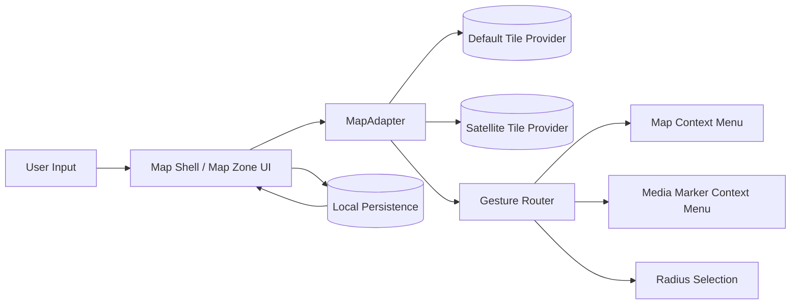
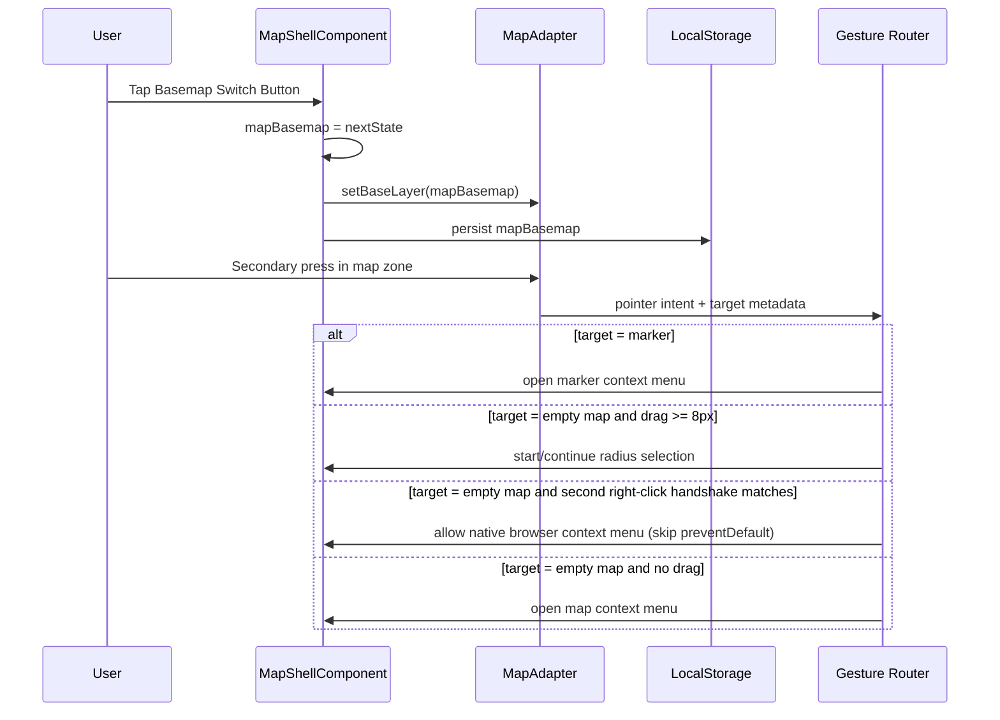

# Map Zone

## What It Is

The central area inside Map Shell that contains the Leaflet map and all floating controls. Everything that overlays the map (search bar, upload button, GPS button, filter chips, placement banner, basemap switch button) lives in Map Zone.

## What It Looks Like

Takes all remaining horizontal space after Sidebar (`flex: 1`). The Leaflet map fills it completely. Floating controls are absolutely positioned within it. No visible border or background — the map tiles are the background. A compact Basemap Switch Button sits in the top-left control stack and flips between default street tiles and a real-photo satellite layer.

## Where It Lives

- **Parent**: `MapShellComponent` template
- **Not a separate component** — it's a `<div class="map-zone">` in the Map Shell template

## Actions

| #   | User Action                      | System Response                                         | Triggers                               |
| --- | -------------------------------- | ------------------------------------------------------- | -------------------------------------- |
| 1   | Pans/zooms map                   | Leaflet viewport updates, triggers debounced data query | `MapAdapter.onViewportChange()`        |
| 2   | Clicks map (placement mode)      | Places marker at click coordinates                      | `placementActive` → new marker         |
| 3   | Right-click + drag (desktop)     | Starts radius selection                                 | Radius Selection Circle appears        |
| 4   | Long-press + drag (mobile)       | Starts radius selection                                 | Radius Selection Circle appears        |
| 5   | Taps Basemap Switch Button       | Switches tile layer (street ↔ satellite); icon + dots update | `MapShellBasemapService.toggle` |
| 6   | Taps Basemap Switch Button again | Switches back | same |
| 7   | Reloads the page                 | Restores last selected basemap from local persistence   | `mapBasemap` restored on shell init    |
| 8   | Switches app theme (light/dark/sandstone/system) | Street basemap swaps CARTO tiles live to match the theme; satellite is theme-agnostic and unchanged | `MapShellBasemapService` re-applies on `data-theme` / `prefers-color-scheme` change |

> **Theme-following street basemap:** the default (street) basemap tracks the active theme via CARTO tilesets — `dark_all` (dark), `rastertiles/voyager` (sandstone — warm, cream-toned), `light_all` (light / system-light). `MapShellBasemapService` watches `<html data-theme>` (MutationObserver) and the OS `prefers-color-scheme` media query, re-applying only the street layer so satellite imagery never reloads needlessly.

## Component Hierarchy

```
MapZone                                    ← div, flex-1, relative, overflow-hidden
├── MapContainer                           ← div #mapContainer, absolute inset-0, Leaflet mounts here
│   ├── [placing] crosshair cursor         ← via CSS class --placing
│   └── TileLayer + MarkerLayer            ← managed by MapAdapter, not Angular components
├── SearchBar                              ← absolute top-4 left-1/2, z-30
├── ActiveFilterChips                      ← absolute below search bar, z-20
├── UploadButtonZone                       ← absolute top-4 right-4, z-20
├── BasemapSwitchButton                    ← bottom-right above GPS, z-200 — see [map-style-switch.md](./map-style-switch.md)
├── GPSButton                              ← absolute bottom-4 right-4, z-20
└── [placement] PlacementBanner            ← absolute bottom-16 center, z-30
```

## Data

### Data Flow (Mermaid)



| Field        | Source                             | Type                                |
| ------------ | ---------------------------------- | ----------------------------------- |
| `mapBasemap` | Local persistence (`localStorage`) | `'default' \| 'satellite'`          |
| Tile layer   | `MapAdapter` provider registry     | `Leaflet.TileLayer` (adapter-owned) |

## State

| Name         | Type                       | Default     | Controls                                      |
| ------------ | -------------------------- | ----------- | --------------------------------------------- |
| `mapBasemap` | `'default' \| 'satellite'` | `'default'` | Active basemap tile layer and switch UI state |

## File Map

| File                                              | Purpose                                                      |
| ------------------------------------------------- | ------------------------------------------------------------ |
| `features/map/map-shell/map-shell.component.html` | Hosts [map style switch](./map-style-switch.md) (bottom-right stack) |
| `features/map/map-shell/map-shell.component.ts`   | Holds `mapBasemap` state and calls `MapAdapter.setBaseLayer` |
| `core/map/map-adapter.ts`                         | Defines `setBaseLayer('default' \| 'satellite')` contract    |
| `core/map/leaflet-map.adapter.ts`                 | Maps basemap state to concrete Leaflet tile layers           |

## Wiring

### Wiring Flow (Mermaid)



- Basemap switch button emits an intent handled by `MapShellComponent`
- `MapShellComponent` is the single source of truth for `mapBasemap`
- `MapAdapter` applies concrete Leaflet tile layer changes
- Last selected basemap is restored at startup before first user interaction

## Settings

- **Map Basemap**: sets the default map layer (`default` or `satellite`) and whether the last user choice is persisted across sessions.

## Acceptance Criteria

- [x] Map tiles fill the entire zone
- [x] Floating controls are positioned correctly and don't overlap
- [x] Placement click only fires when `placementActive` is true
- [x] Map interactions (pan, zoom) work even with floating controls on top
- [ ] User can switch between default street map and real-photo satellite map in one tap
- [ ] Current basemap state remains visible in the switch button (active/inactive)
- [ ] Selected basemap persists after reload
- [ ] Marker and cluster legibility remains acceptable on both tile backgrounds
