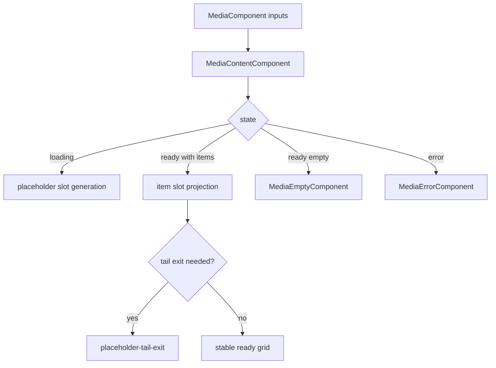
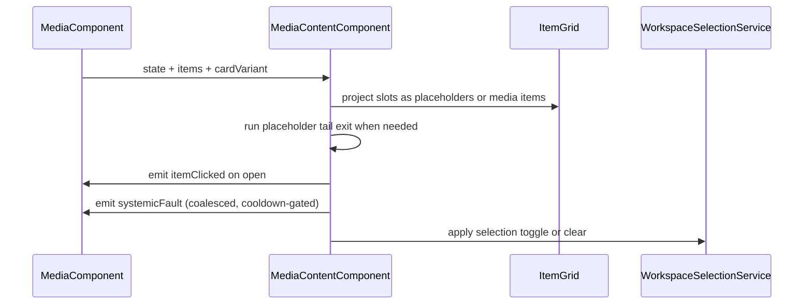

# Media Content

## What It Is

Media Content is the list-rendering state contract for the media route content area. It owns placeholder slot orchestration, empty/error presentation switching, and deterministic projection of media items into ItemGrid.

## What It Looks Like

The component renders a stable content region with placeholder slots during loading. When ready data arrives, placeholders are replaced in-place and optional placeholder tail exit is handled as a short transition phase. Empty and error views are mutually exclusive with grid rendering. Item rendering is delegated to MediaItemComponent in ItemGrid projection. Selection and context actions are forwarded to upstream services without redefining media delivery lifecycle.

## Where It Lives

- Runtime file: apps/web/src/app/features/media/media-content.component.ts
- Template file: apps/web/src/app/features/media/media-content.component.html
- Parent shell contract: docs/specs/component/media.component.md
- Item system contract: docs/specs/component/item-grid.md
- Trigger: MediaComponent updates state or list payload for /media content area

## Actions & Interactions

| #   | User/System Trigger                                | System Response                                                 | Output Contract                                                     |
| --- | -------------------------------------------------- | --------------------------------------------------------------- | ------------------------------------------------------------------- |
| 1   | Input state is loading                             | Render deterministic placeholder slot set                       | view enters loading-grid                                            |
| 2   | Input state is ready with items                    | Render projected media item slots                               | view enters ready-with-items                                        |
| 3   | Input state is ready with zero items               | Render empty state component                                    | view enters ready-empty                                             |
| 4   | Input state is error                               | Render error state component with retry affordance              | view enters error                                                   |
| 5   | Ready item count smaller than placeholder snapshot | Activate placeholder tail exit transition                       | view enters placeholder-tail-exit                                   |
| 6   | Placeholder exit timer completes                   | Remove tail placeholders                                        | transition placeholder-tail-exit to ready-with-items or ready-empty |
| 7   | User opens media item                              | Emit itemClicked output                                         | itemClicked event                                                   |
| 8   | User toggles item selection                        | Update selection service scope set                              | selection changed                                                   |
| 9   | User clicks outside grid while ready               | Clear selection                                                 | selection cleared                                                   |
| 10  | Coalesced systemic media fault signal is received  | Emit one shell escalation intent for the active cooldown window | systemicFault event                                                 |

## Component Hierarchy

```text
MediaContentComponent
├── ItemGridComponent
│   └── projected MediaItemComponent or placeholder slots
├── MediaEmptyComponent
└── MediaErrorComponent
```

## Data Requirements

| Field                           | Source                  | Type                             | Purpose                               |
| ------------------------------- | ----------------------- | -------------------------------- | ------------------------------------- |
| state                           | parent media shell      | loading or error or ready        | primary render switch                 |
| items                           | parent media shell      | ImageRecord[]                    | grid payload                          |
| emptyReason                     | parent media shell      | auth-required or no-results      | empty-state message contract          |
| cardVariant                     | parent media shell      | CardVariant                      | item mode mapping                     |
| loadingPlaceholderCount         | internal computed       | number                           | deterministic placeholder slot volume |
| loadingPlaceholderSnapshotCount | internal signal         | number                           | tail exit baseline                    |
| placeholderExitActive           | internal signal         | boolean                          | transitional placeholder tail phase   |
| gridSlots                       | internal computed       | MediaContentGridSlot[]           | projected slot model                  |
| systemicFaultIntent             | media delivery boundary | SystemicMediaFaultIntent \| null | storm-safe shell escalation signal    |



### FSM State Table

| State                 | Class        | Entry Trigger                                      | Exit Trigger                              | Forbidden Coupling                    |
| --------------------- | ------------ | -------------------------------------------------- | ----------------------------------------- | ------------------------------------- |
| loading-grid          | Main         | parent state loading                               | parent state ready or error               | no MediaDisplay delivery states       |
| ready-with-items      | Main         | parent ready and items length greater than zero    | parent error, loading, or tail exit start | no upload lane state in enum          |
| ready-empty           | Main         | parent ready and items length equals zero          | parent loading or error                   | no MediaItem delivery state proxy     |
| error                 | Main         | parent state error                                 | retry or parent loading                   | no parent route-shell states in enum  |
| placeholder-tail-exit | Transitional | ready transition with surplus placeholder snapshot | timer completion                          | no cross-component FSM state transfer |

## File Map

| File                                                         | Purpose                                 |
| ------------------------------------------------------------ | --------------------------------------- |
| apps/web/src/app/features/media/media-content.component.ts   | content state orchestration and outputs |
| apps/web/src/app/features/media/media-content.component.html | render switch and projected item slots  |
| apps/web/src/app/features/media/media-content.component.scss | content-region visuals and transitions  |
| docs/specs/component/media.component.md                      | parent shell FSM ownership              |
| docs/specs/component/item-grid.md                            | projected grid system contract          |

## Wiring

MediaContentComponent consumes parent state inputs and emits user interaction outputs. It does not own route-shell loading policy or MediaDisplay delivery choreography.
Per-item media delivery failures must not be forwarded upward one-by-one; only coalesced systemic intents from media-delivery boundary are allowed for shell escalation.



## Acceptance Criteria

- [ ] MediaContentComponent is the sole owner of MediaContent FSM transitions for content rendering states.
- [ ] MediaContent FSM includes loading-grid, ready-with-items, ready-empty, error, and placeholder-tail-exit.
- [ ] Empty and error rendering remain mutually exclusive with grid rendering.
- [ ] Placeholder tail exit is modeled as an explicit transitional state.
- [ ] MediaContent FSM does not include MediaDisplay delivery states.
- [ ] MediaContent FSM does not include upload lane states.
- [ ] Selection actions are forwarded without redefining item-render delivery lifecycle.
- [ ] MediaContent forwards at most one systemic fault escalation intent per active cooldown window.
- [ ] Per-item delivery failures are not bubbled directly to MediaComponent.
- [ ] ng build is clean for this contract integration.
- [ ] npm run lint is clean for this contract integration.
