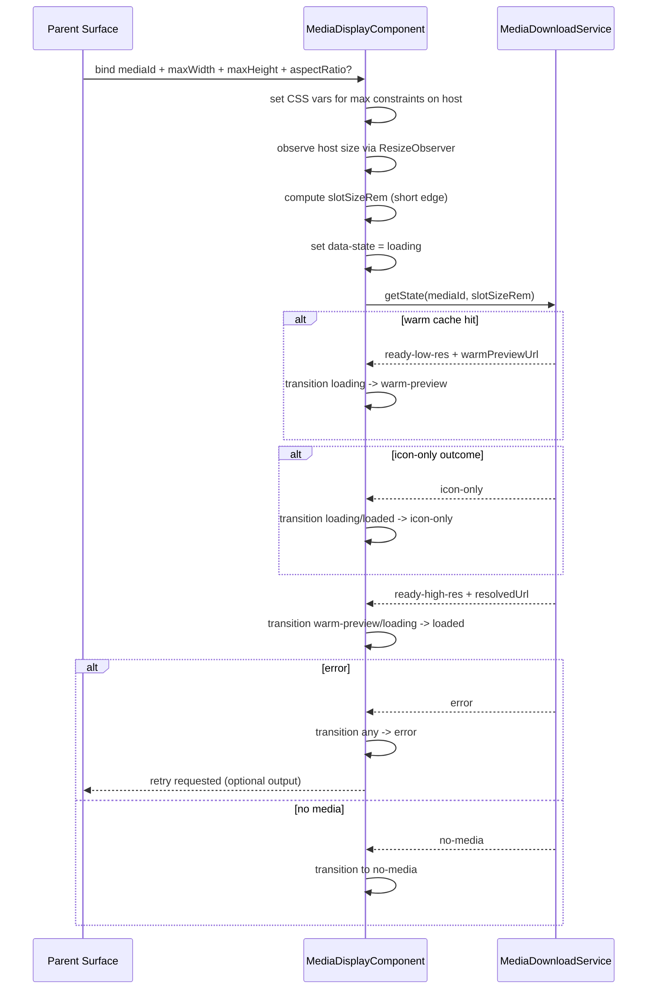

# Media Display

## What It Is

Media Display is the reusable media-rendering contract for Feldpost surfaces. It owns the full media download lifecycle for a single `mediaId` and renders deterministic states (`empty`, `loading`, `warm-preview`, `loaded`, `icon-only`, `error`, `no-media`) without any grid or interaction-layer knowledge.

## What It Looks Like

The component renders one stable media viewport and keeps geometry stable from first paint. While loading, it shows a neutral placeholder surface; if a cached lower tier exists, it can render a blurred warm preview before the requested tier becomes sharp. The transition from warm preview to loaded is a token-driven cross-fade and must never use hardcoded timing. Error and no-media are visually distinct: error exposes retry affordance, no-media communicates intentional absence without failure semantics. Aspect ratio is read from `--media-aspect-ratio` with square fallback to prevent layout shift.

## Where It Lives

- Spec location: `docs/specs/component/media-display.md`
- Service contract dependency: `docs/specs/service/media-download-service/media-download-service.md`
- Primary code location: `apps/web/src/app/shared/media-display/`
- Initial consumers:
  - `MediaItemComponent`
  - map marker media surfaces
  - media detail hero or card views
- Trigger: any UI that needs media rendering by identity (`mediaId`) with deterministic download-state visualization

## Actions & Interactions

| #   | User Action / System Trigger                           | System Response                                                                     | Trigger               |
| --- | ------------------------------------------------------ | ----------------------------------------------------------------------------------- | --------------------- |
| 1   | Component instantiates without `mediaId`               | Enter `empty` and render neutral empty shell                                        | `mediaId` missing     |
| 2   | `mediaId` is provided or changed                       | Enter `loading`, subscribe to `MediaDownloadService.getState(mediaId, slotSizeRem)` | input change          |
| 3   | Service exposes warm cached tier                       | Enter `warm-preview` and show blurred cached bitmap                                 | cache hit             |
| 4   | Requested tier resolves                                | Enter `loaded` and show sharp media asset                                           | service state update  |
| 5   | Service reports explicit no-media outcome              | Enter `no-media` without error treatment                                            | service state update  |
| 6   | Service reports error                                  | Enter `error` and expose retry interaction                                          | service state update  |
| 7   | User triggers retry from error frame                   | Re-enter `loading` and re-request service state stream                              | retry action          |
| 8   | Parent provides `maxWidth` and `maxHeight`             | Apply `--media-display-max-width` and `--media-display-max-height` on host          | input change          |
| 9   | Parent provides `aspectRatio` hint                     | Apply `--media-aspect-ratio` until metadata ratio is known                          | input change          |
| 10  | Service publishes metadata ratio                       | Replace or confirm `--media-aspect-ratio` value without layout jump                 | metadata update       |
| 11  | Component host is resized                              | Measure short edge via `ResizeObserver`, convert to `rem`, update `slotSizeRem`     | resize observer event |
| 12  | Service resolves non-previewable outcome for size/type | Enter `icon-only` and render icon surface without image request                     | service state update  |
| 13  | Visual transition leaves a transient state             | Exit transient layer only on `transitionend`                                        | CSS transition event  |
| 14  | Reduced motion is requested                            | Use global motion policy; component has no local motion branching                   | global CSS policy     |

## Component Hierarchy

```text
MediaDisplayComponent
├── media-display__viewport (single geometry owner)
│   ├── media-display__layer--loading
│   ├── media-display__layer--warm-preview
│   ├── media-display__layer--loaded
│   ├── media-display__layer--icon-only
│   ├── media-display__layer--error
│   └── media-display__layer--no-media
└── media-display__retry (error state control)
```

## Data Requirements

Media Display does not call Supabase directly. It consumes one identity input (`mediaId`) and one service stream from `MediaDownloadService`.

### Data Flow (Mermaid)

```mermaid
flowchart TD
  A[Parent component] --> B[MediaDisplayComponent]
  B --> C[mediaId]
  B --> D[maxWidth and maxHeight constraints]
  B --> E[aspectRatio hint optional]
  B --> F[ResizeObserver short edge measurement]
  F --> G[slotSizeRem]
  C --> H[MediaDownloadService.getState(mediaId, slotSizeRem)]
  G --> H
  H --> I[state + urls + metadata ratio]
  D --> J[--media-display-max-width and --media-display-max-height]
  I --> K[data-state on host]
  I --> L[layer rendering]
  E --> M[--media-aspect-ratio fallback]
  I --> M
```

| Field                 | Source                 | Type                                                                                       | Purpose                                                           |
| --------------------- | ---------------------- | ------------------------------------------------------------------------------------------ | ----------------------------------------------------------------- |
| `mediaId`             | parent                 | `string`                                                                                   | Primary identity for media state subscription                     |
| `maxWidth`            | parent                 | `string`                                                                                   | Maximum allowed inline size as CSS value (`rem`, `%`, `vw`, etc.) |
| `maxHeight`           | parent                 | `string`                                                                                   | Maximum allowed block size as CSS value (`rem`, `%`, `vh`, etc.)  |
| `aspectRatio`         | parent hint            | `number \| null`                                                                           | Optional ratio hint before service metadata arrives               |
| `slotSizeRem`         | internal measurement   | `number`                                                                                   | Host short-edge size in `rem` used for service tier resolution    |
| `deliveryState`       | `MediaDownloadService` | `'signing' \| 'ready-low-res' \| 'ready-high-res' \| 'icon-only' \| 'error' \| 'no-media'` | Service-level delivery semantics                                  |
| `resolvedUrl`         | `MediaDownloadService` | `string \| null`                                                                           | Active sharp tier URL                                             |
| `warmPreviewUrl`      | `MediaDownloadService` | `string \| null`                                                                           | Cached warm preview URL                                           |
| `metadataAspectRatio` | `MediaDownloadService` | `number \| null`                                                                           | Authoritative ratio from media metadata                           |

## Tier Resolution Contract

`MediaDisplayComponent` resolves requested media quality by passing `mediaId` and internally measured `slotSizeRem` (short edge) to `MediaDownloadService`. Tier-selection logic is fully owned by `MediaDownloadService`; this component only supplies measured size and renders the returned state.

Tier thresholds are defined in `MediaDownloadService`, not in `MediaDisplayComponent`.

### Photos and Videos (always bitmap)

| slotSizeRem (short edge) | Requested tier |
| ------------------------ | -------------- |
| `< 4rem`                 | `thumbnail-xs` |
| `4 - 8rem`               | `thumbnail-sm` |
| `8 - 16rem`              | `thumbnail-md` |
| `>= 16rem`               | `thumbnail-lg` |

### Documents, Audio, and Other Non-Photo/Video Types

| slotSizeRem (short edge) | Requested tier                                             |
| ------------------------ | ---------------------------------------------------------- |
| `< 8rem`                 | `icon-only` (no image request)                             |
| `8 - 12rem`              | first-page preview if available, else `icon-only`          |
| `>= 12rem`               | high-res first-page preview if available, else `icon-only` |

`icon-only` is a service-level signal, not a component decision. The component may render `icon-only` only when explicitly returned by `MediaDownloadService`.

## Geometry Ownership Between MediaDisplay and Parent

`MediaDisplayComponent` is strictly parent-constrained. The parent defines both width and height limits (`maxWidth`, `maxHeight`). The component may provide an intrinsic ratio hint (`--media-aspect-ratio`), but this only influences preferred shape inside parent constraints and must never override those limits.

## Geometry Dependency Contract

| Dimension    | Constraint Owner | Intrinsic Shape Owner | Mechanism                                                                                                                         |
| ------------ | ---------------- | --------------------- | --------------------------------------------------------------------------------------------------------------------------------- |
| width        | parent           | n/a                   | Parent sets `maxWidth`; component clamps inline size to that limit and never exceeds it.                                          |
| height       | parent           | component             | Parent sets `maxHeight`; component computes preferred block size from aspect ratio and clamps to parent height limit.             |
| aspect ratio | component        | component             | Component sets `--media-aspect-ratio` from hint/metadata; this changes preferred shape only, not ownership of height constraints. |

### CSS Variable Ownership & Dependency Matrix

| CSS Variable                   | Set By                                            | Consumed By                  | Dependency Type  | Why                                                                                       |
| ------------------------------ | ------------------------------------------------- | ---------------------------- | ---------------- | ----------------------------------------------------------------------------------------- |
| `--media-display-max-width`    | parent value forwarded through component input    | `:host` sizing rules         | parent-dependent | Width limit is an external layout contract and must be controlled by the parent surface.  |
| `--media-display-max-height`   | parent value forwarded through component input    | `:host` sizing rules         | parent-dependent | Height limit is an external layout contract and must be controlled by the parent surface. |
| `--media-aspect-ratio`         | component (`aspectRatio` hint + service metadata) | `:host` `aspect-ratio`       | self-set         | Ratio is media-intrinsic rendering knowledge and belongs to the renderer.                 |
| `--transition-*` design tokens | global design system/theme                        | state layers and transitions | global-dependent | Motion semantics are centralized and must not be duplicated per component.                |

Child dependency note:

- No child component may set geometry-driving CSS variables for `MediaDisplayComponent`.
- Geometry authority remains parent constraints + media-display intrinsic ratio only.

## State

### Public Inputs

| Input         | Type             | Purpose                                                            |
| ------------- | ---------------- | ------------------------------------------------------------------ |
| `mediaId`     | `string`         | Primary identity for internal media download subscription          |
| `maxWidth`    | `string`         | CSS max-width constraint (for example `4rem`, `100%`, `60vw`)      |
| `maxHeight`   | `string`         | CSS max-height constraint (for example `4rem`, `100%`, `60vh`)     |
| `aspectRatio` | `number \| null` | Optional ratio hint to avoid layout shift before metadata resolves |

`slotSizeRem` is not a public input. It is measured internally from host size.

No URL input is allowed. No load-state input is allowed. No boolean visual-state inputs are allowed.

### State Enum

```typescript
export type MediaDisplayState =
  | "empty"
  | "loading"
  | "warm-preview"
  | "loaded"
  | "icon-only"
  | "error"
  | "no-media";
```

### Transition Map

```typescript
export const MEDIA_DISPLAY_TRANSITIONS: Record<
  MediaDisplayState,
  MediaDisplayState[]
> = {
  empty: ["loading", "no-media"],
  loading: ["warm-preview", "loaded", "icon-only", "error", "no-media"],
  "warm-preview": ["loaded", "error", "no-media"],
  loaded: ["loading", "icon-only", "error", "no-media"],
  "icon-only": ["loading", "no-media"],
  error: ["loading", "no-media"],
  "no-media": ["loading", "error"],
};
```

### Transition Guard Contract

- Every state transition must be validated against the transition map.
- The root host is bound by one visual-state driver only: `[attr.data-state]="state()"`.
- Template and SCSS are forbidden from using boolean visual-state flags as primary state drivers.
- `icon-only` is never reachable from `warm-preview`; warm preview paths must complete to `loaded`, `error`, or `no-media`.
- Transient-state exits are controlled by `transitionend`, never by `setTimeout` magic numbers.

### Transition Choreography Table (Required Before CSS)

| from -> to                | step | element            | property     | timing token                 | delay                            |
| ------------------------- | ---- | ------------------ | ------------ | ---------------------------- | -------------------------------- |
| `loading -> warm-preview` | 1    | warm preview layer | opacity 0->1 | `var(--transition-fade-in)`  | 0                                |
| `warm-preview -> loaded`  | 1    | warm preview layer | opacity 1->0 | `var(--transition-fade-out)` | 0                                |
| `warm-preview -> loaded`  | 2    | sharp image        | opacity 0->1 | `var(--transition-fade-in)`  | `var(--transition-reveal-delay)` |
| `loading -> loaded`       | 1    | sharp image        | opacity 0->1 | `var(--transition-fade-in)`  | `var(--transition-reveal-delay)` |
| `loading -> icon-only`    | 1    | icon layer         | opacity 0->1 | `var(--transition-fade-in)`  | `var(--transition-reveal-delay)` |
| `loaded -> icon-only`     | 1    | loaded layer       | opacity 1->0 | `var(--transition-fade-out)` | 0                                |
| `loaded -> icon-only`     | 2    | icon layer         | opacity 0->1 | `var(--transition-fade-in)`  | `var(--transition-reveal-delay)` |
| `any -> error`            | 1    | current layer      | opacity 1->0 | `var(--transition-fade-out)` | 0                                |
| `any -> error`            | 2    | error frame        | opacity 0->1 | `var(--transition-fade-in)`  | `var(--transition-reveal-delay)` |

## State Rendering Matrix

| State          | Class        | Primary HTML layer(s)                                       | Required CSS selector behavior                                                     | Transition entry/exit notes                                                              |
| -------------- | ------------ | ----------------------------------------------------------- | ---------------------------------------------------------------------------------- | ---------------------------------------------------------------------------------------- |
| `empty`        | Main         | `media-display__layer--no-media` or neutral shell           | Host keeps constraints and ratio fallback; no asset layers active                  | Initial state before first valid `mediaId` delivery cycle                                |
| `loading`      | Intermediate | `media-display__layer--loading`                             | Loading layer opacity `1`, all other layers opacity `0`; pulse animation tokenized | Entry from `empty`, `error`, `icon-only`, `loaded`; exits via service state changes only |
| `warm-preview` | Intermediate | `media-display__layer--warm-preview` (+ loading fades away) | Warm-preview layer visible with blur; loaded layer still hidden                    | Allowed only when metadata ratio is known; transition to `loaded` starts cross-fade      |
| `loaded`       | Main         | `media-display__layer--loaded`                              | Loaded image layer opacity `1`; warm-preview can fade out to `0`                   | From `loading` or `warm-preview`; `transitionend` clears transient warm-preview residue  |
| `icon-only`    | Main         | `media-display__layer--icon-only`                           | Icon-only layer opacity `1`; no image element rendered in this state               | Entered only when service emits `icon-only`; may follow `loading` or `loaded`            |
| `error`        | Main         | `media-display__layer--error` + retry button                | Error layer opacity `1`, pointer-events enabled on retry control                   | Entry fades current active layer out first, then error frame in                          |
| `no-media`     | Main         | `media-display__layer--no-media`                            | No-media layer opacity `1`, distinct visual from error                             | Terminal non-error outcome; returns to `loading` on retry/re-request                     |

### HTML/CSS Change Table for Intermediate Transitions

| Transition                | HTML/State change                                                                                   | CSS change                                                                     |
| ------------------------- | --------------------------------------------------------------------------------------------------- | ------------------------------------------------------------------------------ |
| `loading -> warm-preview` | Activate warm-preview layer with cached URL; keep loaded URL inactive                               | Warm-preview opacity `0 -> 1` with `var(--transition-fade-in)`                 |
| `warm-preview -> loaded`  | Keep warm-preview node until loaded image has entered; then clear transient data on `transitionend` | Warm-preview opacity `1 -> 0`, loaded opacity `0 -> 1` with reveal delay token |
| `loading -> loaded`       | Activate loaded layer directly when warm preview is skipped                                         | Loaded opacity `0 -> 1` with reveal-delay token                                |
| `loading -> icon-only`    | Activate icon-only layer without rendering image node                                               | Icon-only opacity `0 -> 1` with reveal-delay token                             |
| `loaded -> icon-only`     | Keep loaded layer until icon-only layer has entered                                                 | Loaded opacity `1 -> 0`, icon-only opacity `0 -> 1`                            |
| `any -> error`            | Switch error layer active and expose retry control                                                  | Active layer opacity `1 -> 0`, error layer `0 -> 1`                            |

## Visual Behavior Contract

### Ownership Matrix

| Behavior            | Visual Geometry Owner              | Stacking Context Owner   | Interaction Hit-Area Owner | Selector(s)                           | Layer (z-index/token) | Test Oracle                                            |
| ------------------- | ---------------------------------- | ------------------------ | -------------------------- | ------------------------------------- | --------------------- | ------------------------------------------------------ |
| Loading placeholder | `.media-display__viewport`         | `app-media-display:host` | none (passive)             | `.media-display__layer--loading`      | layer/content (0)     | Placeholder fills viewport with stable ratio           |
| Warm preview render | `.media-display__viewport`         | `app-media-display:host` | none (passive)             | `.media-display__layer--warm-preview` | layer/content (1)     | Blurred cached tier appears without layout shift       |
| Sharp image render  | `.media-display__viewport`         | `app-media-display:host` | none (passive)             | `.media-display__layer--loaded`       | layer/content (2)     | Sharp tier cross-fades in after warm preview           |
| Icon-only frame     | `.media-display__layer--icon-only` | `app-media-display:host` | none (passive)             | `.media-display__layer--icon-only`    | layer/content (0)     | Filetype icon fills slot, no image element rendered    |
| Error frame + retry | `.media-display__layer--error`     | `app-media-display:host` | `.media-display__retry`    | `.media-display__layer--error`        | layer/feedback (3)    | Error frame is visible and retry is keyboard reachable |
| No-media frame      | `.media-display__layer--no-media`  | `app-media-display:host` | none (passive)             | `.media-display__layer--no-media`     | layer/feedback (3)    | No-media view is distinct from error styling           |

### Ownership Triad Declaration

| Behavior            | Geometry Owner                        | State Owner                           | Visual Owner                          | Same element? |
| ------------------- | ------------------------------------- | ------------------------------------- | ------------------------------------- | ------------- |
| Loading placeholder | `.media-display__layer--loading`      | `.media-display__layer--loading`      | `.media-display__layer--loading`      | yes           |
| Warm preview        | `.media-display__layer--warm-preview` | `.media-display__layer--warm-preview` | `.media-display__layer--warm-preview` | yes           |
| Sharp image         | `.media-display__layer--loaded`       | `.media-display__layer--loaded`       | `.media-display__layer--loaded`       | yes           |
| Icon-only frame     | `.media-display__layer--icon-only`    | `.media-display__layer--icon-only`    | `.media-display__layer--icon-only`    | yes           |
| Error frame         | `.media-display__layer--error`        | `.media-display__layer--error`        | `.media-display__layer--error`        | yes           |
| No-media frame      | `.media-display__layer--no-media`     | `.media-display__layer--no-media`     | `.media-display__layer--no-media`     | yes           |

No triad divergence is required for this component.

## Internal Behavior

- On `mediaId` change: transition to `loading`, then subscribe to `MediaDownloadService.getState(mediaId, slotSizeRem)`.
- On `maxWidth` / `maxHeight` change: set `--media-display-max-width` / `--media-display-max-height` on host.
- On host resize: measure short edge via `ResizeObserver`, convert px to `rem` using computed root font-size, and pass `slotSizeRem` to `MediaDownloadService`.
- On warm cache hit: transition to `warm-preview`.
- On requested tier loaded: transition to `loaded`.
- On service `icon-only` signal: transition to `icon-only` and render icon surface without image element.
- On error: transition to `error`.
- On no-media signal: transition to `no-media`.
- Aspect ratio is injected as `--media-aspect-ratio` on host once known (service metadata or `aspectRatio` hint).
- CSS reads ratio via `aspect-ratio: var(--media-aspect-ratio, 1/1)` and resolves within `max-width: var(--media-display-max-width, 100%)` and `max-height: var(--media-display-max-height, 100%)`.
- Transient state exits use `transitionend`, never arbitrary timers.
- `prefers-reduced-motion` is handled globally; no local override logic is required.

## What It Does Not Own

- Selection state
- Upload overlay
- Quiet actions
- Grid slot geometry
- Any boolean `@Input()` representing visual state
- The decision of whether a filetype is previewable at a given size (owned by `MediaDownloadService`)
- Filetype icon assets (owned by the shared icon system)
- Explicit height assignment on the host (height is derived from width multiplied by aspect ratio)

## File Map

| File                                                                 | Purpose                                               |
| -------------------------------------------------------------------- | ----------------------------------------------------- |
| `apps/web/src/app/shared/media-display/media-display.component.ts`   | Internal state orchestration and service subscription |
| `apps/web/src/app/shared/media-display/media-display.component.html` | Layered state template driven by `data-state`         |
| `apps/web/src/app/shared/media-display/media-display.component.scss` | State-layer visuals and tokenized transitions         |
| `apps/web/src/app/shared/media-display/media-display-state.ts`       | Enum and transition map contracts                     |

## Wiring

### Parent Contract

- Parent passes `mediaId`, `maxWidth`, `maxHeight`, and optional `aspectRatio`.
- Parent does not pass URLs or load-state booleans.
- Parent does not coordinate internal media lifecycle transitions.

### Service Contract

- `MediaDisplayComponent` injects `MediaDownloadService`.
- It subscribes to `getState(mediaId, slotSizeRem)` and maps service delivery semantics to `MediaDisplayState`.
- Retry delegates back to the same `getState(mediaId, slotSizeRem)` pipeline.

### Wiring Sequence (Mermaid)



## Acceptance Criteria

- [ ] The component exposes exactly four inputs: `mediaId`, `maxWidth`, `maxHeight`, and `aspectRatio`.
- [ ] `mode` input does not exist on this component.
- [ ] The component exposes no URL input and no load-state input.
- [ ] The component exposes no boolean visual-state inputs.
- [ ] `maxWidth` and `maxHeight` are applied on host as `--media-display-max-width` and `--media-display-max-height`.
- [ ] The component never sets explicit pixel width or height; sizing remains constraint-driven.
- [ ] Slot size is measured internally via `ResizeObserver` and converted to `rem`.
- [ ] `slotSizeRem` is passed to `MediaDownloadService` on every resize.
- [ ] All state transitions are deterministic and pass transition-map validation.
- [ ] Root visual state is driven only by `[attr.data-state]="state()"`.
- [ ] `mediaId` changes trigger `loading` and a fresh `MediaDownloadService.getState(mediaId, slotSizeRem)` subscription.
- [ ] Warm cache hit renders `warm-preview` before requested tier becomes `loaded`.
- [ ] Warm-preview to loaded transition performs tokenized cross-fade (no timing magic numbers).
- [ ] `icon-only` state is only entered when the service explicitly returns it.
- [ ] `icon-only` is never reached from `warm-preview` state.
- [ ] Photos and videos never enter `icon-only` regardless of slot size; they always receive tier-appropriate bitmap previews.
- [ ] Documents, audio, and other non-photo/video types enter `icon-only` when slot short edge is below `8rem`.
- [ ] Slot-size threshold changes trigger a fresh service request and smooth transition between tiers/states.
- [ ] Error state exposes retry interaction and returns to `loading` on retry.
- [ ] No-media is visually distinct from error.
- [ ] Aspect ratio is stable from first paint via `--media-aspect-ratio` with `1/1` fallback.
- [ ] The component never owns grid slot geometry, upload overlays, selection, or quiet actions.
- [ ] Transient exits are implemented via `transitionend`, not `setTimeout`.
- [ ] `prefers-reduced-motion` remains globally owned (no local override logic).
- [ ] `ng build` is clean after integration.
- [ ] `npm run lint` is clean after integration.
