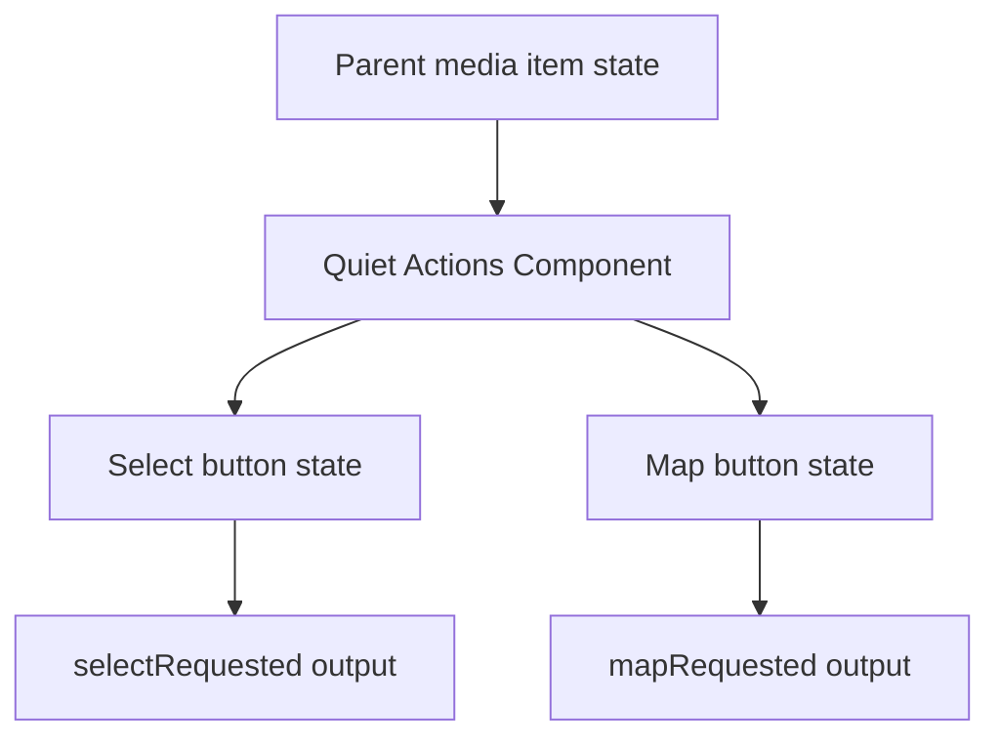
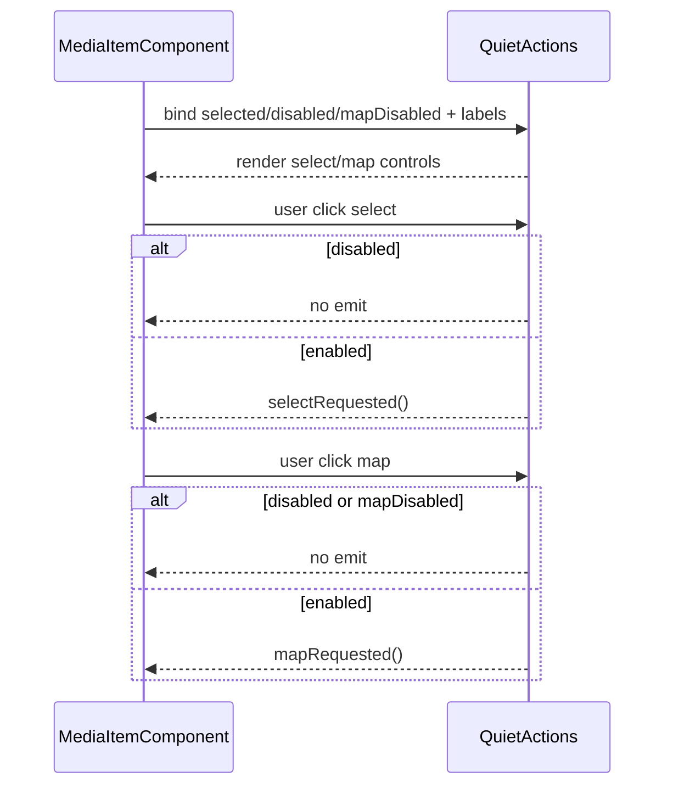

# Media Item Quiet Actions

## What It Is

Media Item Quiet Actions is the corner-action presenter for media item selection and map-jump affordances.
It MUST remain an overlay-layer control surface that reveals via parent hover/focus logic.

## Documentation Phase Boundary

- This refactoring pass MUST modify only the `/media` page specification set:
  - `docs/specs/page/media-page.md`
  - `docs/specs/component/media.component.md`
  - `docs/specs/component/media-content.md`
  - `docs/specs/component/media-item.md`
  - `docs/specs/component/media-display.md`
  - `docs/specs/component/media-item-quiet-actions.md`
  - `docs/specs/component/media-item-upload-overlay.md`
  - `docs/specs/component/item-grid.md` (media-path constraints only)
  - `docs/specs/component/media-page-header.md`
  - `docs/specs/component/media-toolbar.md`
- Broader documentation cleanup MUST be deferred to later phases.

## What It Looks Like

The component exposes two compact icon-only buttons: select (top-left) and map (top-right). The select control can show active selected styling and check icon. The map control uses the same small action style and supports disabled state when no location is available. Buttons support keyboard focus-visible outlines and are rendered within the media-frame action layer. Visual values use token-based spacing and colors.

## Where It Lives

- Component root: `apps/web/src/app/features/media/media-item-quiet-actions.component.ts`
- Used by: `MediaItemComponent`
- Trigger: always rendered as action layer; visibility controlled by parent state selectors

## Actions

| #   | User Action / System Trigger  | System Response                                         | Trigger             |
| --- | ----------------------------- | ------------------------------------------------------- | ------------------- |
| 1   | User clicks select action     | Component MUST emit `selectRequested` only when action is enabled. | select button click |
| 2   | User clicks map action        | Component MUST emit `mapRequested` only when action is enabled and map action is available. | map button click    |
| 3   | Item is selected              | Component MUST render select control with active selected style. | `selected=true`     |
| 4   | Map action disabled           | Component MUST render map button as disabled and non-interactive. | `mapDisabled=true`  |
| 5   | Keyboard focus enters actions | Component MUST render focus-visible ring on focused button. | keyboard navigation |

## Normative Boundary Contract

- This file MUST be the single source of truth for `MediaItemQuietActionsComponent` visual/action-surface behavior.
- `docs/specs/component/media-item.md` MUST remain the single source of truth for item-level orchestration and parent reveal gates.
- This file MUST NOT own route-shell lifecycle behavior.
- This file MUST NOT own upload overlay behavior.

## Component Hierarchy

```text
MediaItemQuietActionsComponent
└── div.media-item-quiet-actions
    ├── button.media-item-quiet-actions__button--select
    │   └── span.material-icons (optional check)
    └── button.media-item-quiet-actions__button--map
        └── span.material-icons (map)
```

## Data

The component consumes parent-provided booleans and labels, and emits action outputs.

| Field         | Source              | Type      | Purpose                                |
| ------------- | ------------------- | --------- | -------------------------------------- |
| `selected`    | parent media item   | `boolean` | selected visual state on select button |
| `disabled`    | parent media item   | `boolean` | disables all actions                   |
| `mapDisabled` | parent media item   | `boolean` | disables map action                    |
| `selectLabel` | i18n parent binding | `string`  | aria-label for select action           |
| `mapLabel`    | i18n parent binding | `string`  | aria-label for map action              |



## State

| Name          | TypeScript Type | Default | What it controls           |
| ------------- | --------------- | ------- | -------------------------- |
| `selected`    | `boolean`       | `false` | select button active style |
| `disabled`    | `boolean`       | `false` | global action lock         |
| `mapDisabled` | `boolean`       | `false` | map action availability    |

## State Machine

FSM scope rule:

- Required because this component has programmatic reveal/selection/disabled state.
- CSS pseudo-classes alone cannot represent action enablement and selected-state transitions.

### State Enum

```ts
export type MediaItemQuietActionsState =
  | "hidden"
  | "revealing"
  | "visible-unselected"
  | "visible-selected"
  | "visible-disabled"
  | "leaving";
```

### Transition Map

```ts
export const MEDIA_ITEM_QUIET_ACTIONS_TRANSITIONS: Record<
  MediaItemQuietActionsState,
  MediaItemQuietActionsState[]
> = {
  hidden: ["revealing"],
  revealing: [
    "visible-unselected",
    "visible-selected",
    "visible-disabled",
    "leaving",
  ],
  "visible-unselected": ["visible-selected", "visible-disabled", "leaving"],
  "visible-selected": ["visible-unselected", "visible-disabled", "leaving"],
  "visible-disabled": ["visible-unselected", "visible-selected", "leaving"],
  leaving: ["hidden"],
};
```

### Transition Guard Contract

- Quiet actions transition through a guarded transition map.
- Unlisted transitions are rejected.
- Root visual driver is `[attr.data-state]`.
- Template and SCSS must not use boolean visual-state flags as primary visual driver.
- Parent/child coordination required: parent media item controls reveal gates and must synchronize quiet-actions state transitions.

### Transition Choreography Table (Required Before CSS)

| from -> to                        | step | element       | property                | timing token                 | delay |
| --------------------------------- | ---- | ------------- | ----------------------- | ---------------------------- | ----- |
| `hidden -> revealing`             | 1    | actions host  | opacity                 | `var(--transition-fade-in)`  | `0ms` |
| `hidden -> revealing`             | 2    | actions host  | transform               | `var(--transition-emphasis)` | `0ms` |
| `revealing -> visible-unselected` | 1    | actions host  | opacity                 | `var(--transition-fade-in)`  | `0ms` |
| `revealing -> visible-selected`   | 1    | select button | border-color/background | `var(--transition-emphasis)` | `0ms` |
| `visible-* -> leaving`            | 1    | actions host  | opacity                 | `var(--transition-fade-out)` | `0ms` |

## Boolean Input Migration Required

- Migration required: yes.
- Current public visual-state inputs are boolean (`selected`, `disabled`, `mapDisabled`).
- Target contract is one enum state input (`state: MediaItemQuietActionsState`) plus non-visual labels and action outputs.
- Parent bindings must migrate in the same pass; boolean visual-state inputs must be removed after cutover.
- Parent call-site migration required: yes (`MediaItemComponent` template bindings to `app-media-item-quiet-actions`).

## File Map

| File                                                                      | Purpose                                    |
| ------------------------------------------------------------------------- | ------------------------------------------ |
| `apps/web/src/app/features/media/media-item-quiet-actions.component.ts`   | action input/output handling               |
| `apps/web/src/app/features/media/media-item-quiet-actions.component.html` | two-button quiet-action markup             |
| `apps/web/src/app/features/media/media-item-quiet-actions.component.scss` | corner button positioning and state styles |

## Wiring

### Injected Services

None.

### Inputs / Outputs

- Inputs: `selected`, `disabled`, `mapDisabled`, `selectLabel`, `mapLabel`
- Outputs: `selectRequested`, `mapRequested`

### Subscriptions

None.

### Supabase Calls

None — delegated to parent/domain services.



## Acceptance Criteria

- [ ] Quiet actions render select and map controls with proper aria labels.
- [ ] Select action emits only when component is enabled.
- [ ] Map action emits only when component and map action are enabled.
- [ ] Focus-visible ring is present for keyboard navigation.
- [ ] Select active style is applied when `selected=true`.
- [ ] Exactly two geometry owners exist in each render path (outer layout owner and innermost content owner).
- [ ] Visual output is driven by one enum state input with `[attr.data-state]`; boolean visual-state inputs are removed.
- [ ] Transition choreography uses tokenized timings (`var(--transition-*)`) and no magic numbers.
- [ ] `npm run lint` and `ng build` are clean for the migration scope.

## Visual Behavior Contract

### Ownership Matrix

| Behavior                   | Visual Geometry Owner                     | Stacking Context Owner | Interaction Hit-Area Owner | Selector(s)                                                         | Layer (z-index/token) | Test Oracle                                          |
| -------------------------- | ----------------------------------------- | ---------------------- | -------------------------- | ------------------------------------------------------------------- | --------------------- | ---------------------------------------------------- |
| Action control positioning | `app-media-item:host` action layer bounds | `app-media-item:host`  | action buttons             | `.media-item__quiet-actions` + `.media-item-quiet-actions__button*` | overlay/actions (3)   | buttons stay in top-left and top-right frame corners |
| Select active style        | select button                             | same as above          | select button              | `.media-item-quiet-actions__button--select-active`                  | actions/select-active | selected state shows highlighted select control      |
| Focus ring                 | focused button                            | same as above          | focused button             | `.media-item-quiet-actions__button:focus-visible`                   | actions/focus         | focus ring appears only on keyboard focus            |

### Ownership Triad Declaration

| Behavior            | Geometry Owner                              | State Owner                                                              | Visual Owner                                       | Same element?                                                                      |
| ------------------- | ------------------------------------------- | ------------------------------------------------------------------------ | -------------------------------------------------- | ---------------------------------------------------------------------------------- |
| Select active style | `.media-item-quiet-actions__button--select` | `.media-item-quiet-actions__button--select-active`                       | `.media-item-quiet-actions__button--select-active` | ✅                                                                                 |
| Focus ring          | `.media-item-quiet-actions__button`         | `.media-item-quiet-actions__button:focus-visible`                        | `.media-item-quiet-actions__button:focus-visible`  | ✅                                                                                 |
| Action reveal       | `.media-item__quiet-actions`                | `.media-item--selected` / `:hover` / `:focus-within` (parent state gate) | `.media-item__quiet-actions`                       | ⚠️ exception — CSS cascade trigger only — no FSM state crosses component boundary. |

### Stacking Context

- Parent media item host provides stacking and absolute overlay placement.
- Quiet-actions component provides internal button layout only.

### Layer Order (z-index)

- Quiet-actions host layer uses parent-assigned action layer z-order (`3`).
- Internal buttons do not create competing global layers.

### State Ownership

- hover/focus reveal: Parent media item selector rules
- select active visual: quiet-actions component select button
- map disabled visual: quiet-actions component map button

### Pseudo-CSS Contract

```css
:host {
  display: block;
}

.media-item-quiet-actions__button {
  position: absolute;
  inset-block-start: var(--spacing-2);
}

.media-item-quiet-actions__button--select {
  inset-inline-start: var(--spacing-2);
}

.media-item-quiet-actions__button--map {
  inset-inline-end: var(--spacing-2);
}
```

## Canonical Name Registry Gate

- Every component name used in this spec MUST match a canonical entry in glossary/registry.
- Names that do not resolve to a canonical glossary/registry entry MUST be treated as unresolved and MUST block completion.
- This refactor pass MUST NOT create or rename glossary/registry entries outside the in-scope media-page specification set.
- If a required canonical name cannot be resolved, documentation work MUST stop with: `⚠ SPEC GAP: [missing file or ambiguous owner]`.
