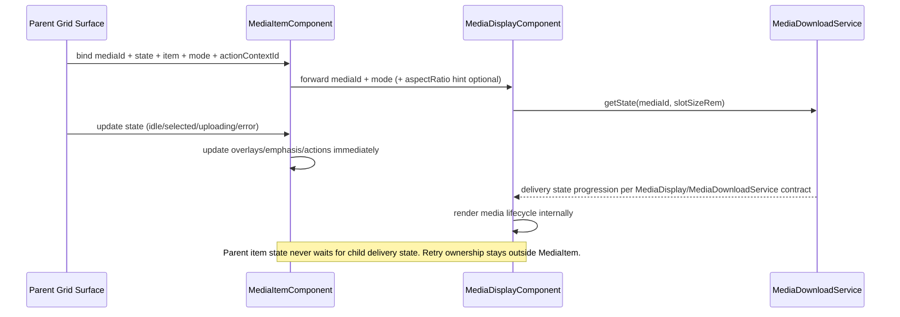

# Media Item

## What It Is

Media Item is the grid-item interaction contract for one media entity in Item Grid surfaces. It owns grid-level visuals and interactions (selection emphasis, upload overlay, quiet actions) and delegates all media download and rendering lifecycle responsibilities to `MediaDisplayComponent`.

## What It Looks Like

The component renders one stable item shell with media content in the base layer, upload overlay above it, and quiet actions on top. Selection emphasis is applied around the media frame and never around the full tile wrapper. Upload state is visible as a dedicated overlay layer and does not interfere with media loading visuals. Quiet actions stay hidden at rest and reveal on hover/focus with keyboard-accessible controls. Media delivery FSM details are not visualized by this component directly and remain delegated to the media renderer/service chain (`MediaDisplayComponent` + `MediaDownloadService`).

## Where It Lives

- Spec location: `docs/specs/component/media-item.md`
- Parent spec: `docs/specs/component/item-grid.md`
- Media renderer dependency: `docs/specs/component/media-display.md`
- Upload overlay dependency: `docs/specs/component/media-item-upload-overlay.md`
- Quiet-actions dependency: `docs/specs/component/media-item-quiet-actions.md`
- Service contract reference: `docs/specs/service/media-download-service/media-download-service.md`
- Runtime location: `apps/web/src/app/features/media/media-item.component.ts`

## Actions & Interactions

| #   | User Action / System Trigger                            | System Response                                                   | Trigger                     |
| --- | ------------------------------------------------------- | ----------------------------------------------------------------- | --------------------------- |
| 1   | Item is rendered in grid context                        | Compose `MediaDisplayComponent` + overlay + quiet actions         | component init              |
| 2   | Parent provides `mediaId`                               | Forward `mediaId` directly to `MediaDisplayComponent`             | input change                |
| 3   | Parent sets visual state to `selected`                  | Render selected emphasis around media frame                       | `state='selected'`          |
| 4   | Parent sets visual state to `uploading`                 | Show upload overlay layer                                         | `state='uploading'`         |
| 5   | Parent sets visual state to `error`                     | Show item-level error treatment for interaction layer             | `state='error'`             |
| 6   | Parent sets visual state to `idle`                      | Hide selected/upload/error-only treatments                        | `state='idle'`              |
| 7   | User hovers/focuses item                                | Reveal quiet actions in deterministic tokenized timing            | hover/focus                 |
| 8   | User activates select/map action                        | Emit canonical item action outputs                                | click/keyboard              |
| 9   | `MediaDisplayComponent` changes internal delivery state | Media Item keeps its own state unchanged; no parent wait required | child internal state change |
| 10  | Upload phase updates                                    | Update overlay content and progress visuals                       | upload stream               |

## Component Hierarchy

```text
MediaItemComponent
├── MediaDisplayComponent         (owns media rendering + download states)
├── MediaItemUploadOverlayComponent
└── MediaItemQuietActionsComponent
```

## Geometry Dependency Contract

| Dimension            | Constraint Owner       | Effective Render Owner           | Mechanism                                                                                                                                                                     |
| -------------------- | ---------------------- | -------------------------------- | ----------------------------------------------------------------------------------------------------------------------------------------------------------------------------- |
| width                | parent                 | child-coupled within constraints | ItemGrid sets slot width constraint. `MediaDisplayComponent` resolves actual rendered media box inside that slot; MediaItem frame/outline must conform to this rendered box.  |
| height               | parent                 | child-coupled within constraints | ItemGrid sets slot height or slot aspect policy. `MediaDisplayComponent` applies aspect ratio and resolves used height; MediaItem frame/outline must follow that used height. |
| intrinsic ratio hint | parent/domain metadata | child renderer                   | Parent may pass optional `aspectRatio` input to `MediaDisplayComponent`; the child uses this hint for internal shape resolution.                                              |

Interpretation rule:

- Parent owns limits (`maxWidth`, `maxHeight`, slot policy).
- Child owns intrinsic media shaping inside these limits.
- MediaItem visuals (outline, selected emphasis, overlays) must align to the child's effective rendered box, not to a stale fixed wrapper assumption.
- If child state is `icon-only`, the rendered box is square (`1/1`) and MediaItem visuals must stay square-aligned.

Geometry chain:

```text
ItemGrid -> sets slot width + height constraints
  MediaItem -> fills slot constraints
    MediaDisplayComponent -> renders media within forwarded constraints
```

### CSS Variable Ownership & Dependency Matrix

| CSS Variable                                               | Set By                                               | Consumed By                              | Dependency Type                 | Why                                                                                                         |
| ---------------------------------------------------------- | ---------------------------------------------------- | ---------------------------------------- | ------------------------------- | ----------------------------------------------------------------------------------------------------------- |
| `--media-item-max-width` (slot contract)                   | parent container (`ItemGrid`)                        | `MediaItem` host/frame sizing            | parent-dependent                | Slot width belongs to layout system, not to media item internals.                                           |
| `--media-item-max-height` (slot contract)                  | parent container (`ItemGrid`)                        | `MediaItem` host/frame sizing            | parent-dependent                | Slot height belongs to layout system, not to media item internals.                                          |
| `--media-item-selected-ring-color`                         | design tokens/theme                                  | selected emphasis styles                 | global-dependent                | Selection semantics must stay globally consistent.                                                          |
| `--media-aspect-ratio`                                     | `MediaDisplayComponent`                              | child host sizing and rendered media box | child-owned (intrinsic shape)   | Ratio comes from media metadata/hint. It shapes the effective box used by the child inside parent limits.   |
| `--media-display-max-width` / `--media-display-max-height` | `MediaDisplayComponent` host (from forwarded inputs) | child internal host styles               | child-owned (internal to child) | These variables are internal to the renderer and must not be read back by MediaItem for geometry decisions. |

Child dependency note:

- `MediaItem` must not read back child CSS variables to compute parent slot geometry.
- `MediaItem` must align outline/overlay geometry to the actual rendered child box in normal layout flow.
- Geometry is therefore two-layered: parent-constrained limits plus child-resolved effective box.

## Data Requirements

Media Item does not call Supabase directly and does not subscribe to media download state for rendering decisions.

### Data Flow (Mermaid)

```mermaid
flowchart TD
  A[Parent grid adapter] --> B[MediaItemComponent]
  B --> C[mediaId]
  B --> D[state: MediaItemState]
  B --> E[item + mode + actionContextId]
  C --> F[MediaDisplayComponent]
  F --> G[MediaDownloadService.getState(mediaId, slotSizeRem)]
  D --> H[MediaItem visual gates]
  H --> I[Selected emphasis]
  H --> J[Upload overlay visibility]
  H --> K[Quiet actions reveal gate]
```

| Field             | Source                                | Type                                                     | Purpose                                            |
| ----------------- | ------------------------------------- | -------------------------------------------------------- | -------------------------------------------------- |
| `mediaId`         | parent adapter                        | `string`                                                 | Identity forwarded to `MediaDisplayComponent`      |
| `state`           | parent interaction/state orchestrator | `MediaItemState`                                         | Single visual-state driver for item-level behavior |
| `item`            | parent adapter                        | `MediaItemViewModel`                                     | Domain data for labels/actions context             |
| `mode`            | parent container                      | `'grid-sm' \| 'grid-md' \| 'grid-lg' \| 'row' \| 'card'` | Slot context forwarded to child components         |
| `actionContextId` | action resolver                       | `string`                                                 | Resolves quiet-actions set                         |
| `uploadOverlay`   | upload manager bridge                 | `UploadOverlayState \| null`                             | Upload progress/status visualization               |

## State

### Public Inputs

| Input             | Type                                                     | Purpose                                         |
| ----------------- | -------------------------------------------------------- | ----------------------------------------------- |
| `mediaId`         | `string`                                                 | Identity forwarded to `MediaDisplayComponent`   |
| `state`           | `MediaItemState`                                         | Single visual driver for grid-level item states |
| `item`            | `MediaItemViewModel`                                     | Domain payload for item metadata and actions    |
| `mode`            | `'grid-sm' \| 'grid-md' \| 'grid-lg' \| 'row' \| 'card'` | Layout/slot context                             |
| `actionContextId` | `string`                                                 | Action-context resolution                       |

All boolean visual-state inputs are forbidden.

### State Enum

```typescript
export type MediaItemState = "idle" | "selected" | "uploading" | "error";
```

### Transition Map

```typescript
export const MEDIA_ITEM_TRANSITIONS: Record<MediaItemState, MediaItemState[]> =
  {
    idle: ["selected", "uploading", "error"],
    selected: ["idle", "uploading", "error"],
    uploading: ["idle", "selected", "error"],
    error: ["idle", "uploading"],
  };
```

### State Scope Clarification

- `MediaItemState` covers only grid-item-level states.
- Media delivery state progression is orchestrated by `MediaDownloadService` and rendered by `MediaDisplayComponent` according to their canonical specs.
- `MediaItemComponent` does not coordinate, await, or proxy media download state transitions.
- Retry behavior for media delivery stays in `MediaDownloadService` and/or parent shells. `MediaItemComponent` remains interaction-shell only.

### Transition Guard Contract

- Every transition must pass through map validation.
- Root binds one visual driver: `[attr.data-state]="state()"`.
- Template and SCSS may not use boolean visual-state flags as primary state drivers.

## Visual Behavior Contract

### Ownership Matrix

| Behavior             | Visual Geometry Owner         | Stacking Context Owner | Interaction Hit-Area Owner           | Selector(s)                    | Layer (z-index/token) | Test Oracle                                                   |
| -------------------- | ----------------------------- | ---------------------- | ------------------------------------ | ------------------------------ | --------------------- | ------------------------------------------------------------- |
| Selected emphasis    | `.media-item__frame`          | `app-media-item:host`  | `.media-item__open`                  | `.media-item__frame--selected` | layer/selected (2)    | Emphasis stays on media frame only                            |
| Upload overlay       | `.media-item__upload-overlay` | `app-media-item:host`  | none (passive)                       | `.media-item__upload-overlay`  | layer/upload (3)      | Upload layer sits above media content and below quiet actions |
| Quiet actions reveal | `.media-item__quiet-actions`  | `app-media-item:host`  | `.media-item-quiet-actions__button*` | `.media-item__quiet-actions`   | layer/actions (4)     | Controls reveal deterministically on hover/focus              |

### Ownership Triad Declaration

| Behavior             | Geometry Owner                | State Owner                          | Visual Owner                   | Same element?                                                     |
| -------------------- | ----------------------------- | ------------------------------------ | ------------------------------ | ----------------------------------------------------------------- |
| Selected emphasis    | `.media-item__frame`          | `.media-item__frame--selected`       | `.media-item__frame--selected` | yes                                                               |
| Upload overlay       | `.media-item__upload-overlay` | `.media-item__upload-overlay`        | `.media-item__upload-overlay`  | yes                                                               |
| Quiet actions reveal | `.media-item__quiet-actions`  | `.media-item` (host data-state gate) | `.media-item__quiet-actions`   | exception: reveal is gated by host state while visuals stay local |

### Stacking Context

- `app-media-item:host` is the sole stacking-context owner.
- `MediaDisplayComponent` is rendered as base content layer.
- Upload overlay and quiet actions are absolute overlays anchored to host.

### Layer Order

| Layer             | z-index | Element                        |
| ----------------- | ------- | ------------------------------ |
| Media content     | 1       | `MediaDisplayComponent`        |
| Selected emphasis | 2       | `.media-item__frame--selected` |
| Upload overlay    | 3       | `.media-item__upload-overlay`  |
| Quiet actions     | 4       | `.media-item__quiet-actions`   |

## Boolean Input Migration Required

- Migration required: yes.
- Current/legacy boolean visual-state inputs (`loading`, `error`, `empty`, `selected`, `disabled`) are removed from the public component API.
- Target input contract:
  - `mediaId: string`
  - `state: MediaItemState`
  - non-visual data inputs (`item`, `mode`, `actionContextId`)
- Parent call sites must migrate in one cutover pass to avoid mixed state models.

## File Map

| File                                                                     | Purpose                                                          |
| ------------------------------------------------------------------------ | ---------------------------------------------------------------- |
| `apps/web/src/app/features/media/media-item.component.ts`                | Item-level state orchestration and event outputs                 |
| `apps/web/src/app/features/media/media-item.component.html`              | Composition of media display + overlays + actions                |
| `apps/web/src/app/features/media/media-item.component.scss`              | Item-level visual layering and interaction styles                |
| `apps/web/src/app/shared/media-display/media-display.component.ts`       | Delegated media rendering and download-state ownership           |
| `apps/web/src/app/features/media/media-item-upload-overlay.component.ts` | Upload overlay presentation                                      |
| `apps/web/src/app/features/media/media-item-quiet-actions.component.ts`  | Quiet actions presentation and outputs                           |
| `apps/web/src/app/features/media/media-item-render-surface.component.ts` | Open question: remove entirely or keep as thin slot wrapper only |

## Wiring

### Parent/Child Coordination Contract

- `MediaItemComponent` provides identity and context to `MediaDisplayComponent` (`mediaId`, `mode`, optional aspect hint pass-through).
- `MediaItemComponent` does not wait for child download states before applying its own grid-level state changes.
- Child media lifecycle and parent item lifecycle are parallel and independent.

### Wiring Sequence (Mermaid)



## Acceptance Criteria

- [ ] `MediaItemComponent` uses `MediaDisplayComponent` for all media rendering.
- [ ] Media download states are not represented in `MediaItemState`.
- [ ] `MediaItemState` contains only `idle`, `selected`, `uploading`, `error`.
- [ ] `MediaItemComponent` exposes no boolean visual-state inputs.
- [ ] Public input contract includes `mediaId`, `state`, and non-visual data (`item`, `mode`, `actionContextId`).
- [ ] Selected emphasis is rendered around media frame only.
- [ ] Upload overlay z-order is above media content and below quiet actions.
- [ ] Quiet actions reveal remains deterministic and keyboard accessible.
- [ ] `MediaItemComponent` does not proxy or await `MediaDisplayComponent` internal states.
- [ ] `MediaItemRenderSurfaceComponent` is either removed or reduced to a thin slot wrapper with no render-state logic.
- [ ] No media render-state logic remains in `MediaItemComponent`.
- [ ] `ng build` is clean after migration.
- [ ] `npm run lint` is clean after migration.

## Ratio Binding Addendum (2026-04-05)

### Decision

- `MediaItemComponent` stays an interaction-shell component.
- Media render lifecycle remains exclusively inside `MediaDisplayComponent`.
- `MediaItemState` remains limited to item-level interaction states (`idle`, `selected`, `uploading`, `error`).
- New media lifecycle states from the MediaDisplay delivery FSM are explicitly forbidden in `MediaItemState`.

### Parent-Driven Ratio Binding Contract

| Concern                    | Owner                      | Rule                                                                                                          |
| -------------------------- | -------------------------- | ------------------------------------------------------------------------------------------------------------- |
| Slot constraints           | Parent grid/layout         | Defines `maxWidth` and `maxHeight` limits for the item shell.                                                 |
| Interaction shell geometry | `MediaItemComponent` frame | Selection ring, hover/click hit areas, quiet actions align to the parent-owned frame.                         |
| Media intrinsic rendering  | `MediaDisplayComponent`    | Renders media inside forwarded constraints and ratio hint.                                                    |
| Ratio hint propagation     | Parent/domain projection   | Parent passes `aspectRatio` hint into `MediaDisplayComponent`; no child-to-parent geometry callback required. |

Mandatory rule:

- `MediaItemComponent` must not read back child CSS variables to compute shell geometry.

### Critical Analysis

- The previous dual-constraint wording can be interpreted as circular ownership if not made explicit.
- The corrected interpretation is: parent owns constraints, child owns intrinsic rendering, and parent interaction shell follows a parent-owned ratio policy.
- This avoids introducing an upward geometry event channel and keeps the interaction contract deterministic.

### Plan Delta (In-Place Only)

1. Tighten `Geometry Dependency Contract` wording to remove ambiguous "child-coupled" interpretation.
2. Keep `MediaItemComponent` free of media delivery-state transitions defined by the MediaDisplay contract.
3. Keep selection, quiet actions, and upload overlays bound to the shell frame only.
4. Align acceptance checks to verify shell-to-media fit for portrait and landscape outcomes.

### Added Verification Cases

- Landscape media: shell width reaches slot limit while height shrinks to ratio.
- Portrait media: shell height reaches slot limit while width shrinks to ratio.
- `icon-only` media: shell remains square-aligned with rendered media box.
- Hover/select/click hit areas remain bound to visible media frame after ratio change.
