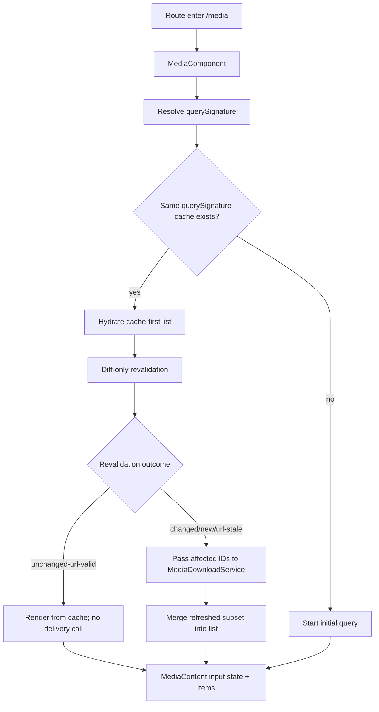
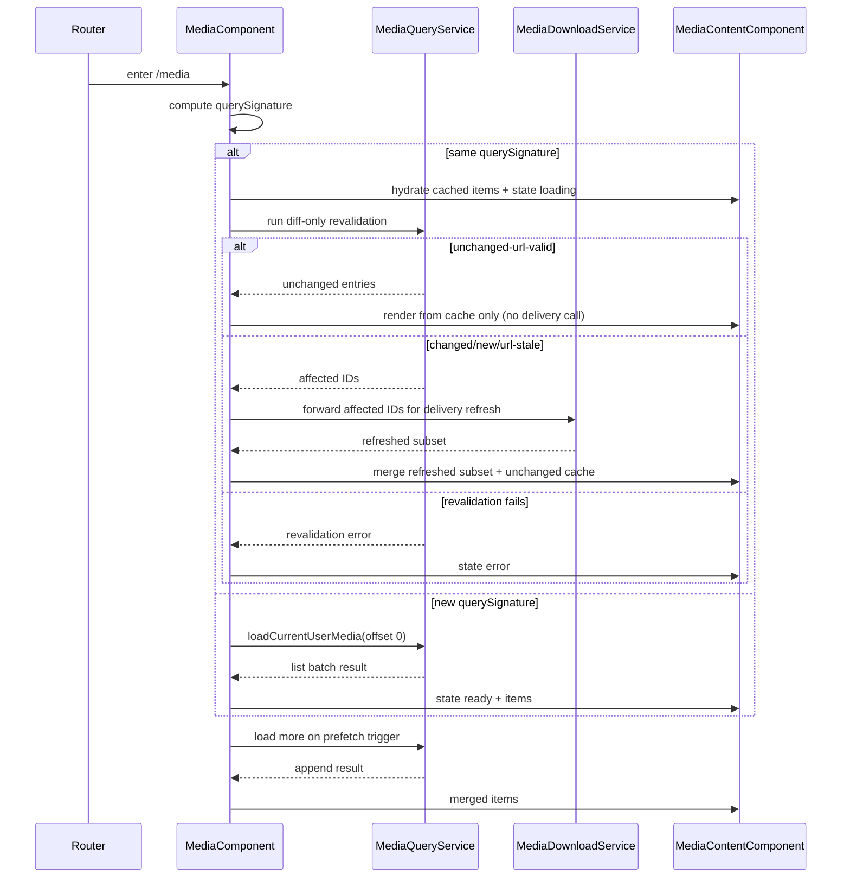

# Media Component

## What It Is

Media Component is the route-shell state owner for /media. It owns list bootstrap, incremental pagination triggers, and page-level error/retry orchestration while delegating item rendering to MediaContentComponent.

## What It Looks Like

The component renders a page header plus a media content region with stable layout geometry. Initial load shows deterministic loading presentation, then transitions to ready rendering or error recovery. Infinite scroll prefetch and batch append are controlled at this shell boundary. Card variant switching is shell-owned and forwarded to content. Visual timing and spacing rely on design tokens and shared primitives.

## Where It Lives

- Runtime file: apps/web/src/app/features/media/media.component.ts
- Template file: apps/web/src/app/features/media/media.component.html
- Parent route contract: docs/specs/page/media-page.md
- Child renderer contract: docs/specs/component/media-content.md
- Trigger: route entry to /media and user interactions that change list loading lifecycle

## Actions & Interactions

| #   | User/System Trigger                          | System Response                                      | Output Contract                         |
| --- | -------------------------------------------- | ---------------------------------------------------- | --------------------------------------- |
| 1   | Route enters /media                          | Initialize shell and begin initial page load         | state enters initial-loading            |
| 2   | Initial load succeeds                        | Publish ready content state to child                 | state enters ready                      |
| 3   | Initial load fails                           | Publish error state with retry affordance            | state enters error                      |
| 4   | User clicks retry                            | Reset pagination and request first batch again       | transition error to initial-loading     |
| 5   | User scrolls near bottom and hasMore is true | Request next deterministic batch                     | state enters loading-more               |
| 6   | Append succeeds                              | Merge deduplicated items and return to ready         | transition loading-more to ready        |
| 7   | Append fails                                 | Keep existing items and raise recoverable page error | transition loading-more to append-error |
| 8   | Auth/user context changes                    | Reset paging and reload from offset zero             | transition to initial-loading           |
| 9   | Upload completion signal arrives             | Reset pagination and requery current route list      | transition to revalidating              |
| 10  | Card variant changed                         | Persist variant setting and re-render child mode     | shell setting updated                   |

## Component Hierarchy

```text
MediaComponent
├── MediaPageHeaderComponent
├── PaneToolbarComponent
└── MediaContentComponent
    └── ItemGridComponent + projected MediaItemComponent
```

## Data Requirements

| Field           | Source                     | Type                      | Purpose                                |
| --------------- | -------------------------- | ------------------------- | -------------------------------------- |
| mediaItems      | MediaQueryService          | ImageRecord[]             | current list payload                   |
| mediaTotalCount | MediaQueryService          | number or null            | hasMore computation                    |
| nextOffset      | pagination cursor          | number                    | next page offset                       |
| cardVariant     | CardVariantSettingsService | CardVariant               | list display mode                      |
| contentState    | internal computed state    | loading or error or ready | child renderer contract input          |
| querySignature  | MediaPageStateService      | string                    | cache namespace for route re-entry     |
| loadedWindows   | MediaPageStateService      | array                     | reused windows for same querySignature |
| indexEntries    | MediaPageStateService      | record                    | dual-staleness reconcile inputs        |



### FSM State Table

| State           | Class        | Entry Trigger                    | Exit Trigger                                                   | Forbidden Coupling                                |
| --------------- | ------------ | -------------------------------- | -------------------------------------------------------------- | ------------------------------------------------- |
| boot            | Transitional | component created                | route context resolved                                         | no item-level delivery states                     |
| initial-loading | Main         | route entry or reset             | success or failure                                             | no upload overlay state in enum                   |
| ready           | Main         | successful list resolve          | append trigger, reset, or failure                              | no media-render lifecycle states                  |
| loading-more    | Transitional | near-bottom prefetch and hasMore | append success or append failure                               | no child-level MediaDisplay transitions           |
| append-error    | Main         | append request failure           | retry append or full reset                                     | no upload lane semantics                          |
| error           | Main         | initial load failure             | retry or auth/user change                                      | no media delivery state proxy                     |
| revalidating    | Transitional | upload/auth driven refresh       | revalidation success to ready or revalidation failure to error | must preserve same querySignature cache namespace |

## File Map

| File                                                 | Purpose                                  |
| ---------------------------------------------------- | ---------------------------------------- |
| apps/web/src/app/features/media/media.component.ts   | route shell orchestration and pagination |
| apps/web/src/app/features/media/media.component.html | header plus content composition          |
| apps/web/src/app/features/media/media.component.scss | page-level shell styling                 |
| docs/specs/page/media-page.md                        | route-level product contract             |
| docs/specs/component/media-content.md                | child renderer state contract            |

## Wiring

Media Component owns page-level loading contract and forwards only stable inputs to MediaContentComponent. It does not own MediaItem or MediaDisplay delivery transitions.



## Acceptance Criteria

- [ ] MediaComponent is the sole owner of MediaPage FSM state transitions for /media route shell behavior.
- [ ] MediaComponent exposes deterministic states boot, initial-loading, ready, loading-more, append-error, error, and revalidating.
- [ ] Route re-entry with identical querySignature hydrates from cache-first and skips full list requery.
- [ ] Revalidation after cache hydration is diff-only.
- [ ] MediaComponent reads `loadedWindows` and `indexEntries` from `MediaPageStateService` before issuing any index query.
- [ ] On revalidation, only changed/new/url-stale IDs are forwarded to `MediaDownloadService`; unchanged-url-valid IDs are rendered from cache without a delivery call.
- [ ] MediaComponent does not encode MediaDisplay delivery states in its FSM.
- [ ] Upload completion and auth changes trigger reset or revalidation through shell FSM only.
- [ ] Child MediaContentComponent receives stable state plus data inputs only.
- [ ] ng build is clean for this contract integration.
- [ ] npm run lint is clean for this contract integration.
